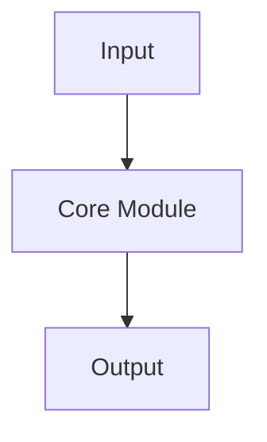

# BLOG_POST_PROTOCOL.md

이 문서는 `eightmm.github.io` 블로그의 **논문 리뷰 포스트 작성 프로토콜**이다.
목표는 앞으로 사용자가 특정 논문을 지정했을 때, 이 문서를 기준으로 **현재 블로그와 동일한 스타일/밀도/구조**의 글을 일관되게 작성하는 것이다.

이 문서는 사람용 가이드이면서 동시에 에이전트가 직접 따라야 하는 실행 프로토콜이다.

---

## 0. 목표

이 블로그의 논문 리뷰 글은 단순 요약이 아니다. 다음 4가지를 동시에 만족해야 한다.

1. **논문의 핵심 아이디어를 빠르게 이해시킨다**
2. **왜 중요한지 맥락을 설명한다**
3. **아키텍처/알고리즘을 기술적으로 깊게 풀어준다**
4. **실제 성능, 한계, 재현 가능성까지 평가한다**

즉, 스타일은 다음에 가깝다.

- 단순 번역 ❌
- 홍보성 소개글 ❌
- 수식/구조/실험을 읽고 풀어주는 **technical review** ✅
- 그러나 논문을 처음 접한 사람도 따라올 수 있도록 **맥락과 직관** 포함 ✅

---

## 1. 이 블로그의 현재 스타일 요약

기존 포스트들을 기준으로 보면, 이 블로그의 paper review는 아래 특징을 가진다.

### 톤

- 기본 언어는 **한국어**
- 논문/기술 용어는 영어를 유지해도 됨
- 문체는 설명적이되 너무 딱딱하지 않음
- 첫머리에서 논문의 문제의식과 핵심 기여를 **강하게 요약**함
- 저자 주장만 반복하지 않고, 중간중간 **해석/평가/비교**를 넣음

### 글의 밀도

- 보통 **긴 편**이다
- `How it works` 섹션이 가장 길고 핵심이다
- 표, bullet, 수식, 그림, mermaid, 코드 블록을 적극 사용한다
- 독자가 “그래서 내부가 어떻게 돌아가는데?”를 읽고 납득할 수 있어야 한다

### 시각 자료 사용

가능하면 다음을 포함한다.

- 대표 그림 1장 이상
- 필요 시 추가 figure 여러 장
- 아키텍처/파이프라인 mermaid
- pseudocode 또는 Python/PyTorch 스타일 코드

### 글의 관점

항상 다음 질문에 답해야 한다.

- 이 논문은 **무슨 문제를 푸는가**
- 기존 방법은 **왜 부족했는가**
- 저자들은 **무엇을 바꿨는가**
- 그 변화가 **왜 효과적인가**
- 실험 결과는 **얼마나 설득력 있는가**
- 실제로 **재현 가능한가 / 한계는 무엇인가**

---

## 2. 언제 이 프로토콜을 쓰는가

다음 요청에 적용한다.

- “이 논문 블로그 포스트 써줘”
- “이 페이퍼 리뷰 정리해줘”
- “블로그용으로 정리해줘”
- “eightmm 스타일로 포스트 작성해줘”
- “현재 블로그처럼 써줘”

논문 리뷰가 아니라 프로젝트 회고, 튜토리얼, 일반 에세이라면 이 문서를 그대로 강제 적용하지 않는다. 다만 front matter 형식과 전반적 품질 기준은 참고할 수 있다.

---

## 3. 작성 전 반드시 수집할 정보

포스트를 쓰기 전에 아래 정보를 먼저 확보한다.

### 필수 입력

1. **논문 제목**
2. **논문 링크** (arXiv / DOI / conference page / journal link)
3. **출판 시점 / venue**
4. **저자/소속**
5. **핵심 figure**
6. **핵심 실험 결과 표/그림**

### 가능하면 추가로 확보

- project page
- code repository
- supplementary / appendix
- benchmark 세부 설정
- baseline 비교 조건
- limitation / failure case figure

### 작성 전에 확인할 것

- 내가 실제로 논문 본문/초록/그림/표를 읽었는가
- 주장하는 수치가 정확한가
- 모델 이름, 데이터셋 이름, metric 표기가 정확한가
- baseline 비교가 fair한지 논문이 단서를 달았는가

불확실하면 단정하지 말고 아래처럼 쓴다.

- “논문 기준으로는 …”
- “저자들은 …라고 해석한다”
- “직접 비교에는 주의가 필요하다”

---

## 4. 파일 생성 규칙

### 위치

- 포스트 파일: `_posts/YYYY-MM-DD-slug.md`
- 이미지 폴더: `assets/img/posts/<slug>/`

### slug 규칙

- 소문자 kebab-case
- 가능한 한 논문 제목의 핵심 표현을 사용
- 너무 길면 앞 핵심 구절만 사용

예시:

- `pearl-foundation-model-placing-every-atom`
- `seedfold-scaling-biomolecular-structure-prediction`
- `alphafold3-accurate-biomolecular-interactions`

### 이미지 규칙

이미지는 가능하면 다음 식으로 저장한다.

- `fig1_overview.png`
- `fig2_architecture.png`
- `fig3_results.png`
- `fig4_ablation.png`
- `fig5_failure_cases.png`

파일명만 보고도 용도를 알 수 있게 한다.

---

## 5. Front Matter 규칙

기본 템플릿은 아래를 따른다.

```yaml
---
title: "논문 제목"
date: YYYY-MM-DD HH:MM:SS +0900
description: "논문의 핵심 기여와 결과를 1~2문장으로 압축한 SEO 설명"
categories: [Paper Review, 세부카테고리]
tags: [핵심-태그1, 핵심-태그2, 핵심-태그3]
math: true
mermaid: true
image:
  path: /assets/img/posts/<slug>/fig1_overview.png
  alt: "대표 그림 설명"
---
```

### Front Matter 작성 원칙

#### title
- 논문 원제를 그대로 쓰는 것을 기본으로 한다
- 부제가 있으면 유지 가능

#### date
- 블로그 게시 시각 기준 `+0900`
- 사용자가 별도 날짜를 지정하지 않으면 작성 시점 기준

#### description
- 반드시 직접 쓴다. 초록 첫 문장 복붙 금지.
- 길이 목표: **120~180자 정도**
- 포함해야 할 것:
  - 누가 / 무엇을 제안했는지
  - 핵심 기술 요소 1~2개
  - 가장 중요한 결과 1개

좋은 예:
- "Genesis Molecular AI의 Pearl은 대규모 synthetic data, SO(3)-equivariant diffusion, multi-chain templating을 통해 protein-ligand cofolding에서 AlphaFold 3를 능가하는 SOTA를 달성한다."

#### categories
기본 메인 카테고리는 다음 중 선택한다.

- `Paper Review`
- `Projects`
- `General`

논문 리뷰라면 거의 항상:

- `[Paper Review, Protein Structure]`
- `[Paper Review, Drug Discovery]`
- `[Paper Review, Generative Models]`
- `[Paper Review, NLP]`
- `[Paper Review, Vision]`

현재 블로그 실사용 기준으로는 **Paper Review + 주제 하위 분류** 형태를 우선 사용한다.

#### tags
- 6~12개 권장
- 검색성과 의미를 같이 본다
- 너무 일반적인 태그만 넣지 말고, 논문 고유 키워드를 섞는다
- 예: `alphafold3`, `diffusion`, `protein-ligand`, `equivariant`, `pairformer`

#### math / mermaid
- 수식이나 mermaid를 쓸 가능성이 높으므로 **기본적으로 true**
- 정말 불필요할 때만 끈다

#### image
- 대표 figure가 있으면 반드시 지정
- alt는 기술적으로 정확하고 짧게 쓴다

---

## 6. 권장 문서 구조

현재 블로그의 실제 패턴을 기준으로, paper review는 아래 구조를 기본으로 한다.

```md
## Hook
## Problem
## Key Idea
## How It Works
## Results
## Discussion
## Limitations
## Conclusion
## TL;DR
## Paper Info
```

다만 실제 기존 글에서는 다음 변형도 허용된다.

- `## Problem: ...`
- `## Key Idea: ...`
- `## How it works`
- `## Discussion`만 있고 `Limitations`, `Conclusion`이 축약될 수 있음

### 현재부터의 권장 표준

앞으로는 가능하면 아래 순서를 유지한다.

1. `Hook`
2. `Problem`
3. `Key Idea`
4. `How It Works`
5. `Results`
6. `Discussion`
7. `Limitations`
8. `Conclusion`
9. `TL;DR`
10. `Paper Info`

즉, **기존 스타일은 유지하되 앞으로는 AF3 포스트에 가까운 정규 구조를 기본값으로 삼는다.**

---

## 7. 섹션별 작성 규칙

### 7.1 Hook

역할:
- 독자가 왜 이 논문을 읽어야 하는지 2~4문단 내에 납득시킨다.
- 해당 분야의 최근 흐름과 이 논문의 위치를 잡아준다.

포함 요소:
- 최근 흐름 1개
- 기존 방법의 한계 1개
- 이 논문의 핵심 주장 1개
- 이 글에서 무엇을 다룰지 1개

피해야 할 것:
- 초록 번역
- 너무 긴 역사 설명
- 뜬구름 잡는 찬사

### 7.2 Problem

역할:
- 이 논문이 정확히 어떤 문제를 푸는지 정의한다.
- 기존 방법이 어디서 막히는지 구조적으로 설명한다.

작성법:
- 가능하면 2~4개의 병목으로 나눠 설명
- 단순히 “성능이 낮다”가 아니라 왜 낮은지 설명
  - 데이터 부족
  - 계산 복잡도
  - representation bottleneck
  - inductive bias 부족
  - physical validity 문제

좋은 패턴:
- “문제는 세 가지다: …”
- “기존 접근은 A에는 강하지만 B를 못 다룬다”

### 7.3 Key Idea

역할:
- 저자의 핵심 기여를 **압축적으로** 정리한다.

작성법:
- 한 문장 요약 1개
- 핵심 기여 bullet 3~4개
- 필요하면 기존 모델 대비 차이 표 1개

여기서는 디테일에 너무 깊게 들어가지 말고, 독자가 큰 그림을 먼저 잡게 한다.

### 7.4 How It Works

가장 중요하다.

이 섹션은 전체 글에서 **최소 35~40% 이상** 비중을 차지하도록 한다.

반드시 포함할 것:
- 전체 파이프라인 설명
- 핵심 representation 설명
- 핵심 모듈 설명
- 필요 시 training recipe / data recipe
- 필요 시 inference mode / sampling / guidance 설명
- pseudocode 또는 Python/PyTorch 스타일 코드 1개 이상
- mermaid diagram 1개 이상 권장

구성 예시:

```md
### Overview
### Representation
### Core Architecture
### Key Innovation
### Training / Inference
```

원칙:
- 단순 기능 나열이 아니라 **왜 이렇게 설계했는지**를 같이 설명
- 수식은 필요한 만큼만 넣되, 수식 뒤에 반드시 자연어 설명을 붙인다
- 코드 블록은 “실제 구현 느낌”이 나도록 작성하되, 논문 개념 전달용임을 명확히 한다

### 7.5 Results

역할:
- 논문이 실제로 얼마나 잘 되는지 보여준다.

반드시 포함할 것:
- main benchmark table 또는 핵심 수치
- baseline 대비 얼마나 나아졌는지 해석
- 중요 ablation 또는 generalization 결과
- 필요한 경우 failure case

작성 원칙:
- 숫자만 나열하지 말고 의미를 해석한다
- best@k, filtered setting, confidence reranking 등 비교 조건이 다르면 명시한다
- 실험이 강한지/애매한지 평가를 덧붙인다

### 7.6 Discussion

역할:
- 저자 주장과 실제 의미 사이를 해석한다.
- 기존 글에서 이 섹션은 꽤 중요하다.

포함하면 좋은 것:
- 왜 이 접근이 먹혔는지에 대한 해석
- 비슷한 다른 논문과의 관계
- 어떤 상황에서 특히 유리한지
- 실제 현업/연구 의미
- 재현 가능성 평가

자주 쓰는 소주제:
- 저자가 밝힌 한계
- 재현성
- 관련 논문 비교
- 실무적 의미

### 7.7 Limitations

역할:
- 논문의 한계를 분리해 명시한다.

가능하면 다음을 다룬다.
- OOD/generalization 한계
- 데이터 의존성
- 계산 비용
- 비공개 코드/비공개 데이터
- 평가 설정의 편향 가능성
- 실제 배포/현업 적용 시 제약

기존 글에서는 Discussion 안에 흡수된 경우도 많지만, 앞으로는 가능하면 별도 섹션으로 분리한다.

### 7.8 Conclusion

역할:
- 독자가 이 논문을 한 문단으로 기억하게 만든다.

구성:
- 이 논문이 바꾼 것 1개
- 가장 중요한 기술 포인트 1개
- 가장 중요한 caveat 1개

짧고 선명하게 쓴다.

### 7.9 TL;DR

역할:
- 바쁜 사람이 이것만 읽어도 핵심을 가져가게 한다.

형식:
- bullet 3~5개
- 가장 중요한 수치 1개 이상 포함 권장

스타일:
- 강하고 압축적이어야 한다
- 마케팅 문구 말고 정보 밀도 위주

### 7.10 Paper Info

반드시 마지막에 표로 정리한다.

기본 템플릿:

```md
## Paper Info

| 항목 | 내용 |
|---|---|
| **Title** | ... |
| **Authors** | ... |
| **Affiliations** | ... |
| **Venue** | ... |
| **Paper** | [arXiv](...) |
| **Project** | ... |
| **Code** | ... |
```

필드가 없으면 생략 가능하지만, 최소한 아래는 넣는다.
- Title
- Authors
- Venue/Published
- Paper link

---

## 8. 문체 규칙

### 해야 할 것

- 첫 문단에서 논문 핵심을 바로 말한다
- 영어 용어를 억지 번역하지 않는다
- 비교급/정량 표현을 적극 사용한다
  - “단순 개선”보다 “14.5% 상대 개선”
- 해석을 곁들인다
  - “이건 memorization보다 generalization을 시사한다”
- 필요한 곳에서 강조를 사용한다
  - `**핵심 주장**`

### 피해야 할 것

- “혁신적이다”, “놀랍다”만 반복
- 초록 복붙
- 무근거 추측
- 논문에 없는 수치 창작
- 너무 많은 수식만 던지고 설명 없음

### 문장 스타일 예시

좋음:
- “핵심은 width를 키운 것이 아니라, **어디의 width를 키웠느냐**다.”
- “이 결과는 단순한 벤치마크 이득보다, **OOD 일반화가 실제로 개선되었을 가능성**을 시사한다.”
- “중요한 점은 PB-valid를 붙여도 성능이 거의 떨어지지 않는다는 것이다.”

피함:
- “이 논문은 매우 훌륭한 논문이다.”
- “아무튼 성능이 좋다.”

---

## 9. 표 / 그림 / 코드 사용 규칙

### 표

다음 상황에서는 표를 적극 사용한다.
- baseline 비교
- 모델 구성 비교
- ablation 요약
- 데이터셋 구성
- training stages

표는 단순 나열보다 **비교가 보이게** 만든다.

### 그림

각 그림 아래에는 다음을 쓴다.
- 그림이 무엇인지
- 왜 중요한지
- 출처가 원 논문임을 명시

예시:
- `_Figure 3: Public benchmark에서의 main result. Best@5 기준으로 Pearl이 AF3를 일관되게 상회한다. 출처: 원 논문_`

### Mermaid

mermaid는 설명용으로만 사용한다.
- 전체 파이프라인
- 데이터 흐름
- 모듈 관계
- 학습/추론 흐름

주의:
- Chirpy 렌더링 문제를 피하려면 `<br>` 대신 `\n` 또는 단순 라벨 사용
- 너무 복잡한 그래프 금지
- inline style은 최소화

### 코드 블록

최소 1개 이상 권장, 특히 paper review에서는 거의 항상 포함한다.

종류:
- pseudocode
- Python/PyTorch 스타일 reference implementation
- training config 예시

원칙:
- 실제 개념을 전달할 정도로 충분히 구체적일 것
- 그러나 논문에 없는 구현 세부를 과하게 단정하지 말 것
- 코드 앞뒤로 “이 블록이 무엇을 보여주는지” 설명할 것

---

## 10. 인용 / 링크 규칙

### 내부 링크

가능하면 기존 블로그 글과 연결한다.

예:
- 같은 시리즈 글
- 비슷한 주제를 다룬 이전 리뷰
- 비교 대상이 되는 논문 리뷰

패턴:
- `[AlphaFold 3](/posts/alphafold3-accurate-biomolecular-interactions/)`

### 외부 링크

주로 다음만 사용한다.
- 논문 링크
- project page
- code repo
- 공식 benchmark / dataset page

과도한 외부 링크 남발 금지.

---

## 11. 논문 리뷰 작성 절차 (실행 프로토콜)

사용자가 논문 리뷰 포스트를 요청하면 아래 순서로 수행한다.

### Step 1. 논문 파악
- 제목, 링크, 저자, venue 확인
- 초록만 보지 말고 figure / method / results / appendix까지 훑기
- 핵심 주장 1문장, 핵심 기여 3개를 먼저 메모

### Step 2. 기존 블로그 맥락 확인
- 비슷한 주제의 기존 포스트가 있는지 확인
- series link를 걸 수 있는지 확인
- 카테고리/태그를 기존 체계에 맞춤

### Step 3. 자료 준비
- 대표 figure 선정
- results / ablation / failure case figure 수집
- 이미지 저장 경로 정리

### Step 4. 개요 먼저 작성
다음 뼈대를 먼저 만든다.
- Hook
- Problem
- Key Idea
- How It Works (세부 소제목 포함)
- Results
- Discussion
- Limitations
- Conclusion
- TL;DR
- Paper Info

### Step 5. 본문 작성
우선순위:
1. Hook
2. Problem
3. Key Idea
4. How It Works
5. Results
6. 나머지 정리

### Step 6. 기술 검증
최소한 아래를 다시 체크한다.
- 논문 수치 오기 없는가
- baseline 이름 정확한가
- 이미지 경로 맞는가
- front matter 누락 없는가
- 내부 링크 깨지지 않는가
- 수식 문법/mermaid 문법 문제 없는가

### Step 7. 블로그 스타일 polish
- 첫 3문단의 밀도 높이기
- TL;DR sharpen
- Discussion에 해석 한 줄 더 넣기
- 제목/description 재점검

---

## 12. 품질 기준 체크리스트

작성 후 아래 기준을 만족해야 한다.

### 최소 기준
- [ ] front matter 완비
- [ ] 대표 이미지 있음
- [ ] `How It Works`가 글의 핵심 비중 차지
- [ ] 결과 표/수치 포함
- [ ] `TL;DR` 존재
- [ ] `Paper Info` 존재
- [ ] 마지막 면책/피드백 안내 블록 존재

### 좋은 글 기준
- [ ] 독자가 왜 중요한지 첫 부분에서 이해 가능
- [ ] 핵심 기여가 3개 이내로 압축됨
- [ ] 코드/수식/그림이 설명과 연결됨
- [ ] 결과 해석이 수치 나열에 그치지 않음
- [ ] 한계/재현성 평가가 있음
- [ ] 기존 포스트와 내부 링크 연결됨

---

## 13. 포스트 마지막 고정 블록

논문 리뷰 포스트 끝에는 아래 블록을 기본으로 넣는다.

```md
---

> 이 글은 LLM(Large Language Model)의 도움을 받아 작성되었습니다. 
> 논문의 내용을 기반으로 작성되었으나, 부정확한 내용이 있을 수 있습니다.
> 오류 지적이나 피드백은 언제든 환영합니다.
{: .prompt-info }
```

문구는 큰 틀을 유지하되 조금 다듬어도 된다.

---

## 14. 새 포스트용 템플릿

아래 템플릿을 복사해 시작한다.

```md
---
title: "<PAPER TITLE>"
date: YYYY-MM-DD HH:MM:SS +0900
description: "<SEO DESCRIPTION>"
categories: [Paper Review, <SUBCATEGORY>]
tags: [<tag1>, <tag2>, <tag3>, <tag4>]
math: true
mermaid: true
image:
  path: /assets/img/posts/<slug>/fig1_overview.png
  alt: "<대표 그림 설명>"
---

## Hook

<왜 이 논문이 중요한지, 어떤 흐름 위에 있는지 설명>

## Problem

<기존 접근의 한계와 해결하려는 문제 정의>

## Key Idea

<핵심 기여 1문장 요약 + bullet 3~4개>

## How It Works

### Overview


_Figure 1: <설명>. 출처: 원 논문_



### Representation

<입력 표현/토큰/특징 설명>

### Core Architecture

<핵심 모듈 설명>

```python
class CoreModule(nn.Module):
    def __init__(self):
        super().__init__()

    def forward(self, x):
        return x
```

### Training / Inference

<학습 전략, sampling, guidance, distillation 등>

## Results

<메인 테이블 + 해석>

## Discussion

<왜 먹히는지 / 다른 방법과 비교 / 재현성>

## Limitations

<한계 정리>

## Conclusion

<짧은 결론>

## TL;DR

- <핵심 1>
- <핵심 2>
- <핵심 3>

## Paper Info

| 항목 | 내용 |
|---|---|
| **Title** | <title> |
| **Authors** | <authors> |
| **Affiliations** | <affiliations> |
| **Venue** | <venue> |
| **Paper** | [link](<url>) |
| **Project** | <project> |
| **Code** | <code> |

---

> 이 글은 LLM(Large Language Model)의 도움을 받아 작성되었습니다. 
> 논문의 내용을 기반으로 작성되었으나, 부정확한 내용이 있을 수 있습니다.
> 오류 지적이나 피드백은 언제든 환영합니다.
{: .prompt-info }
```

---

## 15. 실제 작성 시 추가 메모

- 기존 블로그 스타일상 `Discussion`은 중요하다. 단순 결론 전에 반드시 해석을 넣는다.
- 가능하면 **숫자 비교를 해석하는 한 문장**을 붙인다.
- 기존 시리즈가 있으면 내부 링크를 적극 건다.
- 이미지가 충분하면 더 좋지만, 이미지가 없더라도 글 자체의 설명 밀도를 우선한다.
- 논문에 코드가 없으면 재현 난이도와 비공개 요소를 분명히 써준다.
- 논문이 주장하는 바와 실제 evidence 강도 사이에 차이가 있으면 완곡하지만 분명하게 지적한다.

---

## 16. 최종 원칙 한 줄 요약

**이 블로그의 paper review는 “읽는 사람이 논문을 안 읽어도 핵심을 이해하고, 읽고 나면 구현과 한계까지 감이 오는 수준의 technical long-form review”를 목표로 한다.**
