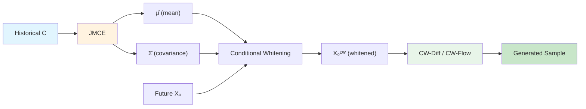

시계열 예측에서 diffusion model과 flow matching은 uncertainty quantification까지 가능한 probabilistic forecasting 도구로 주목받고 있다. 그런데 이 모델들이 생성을 시작하는 출발점, 즉 terminal distribution이 그냥 $N(0, I)$라는 건 꽤 낭비다. 과거 데이터에서 미래의 평균과 공분산을 어느 정도 추정할 수 있는데, 왜 그 정보를 버리는가? CW-Gen은 이 질문에서 출발한다.

## 기존 접근의 한계

Multivariate time series의 probabilistic forecasting은 non-stationarity, inter-variable dependency, distribution shift 등 여러 난제를 안고 있다. TimeGrad, CSDI, SSSD 같은 diffusion 기반 모델들은 conditional distribution $P_{\textbf{X}\|\textbf{C}}$를 학습하지만, terminal distribution으로 $N(0, I)$를 사용한다. 이는 데이터의 실제 분포와 거리가 먼 출발점에서 생성을 시작한다는 의미다.

이 문제를 인식한 CARD는 conditional mean regressor를 pretrain하여 prior로 활용했고, TMDM은 nonlinear regressor로 확장했다. NsDiff는 여기에 variance regressor까지 추가했다. 하지만 이들은 변수 간 correlation을 무시하거나, reverse process가 지나치게 복잡하거나, 이론적 근거 없이 heuristic하게 prior를 삽입하는 한계가 있었다.

> 핵심 질문: prior를 terminal distribution에 넣으면 정말 좋아지는가? 얼마나 정확해야 하는가? 이론적 보장이 있는가?
{: .prompt-tip }

## 핵심 아이디어: Conditional Whitening

CW-Gen의 아이디어는 데이터를 conditional whitening하는 것이다. 과거 관측 $\textbf{C}$로부터 미래 시계열의 conditional mean $\hat{\mu}$와 sliding-window covariance $\hat{\Sigma}$를 추정한 뒤, 원본 데이터에서 평균을 빼고 공분산의 inverse square root를 곱한다. 이렇게 변환된 데이터는 trend, seasonality, heteroscedasticity, 변수 간 linear correlation이 제거되어 $N(0, I)$에 가까워진다. Diffusion이나 flow matching은 이 whitened space에서 동작하므로 terminal distribution과의 gap이 줄어든다.

이 변환은 full-rank linear transformation이라 완전히 invertible하다. 생성 후 역변환을 적용하면 원래 데이터 공간으로 복원할 수 있다.

## How it Works

### 전체 파이프라인

CW-Gen은 크게 세 단계로 구성된다: (1) JMCE로 conditional mean과 covariance 추정, (2) conditional whitening 적용, (3) whitened space에서 diffusion 또는 flow matching 수행.

### JMCE: Joint Mean-Covariance Estimator

JMCE는 Non-stationary Transformer를 backbone으로 사용하여, 과거 관측 $\textbf{C}$를 입력받아 conditional mean $\hat{\mu}_{\textbf{X}\|\textbf{C}} \in \mathbb{R}^{d \times T_f}$와 각 시점의 sliding-window covariance $\hat{\Sigma}_{\textbf{X}_0, t\|\textbf{C}} \in \mathbb{R}^{d \times d}$를 동시에 출력한다. Covariance 추정에는 Cholesky decomposition을 활용하여 lower-triangular matrix $\hat{L}_{t\|\textbf{C}}$를 출력하고 $\hat{\Sigma} = \hat{L}\hat{L}^\top$으로 구성함으로써, positive semi-definiteness를 구조적으로 보장한다.

### 이론적 기반: Theorem 1

Terminal distribution을 $N(0, I)$에서 $N(\hat{\mu}, \hat{\Sigma})$로 바꾸는 것이 언제 유리한지에 대한 충분조건을 제시한다:

$$\left(\min_i \hat{\lambda}_i\right)^{-1}\left(\|\mu - \hat{\mu}\|_2^2 + \|\Sigma - \hat{\Sigma}\|_N\right) + \sqrt{d_x}\|\Sigma - \hat{\Sigma}\|_F \leq \|\mu\|_2^2$$

직관적으로, (1) mean과 covariance 추정이 정확할수록, (2) 최소 eigenvalue가 클수록, (3) signal magnitude $\|\mu\|_2^2$가 클수록 이 조건이 만족된다. Non-stationary 시계열에서 $\mu$가 0에서 크게 벗어나므로, 이 조건이 성립하기 쉽다.

### JMCE Loss 설계

Theorem 1의 좌변을 최소화하도록 loss function을 설계했다:

$$\mathcal{L}_{\text{JMCE}} = \mathcal{L}_2 + \mathcal{L}_{\text{SVD}} + \lambda_{\min}\sqrt{d \cdot T_f}\,\mathcal{L}_F + w_{\text{Eigen}} \cdot \sum_{t=1}^{T_f} \mathcal{R}_{\lambda_{\min}}(\hat{\Sigma}_t)$$

$\mathcal{L}_2$는 mean estimation error, $\mathcal{L}_{\text{SVD}}$와 $\mathcal{L}_F$는 각각 nuclear norm과 Frobenius norm으로 covariance estimation error를 측정한다. $\mathcal{R}_{\lambda_{\min}}$은 eigenvalue가 $\lambda_{\min}$ 아래로 떨어지면 ReLU penalty를 부과하여 수치 안정성을 보장한다.

### CW-Diff: Whitened Space에서의 Diffusion

Conditional whitening 변환 $\textbf{X}_0^{\text{CW}} := \hat{\Sigma}^{-0.5} \circ (\textbf{X}_0 - \hat{\mu})$를 적용하면, whitened data에 대해 표준 DDPM forward process를 그대로 사용할 수 있다:

$$d\textbf{X}_\tau^{\text{CW}} = -\frac{1}{2}\beta_\tau \textbf{X}_\tau^{\text{CW}}\,d\tau + \sqrt{\beta_\tau}\,d\textbf{W}_\tau$$

Terminal distribution이 $N(0, I)$에 더 가까워졌으므로 score network가 학습해야 할 residual이 줄어든다. 생성 후에는 역변환 $\hat{\Sigma}^{0.5} \circ \textbf{X}^{\text{CW}} + \hat{\mu}$로 원래 공간에 복원한다. 기존 diffusion model(TMDM, NsDiff 등)의 $\textbf{X}_0$를 $\textbf{X}_0^{\text{CW}}$로 교체하는 것만으로 CW-Diff를 적용할 수 있어, 다양한 모델에 plug-in이 가능하다.

### CW-Flow: Inverse 없는 효율적 대안

CW-Diff는 $\hat{\Sigma}^{-0.5}$ 계산을 위해 eigen-decomposition이 필요하며 $O(d^3 T_f)$의 비용이 든다. CW-Flow는 이를 회피한다. Flow matching의 terminal distribution 자체를 $N(\hat{\mu}, \hat{\Sigma})$로 설정하고, $\textbf{X}_0$와 $\epsilon^{\text{CW}} \sim N(\hat{\mu}, \hat{\Sigma})$ 사이를 ODE로 직접 연결한다. Inverse matrix 계산도, 생성 후 역변환도 불필요하다.

### 왜 잘 되는가

CW-Gen이 일관된 성능 향상을 보이는 이유는 세 가지다. 첫째, conditional whitening이 non-stationarity의 주요 원인(trend, seasonality, heteroscedasticity)을 사전 제거하여 generative model의 학습 부담을 줄인다. 둘째, covariance 추정을 통해 변수 간 linear correlation까지 처리하여, 기존 mean-only prior보다 완전한 prior를 제공한다. 셋째, Theorem 1이 제시한 충분조건에 맞춰 loss를 설계했기 때문에, prior 도입이 오히려 성능을 떨어뜨리는 unfavorable regime을 체계적으로 회피한다.

## 실험 결과

5개 실세계 데이터셋(ETTh1, ETTh2, ILI, Weather, Solar)에서 6개 SOTA generative model에 CW-Gen을 적용한 결과다.

| Dataset | Win Rate (CRPS/QICE/ProbCorr/CondFID) | Win Rate (ProbMSE) | Win Rate (ProbMAE) |
|---|---|---|---|
| ETTh1 | 76.0% | 75.0% | 80.0% |
| ETTh2 | 79.2% | 78.3% | 81.7% |
| ILI | 80.0% | — | — |
| Weather | 76.0% | — | — |
| Solar | 77.1% | — | — |

전체 30개 model-dataset 조합에서 평균 76-80%의 win rate를 달성했다. ProbCorr 지표에서 특히 일관된 개선이 관찰되어, 변수 간 correlation 포착 능력이 크게 향상되었음을 보여준다. Distribution shift가 존재하는 상황에서도 CW-Gen을 적용한 모델은 mean shift 없이 안정적인 예측 분포를 생성했다.

> Prior 없는 모델들은 test set에서 평균과 분산이 이동하는 현상을 보였으나, CW-Gen 적용 후 이러한 distribution shift가 효과적으로 완화되었다.
{: .prompt-info }

## Discussion

저자들은 sliding-window covariance를 사용하는 이유로, 전체 conditional covariance의 직접 추정이 극도로 어렵고 비평활(non-smooth)하다는 점을 밝힌다. Sliding-window 방식이 근사 정확도와 계산 효율 면에서 유리하다는 것이다. Theorem 1의 충분조건이 만족되지 않는 경우—signal magnitude가 작거나 추정이 부정확한 경우—에는 prior 도입이 오히려 성능을 저하시킬 수 있음을 명시하고 있다.

현재 프레임워크는 univariate가 아닌 multivariate 시계열에 초점을 맞추고 있으며, covariance 추정의 $O(d^2)$ 파라미터로 인해 매우 고차원($d$가 큰) 시계열에서는 scalability 문제가 발생할 수 있다. 코드는 [GitHub](https://github.com/Yanfeng-Yang-0316/Conditionally_whitened_generative_models)에 공개되어 있다.

## TL;DR

- CW-Gen은 conditional mean과 covariance를 추정하여 diffusion/flow matching의 terminal distribution을 informative prior로 대체하는 통합 프레임워크다.
- 이론적 충분조건(Theorem 1)에 기반한 JMCE loss 설계로, prior가 성능을 보장하는 조건을 체계적으로 확보한다.
- 5개 데이터셋 × 6개 모델에서 76-80% win rate로 일관된 성능 향상을 달성했다.

**📄 논문:** [arXiv:2509.20928](https://arxiv.org/abs/2509.20928) \| **💻 코드:** [GitHub](https://github.com/Yanfeng-Yang-0316/Conditionally_whitened_generative_models)

---

> 이 글은 LLM(Large Language Model)의 도움을 받아 작성되었습니다.
> 논문의 내용을 기반으로 작성되었으나, 부정확한 내용이 있을 수 있습니다.
> 오류 지적이나 피드백은 언제든 환영합니다.
{: .prompt-info }
