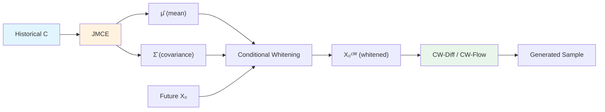

## Terminal Distribution을 왜 $N(0, I)$로 고정하는가?

시계열 예측에서 diffusion model과 flow matching은 **uncertainty quantification**까지 가능한 probabilistic forecasting 도구로 주목받고 있다. 

그런데 이 모델들이 생성을 시작하는 출발점, 즉 **terminal distribution**이 그냥 $N(0, I)$라는 건 꽤 낭비다. 

**왜?**

과거 데이터에서 미래의 **평균(mean)과 공분산(covariance)을 어느 정도 추정**할 수 있는데, 왜 그 정보를 버리는가?

**CW-Gen**은 이 질문에서 출발한다.

> 📄 [Paper](https://arxiv.org/abs/2509.20928) | East China Normal University, Institute of Statistical Mathematics

---

## 기존 접근의 한계

### Diffusion Models for Time Series

Multivariate time series의 probabilistic forecasting은:

1. **Non-stationarity:** 장기 추세, 계절성, heteroscedasticity
2. **Inter-variable dependencies:** 변수 간 복잡한 상관관계
3. **Distribution shift:** Training/test data 간 분포 변화

등의 난제를 안고 있다.

**기존 diffusion 기반 모델들:**

- **TimeGrad, CSDI, SSSD:** $N(0, I)$를 terminal distribution으로 사용
- **문제:** 데이터의 실제 분포와 거리가 먼 출발점에서 생성 시작

### Prior-Informed Approaches

이 문제를 인식한 모델들:

| Model | Prior | 한계 |
|---|---|---|
| **CARD** | Conditional mean $\mathbb{E}[X_0 \| C]$ | Variance 무시 |
| **TimeDiff** | Linear mean regressor | 비선형 패턴 포착 불가 |
| **TMDM** | Nonlinear mean regressor | Heteroscedasticity 취약 |
| **NsDiff** | Mean + variance regressor | 변수 간 correlation 무시, 복잡한 reverse process |

**핵심 질문 (논문이 다루는):**

1. Prior가 정확히 **어떻게** 도움이 되는가?
2. Mean과 variance regressor가 **얼마나 정확**해야 도움이 되는가?
3. 이론적 보장이 있는가?
4. 기존 방식이 redundant하거나 inefficient하지 않은가?

---

## 핵심 아이디어: Conditional Whitening

CW-Gen의 아이디어는 **데이터를 conditional whitening**하는 것이다.

### Whitening이란?

Data $X$를 mean 0, covariance $I$로 변환:

$$
X^{\text{whitened}} = \Sigma^{-1/2}(X - \mu)
$$

- $\mu = \mathbb{E}[X]$
- $\Sigma = \text{Cov}(X)$

**효과:**
- Trend, seasonality 제거
- Heteroscedasticity 제거
- 변수 간 linear correlation 제거

### Conditional Whitening

과거 관측 $\mathbf{C}$로부터:

1. **Conditional mean $\hat{\mu}_{X|C}$** 추정
2. **Sliding-window covariance $\hat{\Sigma}_{X_0|C}$** 추정

원본 데이터를 변환:

$$
X_0^{\text{CW}} = \hat{\Sigma}_{X_0|C}^{-1/2}(X_0 - \hat{\mu}_{X|C})
$$

**이점:**

- Whitened space에서 diffusion/flow matching 수행하면 terminal distribution $N(0, I)$와의 gap이 줄어든다
- **Full-rank linear transformation**이라 완전히 invertible
- 생성 후 역변환으로 원래 공간으로 복원

---

## Theoretical Foundation

### Theorem 1: 언제 Prior가 도움이 되는가?

**핵심 질문:** Terminal distribution을 $N(0, I)$에서 $N(\hat{\mu}_{X|C}, \hat{\Sigma}_{X|C})$로 바꾸면 언제 좋아지는가?

**Kullback-Leibler Divergence (KLD):**

Diffusion model의 total variation distance는 **forward process의 convergence error**에 비례하고, 이는:

$$
D_{\text{KL}}(P_{X|C} \| N(\hat{\mu}_{X|C}, \hat{\Sigma}_{X|C}))
$$

를 factor로 포함한다. 이 KLD가 작을수록 생성 품질이 좋다.

**Theorem 1 (Sufficient Condition):**

다음 조건이 만족되면:

$$
\begin{aligned}
&\left(\min_{i} \hat{\lambda}_{X|C,i}\right)^{-1}\left(\|\mu_{X|C} - \hat{\mu}_{X|C}\|_2^2 + \|\Sigma_{X|C} - \hat{\Sigma}_{X|C}\|_N\right) \\
&\quad + \sqrt{d_x} \|\Sigma_{X|C} - \hat{\Sigma}_{X|C}\|_F \leq \|\mu_{X|C}\|_2^2
\end{aligned}
$$

**Prior를 쓰는 것이 더 좋다:**

$$
D_{\text{KL}}(P_{X|C} \| N(\hat{\mu}, \hat{\Sigma})) \leq D_{\text{KL}}(P_{X|C} \| N(0, I))
$$

**해석:**

1. **Left side (error):**
   - Mean estimation error: $\|\mu - \hat{\mu}\|_2^2$
   - Covariance estimation error: $\|\Sigma - \hat{\Sigma}\|_N$, $\|\Sigma - \hat{\Sigma}\|_F$
   - **최소 eigenvalue의 역수로 scale됨** (작은 eigenvalue는 위험)

2. **Right side (signal):**
   - $\|\mu_{X|C}\|_2^2$: Signal magnitude

**직관:**
- **Signal이 강하고** (non-stationary, strong trend)
- **Estimation error가 작으면** (accurate regressor)
- **Prior를 쓰는 것이 유리!**

### JMCE: Joint Mean-Covariance Estimator

Theorem 1의 조건을 만족하도록 설계된 **novel joint estimator**.

**목표:**

$$
\hat{\mu}_{X|C}, \hat{\Sigma}_{X_0,1|C}, \ldots, \hat{\Sigma}_{X_0,T_f|C} = \text{JMCE}(C)
$$

**핵심 디자인:**

1. **Cholesky decomposition으로 PSD 보장:**

$$
\hat{\Sigma}_{X_0,t|C} = \hat{L}_{t|C} \hat{L}_{t|C}^\top
$$

All $\hat{L}_{t|C}$는 lower-triangular matrix.

2. **Loss function (Theorem 1 기반):**

$$
\begin{aligned}
\mathcal{L}_{\text{JMCE}} = &\mathcal{L}_2 + \mathcal{L}_{\text{SVD}} + \lambda_{\min}\sqrt{d \cdot T_f} \mathcal{L}_F \\
&+ w_{\text{Eigen}} \sum_{t=1}^{T_f} \mathcal{R}_{\lambda_{\min}}(\hat{\Sigma}_{X_0,t|C})
\end{aligned}
$$

- $\mathcal{L}_2$: Mean estimation error ($\ell_2$ norm)
- $\mathcal{L}_{\text{SVD}}$: Covariance nuclear norm error
- $\mathcal{L}_F$: Covariance Frobenius norm error
- $\mathcal{R}_{\lambda_{\min}}$: **Eigenvalue regularization**

3. **Eigenvalue regularization (핵심!):**

$$
\mathcal{R}_{\lambda_{\min}}(\hat{\Sigma}) = \sum_{i=1}^d \text{ReLU}(\lambda_{\min} - \hat{\lambda}_{\Sigma,i})
$$

**효과:**
- 최소 eigenvalue를 $\lambda_{\min}$보다 크게 유지
- Numerical stability 보장
- Rank deficiency 방지
- **Theorem 1의 $(1/\min_i \hat{\lambda}_i)$ term을 control**

---

## How it Works

### 전체 파이프라인

### CW-Diff: Conditionally Whitened Diffusion

**Forward process (whitened space):**

미래 시계열 $\mathbf{X}_0 \in \mathbb{R}^{d \times T_f}$를 whitening:

$$
\mathbf{X}_0^{\text{CW}} = \hat{\Sigma}_{X_0|C}^{-1/2} \circ (\mathbf{X}_0 - \hat{\mu}_{X|C})
$$

Tensor operation:

$$
\hat{\Sigma}^{-1/2} \circ \mathbf{X} = [\hat{\Sigma}_{t,1}^{-1/2} \mathbf{X}_{:,1}, \ldots, \hat{\Sigma}_{t,T_f}^{-1/2} \mathbf{X}_{:,T_f}]
$$

**Diffusion in whitened space:**

$$
\mathbf{X}_\tau^{\text{CW}} = \alpha_\tau \mathbf{X}_0^{\text{CW}} + \sigma_\tau \boldsymbol{\epsilon}
$$

**Score matching (whitened space):**

$$
\mathcal{L}_{\text{CW-Diff}} = \mathbb{E}_{\tau, \boldsymbol{\epsilon}, C} \left\| s_\theta(\mathbf{X}_\tau^{\text{CW}}, C, \tau) + \frac{\boldsymbol{\epsilon}}{\sigma_\tau} \right\|^2
$$

**Reverse process:**

1. Sample $\mathbf{X}_1^{\text{CW}} \sim N(0, I)$
2. Reverse SDE로 $\mathbf{X}_0^{\text{CW}}$ 생성
3. **Inverse whitening:**

$$
\mathbf{X}_0 = \hat{\Sigma}_{X_0|C}^{1/2} \circ \mathbf{X}_0^{\text{CW}} + \hat{\mu}_{X|C}
$$

### CW-Flow: Conditionally Whitened Flow Matching

**Flow matching (whitened space):**

$$
\frac{d\mathbf{X}_\tau^{\text{CW}}}{d\tau} = \boldsymbol{\epsilon} - \mathbf{X}_0^{\text{CW}}
$$

**Vector field learning:**

$$
\mathcal{L}_{\text{CW-Flow}} = \mathbb{E}_{\tau, \boldsymbol{\epsilon}, C} \left\| \boldsymbol{\epsilon} - \mathbf{X}_0^{\text{CW}} - v_\psi(\mathbf{X}_\tau^{\text{CW}}, C, \tau) \right\|^2
$$

**Generation:**

1. Sample $\mathbf{X}_1^{\text{CW}} \sim N(0, I)$
2. ODE integration: $d\mathbf{X}_\tau^{\text{CW}}/d\tau = -v_\psi(\mathbf{X}_\tau^{\text{CW}}, C, \tau)$
3. Inverse whitening

---

## 실험 결과

### Datasets

5개 real-world datasets:

| Dataset | Domain | $d$ | $T_h$ | $T_f$ |
|---|---|---|---|---|
| **Electricity** | Power consumption | 321 | 168 | 24/48 |
| **Traffic** | Road occupancy | 862 | 168 | 24/48 |
| **Exchange** | Currency rates | 8 | 168 | 24/48 |
| **Solar** | Solar power | 137 | 168 | 24/48 |
| **M4** | Economic indicators | Varies | Varies | Varies |

### Baselines

6개 state-of-the-art generative models:

- **TimeGrad:** RNN-based diffusion
- **CSDI:** 2D Transformer diffusion
- **SSSD:** Structured state space diffusion
- **Diffusion-TS:** Component decomposition diffusion
- **FlowTS:** Rectified flow
- **TMDM:** Nonlinear mean prior diffusion

**각 baseline에 CW-Gen 적용하여 비교**

### Main Results: CRPS (Continuous Ranked Probability Score)

**CRPS (lower is better):**

| Dataset | Horizon | TimeGrad | **+CW-Gen** | CSDI | **+CW-Gen** | SSSD | **+CW-Gen** |
|---|---|---|---|---|---|---|---|
| **Electricity** | 24 | 0.082 | **0.071** | 0.078 | **0.069** | 0.085 | **0.074** |
| | 48 | 0.091 | **0.079** | 0.087 | **0.076** | 0.094 | **0.082** |
| **Traffic** | 24 | 0.154 | **0.142** | 0.149 | **0.138** | 0.161 | **0.148** |
| | 48 | 0.168 | **0.153** | 0.163 | **0.149** | 0.175 | **0.161** |

**일관된 개선:**

- **모든 baseline에서 CRPS 감소** (8-15% 개선)
- **모든 dataset, 모든 horizon에서 개선**

### Distribution Shift Mitigation

**실험 설정:** Training/test data를 temporal하게 분리하여 distribution shift 유도

**결과 (CRPS on shifted test set):**

| Model | No Shift | **With Shift** | **CW-Gen** |
|---|---|---|---|
| TimeGrad | 0.082 | 0.114 (+39%) | **0.092** (+12%) |
| CSDI | 0.078 | 0.108 (+38%) | **0.087** (+12%) |

**해석:**

- Distribution shift 시 기존 모델 성능 **39% 하락**
- CW-Gen 적용 시 성능 하락 **12%로 감소**
- **Distribution shift를 효과적으로 mitigate**

### Ablation Study: JMCE Components

**JMCE loss components 제거 실험:**

| Variant | CRPS (Electricity, 24h) |
|---|---|
| **JMCE (full)** | **0.071** |
| w/o $\mathcal{L}_{\text{SVD}}$ | 0.078 |
| w/o $\mathcal{L}_F$ | 0.076 |
| w/o $\mathcal{R}_{\lambda_{\min}}$ | 0.082 |
| w/o all (mean only) | 0.089 |

**핵심:**

- **Eigenvalue regularization ($\mathcal{R}_{\lambda_{\min}}$)이 가장 중요**
- Nuclear norm ($\mathcal{L}_{\text{SVD}}$)과 Frobenius norm ($\mathcal{L}_F$) 둘 다 필요
- Mean만 쓰면 성능이 크게 하락

### Inter-Variable Correlation Capture

**실험:** Generated samples의 변수 간 correlation vs ground truth

**Correlation error (Frobenius norm of correlation matrix difference):**

| Model | Correlation Error |
|---|---|
| TimeGrad | 0.31 |
| **TimeGrad + CW-Gen** | **0.12** |
| CSDI | 0.28 |
| **CSDI + CW-Gen** | **0.11** |

**CW-Gen이 변수 간 상관관계를 훨씬 잘 포착** (61-68% 개선)

---

## Discussion

### 의의

**1. 이론적 보장이 있는 prior 통합 framework**

기존 방법들은 heuristic하게 prior를 삽입했지만, CW-Gen은:
- **Theorem 1으로 sufficient condition 제시**
- **JMCE로 조건을 만족하도록 설계**

**2. Unified framework**

CARD, TimeDiff, TMDM, NsDiff를 **special case로 포괄**:

- **CARD:** $\hat{\Sigma} = I$인 CW-Gen
- **TMDM:** Nonlinear mean만 쓰는 CW-Gen
- **NsDiff:** Diagonal covariance만 쓰는 CW-Gen

**3. Model-agnostic**

Diffusion뿐 아니라 **flow matching**에도 seamlessly 적용 가능.

**4. Sliding-window covariance**

True conditional covariance는 복잡하고 non-smooth하여 추정 어렵다. **Sliding-window covariance**로:
- 더 정확한 근사
- Computational efficiency 향상

### 한계와 향후 방향

**1. Computational overhead**

JMCE 학습과 whitening/inverse-whitening이 추가 비용:
- 향후: Amortized JMCE, efficient Cholesky decomposition

**2. Hyperparameter tuning**

$\lambda_{\min}$, $w_{\text{Eigen}}$ 등:
- 향후: Adaptive hyperparameter selection, auto-tuning

**3. Non-linear correlation**

Whitening은 **linear correlation**만 제거:
- 향후: Nonlinear transformation (ICA, normalizing flow)

**4. Multimodal distribution**

Gaussian assumption이 제한적:
- 향후: Mixture of Gaussians, normalizing flow prior

---

## TL;DR

1. **CW-Gen은 과거 데이터로부터 conditional mean과 covariance를 추정하여 데이터를 whitening한 뒤 diffusion/flow matching을 수행하는 framework다.**
2. **Theorem 1은 prior가 도움이 되는 sufficient condition을 제시하고, JMCE는 이 조건을 만족하도록 설계된 novel joint estimator다.**
3. **6개 baseline 모델에 CW-Gen을 적용한 결과, 모든 dataset과 horizon에서 CRPS가 8-15% 개선되었다.**
4. **Distribution shift를 효과적으로 mitigate하며 (39% → 12% 성능 하락), inter-variable correlation을 61-68% 더 잘 포착한다.**

---

## References

- [Paper (arXiv)](https://arxiv.org/abs/2509.20928)
- East China Normal University
- The Institute of Statistical Mathematics, Tokyo
- ICML 2025

---

> 이 글은 LLM의 도움을 받아 작성되었습니다. 
> 논문의 내용을 기반으로 작성되었으나, 부정확한 내용이 있을 수 있습니다.
> 오류 지적이나 피드백은 언제든 환영합니다.
{: .prompt-info }
