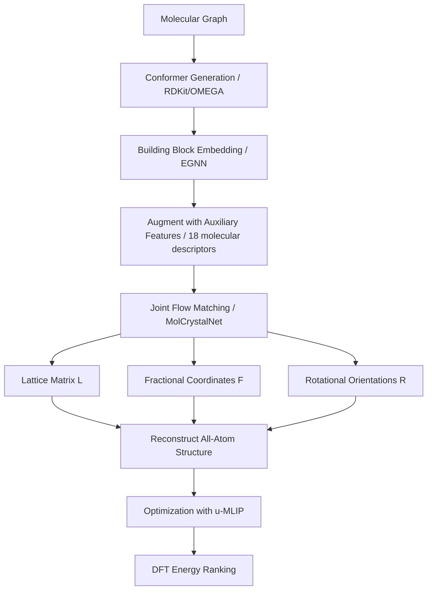

## Hook

신약을 개발할 때, 같은 분자라도 어떻게 쌓이느냐에 따라 약효가 완전히 달라진다. 이를 **polymorphism**(다형성)이라 부른다. 예를 들어 HIV 치료제 Ritonavir는 Form A로 출시되었다가, 몇 년 후 갑자기 Form B가 나타나면서 용해도가 급격히 떨어져 약효를 잃었다. 화학적으로는 동일한 분자이지만, 결정 구조가 달라지면서 제품 리콜과 막대한 재설계 비용이 발생했다. 이처럼 **분자 결정 구조 예측(molecular crystal structure prediction, CSP)**은 신약 개발의 핵심 과제다. 그런데 기존 방법들은 수백만 개의 구조를 무작위로 생성한 뒤 에너지를 계산해서 순위를 매기는 방식이라 엄청난 계산 비용이 든다. MolCrystalFlow는 생성 모델로 이 문제를 해결한다.

## Problem

분자 결정은 작은 분자 단위가 3D 공간에서 주기적으로 반복되는 구조다. 무기물 결정(예: 소금, 다이아몬드)과 달리, 분자 결정은 **분자 내부의 복잡한 구조**와 **분자 간 약한 상호작용**(수소 결합, van der Waals)이 동시에 작용한다. 이 때문에 하나의 분자가 여러 가지 안정한 결정 구조(다형체)를 가질 수 있다.

기존 CSP 방법들은 대부분 **"generate-and-rank"** 전략을 사용한다:
1. Random structure search나 evolutionary algorithm으로 수백만 개의 후보 구조 생성
2. 각 구조의 에너지를 DFT나 force field로 계산
3. 에너지가 낮은 순서대로 정렬

이 접근법의 문제점:
- **계산 비용**: 하나의 화합물에 수백만 CPU-hour가 필요
- **검색 공간의 거대함**: 50개 원자 결정의 경우 구조 공간이 기하급수적으로 증가
- **중복 제거의 어려움**: 생성된 구조를 클러스터링하고 필터링하는 후처리 비용

최근 생성 모델(diffusion, flow matching)이 분자, 단백질, 무기물 결정 생성에서 성공을 거두었지만, **분자 결정**에 적용하기는 쉽지 않다:
- **소분자 생성 모델**: 주기성(periodicity) 제약이 없음
- **무기물 결정 모델**: 원자가 50개를 넘어가면 성능이 급격히 떨어짐 (예: OMatG는 20개 원자에서 70% 정확도, 50개 원자에서 27%로 하락)
- **MOF 모델**: 주기적 병진 불변성(periodic translational invariance)을 완전히 만족하지 못함

따라서 **주기성을 만족하면서도 큰 분자 결정을 효율적으로 생성할 수 있는 모델**이 필요하다.

## Key Idea

MolCrystalFlow의 핵심 아이디어는 **계층적 표현(hierarchical representation)**과 **Riemannian flow matching**의 결합이다.

### 1. Rigid-body approximation으로 복잡도 분리
분자 결정을 생성할 때, 분자 **내부** 구조(어떤 원자가 어떻게 연결되어 있는지)와 분자 **간** 배치(분자들이 어떻게 쌓이는지)는 서로 다른 문제다. MolCrystalFlow는 각 분자를 **강체(rigid body)**로 취급한다. 즉, 분자 내부 구조는 고정하고, 분자들이 공간에서 어떻게 배치되고 회전하는지만 학습한다.

이를 위해 필요한 정보:
- **Lattice matrix** $$L \in \mathbb{R}^{3 \times 3}$$: 결정을 이루는 3개의 격자 벡터
- **Centroid fractional coordinates** $$F \in \mathbb{R}^{3}$$: 각 분자 중심의 위치 (격자 좌표계)
- **Rotational orientation** $$R \in \text{SO}(3)$$: 각 분자의 회전 상태

### 2. Riemannian manifold 위에서의 flow matching
각 변수는 자연스러운 **기하학적 manifold** 위에 존재한다:
- Fractional coordinates: 3D **torus** (주기 경계 조건 때문)
- Rotational orientation: **SO(3)** (3D 회전 그룹)
- Lattice matrix: Euclidean space (선형 보간)

Flow matching은 간단한 base distribution(예: Gaussian)에서 시작해 데이터 분포로 점진적으로 변환하는 방법이다. 각 manifold에 맞는 **geodesic interpolation**을 사용하여 물리적으로 타당한 경로를 따라 구조를 생성한다.

### 3. SE(3)-equivariant graph neural network
분자 결정은 **주기적 병진 불변성**(periodic translational invariance)과 **회전 등변성**(rotational equivariance)을 만족해야 한다. MolCrystalFlow는 이를 보장하는 GNN 아키텍처를 사용:
- **Fractional coordinates**: Fourier embedding으로 주기성 처리
- **Rotational orientation**: Axis-angle representation에서 각도는 Fourier embedding, inclination angle은 MLP
- **Lattice-position/orientation coupling**: 격자와 위치/회전의 상호작용을 명시적으로 모델링

> MolCrystalFlow는 분자 결정 생성 문제를 **"분자 내부 복잡도"와 "분자 간 배치"로 분리**하고, 각 모달리티(위치, 회전, 격자)를 자연스러운 manifold 위에서 동시에 학습한다.
{: .prompt-tip }

## How It Works

### 4.1 Overview

MolCrystalFlow는 두 단계로 작동한다:
1. **Building-block embedding**: 각 분자를 E(3)-invariant한 벡터로 임베딩
2. **Joint flow matching**: 격자, 위치, 회전을 동시에 생성

전체 파이프라인:



### 4.2 Representation

#### Molecular building block embedding

각 분자를 E(3)-invariant하게 표현하기 위해 **EGNN**(E(nn)-equivariant GNN)을 사용한다. 원자 좌표 $$x_i \in \mathbb{R}^3$$와 원자 타입 임베딩 $$h_i$$를 입력으로 받아, message passing을 수행한다:

$$
m_{ij} = \phi_m(h_i^l, h_j^l, d_{ij}^2, \phi_d(d_{ij})), \quad h_i^{l+1} = \phi_h(h_i^l, \sum_{j \neq i} m_{ij})
$$

여기서 $$d_{ij} = \|x_i - x_j\|$$는 원자 간 거리이고, $$\phi_d$$는 Gaussian RBF embedding이다. Message가 **거리에만 의존**하므로 회전/병진에 불변이다.

최종 building block 임베딩은 학습 가능한 가중 평균:

$$
\hat{h}_{\text{BB}} = \sum_i w_i \cdot h_{i,\text{final}}, \quad w_i = \phi_w([h_{i,\text{final}} \oplus \|x_i\|])
$$

추가로 18개의 보조 feature를 결합:
- **Basic** (3): 원자 수, 무거운 원자 수, 분자량
- **Chemical** (8): 키랄성, H-bond donor/acceptor 수, 회전 가능한 결합 수, 방향족 고리 수, logP, TPSA
- **Geometric** (7): 회전 반경, asphericity, eccentricity, planarity, 주성분 3개 길이

최종 임베딩: $$h_{\text{BB}} = [\hat{h}_{\text{BB}} \oplus \psi]$$

#### Fractional coordinates와 rotational orientation

분자 중심(centroid)은 **fractional coordinates** $$F \in [0,1)^3$$로 표현한다. Cartesian 좌표계 대신 격자 좌표계를 사용하면 주기 경계 조건을 자연스럽게 처리할 수 있다.

회전 방향은 **SO(3)** 행렬로 표현한다. 각 분자의 원자 좌표에 PCA(주성분 분석)를 수행해 3개의 주축(principal axes)을 얻고, 이를 정규화하여 회전 행렬을 구성한다.

### 4.3 Core Architecture

#### Overall architecture

```python
class MolCrystalFlow:
    """
    MolCrystalFlow: Molecular crystal structure prediction via flow matching
    """
    def __init__(self, hidden_dim=256, num_layers=5):
        # Stage 1: Building block embedder
        self.bb_embedder = EGNN(
            hidden_dim=hidden_dim,
            num_layers=num_layers,
            cutoff=5.0  # Angstrom
        )
        
        # Stage 2: Joint flow matching network
        self.flow_net = MolCrystalNet(
            bb_dim=hidden_dim + 18,  # EGNN embedding + auxiliary features
            hidden_dim=hidden_dim,
            num_layers=num_layers
        )
        
    def forward(self, molecular_graph, conformer_coords, t):
        """
        Args:
            molecular_graph: atom types and bonds
            conformer_coords: (N_atoms, 3) atomic coordinates
            t: time step in [0, 1]
        Returns:
            velocity fields for F, R, L
        """
        # Stage 1: Embed molecule as rigid body
        h_bb = self.bb_embedder(molecular_graph, conformer_coords)
        psi = compute_auxiliary_features(molecular_graph, conformer_coords)
        h_full = torch.cat([h_bb, psi], dim=-1)
        
        # Stage 2: Flow matching
        # Input: current state (F_t, R_t, L_t) at time t
        # Output: velocity u_F, denoised R_1, denoised L_1
        u_F, R_1, L_1 = self.flow_net(h_full, F_t, R_t, L_t, t)
        
        return u_F, R_1, L_1
```

#### MolCrystalNet: Periodic E(3)-invariant flow network

핵심 아키텍처는 DiffCSP를 기반으로 한 periodic GNN이다. 각 분자를 노드로 하고, 주기 경계를 고려한 edge를 구성한다.


_Figure 2: MolCrystalFlow의 신경망 아키텍처. (a) EGNN 기반 building block 임베딩, (b) MolCrystalNet의 joint flow matching, (c) Rotation message passing, (d) Chi embedding fusion, (e) Chi-grouped optimal transport_

```python
class MolCrystalNet(nn.Module):
    """
    Periodic E(3)-invariant graph neural network for joint flow matching.
    Simultaneously generates lattice matrix, fractional coordinates, and rotations.
    """
    def __init__(self, bb_dim, hidden_dim, num_layers):
        super().__init__()
        self.num_layers = num_layers
        
        # Time embedding (Transformer-style sinusoidal)
        self.time_mlp = nn.Sequential(
            SinusoidalPosEmb(hidden_dim),
            nn.Linear(hidden_dim, hidden_dim),
            nn.SiLU()
        )
        
        # Initial node embedding: [h_BB, psi, time_emb]
        self.node_init = nn.Linear(bb_dim + hidden_dim, hidden_dim)
        
        # Chi (axis-flip state) embedding
        self.chi_emb = nn.Embedding(2, hidden_dim)  # chi in {0, 1}
        
        # Message passing layers
        self.mp_layers = nn.ModuleList([
            PeriodicMessagePassing(hidden_dim) for _ in range(num_layers)
        ])
        
        # Output heads
        self.head_F = nn.Linear(hidden_dim, 3)  # velocity for F
        self.head_R = nn.Linear(hidden_dim, 9)  # denoised R (flattened 3x3)
        self.head_L = nn.Linear(hidden_dim, 9)  # denoised L (flattened 3x3)
        
    def forward(self, h_bb, F_t, R_t, L_t, chi, t):
        """
        Args:
            h_bb: (N_molecules, bb_dim) building block embeddings
            F_t: (N_molecules, 3) fractional coordinates at time t
            R_t: (N_molecules, 3, 3) rotational orientations at time t
            L_t: (3, 3) lattice matrix at time t
            chi: (N_molecules,) axis-flip state {0, 1}
            t: scalar time in [0, 1]
        Returns:
            u_F: (N_molecules, 3) velocity for fractional coordinates
            R_1: (N_molecules, 3, 3) denoised rotation
            L_1: (3, 3) denoised lattice
        """
        # Time embedding
        t_emb = self.time_mlp(t * torch.ones(h_bb.shape[0], 1))  # (N, hidden_dim)
        
        # Initial node embedding
        h = self.node_init(torch.cat([h_bb, t_emb], dim=-1))  # (N, hidden_dim)
        
        # Chi embedding fusion
        chi_emb = self.chi_emb(chi)  # (N, hidden_dim)
        h = h + chi_emb  # concatenate_sum operation
        
        # Message passing
        for layer in self.mp_layers:
            h = layer(h, F_t, R_t, L_t)
        
        # Output heads
        u_F = self.head_F(h)  # velocity for F
        R_1_flat = self.head_R(h)  # (N, 9)
        R_1 = R_1_flat.view(-1, 3, 3)
        R_1 = orthogonalize(R_1)  # project to SO(3)
        
        L_1_flat = self.head_L(h.mean(dim=0))  # pool over molecules
        L_1 = L_1_flat.view(3, 3)
        L_1 = enforce_lattice_constraints(L_1)
        
        return u_F, R_1, L_1
```

#### Periodic message passing

Message passing은 3가지 상호작용을 포함한다:
1. **Fractional coordinate message** $$m_F$$: Fourier embedding으로 주기성 보장
2. **Rotational message** $$m_R$$: Axis-angle representation
3. **Lattice coupling**: $$(F, L)$$과 $$(R, L)$$ 상호작용

```python
class PeriodicMessagePassing(nn.Module):
    def __init__(self, hidden_dim):
        super().__init__()
        self.mlp_F = nn.Sequential(...)  # Fourier-embedded F message
        self.mlp_R = nn.Sequential(...)  # Rotation message
        self.mlp_FL = nn.Sequential(...) # (F, L) coupling
        self.mlp_RL = nn.Sequential(...) # (R, L) coupling
        self.node_mlp = nn.Sequential(...)
        
    def forward(self, h, F_t, R_t, L_t):
        """
        h: (N, hidden_dim) node embeddings
        F_t: (N, 3) fractional coordinates
        R_t: (N, 3, 3) rotations
        L_t: (3, 3) lattice
        """
        N = h.shape[0]
        messages = []
        
        # Build periodic edges (considering 27 neighboring cells)
        for i in range(N):
            for j in range(N):
                for shift in get_periodic_shifts():  # [-1, 0, 1]^3
                    # Relative fractional coordinate
                    dF = F_t[j] - F_t[i] + shift  # (3,)
                    
                    # Fourier embedding for periodicity
                    m_F = fourier_embedding(dF)  # sin/cos encoding
                    
                    # Relative rotation
                    R_rel = R_t[j] @ R_t[i].T  # (3, 3)
                    omega_vec = rotation_to_axis_angle(R_rel)  # (3,)
                    omega = torch.norm(omega_vec)  # angle
                    e = omega_vec / (omega + 1e-8)  # axis
                    
                    # Polar coordinates of axis
                    kappa = torch.acos(e[2])  # inclination
                    rho = torch.atan2(e[1], e[0])  # azimuthal
                    
                    # Rotation message
                    m_R = torch.cat([
                        fourier_embedding(omega),
                        fourier_embedding(rho),
                        self.mlp_kappa(kappa)
                    ])
                    
                    # Lattice coupling
                    Gram_L = L_t.T @ L_t  # (3, 3)
                    m_FL = self.mlp_FL(Gram_L @ dF.unsqueeze(-1))
                    m_RL = self.mlp_RL(Gram_L @ omega_vec.unsqueeze(-1))
                    
                    # Aggregate message
                    m_ij = self.mlp_F(m_F) + self.mlp_R(m_R) + m_FL + m_RL
                    messages.append(m_ij)
        
        # Update node embeddings
        h_new = self.node_mlp(torch.cat([h, torch.stack(messages).sum(0)], dim=-1))
        return h_new
```

> **Axis-flip state** $$\chi \in \{0, 1\}$$: PCA로 주축을 구할 때 방향이 모호하다 (eigenvector의 부호). 같은 결정 내에서 분자들이 같은 방향을 향하는지, 반대 방향을 향하는지를 나타내는 이산 변수다. 학습 시 $$\chi$$는 고정되고, flow는 회전만 학습한다.
{: .prompt-info }

### 4.4 Key Innovation: Joint flow on Riemannian manifolds

각 변수는 자연스러운 manifold 위에서 정의된다:
- **Fractional coordinates** $$F$$: 3D torus $$\mathbb{T}^3 = [0,1)^3$$
- **Rotational orientation** $$R$$: $$\text{SO}(3)$$
- **Lattice matrix** $$L$$: Euclidean space $$\mathbb{R}^{3 \times 3}$$

Flow matching의 핵심은 interpolant $$x_t$$를 정의하는 것이다. Euclidean space에서는 단순히 선형 보간하지만, non-Euclidean manifold에서는 **geodesic**을 따라야 한다.

#### Torus geodesic (Fractional coordinates)

$$F_t = F_0 + t \cdot \delta F \pmod{1}$$

여기서 $$\delta F = F_1 - F_0$$를 $$[-0.5, 0.5]^3$$로 wrapping한다 (최단 경로).

#### SO(3) geodesic (Rotation)

$$R_t = \exp(t \log(R_1 R_0^{-1})) R_0$$

여기서 $$\log: \text{SO}(3) \to \mathfrak{so}(3)$$는 matrix logarithm이다.

#### Linear interpolation (Lattice)

$$L_t = (1-t) L_0 + t L_1$$

저자들은 lattice에 대해서는 data-informed base distribution을 사용하여 간단한 선형 보간이 충분함을 발견했다.

### 4.5 Training & Inference

#### Training objective

Flow matching의 목표는 velocity field $$u_\theta(x_t, t)$$를 학습하는 것이다. Conditional flow matching loss:

$$
\mathcal{L}_{\text{CFM}} = \mathbb{E}_{t, x_0, x_1} \left[ \| u_\theta(x_t, t) - u_t(x_t | x_0, x_1) \|^2 \right]
$$

여기서 $$u_t$$는 target velocity (geodesic의 미분).

**Denoising parameterization**: 일부 변수($$R$$, $$L$$)에 대해서는 velocity 대신 최종 상태 $$x_1$$을 직접 예측한다:

$$
\mathcal{L}_R = \mathbb{E}_{t, R_0, R_1} \left[ d_{\text{SO}(3)}(R_\theta(R_t, t), R_1)^2 \right]
$$

여기서 $$d_{\text{SO}(3)}$$는 SO(3) 위의 geodesic distance.

전체 loss는 3개 모달리티의 weighted sum:

$$
\mathcal{L} = \lambda_F \mathcal{L}_F + \lambda_R \mathcal{L}_R + \lambda_L \mathcal{L}_L
$$

#### Training loop

```python
# Training pseudocode
for batch in dataloader:
    # Sample time
    t = torch.rand(batch_size)  # uniform in [0, 1]
    
    # Get ground truth
    F_1, R_1, L_1 = batch['fractional_coords'], batch['rotations'], batch['lattice']
    
    # Sample base distribution
    F_0 = torch.rand_like(F_1)  # uniform on [0, 1]^3
    R_0 = sample_SO3_uniform(batch_size)  # Haar measure on SO(3)
    L_0 = sample_lattice_prior(batch_size)  # data-informed
    
    # Chi-grouped optimal transport
    chi = batch['chi']
    F_0, R_0 = optimal_transport_grouped_by_chi(F_0, R_0, F_1, R_1, chi)
    
    # Interpolate (geodesic)
    F_t = torus_geodesic(F_0, F_1, t)
    R_t = SO3_geodesic(R_0, R_1, t)
    L_t = (1 - t) * L_0 + t * L_1
    
    # Forward pass
    u_F_pred, R_1_pred, L_1_pred = model(h_bb, F_t, R_t, L_t, chi, t)
    
    # Compute losses
    u_F_target = compute_torus_velocity(F_0, F_1, t)
    loss_F = F.mse_loss(u_F_pred, u_F_target)
    loss_R = SO3_distance(R_1_pred, R_1) ** 2
    loss_L = F.mse_loss(L_1_pred, L_1)
    
    loss = lambda_F * loss_F + lambda_R * loss_R + lambda_L * loss_L
    loss.backward()
    optimizer.step()
```

#### Inference: sampling

```python
# Inference pseudocode
def sample_crystal(model, molecular_conformer, num_samples=10, num_steps=50):
    """
    Generate molecular crystal structures given a conformer.
    """
    # Embed building block
    h_bb = model.bb_embedder(molecular_conformer)
    psi = compute_auxiliary_features(molecular_conformer)
    h_full = torch.cat([h_bb, psi], dim=-1)
    
    # Initialize from base distribution
    F_0 = torch.rand(num_samples, N_molecules, 3)
    R_0 = sample_SO3_uniform(num_samples, N_molecules)
    L_0 = sample_lattice_prior(num_samples)
    chi = infer_chi_from_conformer(molecular_conformer)
    
    # ODE integration (Euler method)
    F_t, R_t, L_t = F_0, R_0, L_0
    dt = 1.0 / num_steps
    
    for step in range(num_steps):
        t = step * dt
        
        # Predict velocity / denoised targets
        u_F, R_1_pred, L_1_pred = model.flow_net(h_full, F_t, R_t, L_t, chi, t)
        
        # Velocity annealing (optional)
        u_F = u_F * scale_u_F  # e.g., scale_u_F = 9
        u_R = compute_rotation_velocity(R_t, R_1_pred) * scale_u_R  # e.g., scale_u_R = 3
        
        # Update
        F_t = F_t + u_F * dt
        F_t = F_t % 1.0  # wrap to [0, 1)
        
        R_t = SO3_exp_map(u_R * dt, R_t)  # exponential map on SO(3)
        L_t = L_t + (L_1_pred - L_t) * dt  # denoising step
    
    # Reconstruct all-atom structure
    structures = []
    for i in range(num_samples):
        coords = reconstruct_atoms(F_t[i], R_t[i], L_t[i], molecular_conformer)
        structures.append({'coords': coords, 'lattice': L_t[i]})
    
    return structures
```

> **Velocity annealing**: 추론 시 velocity에 scaling factor를 곱하면 성능이 향상된다. Grid search로 $$s_{u_F} \in [5, 13]$$, $$s_{u_R} \in [1, 3]$$을 찾았고, 최적값은 $$s_{u_F}=9, s_{u_R}=3$$이었다.
{: .prompt-tip }

## Results

### Dataset과 baseline

**Dataset**: 
- **CSD-11K**: Cambridge Structural Database에서 추출한 11,488개 분자 결정 (train 10K, val 738, test 750)
- **OMC25**: 오픈소스 분자 결정 데이터셋의 부분집합 (더 크고 다양함)

**Baselines**:
- **MOFFlow**: MOF를 위한 hierarchical flow model (state-of-the-art for large periodic crystals)
- **Genarris-3**: Rule-based random structure generator (space group constraints 사용)

**평가 지표**:
- **Structure matching rate**: 생성된 구조와 ground truth의 원자 위치 차이(site tolerance)로 판정
- **Lattice volume deviation**: RMAD (Relative Mean Absolute Deviation)

### 주요 결과

| Model | 10-sample match rate @ stol=0.8 | Lattice RMAD (%) |
|---|---|---|
| **MolCrystalFlow** | **6.8%** | **3.86 ± 0.07** |
| MOFFlow | 1.2% | 18.8 ± 0.6 |
| Genarris-3 (Raw) | 0.4% | 59.0 ± 0.35 |
| Genarris-3 (Opt) | 4.0% | 10.7 ± 0.20 |

**핵심 관찰**:
1. MolCrystalFlow가 MOFFlow와 Genarris-3 raw를 **압도적으로 능가**
2. Genarris-3 optimized와 비교하면, **loose tolerance**에서는 MolCrystalFlow가 우세, **strict tolerance**에서는 Genarris-3가 약간 앞섬
3. **Lattice volume 예측**은 MolCrystalFlow가 가장 정확 (RMAD 3.86%)


_Figure 3: MolCrystalFlow vs. MOFFlow vs. Genarris-3. (a) 직접 생성 구조, (b) 최적화 후 구조, (c-e) Lattice volume deviation_

### CSP 통합 파이프라인: MolCrystalFlow + u-MLIP + DFT

실제 CSP 시나리오에서는 생성된 구조를 **에너지로 ranking**해야 한다. 저자들은 다음 파이프라인을 구축했다:

1. **MolCrystalFlow**: 200개 후보 구조 생성
2. **UMA-OMC (u-MLIP)**: 모든 구조를 2단계 relaxation (rough + fine)
3. **Top-10 선택**: u-MLIP 에너지 기준으로 상위 10개 선택
4. **DFT ranking**: PBE-D3, PBE-MBD로 최종 에너지 계산

**Test targets**: 3rd CCDC CSP Blind Test의 target VIII, X, XI


_Figure 4: MolCrystalFlow + u-MLIP + DFT 통합 파이프라인. (a) 4단계 워크플로우, (b) 3개 CSP target 분자 구조, (c-e) 에너지 ranking 결과, (f) Packing 유사도 분석_

| Target | Exp. Z | Predicted Z | PBE-MBD ΔE (kJ/mol) | COMPACK RMSD (Å) |
|---|---|---|---|---|
| VIII | 8 | 4 | ~0.5 | 0.397 (7 matched) |
| X | 4 | 2 | ~3.0 | 2.703 (5 matched) |
| XI | 8 | 4 | ~1.0 | 1.107 (10 matched) |

**결과 해석**:
- Target **VIII**과 **XI**: 실험 구조와 비슷한 에너지와 packing을 가진 다형체 발견 (수소 결합 네트워크 유사)
- Target **X**: 에너지가 약 3 kJ/mol 높고, packing이 다름 (수소 결합 네트워크 불일치)

> CSP 성공 사례: MolCrystalFlow + u-MLIP + DFT 파이프라인이 2/3 target에서 실험 구조와 유사한 다형체를 발견했다. 하지만 복잡한 에너지 landscape에서 **정확한 실험 구조**를 재현하는 것은 여전히 어렵다.
{: .prompt-warning }

### 생성 속도

- **MolCrystalFlow**: 22 ms/structure (GPU)
- **Genarris-3**: 43 ms/structure (CPU)
- **MOFFlow**: 6 ms/structure (GPU) — 하지만 성능이 훨씬 낮아 샘플 수를 늘려도 따라잡지 못함

## Discussion

MolCrystalFlow는 분자 결정 구조 예측을 위한 첫 번째 **periodic E(3)-invariant flow matching** 모델이다. Rigid-body 가정을 통해 복잡도를 분리하고, Riemannian manifold 위에서 격자/위치/회전을 동시에 생성한다.

### 논문이 밝힌 한계점

1. **에너지 정보 부재**: 현재 모델은 구조 데이터만으로 학습하며, 에너지 정보를 직접 활용하지 않는다. 생성된 구조가 항상 낮은 에너지를 보장하지는 않는다. 이는 energy-based formulation이나 inference-time reweighting으로 개선 가능하다.

2. **Rigid-body 가정의 한계**: 많은 분자 결정이 **conformational polymorphism**(분자 내부 형태 변화)을 보인다. 예를 들어 Ritonavir의 Form A와 B는 분자 형태도 약간 다르다. Torsional degrees of freedom을 추가하면 이를 해결할 수 있다.

3. **Space group 제약 미활용**: 실험 분자 결정은 230개 space group 중 일부에만 집중된다 (예: P21/c가 35%). Space group을 명시적으로 제약하면 탐색 공간을 크게 줄일 수 있다.

### 향후 연구 방향 (논문에서 제시)

- **Energy-guided sampling**: Diffusion 과정에 에너지 gradient를 통합
- **Conformational flexibility**: Torsion angle을 추가 변수로 학습
- **Space-group conditioning**: Asymmetric unit 표현으로 변환

> MolCrystalFlow는 분자 결정 생성 분야의 중요한 첫걸음이지만, 에너지 정확도, 유연성, space group 활용 면에서 개선 여지가 많다. 특히 **생성 속도와 물리적 타당성**을 동시에 만족하는 점에서 실용적 가치가 크다.
{: .prompt-info }

## Limitations

1. **에너지 정보 미활용**: 구조 데이터만으로 학습하며 에너지를 직접 최적화하지 않아, 생성된 구조가 thermodynamically stable함을 보장하지 못한다.
2. **Rigid-body 가정**: 분자 내부 형태(conformation)를 고정하므로, conformational polymorphism(같은 분자의 다른 내부 형태로 인한 다형성)을 포착할 수 없다.
3. **Space group 제약 미사용**: 230개 crystallographic space group의 대칭 제약을 활용하지 않아, 탐색 공간이 불필요하게 넓고 물리적으로 불가능한 구조가 생성될 수 있다.
4. **Strict tolerance에서의 한계**: 느슨한 기준에서는 우수하지만, 엄격한 구조 일치 기준(stol < 0.3)에서는 rule-based 방법(Genarris-3 optimized)에 뒤처진다.
5. **단일 conformer 입력**: 하나의 분자 conformer만 입력으로 받으므로, 분자의 conformational flexibility에 대한 정보가 제한적이다.

## Conclusion

MolCrystalFlow는 분자 결정 구조 예측을 위한 최초의 periodic E(3)-invariant flow matching 모델이다. Rigid-body 가정으로 분자 내부/외부 복잡도를 분리하고, 격자·위치·회전 각각을 자연스러운 Riemannian manifold 위에서 동시에 생성한다. MOFFlow 대비 5배 이상의 구조 일치율과 3.86%의 lattice volume RMAD를 달성했으며, u-MLIP + DFT 파이프라인과 결합하여 CSP blind test에서 2/3 target의 다형체를 성공적으로 발견했다. Generate-and-rank 패러다임에서 학습 기반 생성으로의 전환을 이끄는 중요한 첫걸음이다.

## TL;DR

- **문제**: 분자 결정 구조 예측은 거대한 검색 공간과 다형성 때문에 어렵다. 기존 방법은 수백만 구조를 무작위 생성 후 ranking.
- **해법**: Rigid-body 가정으로 복잡도를 분리 → 격자/위치/회전을 Riemannian manifold 위에서 flow matching으로 동시 생성.
- **결과**: MOFFlow 대비 5배 이상 높은 구조 일치율, lattice volume RMAD 3.86%. u-MLIP + DFT와 결합하여 CSP blind test에서 2/3 성공.
- **한계**: 에너지 정보 미활용, rigid-body 가정, space group 제약 없음.

## Paper Info

| 항목 | 내용 |
|---|---|
| **Title** | MolCrystalFlow: Molecular Crystal Structure Prediction via Flow Matching |
| **Authors** | Chuanming Zeng et al. (University of Florida, NYU, University of Minnesota) |
| **Venue** | arXiv preprint |
| **Submitted** | 2026-02-19 |
| **Published** | arXiv preprint, February 2026 |
| **Link** | [arXiv:2602.16020](https://arxiv.org/abs/2602.16020) |
| **Paper** | [arXiv:2602.16020](https://arxiv.org/abs/2602.16020) |
| **Code** | 미공개 |

---

> 이 글은 LLM(Large Language Model)의 도움을 받아 작성되었습니다. 
> 논문의 내용을 기반으로 작성되었으나, 부정확한 내용이 있을 수 있습니다.
> 오류 지적이나 피드백은 언제든 환영합니다.
{: .prompt-info }
