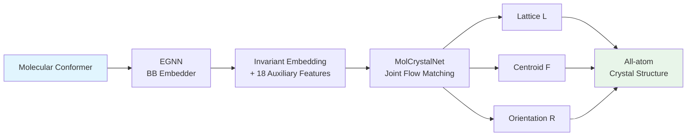
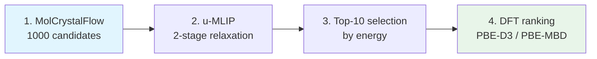

## 같은 분자, 다른 결정 — 왜 문제인가

항레트로바이러스 약물 Ritonavir는 Form A로 출시되었지만, 수년 후 Form B라는 새로운 polymorph가 실험실에서 발견되었다. 화학적으로 동일한 분자임에도 불구하고, 분자 패킹의 미세한 차이가 용해도를 극적으로 떨어뜨렸고, 결국 제품 회수와 대규모 재제형화 비용으로 이어졌다. 분자 결정 구조 예측(Crystal Structure Prediction, CSP)은 이런 사태를 사전에 방지하기 위한 핵심 과제다. MolCrystalFlow는 flow matching을 Riemannian manifold 위에서 구동하여, 분자 결정의 패킹 구조를 직접 생성하는 모델이다.

## 기존 접근법의 한계

분자 결정의 energy landscape에는 경쟁하는 low-energy minima가 무수히 존재한다. 기존 CSP 워크플로우는 stochastic 또는 evolutionary search로 후보 구조를 대량 생성한 뒤, lattice energy로 ranking하는 "generate-and-rank" 패러다임을 따른다. 이 방식은 단일 화합물에 수백만 CPU-hour를 요구하며, 화학 계열 간 일반화가 어렵다.

Generative modeling이 대안으로 떠올랐지만, 기존 모델들은 molecular crystal에 바로 적용하기 어렵다. All-atom inorganic crystal 모델(OMatG 등)은 원자 수 50개 부근에서 matching rate가 27.4%로 급감한다. MOFFlow는 periodic translational invariance를 강제하지 않고, AssembleFlow는 periodic lattice 자체를 다루지 않는다. Oxtal은 cluster 기반으로 lattice를 직접 생성하지 못해 post hoc lattice inference가 필요하다. 즉, periodic lattice constraint를 존중하면서 분자 결정 polymorph를 생성하는 모델은 부재했다.

## 핵심 아이디어: 분자 내부와 패킹의 분리

MolCrystalFlow의 핵심 전략은 intramolecular complexity와 intermolecular packing을 분리하는 것이다. 각 분자를 rigid body로 취급하여 내부 구조는 고정하고, crystal packing을 결정하는 세 가지 modality — lattice matrix $L$, centroid fractional coordinate $F$, rotational orientation $R$ — 만을 생성한다. 각 modality는 고유한 Riemannian manifold 위에서 flow matching으로 학습된다.

> 분자의 "무엇"은 고정하고, "어디에 어떤 방향으로 놓이는가"만 생성한다 — 이것이 hierarchical representation의 핵심이다.
{: .prompt-tip }

## How it works

### 전체 파이프라인

MolCrystalFlow는 2-stage hierarchical framework로 구성된다. Stage 1에서 각 분자를 E(3)-invariant embedding으로 변환하고, Stage 2에서 joint flow matching을 통해 lattice, centroid, orientation을 동시에 생성한다.

### Representation: Building Block Embedding

Stage 1에서는 EGNN을 사용해 분자의 E(3)-invariant embedding을 얻는다. 각 원자의 node embedding $h_i$는 cutoff radius 내 이웃 원자와의 message passing으로 업데이트되며, 최종 building block embedding은 learnable weighted mean으로 집계된다:

$$\hat{h}_{BB} = \sum_i w_i \cdot h_{i,\text{final}}, \quad w_i = \phi_w([h_{i,\text{final}} \oplus \|x_i\|])$$

EGNN embedding만으로는 원자 수 등의 분자 수준 정보가 약화될 수 있어, 18개의 auxiliary descriptor(원자 수, chirality, $\log P$, radius of gyration, asphericity 등)를 concatenate한다.

### Core Model: Riemannian Flow Matching

Stage 2의 MolCrystalNet은 세 modality를 각각의 intrinsic manifold에서 flow matching한다.

| Modality | Manifold | Interpolation | Output |
|---|---|---|---|
| Lattice $L \in \mathbb{R}^{3\times3}$ | Euclidean | Linear | Denoised $L_1$ |
| Centroid $F \in T^3$ | Torus | Geodesic (wrapping) | Velocity $u_t(F_t)$ |
| Orientation $R \in SO(3)$ | $SO(3)$ | Geodesic | Denoised $R_1$ |

Lattice와 orientation에는 denoising parameterization을 사용하고, fractional coordinate에는 periodic wrapping의 ambiguity를 피하기 위해 velocity-field objective를 유지한다. Orientation의 geodesic interpolation은 다음과 같다:

$$R_t = R_0 \cdot \exp\bigl(t \cdot \log(R_0^\top R_1)\bigr)$$

### Message Passing: 위치와 방향을 동시에 전달

MolCrystalNet의 message passing은 DiffCSP에서 차용한 periodic E(3)-invariant GNN을 기반으로 한다. Fractional coordinate message $m_F$는 relative fractional coordinate difference의 Fourier embedding으로 구성되어 periodic translational invariance를 보장한다.

Orientation을 위한 전용 message $m_R$도 도입되었다. 두 building block 간 relative rotation matrix를 axis-angle representation $\vec{\omega}$로 변환하고, rotation angle $\omega$와 azimuthal angle $\rho$는 Fourier feature로, inclination angle $\kappa$는 MLP로 embedding한다. 추가로 lattice Gram matrix와 fractional coordinate·rotation의 interaction $(F,L)$, $(R,L)$도 message passing에 포함된다.

### Key Innovation: $\chi$-grouped Optimal Transport

분자 결정에서 PCA로 local reference frame을 정의하면 axis-flip degeneracy가 발생한다. MolCrystalFlow는 이를 binary state $\chi \in \{0, 1\}$로 정의하고, 같은 $\chi$ group 내에서만 optimal transport를 수행한다. 이렇게 하면 서로 다른 axis-flip state의 building block 간 flow path가 교차(cross-link)하는 것을 방지하여 inference 품질을 높인다. $\chi$ embedding은 각 update block에서 concatenate-sum operation을 통해 node embedding에 반영된다.

### Velocity Annealing

Inference 시 manifold별 velocity scaling factor $s_{u_F}$, $s_{u_R}$을 도입하면 성능이 크게 향상된다. Grid search 결과, $s_{u_F} = 9$, $s_{u_R} = 3$에서 10-sample matching rate가 3.36%에서 6.8%로 약 2배 증가했다. 이는 Riemannian flow matching에서 manifold별 step size를 조절하는 것이 생성 품질에 중요함을 보여준다.

### Training & Generation

모델은 CSD에서 curate된 11,488개 구조(train 10,000 / val 738 / test 750)로 학습되었다. Inference는 50 integration time step으로 수행되며, 구조 하나 생성에 평균 22ms가 소요된다. Building block embedder(EGNN)와 MolCrystalNet은 end-to-end로 jointly training된다. 생성된 구조는 lattice matrix $L$, centroid $F$, orientation $R$과 고정된 intramolecular coordinate를 결합하여 all-atom crystal structure로 복원된다.

## 실험 결과

### CSD Benchmark

| Model | Lattice Volume RMAD | 생성 속도 |
|---|---|---|
| **MolCrystalFlow** | **3.86 ± 0.07%** | 22 ms/구조 |
| MOFFlow | 18.8 ± 0.6% | 6 ms/구조 |
| Genarris-3 (Raw) | 59.0 ± 0.35% | 43 ms/구조 |
| Genarris-3 (Opt) | 10.7 ± 0.20% | — |

MolCrystalFlow는 직접 생성된 구조 기준으로 모든 site tolerance에서 MOFFlow와 Genarris-3를 상회하는 matching rate를 보였다. Lattice volume RMAD 3.86%는 MOFFlow 대비 약 5배 정확하다. OMC25 데이터셋에서도 MolCrystalFlow의 우위가 더욱 두드러졌다.

### CSP Pipeline: CCDC Blind Test

MolCrystalFlow를 u-MLIP(UMA-OMC)과 DFT(PBE-D3, PBE-MBD)와 결합한 4-step CSP pipeline을 3rd CCDC Blind Test target에 적용했다.

Target VIII에서는 PBE-MBD 최저 에너지 polymorph가 실험 구조와 RMSD₇ = 0.397 Å로 유사한 패킹을 보였고, target XI은 RMSD₁₀ = 1.107 Å를 기록했다. Target X는 hydrogen-bonding network 복원에 실패하여 RMSD₅ = 2.703 Å로, 복잡한 energy landscape에서의 한계를 보여주었다.

> 생성된 구조들이 energy landscape의 low-energy basin에 위치한다는 점은 확인되었으나, 실험 구조의 정확한 재현은 여전히 도전적 과제로 남아있다.
{: .prompt-warning }

## Discussion

저자들이 밝힌 한계는 세 가지다. 첫째, 모델이 순수하게 구조 데이터만으로 학습되어 에너지 정보를 활용하지 못한다. Energy-based formulation이나 inference-time scaling/reweighting 전략과의 결합이 이를 완화할 수 있다. 둘째, rigid body 가정이 conformational polymorphism을 포착하지 못한다. Torsional degrees of freedom을 추가하면 all-atom 표현 없이도 intramolecular flexibility를 다룰 수 있다. 셋째, space group symmetry를 명시적으로 활용하지 않는다. Space-group-constrained manifold나 asymmetric unit representation 위에서 동작하는 방향이 향후 효율성과 정확도를 높일 수 있다.

## TL;DR

- 분자 결정의 intramolecular complexity와 intermolecular packing을 분리하여, lattice·centroid·orientation을 Riemannian manifold 위에서 joint flow matching으로 생성
- CSD 벤치마크에서 lattice volume RMAD 3.86%로 MOFFlow(18.8%) 대비 약 5배 정확하며, 구조당 22ms로 생성
- CCDC Blind Test에서 u-MLIP + DFT pipeline과 결합하여 실험 구조에 근접한 low-energy polymorph 발견

📄 [arXiv: 2602.16020](https://arxiv.org/abs/2602.16020)

---

> 이 글은 LLM(Large Language Model)의 도움을 받아 작성되었습니다.
> 논문의 내용을 기반으로 작성되었으나, 부정확한 내용이 있을 수 있습니다.
> 오류 지적이나 피드백은 언제든 환영합니다.
{: .prompt-info }
