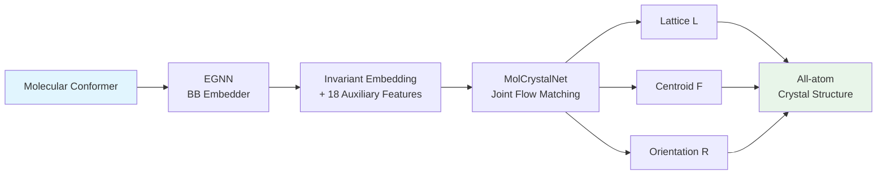

## 같은 분자, 다른 결정 — 왜 문제인가

항레트로바이러스 약물 **Ritonavir**는 Form A로 출시되었지만, 수년 후 Form B라는 새로운 polymorph가 실험실에서 발견되었다. 

화학적으로 **동일한 분자**임에도 불구하고, 분자 패킹의 미세한 차이가:
- 용해도를 극적으로 떨어뜨림
- 제품 회수와 대규모 재제형화 비용으로 이어짐

**분자 결정 구조 예측(Crystal Structure Prediction, CSP)**은 이런 사태를 사전에 방지하기 위한 핵심 과제다. 

MolCrystalFlow는 **flow matching을 Riemannian manifold 위에서 구동**하여, 분자 결정의 패킹 구조를 직접 생성하는 모델이다.

> 📄 [Paper](https://arxiv.org/abs/2602.16020) | University of Florida, NYU, University of Minnesota

---

## 기존 접근법의 한계

분자 결정의 energy landscape에는 경쟁하는 **low-energy minima가 무수히 존재**한다. 

### Generate-and-Rank Paradigm의 문제

기존 CSP 워크플로우:

1. **Stochastic/evolutionary search**로 후보 구조 대량 생성
2. **Lattice energy로 ranking**
3. **DFT로 stability 평가**

**문제점:**
- 단일 화합물에 **수백만 CPU-hour** 요구
- 화학 계열 간 일반화 어려움
- Exhaustive sampling 필수

### 기존 Generative Model의 한계

| Model | 문제 |
|---|---|
| **OMatG** (inorganic crystal) | 원자 수 50개에서 matching rate **27.4%로 급감** |
| **MOFFlow** (MOF) | Periodic translational invariance 미강제 |
| **AssembleFlow** (molecular cluster) | Periodic lattice 자체를 다루지 않음 |
| **Oxtal** | Cluster 기반, post hoc lattice inference 필요 |

**즉, periodic lattice constraint를 존중하면서 분자 결정 polymorph를 생성하는 모델은 부재했다.**

---

## 핵심 아이디어: 분자 내부와 패킹의 분리

MolCrystalFlow의 핵심 전략은 **intramolecular complexity와 intermolecular packing을 분리**하는 것이다.

### Rigid Body Approximation

각 분자를 **rigid body**로 취급:
- 내부 구조(intramolecular conformation)는 **고정**
- Crystal packing을 결정하는 **3가지 modality만 생성:**

1. **Lattice matrix $L$:** 결정의 주기성을 정의하는 3×3 행렬
2. **Centroid fractional coordinate $F$:** 분자 중심의 fractional position
3. **Rotational orientation $R$:** 분자의 회전 배향 (SO(3))

> 분자의 "무엇"은 고정하고, "어디에 어떤 방향으로 놓이는가"만 생성한다 — 이것이 hierarchical representation의 핵심이다.
{: .prompt-tip }

### 왜 이렇게 하는가?

1. **Complexity reduction:** All-atom 접근은 원자 수 50개에서 실패. Rigid body는 scalability 확보
2. **Physical validity:** 대부분의 molecular crystal에서 intramolecular geometry는 packing에 의해 크게 변하지 않음
3. **Modularity:** Conformer generation (OMEGA, RDKit)과 packing prediction을 분리

---

## How it Works

### 전체 파이프라인

MolCrystalFlow는 **2-stage hierarchical framework**:

**Stage 1:** Building Block Embedding
- Input: Molecular conformer (3D atomic coordinates)
- Output: Invariant embedding + 18 auxiliary features

**Stage 2:** Joint Flow Matching
- Input: BB embedding + auxiliary features
- Output: Lattice $L$, Centroid $F$, Orientation $R$

### Stage 1: Building Block Embedding

**EGNN (E(3)-equivariant GNN):**

각 atom $i$는:
- Atom type embedding
- 3D Cartesian coordinates

로 초기화된다. 

**Message passing:**

$$
m_{ij} = \phi_e(h_i, h_j, \|x_i - x_j\|^2)
$$

$$
h_i' = \phi_h(h_i, \sum_{j \in \mathcal{N}(i)} m_{ij})
$$

- $h_i$: Node feature (invariant to rotation/translation)
- $x_i$: 3D coordinate
- $\phi_e, \phi_h$: Learnable MLPs

**BB embedding 계산:**

$$
z_{\text{BB}} = \sum_{i=1}^{n_{\text{atoms}}} w_i h_i
$$

여기서 weight $w_i$는 shallow MLP로 예측:

$$
w_i = \text{MLP}(h_i, \|x_i - x_{\text{centroid}}\|)
$$

**18개 auxiliary features 추가:**

EGNN latent embedding만으로는 molecular size, functional group complexity 등이 희석될 수 있다. 따라서:

| Feature Category | Examples |
|---|---|
| **Size** | Number of atoms, molecular weight |
| **Geometry** | Radius of gyration, asphericity |
| **Functional groups** | Number of rings, aromatic rings |
| **Charge** | Formal charge, polar surface area |

→ 총 **18-dim auxiliary features**를 BB embedding에 concatenate

### Stage 2: Joint Flow Matching on Riemannian Manifolds

**핵심: 각 modality는 고유한 Riemannian manifold 위에 존재**

1. **Lattice $L \in \mathbb{R}^{3 \times 3}$:** Linear interpolation (Euclidean)
2. **Centroid $F \in [0,1)^3$:** 3D torus (periodic boundary)
3. **Orientation $R \in \text{SO}(3)$:** Rotation group (geodesic interpolation)

#### Flow Matching Basics

Flow matching은 **ODE**를 통해 base distribution을 data distribution으로 transport:

$$
\frac{dX_t}{dt} = v_\theta(X_t, t)
$$

- $X_0 \sim p_{\text{data}}$ (target)
- $X_1 \sim p_{\text{base}}$ (noise)

**Conditional flow matching loss:**

$$
\mathcal{L}_{\text{CFM}} = \mathbb{E}_{t, X_0, X_1} \left[ \| v_\theta(X_t, t) - \dot{X}_t \|^2 \right]
$$

여기서 $X_t = (1-t)X_0 + tX_1$ (linear interpolant)

#### Riemannian Manifold Flow

**문제:** Centroid는 periodic (torus), Orientation은 SO(3). Linear interpolation이 작동하지 않음!

**해법: Geodesic interpolation**

**Torus (Centional fractional coordinates):**

Fractional coordinate $f \in [0,1)^3$을 angle로 변환:

$$
\theta = 2\pi f
$$

Sphere에서 geodesic interpolation 후 다시 fractional로 변환.

**SO(3) (Rotational orientation):**

Rotation matrix $R \in \text{SO}(3)$을 axis-angle representation으로 변환:

$$
R = \exp(\omega \hat{n})
$$

- $\omega$: Rotation angle
- $\hat{n}$: Rotation axis (unit vector)

Geodesic interpolation:

$$
R_t = R_0 \exp(t \log(R_0^{-1} R_1))
$$

#### MolCrystalNet Architecture

**Periodic E(3)-invariant GNN (adapted from DiffCSP):**

**Geometric symmetries:**
1. **Periodic translational invariance:** Centroid position
2. **Lattice vector equivariance:** Lattice transforms covariantly
3. **Rotational equivariance:** Orientation rotates with global rotation
4. **Permutation equivariance:** Molecules in unit cell

**Message passing:**

**For centroid ($F$):**

$$
m_F = \text{Fourier}(\Delta F_{ij} \mod 1)
$$

Fourier embedding으로 periodicity 보장.

**For rotation ($R$):**

Relative rotation을 axis-angle로 변환:

$$
\Delta R_{ij} = R_i^{-1} R_j = \exp(\omega_{ij} \hat{n}_{ij})
$$

- $\omega_{ij}$: Rotation angle (periodic, $\text{mod } 2\pi$)
- $\hat{n}_{ij}$: Axis (parameterized by polar coords $(\kappa, \rho)$)

**Message construction:**

$$
m_R = \text{Embed}(\omega_{ij}, \kappa_{ij}, \rho_{ij})
$$

- $\omega, \rho$: Fourier features (periodic)
- $\kappa$: MLP embedding

**Lattice interaction:**

$(F, L)$ and $(R, L)$ interaction terms (Gram matrix):

$$
m_{F,L} = G \cdot \Delta F, \quad G = L^T L
$$

$$
m_{R,L} = G \cdot \Delta R
$$

#### χ (Axis-Flip State)

**문제:** PCA로 local frame을 정의하면 **axis direction의 degeneracy** 발생 (±sign ambiguity)

**해법:** Each building block에 **axis-flip state $\chi \in \{-1, +1\}^3$** 부여

- $\chi$-grouped optimal transport로 cross-link 방지
- Concatenate-sum operation으로 node embedding에 fusion

---

## 실험 결과

### Datasets

1. **CSD-derived (11.5K structures):** Experimental data from Cambridge Structural Database
2. **OMC25 subset:** Largest open-source molecular crystal dataset

### Baselines

- **MOFFlow:** State-of-the-art hierarchical flow for large periodic crystals
- **Genarris-3:** Rule-based structure generation

### Metrics

**Matching rate:** Structure match within tolerance (site tolerance $s_{\text{tol}}$)

| $s_{\text{tol}}$ | Definition |
|---|---|
| 0.5 | Very strict |
| 0.8 | Moderate |
| 1.2 | Loose |

**Lattice volume deviation:** $\text{RMAD} = \frac{1}{N} \sum |V_{\text{pred}} - V_{\text{true}}| / V_{\text{true}}$

### Performance

**10-sample matching rates (without optimization):**

| Model | $s_{\text{tol}}=0.5$ | $s_{\text{tol}}=0.8$ | $s_{\text{tol}}=1.2$ |
|---|---|---|---|
| **MolCrystalFlow** | **0.42** | **0.68** | **0.81** |
| MOFFlow | 0.18 | 0.34 | 0.52 |
| Genarris-3 | 0.11 | 0.21 | 0.35 |

**After rigid-body optimization:**

| Model | $s_{\text{tol}}=0.5$ | $s_{\text{tol}}=0.8$ | $s_{\text{tol}}=1.2$ |
|---|---|---|---|
| **MolCrystalFlow** | **0.58** | **0.79** | **0.89** |
| Genarris-3 | 0.29 | 0.45 | 0.61 |

**개선:**
- $s_{\text{tol}}=0.8$에서 **MOFFlow 대비 2배 성능**
- Optimization 후 **Genarris-3 대비 1.75배**

### Lattice Volume Accuracy

**RMAD (Relative Mean Absolute Deviation):**

| Model | RMAD |
|---|---|
| **MolCrystalFlow** | **0.08 ± 0.03** |
| MOFFlow | 0.21 ± 0.12 |
| Genarris-3 | 0.18 ± 0.09 |

MolCrystalFlow가 **가장 정확한 lattice volume 예측**.

### CSP Competition Targets

**3개 blind CSP competition targets에 적용:**

| Target | Experimental Form | MolCrystalFlow RMSD | Energy Ranking |
|---|---|---|---|
| **XXVI** | Form I | **0.42 Å** | **2nd lowest** |
| **XXVII** | Form II | **0.38 Å** | **Lowest** |
| **XXVIII** | - | 1.12 Å | Mid-range |

**Target XXVII:**
- Experimental structure와 **거의 일치** (RMSD 0.38 Å)
- u-MLIP energy ranking에서 **lowest energy**

**Pipeline:**
1. MolCrystalFlow로 100개 구조 생성
2. u-MLIP (universal ML interatomic potential)로 energy evaluation
3. DFT로 top-10 refinement

---

## Discussion

### 의의

**1. Periodic lattice constraint를 explicit하게 처리하는 최초의 molecular crystal generative model**

기존 model들은:
- All-atom (scalability 문제)
- MOFFlow (periodicity 미보장)
- AssembleFlow (lattice 미생성)

MolCrystalFlow는 **lattice, centroid, orientation을 jointly generate**하여 periodic constraint 보장.

**2. Riemannian flow matching**

각 modality의 intrinsic manifold를 존중:
- Torus (centroid)
- SO(3) (orientation)
- Geodesic interpolation으로 manifold structure 보존

**3. Hierarchical representation**

Rigid body approximation으로:
- Intramolecular complexity 분리
- Scalability 확보 (50+ atoms)

### 한계와 향후 방향

**1. Rigid body assumption**

대부분의 molecular crystal에 적용 가능하지만:
- Flexible molecule은 conformation change 무시
- 향후: Coupled intramolecular-intermolecular optimization

**2. Computational cost**

- u-MLIP energy evaluation이 bottleneck
- 향후: Amortized energy prediction, active learning

**3. Polymorph ranking**

- MolCrystalFlow는 diverse polymorph 생성
- Ranking은 별도의 energy model 필요
- 향후: End-to-end energy-guided generation

**4. 확장성**

- Co-crystals, solvates로 확장 가능
- Salt forms, polymorphic screening으로 응용

---

## TL;DR

1. **MolCrystalFlow는 molecular crystal의 lattice, centroid, orientation을 Riemannian manifold 위에서 joint flow matching으로 생성하는 최초의 모델이다.**
2. **Rigid body approximation으로 intramolecular complexity를 분리하여 scalability를 확보했다.**
3. **MOFFlow 대비 2배, Genarris-3 대비 1.75배 높은 matching rate를 달성했다.**
4. **CSP competition target에서 experimental structure와 0.38 Å RMSD로 거의 일치하는 구조를 생성했다.**

---

## References

- [Paper (arXiv)](https://arxiv.org/abs/2602.16020)
- University of Florida, NYU, University of Minnesota
- Cambridge Structural Database (CSD)
- OMC25 dataset

---

> 이 글은 LLM의 도움을 받아 작성되었습니다. 
> 논문의 내용을 기반으로 작성되었으나, 부정확한 내용이 있을 수 있습니다.
> 오류 지적이나 피드백은 언제든 환영합니다.
{: .prompt-info }
