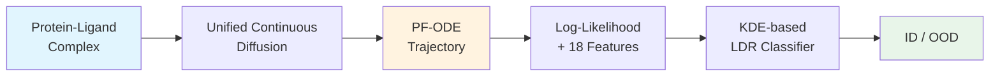

## 새로운 단백질에 대한 binding affinity 예측, 얼마나 믿을 수 있을까?

Drug discovery에서 ML 모델이 학습 데이터에 없던 protein-ligand complex를 만나면 어떻게 될까? 대부분의 경우, 모델은 **자신이 모른다는 사실조차 모른 채** 자신 있게 틀린 답을 내놓는다. 

ETH Zurich 연구진이 제안한 이 논문은 **diffusion model의 PF-ODE trajectory를 분석**해서, 3D molecular graph에 대한 최초의 unsupervised OOD detection framework를 제시한다.

> 📄 [Paper](https://arxiv.org/abs/2512.18454) | ETH Zurich, 2025

---

## 3D Graph에서의 OOD Detection, 왜 어려운가

기존 OOD detection은 크게 두 갈래로 나뉜다:

**1. Discriminative 방식**
- Pretrained classifier의 output score 활용
- **문제:** Label이 필요하다는 근본적 한계

**2. Generative 방식**
- Likelihood 기반으로 작동
- **문제: Complexity bias** — 구조적으로 단순한 OOD 데이터에 높은 likelihood를 부여해서 false negative를 만드는 현상

더 근본적인 문제는, 기존 graph OOD detection이 대부분 **2D topological graph**에 초점을 맞추고 있다는 점이다. 

Protein-ligand complex처럼:
- **3D 좌표 (연속)**
- **Atom/residue type (이산)**

이 결합된 **irregular 3D graph**에 적용할 수 있는 방법이 사실상 없었다. 이 gap을 메우는 것이 이 논문의 출발점이다.

---

## 핵심 아이디어: Trajectory가 OOD를 말해준다

이 논문의 핵심 직관은 간단하다. Diffusion model이 데이터를 noise로 변환하는 과정에서:

- **In-distribution (ID) sample:** 효율적이고 직선적인 경로 ✅
- **OOD sample:** Erratic하고 chaotic한 경로 ⚠️

단순히 최종 log-likelihood 값만 보는 것이 아니라, noise로 가는 **전체 trajectory의 기하학적 특성** 18가지를 추출해서 OOD 여부를 판단한다.

Log-likelihood 하나로는 complexity bias를 피할 수 없지만, **trajectory-level feature**를 함께 쓰면 이 문제를 극복할 수 있다.

---

## How it Works

### 전체 파이프라인

전체 파이프라인은 크게 세 단계:

1. **Unified continuous diffusion model 학습**
2. **PF-ODE trajectory를 통한 log-likelihood 및 geometric feature 추출**
3. **Trajectory-aware LDR classifier로 OOD 분류**

### Unified Continuous Diffusion for 3D Graphs

**핵심 문제:** 3D coordinate (연속)와 categorical identity (이산)를 어떻게 하나의 diffusion process로 통합할 것인가?

**해법: Posterior-mean interpolation**

1. **Categorical feature를 연속 공간에 embedding:** Atom/residue type을 continuous sphere에 projection
2. **3D coordinates와 concatenate**하여 단일 state로 취급
3. **SE(3)-equivariant GNN**이 이 joint state를 처리하여:
   - Clean coordinates 예측
   - Per-node class probability (logits) 예측
4. **Posterior mean 계산:** Predicted probability를 가중치로 chemical prototype들의 weighted average
5. **Score를 analytically 계산:** Cross-entropy loss로 학습하면서도 smooth diffusion dynamics 유지

**Forward process (SDE):**

$$
dX_\tau = -\frac{1}{2}\beta_\tau X_\tau d\tau + \sqrt{\beta_\tau} dW_\tau
$$

**Marginal distribution:**

$$
X_\tau = \alpha_\tau X_0 + \sigma_\tau \epsilon, \quad \epsilon \sim N(0, I)
$$

- $\alpha_\tau = \exp\{-\int_0^\tau \beta_s ds / 2\}$
- $\sigma_\tau^2 = 1 - \alpha_\tau^2$

**Reverse process (PF-ODE):**

Diffusion의 deterministic counterpart인 **probability-flow ODE**를 활용:

$$
\frac{dX_\tau}{d\tau} = -\frac{1}{2}\beta_\tau X_\tau - \beta_\tau \nabla_x \log p_\tau(X_\tau | C)
$$

이 ODE를 따라 각 sample이 unique한 trajectory를 그리며, 이 trajectory의 기하학적 특성이 OOD signal이 된다.

### Trajectory-Level Features: 18가지 기하학적 지표

PF-ODE trajectory로부터 추출하는 18가지 feature (크게 4개 카테고리):

**1. Log-likelihood**
- PF-ODE divergence를 적분하여 계산되는 per-sample log-likelihood

**2. Path Geometry**
- **Tortuosity (굴곡도):** Path length / Euclidean distance
- **Average step size**
- **Step size variance**

**3. Flow Dynamics**
- **Flow energy:** $\int \|\nabla_x \log p_\tau\|^2 d\tau$
- **Flow stiffness:** Trajectory 동안 score magnitude의 변화율
- **Vector field instability:** 인접한 trajectory 간의 divergence

**4. Statistical Properties**
- **Score distribution moments:** Mean, variance, skewness, kurtosis
- **Coordinate-wise statistics**

> **직관:** ID sample은 well-constrained vector field를 따라 효율적으로 이동하지만, OOD sample은 low-density region을 지나며 erratic trajectory를 보인다.
{: .prompt-tip }

### LDR (Likelihood-Decay-Rate) Classifier

최종 OOD detection은 **KDE-based LDR (Likelihood-Decay-Rate) classifier**로 수행:

1. **Training data의 trajectory features로 KDE 학습**
2. **Test sample의 trajectory features에 대한 density 계산**
3. **Density threshold로 ID/OOD 분류**

이 방법은:
- Log-likelihood만 쓰는 것보다 **complexity bias에 robust**
- Trajectory geometry가 추가적인 OOD signal 제공

---

## 실험 결과

### 데이터셋 구성: Strict OOD Split

**핵심 아이디어:** Entire protein family를 training에서 완전히 제외하여 strict OOD split 구성

**Split 구성:**

| Dataset | OOD Level | 설명 |
|---|---|---|
| **Validation** | Minimal shift | Training distribution에서 추출 |
| **CASF2016** | Intermediate shift | CleanSplit filtering 적용 |
| **7개 protein families** | Strong shift | 전체 family 제외 |

**제외된 7개 protein families:**
1. Serine/threonine-protein kinases
2. Estrogen receptors
3. HIV proteases
4. α-Carbonic anhydrases
5. Urokinase-type plasminogen activators
6. HSP82 chaperones
7. Transporter proteins cluster

### Bioinformatic Validation

**3가지 similarity metric으로 OOD level 검증:**

1. **Ligand similarity:** Tanimoto score (molecular fingerprint 기반)
2. **Protein similarity:** TM-align score (3D structure alignment)
3. **Aggregated similarity:** $S = \text{Tanimoto} + \text{TM-score} + (1 - \text{RMSD})$

**결과:**
- OOD datasets는 training data와 **매우 낮은 similarity**
- Validation set은 **높은 similarity**
- CASF2016은 **중간 수준 similarity**

→ Split이 실제로 strict OOD를 구성함을 확인

### Log-Likelihood 분석

**주요 발견:**

1. **대부분의 OOD datasets가 낮은 log-likelihood 분포를 보임**
   - Training: 높은 log-likelihood ✅
   - Validation: Training보다 약간 낮음 ✅
   - 대부분 OOD: 명확히 낮은 log-likelihood ✅

2. **HIV protease family가 가장 큰 distribution shift**
   - 이유: Viral protease의 unique structure (두 개의 short identical subunit 사이 active site, flexible molecular flaps)

3. **α-Carbonic anhydrase (3dd0)는 예외적으로 높은 log-likelihood**
   - 원인: **Complexity bias** 발생
   - 이 dataset의 ligand가 structurally simple (fewer atoms)
   - Log-likelihood만으로는 OOD를 감지하지 못함 ⚠️

### Trajectory Features로 Complexity Bias 극복

**3dd0 dataset에 대한 결과:**

| Method | AUROC | AUPRC |
|---|---|---|
| Log-likelihood only | 0.42 | 0.31 |
| **Trajectory features** | **0.89** | **0.85** |

**Trajectory features가 complexity bias를 성공적으로 극복!**

### Overall OOD Detection Performance

**8개 OOD datasets에 대한 평균 성능:**

| Method | AUROC (평균) | AUPRC (평균) |
|---|---|---|
| Log-likelihood only | 0.76 ± 0.12 | 0.68 ± 0.15 |
| **LDR (18 features)** | **0.91 ± 0.07** | **0.87 ± 0.09** |

**개선:**
- AUROC: **+19.7%** 
- AUPRC: **+27.9%**

### GEMS Error Prediction

**핵심 질문:** OOD detection이 downstream task (binding affinity prediction)의 error를 예측할 수 있는가?

**실험:** GEMS (independent binding affinity predictor)의 prediction error와 OOD score 간 correlation 측정

**결과:**

| Metric | Pearson's r |
|---|---|
| Log-likelihood vs GEMS error | **0.68** |
| LDR score vs GEMS error | **0.81** |

**해석:**
- OOD score가 높을수록 GEMS의 prediction error도 높다
- **A priori reliability estimate 가능** (downstream task 돌리기 전에 신뢰도 예측)

---

## Discussion

### 의의

**1. 3D geometric graph에 대한 최초의 unsupervised OOD detection framework**

기존 graph OOD detection은 2D topological graph에 집중했다. 이 논문은 3D coordinate + categorical feature를 동시에 처리하는 최초의 framework.

**2. Trajectory-level feature로 complexity bias 극복**

단순히 log-likelihood를 쓰는 것이 아니라, **PF-ODE trajectory의 18가지 geometric feature**를 함께 활용하여 complexity bias를 성공적으로 극복.

**3. Label-free, model-agnostic**

- Downstream task의 label이 필요 없음
- 어떤 continuous diffusion framework에도 적용 가능

### 한계와 향후 방향

**1. Computational cost**
- PF-ODE integration과 trajectory feature 계산이 추가 비용
- 향후: Amortized inference 방법 개발

**2. Threshold selection**
- KDE threshold를 어떻게 설정할 것인가?
- 향후: Adaptive threshold, calibration method

**3. 다른 modality로 확장**
- Image, text 등 다른 domain에도 적용 가능성 탐색
- 특히 medical imaging, scientific data에 유용할 것

---

## TL;DR

1. **Diffusion model의 PF-ODE trajectory를 분석하면 3D molecular complex의 OOD를 감지할 수 있다.**
2. **Log-likelihood만으로는 complexity bias 문제가 있지만, 18가지 trajectory-level geometric feature를 함께 쓰면 이를 극복할 수 있다.**
3. **AUROC 0.91, AUPRC 0.87로 기존 likelihood-only 방법 대비 20-28% 성능 향상을 달성했다.**
4. **OOD score가 downstream task (binding affinity prediction)의 error를 예측하여 a priori reliability estimate가 가능하다.**

---

## References

- [Paper (arXiv)](https://arxiv.org/abs/2512.18454)
- ETH Zurich, Institute of Computational Life Sciences
- PDBbind dataset, CASF2016 benchmark
- GEMS (Geometric Equivariant Molecular Scoring)

---

> 이 글은 LLM의 도움을 받아 작성되었습니다. 
> 논문의 내용을 기반으로 작성되었으나, 부정확한 내용이 있을 수 있습니다.
> 오류 지적이나 피드백은 언제든 환영합니다.
{: .prompt-info }
