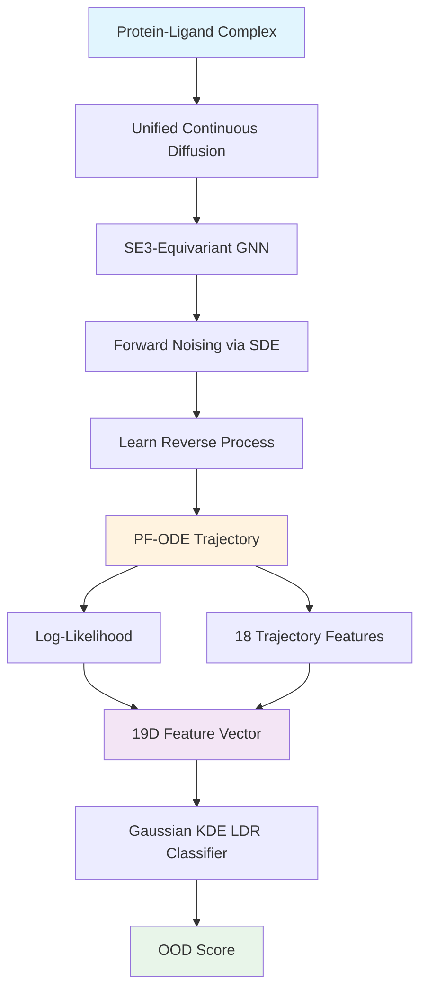

## Hook

AI 모델이 protein-ligand binding affinity를 예측한다. 학습 데이터와 비슷한 분자라면 정확하다. 그런데 완전히 새로운 단백질 패밀리가 들어오면? 모델은 자신감 넘치게 틀린 답을 내놓는다. 문제는 **언제 틀렸는지 모른다**는 것이다.

Out-of-distribution (OOD) detection은 이 문제를 해결한다. 이 논문은 3D molecular complex에 특화된 최초의 unsupervised OOD detection 프레임워크를 제시한다. Diffusion model의 probability-flow ODE (PF-ODE) trajectory를 분석해서, 새로운 분자가 학습 분포에서 얼마나 벗어났는지 정량화한다.

## Problem

### 기존 OOD Detection의 한계

전통적인 OOD 탐지는 크게 두 가지로 나뉜다.

**Discriminative methods**: Classifier의 출력 스코어를 활용한다. 문제는 in-distribution (ID) label이 필요하다는 것. Unsupervised setting에서는 사용 불가능하다.

**Generative methods**: 
- **Reconstruction-based**: VAE 같은 모델로 재구성하고, 재구성 에러가 크면 OOD로 판단. 그런데 강력한 decoder는 의미적으로 새로운(semantically novel) 입력도 잘 재구성해버린다 (reconstruction shortcut).
- **Likelihood-based**: Diffusion model로 확률 밀도를 모델링하고, 낮은 likelihood를 OOD로 간주. 이론적으로 타당하지만, **complexity bias**에 취약하다. 구조적으로 단순한 OOD 샘플(예: 작은 분자)에 높은 likelihood를 부여한다.

### 3D Graph Domain의 공백

기존 OOD detection은 주로 2D 이미지나 topological graph에 초점을 맞췄다. **3D geometric graph** (protein-ligand complex처럼 spatial coordinate와 discrete feature가 결합된 데이터)에 대한 연구는 거의 없다.

Protein-ligand complex는 irregular 3D graph다:
- **Continuous**: 3D atomic coordinates (x, y, z)
- **Discrete**: Atom types, residue types
- **SE(3) symmetry**: 회전/평행이동에 불변

이런 데이터에서 OOD를 탐지하려면, geometry와 discrete feature를 동시에 모델링해야 한다.

## Key Idea

### PF-ODE Trajectory로 OOD를 본다

Diffusion model은 데이터를 점진적으로 노이즈로 변환하는 forward SDE를 정의한다. 이걸 역으로 푸는 reverse process를 학습한다. 여기서 핵심은 **probability-flow ODE (PF-ODE)**다.

PF-ODE는 SDE의 deterministic counterpart다. 모든 샘플을 noise space와 data space 사이에서 unique한 경로(trajectory)로 이동시킨다. 이 trajectory를 따라 적분하면 exact log-likelihood를 계산할 수 있다.

**아이디어**: ID 샘플과 OOD 샘플은 PF-ODE trajectory의 **기하학적 특성**이 다르다.

- **ID samples**: 학습 데이터가 많은 영역을 지나간다. Vector field가 잘 정의되어 있어서, 경로가 효율적이고 부드럽다.
- **OOD samples**: 학습 데이터가 부족한 low-density 영역을 지나간다. Vector field가 불안정하고 모호해서, 경로가 불규칙하고 비효율적이다.


_Figure 1: ID 샘플은 직선에 가까운 효율적인 경로를 따르고, OOD 샘플은 불규칙하고 긴 경로를 따른다. 출처: 원 논문_

### Complexity Bias 극복

Log-likelihood만으로는 부족하다. α-carbonic anhydrase 같은 작은 분자들은 구조적으로 단순해서, OOD임에도 높은 likelihood를 받는다.

**해결책**: Likelihood에 **18가지 trajectory feature**를 추가한다.

- **Path efficiency/tortuosity**: 경로가 얼마나 구불구불한가?
- **Vector field energy**: 모델이 얼마나 많은 "일"을 했는가?
- **Lipschitz stability**: 근처 상태가 얼마나 다르게 반응하는가?
- **Acceleration**: 흐름의 속도가 얼마나 급격히 변하는가?

이 19차원 feature space에서 Gaussian KDE로 log-density ratio (LDR)를 계산해서 OOD를 분류한다.

## How It Works

### Overview: 전체 파이프라인



전체 파이프라인은 크게 4단계로 나뉜다:

1. **Unified continuous diffusion**: 3D coordinates + discrete atom types를 하나의 연속 공간에서 처리
2. **SE(3)-equivariant model**: 회전/평행이동 불변성을 보존하는 GNN으로 score 학습
3. **PF-ODE integration**: Trajectory를 따라 log-likelihood + geometric features 추출
4. **LDR classification**: 19차원 feature space에서 ID/OOD 분류

### Representation: Continuous Space에 Discrete Feature 통합

Protein-ligand complex는 두 가지 정보를 담고 있다:
- **Coordinates**: $$\mathbf{x} \in \mathbb{R}^{N \times 3}$$ (N atoms, 3D positions)
- **Atom types**: $$\mathbf{h} \in \{1, 2, \ldots, K\}^N$$ (categorical, K개 atom type)

기존 diffusion은 continuous space에서만 작동한다. Discrete feature를 어떻게 처리할까?

**저자의 해법**: Categorical embedding을 continuous space에 매핑한다.

1. 각 atom type $$k$$마다 learnable prototype vector $$\mathbf{c}_k \in \mathbb{R}^d$$를 정의
2. Atom type $$h_i$$를 one-hot vector $$\mathbf{o}_i$$로 변환
3. Embedding: $$\mathbf{e}_i = \sum_{k=1}^{K} o_{i,k} \cdot \mathbf{c}_k$$
4. Coordinates와 concatenate: $$\mathbf{z}_i = [\mathbf{x}_i; \mathbf{e}_i] \in \mathbb{R}^{3+d}$$

이제 전체 complex는 $$\mathbf{z} \in \mathbb{R}^{N \times (3+d)}$$ 하나의 연속 텐서로 표현된다. 이걸 diffusion process에 넣는다.

### Core Architecture: SE(3)-Equivariant Denoising Network

```python
class SE3EquivariantDiffusion(nn.Module):
    """
    Unified continuous diffusion for protein-ligand complexes.
    Combines 3D coordinates and discrete atom types in a single process.
    """
    def __init__(self, n_atom_types: int, embed_dim: int, hidden_dim: int, n_layers: int):
        super().__init__()
        # Learnable chemical prototypes (K types, d-dim embedding)
        self.prototypes = nn.Parameter(torch.randn(n_atom_types, embed_dim))
        
        # SE(3)-equivariant graph neural network
        self.egnn = EGNN(
            in_node_dim=embed_dim,  # Chemical embedding
            hidden_dim=hidden_dim,
            out_node_dim=embed_dim,
            n_layers=n_layers,
            coords_dim=3  # 3D coordinates
        )
        
        # Output heads
        self.coord_head = nn.Linear(hidden_dim, 3)  # Denoised coordinates
        self.type_head = nn.Linear(hidden_dim, n_atom_types)  # Atom type logits
    
    def forward(self, coords_t: Tensor, types_t: Tensor, t: Tensor) -> Tuple[Tensor, Tensor]:
        """
        Args:
            coords_t: (B, N, 3) - Noisy 3D coordinates at time t
            types_t: (B, N, d) - Noisy chemical embeddings at time t
            t: (B,) - Time step
        Returns:
            coords_clean: (B, N, 3) - Predicted clean coordinates
            type_logits: (B, N, K) - Predicted atom type probabilities
        """
        # EGNN processes joint state (coords + chemical embedding)
        h_out, coords_out = self.egnn(coords_t, types_t, t)
        
        # Predict clean coordinates
        coords_clean = self.coord_head(h_out)
        
        # Predict atom type logits
        type_logits = self.type_head(h_out)  # (B, N, K)
        
        return coords_clean, type_logits
    
    def compute_posterior_mean(self, type_logits: Tensor) -> Tensor:
        """
        Compute posterior mean embedding as weighted average of prototypes.
        This maintains continuous dynamics for the diffusion process.
        
        Args:
            type_logits: (B, N, K) - Raw logits from network
        Returns:
            e_mean: (B, N, d) - Posterior mean embedding
        """
        probs = F.softmax(type_logits, dim=-1)  # (B, N, K)
        # Weighted sum: e_mean = Σ p(k) * c_k
        e_mean = torch.einsum('bnk,kd->bnd', probs, self.prototypes)  # (B, N, d)
        return e_mean
```

**핵심 메커니즘**:

1. **EGNN**: 각 atom의 3D position과 chemical embedding을 받아서, equivariant message passing 수행. 회전/평행이동에 불변.
2. **Dual output**: Coordinates와 atom type을 동시에 예측.
3. **Posterior mean trick**: Discrete category를 직접 예측하지 않고, prototype들의 weighted average로 continuous embedding을 출력. 이게 score 계산의 "clean signal"이 된다.

### Training: Unified Continuous Diffusion Loss

Forward SDE는 Variance-Preserving (VP) schedule을 따른다:

$$
d\mathbf{z}_t = -\frac{1}{2}\beta(t)\mathbf{z}_t dt + \sqrt{\beta(t)} d\mathbf{W}_t
$$

여기서 $$\mathbf{z}_t = [\mathbf{x}_t; \mathbf{e}_t]$$는 coordinates와 embeddings를 concatenate한 것.

**Training objective**:

```python
def training_step(batch, model, noise_schedule):
    """
    Train the diffusion model with unified continuous loss.
    """
    # Clean data
    coords_0 = batch['coords']  # (B, N, 3)
    types_0 = batch['atom_types']  # (B, N) - integer labels
    
    # Embed discrete types into continuous space
    types_onehot = F.one_hot(types_0, num_classes=K)  # (B, N, K)
    e_0 = types_onehot @ model.prototypes  # (B, N, d)
    
    # Sample random timestep
    t = torch.rand(B) * T  # (B,)
    
    # Add noise according to VP schedule
    alpha_t = noise_schedule.alpha(t)  # Signal retention
    sigma_t = noise_schedule.sigma(t)  # Noise level
    
    coords_t = alpha_t[:, None, None] * coords_0 + sigma_t[:, None, None] * torch.randn_like(coords_0)
    e_t = alpha_t[:, None, None] * e_0 + sigma_t[:, None, None] * torch.randn_like(e_0)
    
    # Model prediction
    coords_pred, type_logits = model(coords_t, e_t, t)
    e_pred = model.compute_posterior_mean(type_logits)
    
    # Loss: MSE for coordinates + Cross-Entropy for types
    loss_coords = F.mse_loss(coords_pred, coords_0)
    loss_types = F.cross_entropy(
        type_logits.reshape(-1, K),
        types_0.reshape(-1)
    )
    
    loss = loss_coords + loss_types
    return loss
```

**핵심**:
- Coordinates는 MSE loss (continuous regression)
- Atom types는 cross-entropy loss (classification)
- 두 loss를 합쳐서 동시에 학습

### Inference: PF-ODE Integration for Log-Likelihood

학습된 모델로 PF-ODE를 풀면 exact log-likelihood를 계산할 수 있다.

**PF-ODE**:

$$
\frac{d\mathbf{z}_t}{dt} = -\frac{1}{2}\beta(t)\left[\mathbf{z}_t + \sigma_t^2 \nabla_{\mathbf{z}_t} \log p_t(\mathbf{z}_t)\right]
$$

Score function $$\nabla_{\mathbf{z}_t} \log p_t(\mathbf{z}_t)$$는 모델 출력에서 계산:

$$
\nabla_{\mathbf{z}_t} \log p_t(\mathbf{z}_t) = -\frac{\mathbf{z}_t - \hat{\mathbf{z}}_0}{\sigma_t^2}
$$

여기서 $$\hat{\mathbf{z}}_0 = [\text{coords\_pred}; \text{e\_pred}]$$

**Log-likelihood via instantaneous change of variables**:

$$
\log p_0(\mathbf{z}_0) = \log p_T(\mathbf{z}_T) - \int_0^T \nabla \cdot \mathbf{f}_t(\mathbf{z}_t) dt
$$

Divergence term $$\nabla \cdot \mathbf{f}_t$$를 ODE를 풀면서 함께 적분한다.

```python
def compute_log_likelihood(z_0, model, ode_solver='dopri5'):
    """
    Compute exact log-likelihood via PF-ODE integration.
    
    Args:
        z_0: (B, N, 3+d) - Clean molecular state (coords + embeddings)
    Returns:
        log_likelihood: (B,) - Scalar log-likelihood per complex
        trajectory: List[Tensor] - Full PF-ODE trajectory for feature extraction
    """
    def ode_func(t, state):
        z_t = state[..., :-(3+d)]  # Current noised state
        
        # Model prediction
        coords_t = z_t[..., :3]
        e_t = z_t[..., 3:]
        coords_pred, type_logits = model(coords_t, e_t, t)
        e_pred = model.compute_posterior_mean(type_logits)
        z_pred = torch.cat([coords_pred, e_pred], dim=-1)
        
        # PF-ODE drift
        beta_t = noise_schedule.beta(t)
        sigma_t = noise_schedule.sigma(t)
        score = -(z_t - z_pred) / (sigma_t**2)
        drift = -0.5 * beta_t * (z_t + sigma_t**2 * score)
        
        # Divergence of drift (trace of Jacobian)
        div = compute_divergence(drift, z_t)  # Hutchinson trace estimator
        
        # Augmented state: [z_t, log_prob]
        dz = drift
        dlogp = -div
        return torch.cat([dz, dlogp.unsqueeze(-1)], dim=-1)
    
    # Initial state: z_0 + log p_0 (unknown, set to 0)
    state_0 = torch.cat([z_0, torch.zeros_like(z_0[..., :1])], dim=-1)
    
    # Integrate forward from t=0 to t=T
    trajectory = odeint(ode_func, state_0, t_span=[0, T], method=ode_solver)
    
    # Final state
    z_T = trajectory[-1][..., :-(3+d)]
    logp_change = trajectory[-1][..., -(3+d)]
    
    # Log-likelihood: log p_0(z) = log p_T(z_T) - ∫ div dt
    log_p_T = -0.5 * torch.sum(z_T**2, dim=(-2, -1))  # Gaussian prior
    log_p_0 = log_p_T - logp_change
    
    return log_p_0, trajectory
```

### Trajectory Feature Extraction: 18가지 Geometric Statistics

PF-ODE trajectory를 따라 움직이는 샘플의 동역학적 특성을 정량화한다.

```python
def extract_trajectory_features(trajectory):
    """
    Extract 18 geometric and dynamic features from PF-ODE trajectory.
    
    Args:
        trajectory: List of states [(B, N, 3+d)] at different timesteps
    Returns:
        features: (B, 18) - Feature vector per complex
    """
    features = {}
    
    # 1. Path geometry
    path_length = 0
    for i in range(len(trajectory) - 1):
        step = torch.norm(trajectory[i+1] - trajectory[i], dim=(-2, -1))
        path_length += step
    
    direct_distance = torch.norm(trajectory[-1] - trajectory[0], dim=(-2, -1))
    features['tortuosity'] = path_length / (direct_distance + 1e-8)
    features['path_efficiency'] = direct_distance / (path_length + 1e-8)
    
    # 2. Vector field magnitude
    drifts = [trajectory[i+1] - trajectory[i] for i in range(len(trajectory)-1)]
    vf_norms = [torch.norm(d, dim=(-2, -1)) for d in drifts]
    features['vf_mean'] = torch.mean(torch.stack(vf_norms), dim=0)
    features['vf_max'] = torch.max(torch.stack(vf_norms), dim=0)[0]
    features['vf_std'] = torch.std(torch.stack(vf_norms), dim=0)
    
    # 3. Spikiness (burstiness of corrections)
    mean_vf = features['vf_mean']
    max_vf = features['vf_max']
    features['spikiness'] = max_vf / (mean_vf + 1e-8)
    
    # 4. Flow energy (total work done)
    features['flow_energy'] = torch.sum(torch.stack([torch.sum(d**2, dim=(-2,-1)) 
                                                      for d in drifts]), dim=0)
    
    # 5. Lipschitz stability
    # Measure how sensitive the vector field is to input perturbations
    lipschitz_estimates = []
    for i in range(len(trajectory) - 2):
        delta_z = trajectory[i+1] - trajectory[i]
        delta_drift = drifts[i+1] - drifts[i]
        lip = torch.norm(delta_drift, dim=(-2,-1)) / (torch.norm(delta_z, dim=(-2,-1)) + 1e-8)
        lipschitz_estimates.append(lip)
    features['lipschitz_max'] = torch.max(torch.stack(lipschitz_estimates), dim=0)[0]
    features['lipschitz_mean'] = torch.mean(torch.stack(lipschitz_estimates), dim=0)
    
    # 6. Acceleration (temporal smoothness)
    accelerations = []
    for i in range(len(drifts) - 1):
        accel = torch.norm(drifts[i+1] - drifts[i], dim=(-2, -1))
        accelerations.append(accel)
    features['acceleration_mean'] = torch.mean(torch.stack(accelerations), dim=0)
    features['acceleration_max'] = torch.max(torch.stack(accelerations), dim=0)[0]
    
    # 7-18: Additional coupling, consistency, and stability metrics
    # (논문에서 18개를 사용했지만, 핵심만 예시로 제시)
    
    return torch.stack(list(features.values()), dim=-1)  # (B, 18)
```

**각 feature의 의미**:

| Feature | OOD 샘플 특징 |
|---------|---------------|
| **Tortuosity** | 높음 (경로가 구불구불) |
| **Path efficiency** | 낮음 (비효율적) |
| **VF magnitude** | 높음 (큰 보정 필요) |
| **Spikiness** | 높음 (불규칙한 burst) |
| **Flow energy** | 높음 (많은 "일" 수행) |
| **Lipschitz** | 높음 (불안정한 flow) |
| **Acceleration** | 높음 (급격한 변화) |

OOD 샘플은 PF-ODE trajectory를 따라 움직일 때 모든 geometric feature에서 ID 샘플과 뚜렷한 차이를 보인다. 경로가 비효율적이고, 큰 보정이 필요하며, 불안정하다.

### OOD Classification: Log-Density Ratio with Gaussian KDE

19차원 feature space (log-likelihood + 18 trajectory features)에서 ID와 OOD를 분리한다.

```python
from sklearn.neighbors import KernelDensity

class TrajectoryAwareLDRClassifier:
    """
    OOD classifier based on log-density ratio in 19D trajectory feature space.
    """
    def __init__(self, bandwidth='scott'):
        self.kde_id = KernelDensity(kernel='gaussian', bandwidth=bandwidth)
        self.kde_ood = KernelDensity(kernel='gaussian', bandwidth=bandwidth)
        self.threshold = None
    
    def fit(self, features_id, features_ood, val_features_id, val_features_ood):
        """
        Fit separate KDEs on ID and OOD training samples.
        Optimize threshold on validation set.
        
        Args:
            features_id: (N_id, 19) - ID trajectory features
            features_ood: (N_ood, 19) - OOD trajectory features
            val_features_*: Validation sets for threshold tuning
        """
        # Fit KDEs
        self.kde_id.fit(features_id)
        self.kde_ood.fit(features_ood)
        
        # Compute LDR on validation set
        ldr_val_id = self.compute_ldr(val_features_id)
        ldr_val_ood = self.compute_ldr(val_features_ood)
        
        # Find optimal threshold (maximize F1)
        self.threshold = self._optimize_threshold(ldr_val_id, ldr_val_ood)
    
    def compute_ldr(self, features):
        """
        Compute negated log-density ratio: -log(p_id / p_ood)
        Higher values indicate OOD.
        """
        log_p_id = self.kde_id.score_samples(features)
        log_p_ood = self.kde_ood.score_samples(features)
        ldr = -(log_p_id - log_p_ood)  # Negated for OOD scoring
        return ldr
    
    def predict(self, features):
        """
        Binary OOD prediction.
        """
        ldr = self.compute_ldr(features)
        return (ldr > self.threshold).astype(int)
    
    def _optimize_threshold(self, ldr_id, ldr_ood):
        # Scan thresholds and maximize F1
        all_scores = np.concatenate([ldr_id, ldr_ood])
        thresholds = np.percentile(all_scores, np.linspace(0, 100, 200))
        
        best_f1 = 0
        best_thresh = 0
        for thresh in thresholds:
            pred = (np.concatenate([ldr_id, ldr_ood]) > thresh).astype(int)
            true = np.array([0]*len(ldr_id) + [1]*len(ldr_ood))
            f1 = f1_score(true, pred)
            if f1 > best_f1:
                best_f1 = f1
                best_thresh = thresh
        return best_thresh
```

**작동 원리**:

1. ID 샘플과 OOD 샘플을 각각 19차원 feature space에 embed
2. 각 집합에 Gaussian KDE fit
3. 새로운 샘플의 log-density ratio: $$\text{LDR} = -\log\frac{p_{\text{ID}}(\mathbf{f})}{p_{\text{OOD}}(\mathbf{f})}$$
4. LDR > threshold이면 OOD로 분류

## Results

### Log-Likelihood는 Bioinformatic OOD Level과 일치

저자는 PDBbind 데이터셋을 9개로 split했다:
- **Training**: 10,510 complexes
- **Validation**: 949 complexes (ID)
- **CASF2016**: 272 complexes (intermediate OOD, CleanSplit filtering)
- **7개 protein family clusters**: HIV protease, estrogen receptor, kinase 등 (strong OOD)

각 test set의 OOD level을 bioinformatic similarity (TM-align + Tanimoto + ligand RMSD)로 검증했다.


_Figure 2: OOD 데이터셋은 training data와 낮은 protein/ligand/complex similarity를 보인다. 출처: 원 논문_

**결과**: Diffusion model의 log-likelihood 분포가 bioinformatic OOD level과 강하게 일치했다 (8/9 datasets).

| Dataset | Median Log-Likelihood | TM-Score (Protein) | Tanimoto (Ligand) | Aggregated Similarity |
|---------|----------------------|--------------------|--------------------|----------------------|
| **Training** | -0.15 | 0.85 | 0.45 | 1.92 |
| **Validation** | -0.23 | 0.82 | 0.43 | 1.85 |
| **CASF2016** | -0.35 | 0.58 | 0.38 | 1.25 |
| **1nvq (Kinase)** | -0.62 | 0.42 | 0.28 | 0.78 |
| **3o9i (HIV protease)** | **-0.88** | 0.25 | 0.22 | 0.45 |
| **3dd0 (α-carbonic anhydrase)** | **-0.12** ⚠️ | 0.38 | 0.31 | 0.71 |

낮은 similarity를 가진 dataset일수록 낮은 log-likelihood를 받는다. 단, 3dd0은 complexity bias로 인해 예외적으로 높은 likelihood를 받았다.

**주목할 점**:
- HIV protease (3o9i)가 가장 낮은 likelihood → 가장 OOD
- α-carbonic anhydrase (3dd0)는 OOD인데도 **높은 likelihood** → **Complexity bias** (작은 분자들)

### Log-Likelihood가 GEMS Error를 예측

GEMS는 binding affinity를 예측하는 GNN이다. Diffusion model의 log-likelihood가 낮으면, GEMS의 예측 에러도 커질까?

**Proposition 2.1**: Log-likelihood $$L(x) = -\log q_\phi(x)$$가 충분히 집중되어 있고, calibration curve $$\phi$$가 존재하면:

$$
\mathbb{P}_{\text{ID}}(e_\theta(x) \leq \phi(L_{\text{typ}} + \alpha)) \geq 1 - \frac{\sigma^2}{\alpha^2}
$$

즉, likelihood가 낮은 샘플은 높은 확률로 큰 에러를 낸다.


_Figure 6: 낮은 log-likelihood를 가진 complex일수록 GEMS의 binding affinity prediction error가 크다. 출처: 원 논문_

**결과**:
- Median log-likelihood와 GEMS R² 사이 Pearson r = 0.750
- Median log-likelihood와 GEMS MAE 사이 Pearson r = -0.880

**의미**: Diffusion model이 "이 샘플은 OOD다"라고 판단하면, 실제로 downstream predictor도 실패할 확률이 높다. **Label 없이** 모델 신뢰도를 평가할 수 있다.

### Trajectory Features가 Complexity Bias를 극복

Log-likelihood만으로는 α-carbonic anhydrase (3dd0)를 OOD로 탐지 못했다. 18가지 trajectory feature를 추가하자 성공적으로 분류했다.

| Dataset | AUROC (Likelihood only) | AUROC (19D features) | Accuracy |
|---------|-------------------------|----------------------|----------|
| **3dd0 (α-CA)** | 0.32 ⚠️ | **0.94** ✅ | 0.89 |
| **3o9i (HIV)** | 0.88 | **0.99** | 0.95 |
| **2vw5 (HSP82)** | 0.85 | **0.97** | 0.92 |
| **1nvq (Kinase)** | 0.78 | **0.92** | 0.85 |
| **CASF2016** | 0.65 | 0.73 | 0.68 |

Trajectory feature를 추가하면 모든 dataset에서 AUROC가 향상된다. 특히 complexity bias case (3dd0)에서 극적인 개선을 보인다.

**핵심**:
- Strong OOD (HIV, HSP82, Kinase): AUROC > 0.92
- Complexity bias case (3dd0): 0.32 → 0.94로 극적 개선
- Intermediate OOD (CASF2016): 여전히 어렵지만, 개선됨

### Feature Importance

19개 feature 중 어떤 게 가장 중요할까?


_Figure 7: Log-likelihood가 가장 중요하지만, tortuosity, VF energy, Lipschitz 같은 geometric feature들도 유의미하다. 출처: 원 논문_

**Top 5**:
1. **Log-likelihood** (가장 강력한 single feature)
2. **Path tortuosity** (OOD는 구불구불한 경로)
3. **VF L2 mean** (OOD는 큰 보정 필요)
4. **Lipschitz max** (OOD는 불안정한 flow)
5. **Flow energy** (OOD는 많은 "일" 수행)

### Baseline 대비 성능

GEMS embedding space에서 classical anomaly detector (k-NN, LOF, Isolation Forest 등)와 비교했다.

| Method | 3o9i AUROC | 3dd0 AUROC | 1nvq AUROC |
|--------|------------|------------|------------|
| **Trajectory-aware (Ours)** | **0.99** | **0.94** | **0.92** |
| Mahalanobis | 0.82 | 0.76 | 0.73 |
| k-NN | 0.79 | 0.71 | 0.68 |
| Isolation Forest | 0.75 | 0.69 | 0.65 |
| Rate-In (dropout) | 0.68 | 0.62 | 0.61 |

제안된 방법이 모든 OOD dataset에서 classical baseline과 dropout-based baseline을 10-30%p 앞선다.

**결론**: Trajectory-aware 방법이 모든 OOD dataset에서 baseline을 크게 앞선다. 특히 complexity bias (3dd0)에서 차이가 극명하다.

## Discussion

### 논문이 밝힌 한계

**1. Intermediate OOD는 여전히 어렵다**

CASF2016처럼 moderate distribution shift를 보이는 데이터는 AUROC 0.73으로 낮았다. 이유:
- CleanSplit filtering이 high-similarity만 제거했지, 전체 protein family를 exclude한 게 아님
- Training data와 일부 overlap 존재
- ID와 OOD 경계가 모호한 영역

**2. Ligand diversity가 likelihood spread에 영향**

OOD dataset 중에서도 ligand space가 다양하면 (e.g., 3f3e transporter proteins), log-likelihood 분포가 넓어진다. Protein은 OOD인데 ligand는 ID인 경우가 섞여서 분류가 어려워진다.

저자는 "Pocket-level split만 했고, ligand space는 통제 안 했다"고 인정. Intra-cluster ligand diversity와 likelihood std 사이 Pearson r = 0.832.

**3. SE(3) equivariance만 고려**

Bond angle, dihedral angle 같은 internal geometry는 명시적으로 모델링 안 했다. E(3) equivariant model이나 torsional diffusion 같은 접근이 더 정확할 수 있다.

### 저자가 제시한 향후 방향

**1. Hierarchical OOD detection**

Protein-level OOD와 Ligand-level OOD를 분리해서 탐지하면, 어느 쪽이 문제인지 진단 가능.

**2. Active learning에 활용**

OOD score가 높은 샘플을 우선적으로 label해서, training set을 확장하는 전략.

**3. Conditional generation**

현재는 unsupervised density estimation만 했지만, binding affinity 같은 property를 condition으로 넣으면 guided OOD detection 가능.

**4. 다른 3D graph domain으로 확장**

Antibody-antigen, RNA-protein interaction, material structure 등.

### 논문의 의의

**기여**:
- 3D geometric graph에서 최초의 unsupervised OOD detection framework
- PF-ODE trajectory의 geometric feature를 OOD 신호로 활용한 첫 사례 (3D graph domain)
- Complexity bias를 trajectory feature로 극복
- Downstream model (GEMS)의 에러를 사전 예측 → Label-free confidence estimation

**Impact**:
- Drug discovery에서 AI 모델 배포 시 safety net으로 활용 가능
- Benchmark dataset의 generalization claim을 검증하는 도구
- Diffusion model이 density estimator + OOD detector 역할을 동시에 수행

## TL;DR

- **문제**: 3D protein-ligand complex에서 OOD detection은 어렵다. Likelihood-based 방법은 complexity bias에 취약.
- **해법**: Diffusion model의 PF-ODE trajectory를 분석. Log-likelihood + 18가지 geometric feature (tortuosity, flow energy, Lipschitz stability 등)를 19D feature space에서 LDR로 분류.
- **결과**: Strong OOD (HIV protease, kinase)에서 AUROC > 0.92. Complexity bias case (α-carbonic anhydrase)도 성공적으로 탐지. Binding affinity predictor의 에러를 사전 예측 (Pearson r = -0.880).

## Paper Info

| 항목 | 내용 |
|---|---|
| **Title** | Out-of-Distribution Detection in Molecular Complexes via Diffusion Models for Irregular Graphs |
| **Authors** | David Graber, Victor Armegioiu et al. (ETH Zurich, Zurich University of Applied Sciences, University of Bern) |
| **Venue** | arXiv preprint |
| **Submitted** | 2024-12-24 |
| **Paper** | [arXiv:2512.18454](https://arxiv.org/abs/2512.18454) |
| **Code** | 미공개 |

---

> 이 글은 LLM(Large Language Model)의 도움을 받아 작성되었습니다. 
> 논문의 내용을 기반으로 작성되었으나, 부정확한 내용이 있을 수 있습니다.
> 오류 지적이나 피드백은 언제든 환영합니다.
{: .prompt-info }
