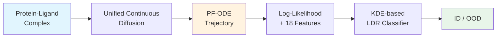

## 새로운 단백질에 대한 binding affinity 예측, 얼마나 믿을 수 있을까?

Drug discovery에서 ML 모델이 학습 데이터에 없던 protein-ligand complex를 만나면 어떻게 될까? 대부분의 경우, 모델은 자신이 모른다는 사실조차 모른 채 자신 있게 틀린 답을 내놓는다. 이 논문은 diffusion model의 PF-ODE trajectory를 분석해서, 3D molecular graph에 대한 최초의 unsupervised OOD detection framework를 제안한다.

> ETH Zurich 연구진이 PDBbind 데이터셋에서 7개 protein family를 완전히 제외한 strict OOD split으로 검증했다.
{: .prompt-info }

## 3D Graph에서의 OOD Detection, 왜 어려운가

기존 OOD detection은 크게 두 갈래로 나뉜다. Discriminative 방식은 pretrained classifier의 output score를 활용하지만, label이 필요하다는 근본적 한계가 있다. Generative 방식은 likelihood 기반으로 작동하지만, **complexity bias** 문제에 시달린다 — 구조적으로 단순한 OOD 데이터에 높은 likelihood를 부여해서 false negative를 만드는 현상이다.

더 근본적인 문제는, 기존 graph OOD detection이 대부분 2D topological graph에 초점을 맞추고 있다는 점이다. Protein-ligand complex처럼 3D 좌표(연속)와 atom/residue type(이산)이 결합된 irregular 3D graph에 적용할 수 있는 방법이 사실상 없었다. 이 gap을 메우는 것이 이 논문의 출발점이다.

## 핵심 아이디어: Trajectory가 OOD를 말해준다

이 논문의 핵심 직관은 간단하다. Diffusion model이 데이터를 noise로 변환하는 과정에서, **in-distribution(ID) sample은 효율적이고 직선적인 경로**를 따르는 반면, **OOD sample은 erratic하고 chaotic한 경로**를 보인다는 것이다.

단순히 최종 log-likelihood 값만 보는 것이 아니라, noise로 가는 **전체 trajectory의 기하학적 특성** 18가지를 추출해서 OOD 여부를 판단한다. Log-likelihood 하나로는 complexity bias를 피할 수 없지만, trajectory-level feature를 함께 쓰면 이 문제를 극복할 수 있다.

## How it Works

### 전체 파이프라인

전체 파이프라인은 크게 세 단계로 구성된다: (1) unified continuous diffusion model 학습, (2) PF-ODE trajectory를 통한 log-likelihood 및 geometric feature 추출, (3) trajectory-aware LDR classifier로 OOD 분류.

### Input Representation: 연속과 이산의 통합

Protein-ligand complex는 3D 좌표(연속)와 atom type, residue type(이산)이 혼합된 데이터다. 이 논문은 categorical feature를 spherical embedding space에 매핑한 뒤 3D 좌표와 concatenate해서, 전체 molecular state를 하나의 연속적인 Euclidean space에서 처리한다. 이렇게 하면 단일 diffusion process로 geometry와 discrete feature를 동시에 다룰 수 있다.

### Core Model: SE(3)-Equivariant Diffusion

Backbone으로 SE(3)-equivariant graph neural network (EGNN)을 사용한다. 이 네트워크는 좌표와 noisy categorical embedding의 joint state를 입력으로 받아, per-node clean 좌표와 각 chemical type의 probability(logits)를 출력한다. Predicted probability로부터 posterior mean을 계산하고, 이 "clean" signal에서 score를 analytic하게 구한다. 이 posterior-mean interpolation 방식 덕분에 standard cross-entropy loss로 학습하면서도 diffusion process에 필요한 smooth continuous dynamics를 유지할 수 있다.

### PF-ODE를 통한 Exact Log-Likelihood

Forward SDE의 marginal flow에 대응하는 deterministic ODE, 즉 probability-flow ODE(PF-ODE)를 통해 exact log-likelihood를 계산한다:

$$\log p_0(x_0) = \log p_T(x_T) - \int_0^T \nabla \cdot v_t(x_t) \, dt$$

PF-ODE는 data space와 noise space 사이의 reversible mapping을 정의하며, 각 sample은 고유한 deterministic trajectory를 따른다. 이 trajectory를 따라 drift term의 divergence를 적분하면 exact log-likelihood를 얻는다.

### Key Innovation: 18가지 Trajectory Feature

Log-likelihood만으로는 complexity bias를 피할 수 없다. 이 논문의 차별화 포인트는 PF-ODE trajectory에서 18개의 geometric feature를 추가로 추출하는 것이다:

| Category | Features | OOD 시그널 |
|---|---|---|
| **Geometric Inefficiency** | Path tortuosity, efficiency | OOD → 경로가 길고 비효율적 |
| **Local Instability** | Max Lipschitz estimate | OOD → flow stiffness 증가 |
| **Vector Field Activity** | VF mean/max/std, spikiness, acceleration | OOD → corrective push가 크고 불규칙 |
| **Energetic Cost** | Total flow energy | OOD → 더 많은 "일" 소요 |
| **Feature-Coordinate Coupling** | Coupling consistency | OOD → 좌표-feature 업데이트 비동기화 |

ID sample은 vector field가 잘 학습된 영역을 지나므로 efficient하고 smooth한 trajectory를 보인다. 반면 OOD sample은 학습 데이터가 부족한 low-density region을 지나면서 erratic하고 high-tortuosity 경로를 만들어낸다.

### Training & Classification

Log-likelihood와 18개 trajectory feature를 합친 19차원 feature space에서, ID와 OOD sample 각각에 Gaussian Kernel Density Estimator(KDE)를 fitting한다. 새로운 데이터에 대해 negated Log-Density Ratio(LDR)를 계산하고, threshold를 넘으면 OOD로 분류한다.

이 접근법이 잘 작동하는 이유는, OOD shift가 단순히 terminal density 값이 아니라 **probability flow 전체의 dynamic signature**로 나타나기 때문이다. Feature importance 분석에서도 log-likelihood가 가장 중요하지만, path tortuosity, flow energy, Lipschitz stability 등이 비슷한 수준의 discriminative power를 보인다.

### Likelihood와 Prediction Error의 관계

이 프레임워크의 실용적 가치를 뒷받침하는 결과로, PF-ODE log-likelihood가 독립적인 binding affinity predictor(GEMS)의 error를 예측할 수 있다는 점이 있다. 저자들은 이를 formal하게 증명한다:

$$\mathbb{P}_{\mathrm{ID}}\!\bigl(e_{\theta}(x) > \phi(L_{\mathrm{typ}}+\alpha)\bigr) \leq \frac{\sigma^{2}}{\alpha^{2}}$$

Negative log-likelihood $L(x)$가 typical value에서 $\alpha$만큼 벗어날 확률이 $\sigma^2/\alpha^2$ 이하로 bounded된다는 Chebyshev-type bound다. 즉, log-likelihood가 높은 sample은 높은 확률로 정확한 prediction을 받고, 낮은 sample은 큰 error를 보인다.

## Results

### Complexity Bias 극복

가장 주목할 결과는 $\alpha$-carbonic anhydrase dataset(3dd0)에 대한 것이다. 이 dataset은 OOD임에도 training set보다 **높은 log-likelihood**를 받았는데, 이는 ligand 구조가 단순해서 발생한 전형적인 complexity bias다. 그러나 trajectory feature를 추가하자 이 dataset을 성공적으로 OOD로 분류할 수 있었다.

### OOD Classification 성능

| Dataset | AUROC (Traj-LDR) | AUROC (Embedding) | AUROC (Rate-In) |
|---|---|---|---|
| **3o9i** (HIV protease) | **0.94 ± 0.01** | 0.74 ± 0.02 | 0.69 ± 0.03 |
| **2vw5** (HSP82) | **0.91 ± 0.02** | 0.80 ± 0.03 | 0.76 ± 0.03 |
| **3dd0** (α-CA) | **0.90 ± 0.01** | 0.65 ± 0.02 | 0.57 ± 0.03 |
| **1nvq** (Kinase) | **0.82 ± 0.01** | 0.69 ± 0.01 | 0.65 ± 0.02 |
| CASF2016 | 0.62 ± 0.02 | 0.58 ± 0.03 | 0.55 ± 0.03 |

Strong distribution shift를 보이는 OOD dataset(HIV protease, HSP82, α-carbonic anhydrase)에서 trajectory-aware LDR classifier가 embedding space baseline과 Rate-In baseline을 크게 outperform한다. Intermediate OOD인 CASF2016에서는 세 방법 모두 낮은 성능을 보였는데, 이는 training distribution과의 moderate similarity가 원인이다.

> Trajectory-aware 접근법은 label 없이 generative model만으로 작동하면서도, task-specific label을 사용하는 baseline들을 outperform한다.
{: .prompt-tip }

### GEMS Error와의 상관관계

Median log-likelihood와 GEMS의 $R^2$ 사이 Pearson r = 0.750, MAE와의 r = -0.880으로 강한 상관관계를 보였다. 이는 새로운 complex의 likelihood만으로 downstream predictor의 신뢰도를 사전에 판단할 수 있음을 의미한다.

## Discussion

저자들이 밝힌 한계와 향후 방향은 다음과 같다.

**한계점:** Intermediate OOD dataset(CASF2016, 3f3e)에서는 분류 정확도가 낮았다. 이는 training data와 moderate similarity를 유지하는 complex들이 포함되어 있기 때문이다. 또한 PF-ODE trajectory 계산에 sample당 약 5초의 computational overhead가 발생한다.

**향후 방향:** 저자들은 이 프레임워크가 protein-ligand complex에 국한되지 않고, continuous diffusion이 적용 가능한 모든 data modality로 일반화될 수 있다고 제시한다. 특히 diffusion model의 distribution learning을 개선하면 미묘한 chemical/structural nuance에 대한 sensitivity를 더 높일 수 있다고 언급한다. 또한 OOD quantification이 benchmark dataset의 generalization claim에 대한 "certificate" 역할을 할 수 있다는 점을 강조한다 — model이 OOD territory로 갈수록 error가 급격히 증가하면 memorization, 완만하면 genuine generalization이라는 해석이 가능하다.

> 코드는 논문 발표 시점 기준 공개되지 않았다.
{: .prompt-warning }

## TL;DR

- PF-ODE trajectory의 18개 geometric feature로 3D molecular graph의 unsupervised OOD detection을 수행하는 최초의 프레임워크
- Complexity bias를 극복하고, label 없이도 task-specific baseline을 outperform
- Log-likelihood가 independent binding affinity predictor의 error와 강하게 상관 → prediction 신뢰도의 사전 판단 도구로 활용 가능

📄 [arXiv: 2512.18454](https://arxiv.org/abs/2512.18454)

---

> 이 글은 LLM(Large Language Model)의 도움을 받아 작성되었습니다.
> 논문의 내용을 기반으로 작성되었으나, 부정확한 내용이 있을 수 있습니다.
> 오류 지적이나 피드백은 언제든 환영합니다.
{: .prompt-info }
