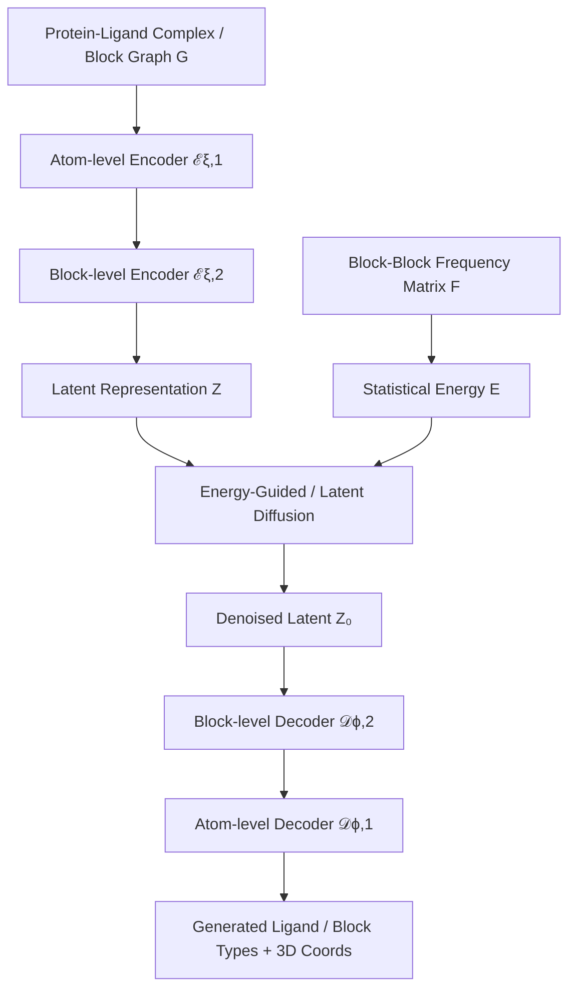

## Hook

약을 설계하는 AI가 있다. Binding affinity는 높게 잡는데, 문제는 타겟이 아닌 단백질에도 마구 붙는다는 것이다. 기존 structure-based drug design (SBDD) 모델들은 단일 타겟에 대한 결합력 최적화에만 집중하다 보니, 생성된 분자들이 off-target에도 강하게 결합하는 promiscuous binder가 되어버린다. SpecLig는 "자연이 이미 알고 있는 분자 궁합 정보"를 diffusion 과정에 주입해서, 특정 타겟에만 선택적으로 결합하는 분자를 만든다.

## Problem

SBDD 모델들은 receptor의 3D 구조를 활용해 화학적·공간적으로 합리적인 리간드를 생성한다. 하지만 대부분의 모델은 단일 타겟 구조에만 조건을 걸어 학습하기 때문에, training data에서 자주 등장하는 motif를 반복적으로 생성한다. 이런 motif는 predicted affinity를 높일 수는 있지만, 타겟 특이성(specificity)을 떨어뜨린다.


_Figure 1: 기존 SBDD 모델의 off-target binding 문제와 SpecLig의 hierarchical architecture. (a-b) VoxBind와 PepGLAD가 생성한 리간드가 target (분홍)보다 non-target (파랑)에 더 강하게 결합. (c-d) Low-specificity 디자인의 화학적 특징. (e-f) SpecLig의 block-block frequency matrix 구축과 energy-guided diffusion. 출처: 원 논문_

논문은 VoxBind와 PepGLAD 같은 모델이 native ligand보다 높은 predicted affinity를 보였지만, 동시에 unrelated protein에도 강하게 결합하는 사례를 보여준다. 예를 들어 cytochrome P450BM-3를 타겟으로 생성된 small molecule이 aldehyde decarbonylase라는 무관한 단백질에 더 높은 docking score를 기록했다. Interaction 분석 결과, 생성된 리간드의 일부 fragment가 intended target과는 별로 상호작용하지 않으면서 off-target과는 주요 결합을 형성했다.

저자들은 여러 SBDD 모델의 출력을 specificity 기준으로 분류했다. 낮은 specificity를 가진 small molecule은 polar group 비율이 약 5-10% 더 높았고, 이는 여러 타겟에 promiscuous하게 결합하는 경향을 보였다. Peptide의 경우 high-specificity design은 helical structure 비율이 3-10% 더 높았고, non-helical flexible segment는 노출 위험을 증가시켰다.

기존 SBDD 벤치마크는 single-target docking score에만 집중하며, 과도한 modification을 통해 높은 score를 얻을 수 있지만 promiscuity를 감추는 문제가 있다. Specificity를 정량화하는 기존 시도들은 random non-target과 비교하는 수준에 그쳐 actionable guidance를 제공하지 못했다.

## Key Idea

SpecLig의 핵심 아이디어는 **evolutionary binding preference를 statistical energy로 활용**하는 것이다. 단일 구조에만 conditioning하는 대신, native protein-ligand complex에서 추출한 block-block contact frequency를 empirical potential로 변환한다.

Block은 amino acid residue 또는 predefined molecular fragment를 의미한다. SpecLig는 수백만 개의 natural complex에서 "어떤 fragment가 어떤 fragment와 자주 함께 등장하는가"를 통계적으로 집계한다. 이 frequency matrix를 statistical potential로 변환하여, diffusion sampling 과정에서 energy guidance로 사용한다.

기존의 물리 기반 energy function과 달리, 이 statistical potential은 "특정 inter-fragment interaction이 다양한 타겟에서 얼마나 선호되는지"를 정량화한다. 따라서 모델은 일반적인 promiscuous motif 대신, 현재 query pocket과 유사한 환경에서 역사적으로 등장했던 fragment combination을 선호하게 된다.

이를 구현하기 위해 SpecLig는 hierarchical SE(3)-equivariant VAE와 energy-guided latent diffusion model을 결합한다. Atom-level encoder는 local chemistry와 bond order를 포착하고, block-level encoder는 global topology를 reduced cost로 표현한다. Latent diffusion 과정에서 chemical prior를 additive guidance로 주입하여, pocket-complementary fragment combination을 우선적으로 생성한다.

## How It Works

### Overview

SpecLig는 크게 세 가지 구성요소로 나뉜다: (1) Hierarchical SE(3)-equivariant VAE encoder, (2) Energy-guided latent diffusion model, (3) Hierarchical decoder.



전체 generation 과정은 다음과 같이 표현된다:

$$p(G_L | G_P) = \int p_\theta(G_L | Z_0, Z_P) \cdot p_\theta(Z_0 | Z_T, Z_P) \cdot p(Z_T) \, dZ_0 dZ_T$$

여기서 $G_P$는 pocket, $G_L$은 ligand, $Z_P$는 pocket의 latent representation, $Z_0$는 noise-free ligand latent, $Z_T$는 terminal Gaussian noise다.

```python
# Overall Architecture Pseudocode
class SpecLig(nn.Module):
    def __init__(self, vocab_size, latent_dim=8):
        super().__init__()
        # Hierarchical VAE: atom and block encoders/decoders
        self.atom_enc = AtomLevelEncoder()      # ℰξ,1
        self.block_enc = BlockLevelEncoder()    # ℰξ,2
        self.block_dec = BlockLevelDecoder()    # 𝒟ϕ,2
        self.atom_dec = AtomLevelDecoder()      # 𝒟ϕ,1
        
        # Latent diffusion model
        self.diff_model = LatentDiffusion(latent_dim)
        
        # Statistical energy prior (frequency matrix F)
        self.register_buffer('freq_mat', 
                           self.build_frequency_matrix())  # F: (vocab_size, vocab_size)
    
    def encode(self, complex_graph):
        # Step 1: Atom-scale encoding
        atom_feats = self.atom_enc(complex_graph)
        
        # Step 2: Block-scale encoding with reparameterization
        mu, logvar = self.block_enc(atom_feats)
        z = self.reparameterize(mu, logvar)  # (num_blocks, latent_dim)
        
        return z, mu, logvar
    
    def decode(self, z):
        # Step 1: Block-level decoding → block types + centroids
        block_types, centroids = self.block_dec(z)
        
        # Step 2: Atom-level decoding → full 3D coordinates
        atoms = self.atom_dec(block_types, centroids, z)
        
        return atoms
    
    def forward(self, pocket, ligand=None):
        # Encoding (training mode with ground-truth ligand)
        z_P = self.encode(pocket)[0]
        z_L, mu, logvar = self.encode(ligand)
        
        # Latent diffusion with energy guidance
        z_0 = self.diff_model.sample(z_L, z_P, self.freq_mat)
        
        # Decoding
        gen_ligand = self.decode(z_0)
        
        return gen_ligand, mu, logvar
```

### Representation

SpecLig는 protein-ligand complex를 **block-based graph** $G = (V, E)$로 표현한다. 각 node $v_i \in V$는 하나의 block을 나타내며, unordered set of atoms $\\{(a_j, \mathbf{x}_j)\\}_{j=1}^{n_i}$로 구성된다. 여기서 $a_j$는 element type, $\mathbf{x}_j$는 3D coordinate다.

Block vocabulary $S$는 canonical amino acid residue와 predefined small-molecule fragment로 구성된다. Small-molecule fragment는 ZINC15와 ChEMBL database에서 수백만 개의 분자를 principal-subgraph algorithm으로 분해하여 얻는다. 각 block에는 type $s_i \in S$가 할당되고, canonical residue로 제한할지 여부를 나타내는 flag $p_i \in \\{0, 1\\}$이 부여된다.

Edge $E$는 intra-block bond, inter-block bond, spatial adjacency를 기록한다. Pocket은 native ligand의 어떤 atom으로부터 10Å 이내에 reference point (Cβ 또는 fragment centroid)가 위치한 block들로 정의된다.

이러한 hierarchical representation의 장점은 (1) atom-level noise를 filtering하면서 fragment semantic을 보존하고, (2) global topology를 reduced computational cost로 모델링하며, (3) statistical prior를 block 단위로 효율적으로 적용할 수 있다는 것이다.

### Hierarchical VAE Architecture

Atom-level encoder $\mathcal{E}_{\xi,1}$은 SE(3)-equivariant transformer로 구현된다. 각 atom은 다음 feature로 인코딩된다: element type, parent block type, canonical-residue flag, chain ID. 중요한 점은 atom feature에 **frequency matrix에서 학습된 correlated projection**을 augmentation한다는 것이다.

```python
# Atom-level Encoder with Frequency Matrix Augmentation
class AtomLevelEncoder(nn.Module):
    def __init__(self, vocab_size, hidden_dim=128, num_layers=6):
        super().__init__()
        self.atom_embed = nn.Embedding(100, hidden_dim)  # 100 element types
        self.block_embed = nn.Embedding(vocab_size, hidden_dim)
        
        # Frequency matrix projection (augmentation)
        self.freq_proj = nn.Linear(vocab_size, hidden_dim)
        self.temperature = 1.0
        
        # SE(3)-equivariant transformer layers
        self.layers = nn.ModuleList([
            SE3TransformerLayer(hidden_dim) 
            for _ in range(num_layers)
        ])
    
    def forward(self, atoms, blocks, freq_matrix):
        # atoms: (N_atoms, 3)  positions
        # blocks: (N_atoms,)   parent block id
        # freq_matrix: (vocab_size, vocab_size)
        
        # Initial embedding
        h_atom = self.atom_embed(atoms.element_type)
        h_block = self.block_embed(blocks.type)
        
        # Augment with frequency matrix correlation
        # Temperature-scaled normalization
        F_norm = torch.softmax(freq_matrix / self.temperature, dim=-1)
        freq_feature = self.freq_proj(F_norm[blocks.type])
        
        h = h_atom + h_block + freq_feature  # (N_atoms, hidden_dim)
        
        # Build KNN graph (restricted within GL or GP separately)
        edge_index = self.build_knn_graph(atoms.pos, k=10, 
                                          separate_chains=True)
        
        # Edge features: {same_block, distance, bond_type}
        edge_attr = self.compute_edge_features(edge_index, atoms, blocks)
        
        # SE(3)-equivariant message passing
        for layer in self.layers:
            h, atoms.pos = layer(h, atoms.pos, edge_index, edge_attr)
        
        return h  # (N_atoms, hidden_dim)
```

Information flow는 GL과 GP를 따로 처리하여 information leakage를 방지한다. Block-level encoder $\mathcal{E}_{\xi,2}$는 atom-level feature를 aggregation하여 block-level latent representation을 생성한다. 각 block마다 8차원 latent vector $z_i = (\mathbf{z}_i^{attr}, \mathbf{z}_i^{coord}) \in \mathbb{R}^8$가 생성되며, 일부는 block type/attribute를, 나머지는 coordinate information을 인코딩한다.

Decoder는 encoder의 역순으로 동작한다. Block-level decoder $\mathcal{D}_{\phi,2}$는 latent $Z$를 받아 block type probability와 coarse centroid를 예측한다. Atom-level decoder $\mathcal{D}_{\phi,1}$은 이를 바탕으로 full-atom 3D coordinate와 bond type을 재구성한다.

### Statistical Energy Guidance

SpecLig의 핵심 혁신은 **statistical energy guidance**를 latent diffusion에 통합한 것이다.

Frequency matrix $F \in \mathbb{R}^{n_s \times n_s}$는 세 가지 source에서 수집된다:

1. **Fragment-fragment co-occurrence**: ZINC15, ChEMBL에서 수백만 small molecule을 principal-subgraph algorithm으로 분해하여 fragment pair 빈도 집계
2. **Residue pair bonding**: RCSB PDB, PepBDB에서 inter-chain hydrogen bond를 trajectory-based analysis로 추출
3. **Protein-ligand interaction**: PDBbind, Binding-MOAD에서 BINANA를 사용한 interaction frequency

각 source별로 frequency matrix를 구축한 후, modal bias를 줄이기 위해 normalize하고, log-transform하여 continuous statistical potential로 변환한다:

$$F_{ij} = \log\left(\frac{\text{count}(s_i, s_j)}{\sum_{k} \text{count}(s_i, s_k)} + \epsilon\right)$$

Latent diffusion의 각 reverse step에서, 현재 denoised estimate로부터 block type probability $\hat{s}$를 frozen decoder로 예측한다. Block pair $(i, j)$에 대한 pairwise energy는:

$$E_{ij}(\hat{s}_i, \hat{s}_j) = -\omega_{ij} \sum_{s_i, s_j} \hat{s}_i(s_i) \cdot F_{s_i, s_j} \cdot \hat{s}_j(s_j) / \tau$$

여기서 $\tau$는 temperature smoothing factor, $\omega_{ij}$는 distance-dependent decay다. Total energy $E$는 모든 block pair에 대해 합산하고, molecular mass로 normalize한다.

```python
# Energy-Guided Sampling
class EnergyGuidedDiffusion(nn.Module):
    def __init__(self, freq_matrix, temperature=1.0):
        super().__init__()
        self.freq_matrix = freq_matrix  # F: (vocab_size, vocab_size)
        self.temperature = temperature
    
    def compute_energy(self, z_t, block_decoder):
        """
        Compute statistical energy from current latent state
        z_t: (batch, num_blocks, latent_dim)
        Returns: E (scalar)
        """
        # Decode block type probabilities (frozen decoder)
        with torch.no_grad():
            block_probs = block_decoder.predict_type_probs(z_t)
            # block_probs: (batch, num_blocks, vocab_size)
        
        # Threshold probabilities for stability
        block_probs = torch.clamp(block_probs, min=1e-6)
        
        # Compute pairwise energy for all block pairs
        B, N, V = block_probs.shape
        energy = 0.0
        
        for i in range(N):
            for j in range(i+1, N):
                # Distance-dependent decay
                dist = torch.norm(z_t[:, i, :3] - z_t[:, j, :3], dim=-1)
                omega_ij = torch.exp(-dist / 5.0)  # decay scale = 5Å
                
                # Pairwise energy: -ω_ij * Σ p_i(s_i) * F[s_i,s_j] * p_j(s_j)
                pairwise = torch.einsum('bi,ij,bj->b', 
                                       block_probs[:, i],
                                       self.freq_matrix,
                                       block_probs[:, j])
                energy += -omega_ij * pairwise / self.temperature
        
        # Normalize by molecular mass (approx: num_blocks)
        energy = energy / N
        
        return energy.mean()
    
    def reverse_step_with_guidance(self, z_t, t, z_P, noise_pred_net, 
                                   block_decoder, guidance_weight=1.0):
        """
        Reverse diffusion step with energy guidance
        """
        # Standard noise prediction
        eps_pred = noise_pred_net(z_t, t, z_P)  # ε_θ(z_t, t, z_P)
        
        # Denoised estimate: z_0 = (z_t - √(1-α_t)·ε) / √α_t
        alpha_t = self.get_alpha(t)
        z_0_hat = (z_t - torch.sqrt(1 - alpha_t) * eps_pred) / torch.sqrt(alpha_t)
        
        # Compute energy and backprop gradient to noise space
        z_0_hat.requires_grad_(True)
        energy = self.compute_energy(z_0_hat, block_decoder)
        
        # ∂E/∂z_0
        grad_z0 = torch.autograd.grad(energy, z_0_hat)[0]
        
        # Chain rule: ∂E/∂ε = (∂E/∂z_0) * (∂z_0/∂ε)
        # From z_0 = (z_t - √(1-α_t)·ε) / √α_t
        # → ∂z_0/∂ε = -√(1-α_t) / √α_t
        grad_eps = -grad_z0 * torch.sqrt(1 - alpha_t) / torch.sqrt(alpha_t)
        
        # Gradient clipping for stability
        grad_norm = torch.norm(grad_eps)
        if grad_norm > 10.0:  # G_set = 10
            grad_eps = grad_eps * (10.0 / grad_norm)
        
        # Guided noise prediction
        # ε_guided = ε_θ - ω_t · ∇_ε E
        eps_guided = eps_pred - guidance_weight * grad_eps
        
        # Standard DDPM reverse step
        z_prev = self.ddpm_reverse(z_t, t, eps_guided)
        
        return z_prev
```

Guidance weight $\omega_t$는 time step이 진행될수록 decay한다. 초기에는 강한 guidance로 coarse structure를 잡고, 후반에는 약한 guidance로 fine detail을 조정한다.

Training data에서 자주 등장하는 fragment는 general binding potential을 반영하지만, pocket specificity를 보장하지 않는다. 반면 frequency matrix $F$를 statistical potential로 사용하면, **현재 query pocket과 유사한 환경에서 역사적으로 co-occurred한 fragment combination**을 우선시한다. 즉, "이 pocket type에서는 fragment A와 B가 자주 함께 등장했다"는 evolutionary signal을 활용하여, promiscuity-prone motif 생성을 억제하고 pocket-specific binding pattern을 강화한다.

### Training Procedure

Training은 두 단계로 나뉜다: (1) Hierarchical VAE 학습, (2) Latent diffusion 학습.

**Stage 1: Hierarchical VAE**

Composite loss는 atom-scale, block-scale, global contrastive term의 weighted sum이다. Atom-scale loss는 focal loss for inter-block bond classification, cross-entropy for bond type prediction, MSE loss on predicted velocity fields, paired-distance loss for adjacent atom pairs를 포함한다. Block-scale loss는 KL divergence on attribute/coordinate latents, cross-entropy for block type classification, MSE for coarse centroid regression을 사용한다. Global contrastive loss는 triplet-based로 ligand와 pocket의 global descriptor를 align한다.

Training 중에는 teacher forcing을 사용한다: atomic type, intra-block bond, 50%의 inter-block bond를 모델에 노출한다. 추가로 5%의 pocket residue를 masking한다.

**Stage 2: Latent Diffusion**

Latent diffusion은 denoising MSE loss와 latent perceptual loss (LPL)의 weighted sum으로 학습된다:

$$\mathcal{L}_{\text{diffusion}} = \mathbb{E}_{t,\epsilon}\left[\|\epsilon - \epsilon_\theta(z_t, t, z_P)\|^2\right] + \lambda \cdot \text{LPL}(z_0, \hat{z}_0)$$


_Figure 2: Small-molecule generative 모델의 5개 카테고리별 성능 비교. SpecLig가 Specificity, Interaction, Chemistry에서 최고 성능. 출처: 원 논문_

### Inference: Guided Sampling

Inference 시에는 Gaussian noise $z_T \sim \mathcal{N}(0, I)$에서 시작하여, energy-guided reverse step을 반복적으로 수행한다. Guidance weight는 초기에는 크게 설정하여 global structure를 잡고, 점차 감소시켜 local refinement를 수행한다.

## Results

### Small Molecule Design

SpecLig를 CrossDocked2020 benchmark에서 평가했다. Baseline으로는 autoregressive (AR, Pocket2Mol, ResGen), diffusion-based (TargetDiff, DecompDiff), fragment-based (FLAG, D3FG, DrugGPS), voxel-based (LiGAN, VoxBind), continuous-space (MolCRAFT, UniMoMo) 등 다양한 패러다임의 모델들과 비교했다.

| Category | SpecLig Rank | Key Metric | Comparison |
|---|---|---|---|
| **Specificity** | 🥇 1st | ΔE_pair = -0.83 | Ratio_pair = 58.73% |
| **Interaction** | 🥇 1st | MPBG = 15.17 | +53.4% vs VoxBind (9.90) |
| **Chemistry** | 🥇 1st | High QED, SA | Drug-like + specific |
| **Substructure** | 🥈 2nd | Natural fragments | Best on fragment classes |
| **Geometry** | 3rd | Low collision | Bond-length improvable |

**Specificity 결과**: SpecLig는 모든 specificity metric에서 1위 또는 2위를 차지했다. ΔE_pair = -0.83은 target이 non-target보다 평균 0.83 kcal/mol 더 강하게 결합함을 의미한다. Ratio_pair = 58.73%는 생성된 분자의 58.73%가 target에서 더 좋은 docking score를 기록했다는 뜻이다.

**Interaction 결과**: MPBG = 15.17로 2위 VoxBind (9.90) 대비 53.4% 향상. 이는 pocket-specific binding enhancement가 뚜렷함을 보여준다.

**Chemistry 결과**: Drug-likeness (QED)와 synthetic accessibility (SA)에서 최고 수준을 유지하면서 specificity를 달성했다.

**한계**: Small molecule에서의 specificity 개선폭은 peptide보다 작았다. 저자들은 이를 small molecule의 discrete하고 high-dimensional한 chemical space 때문으로 분석했다. Functional group, aromatic system, rotatable bond의 combinatorial variation이 highly multimodal energy landscape를 형성하여, 단일 block vocabulary의 coverage가 제한적이다.

### Peptide Design

PepBench, ProtFrag, LNR benchmark에서 평가했다. Baseline은 RFDiffusion, PepFlow, PepGLAD, UniMoMo이다.

| Category | SpecLig Rank | Key Metric | Comparison |
|---|---|---|---|
| **Specificity** | 🥇 1st | Ratio_pair = 75.43% | Ratio_20 = 75.00% |
| **Interaction** | 🥇 1st | ΔG = -1.92 | Only negative mean |
| **Structural Validity** | 🥇 1st | Lowest Clash_out | Lowest L-RMSD |
| **Recovery** | 🥈 2nd | Competitive AAR | Competitive C-RMSD |
| **Diversity** | 3rd | Slight reduction | Due to energy constraint |


_Figure 3: Peptide design 모델의 5개 카테고리별 성능 비교. SpecLig가 Specificity, Interaction, Structural Validity에서 최고 성능. 출처: 원 논문_

**Specificity 결과**: Ratio_pair와 Ratio_20을 2위 모델 대비 각각 6.68%p, 22.09%p 향상시켰다. Native ligand의 성능 (80.72%, 78.31%)에 근접했다.

**Interaction 결과**: SpecLig만 유일하게 negative mean ΔG = -1.92를 달성했다 (2위 UniMoMo는 +29.21). 이는 대부분의 생성 peptide가 favorable binding energy를 보였음을 의미한다.

**Structural Validity**: Clash_out과 L-RMSD에서 최고 성능으로 geometrically self-consistent한 output을 생성했다.

### Case Study

논문은 두 가지 case study를 제시한다. Small molecule의 경우, native ligand (cytochrome P450BM-3 대상)가 non-target (aldehyde decarbonylase)에 더 강하게 binding (Vina = -7.32 vs -6.08)했지만, SpecLig가 생성한 molecule은 target에서 -9.58을 기록하면서 non-target에서는 valid docking pose조차 찾지 못했다.

Peptide의 경우, native peptide (microcin J25, ferrichrome-iron receptor 대상)가 off-target rhodopsin에서 ΔG = -30.46으로 target (-8.71)보다 훨씬 강하게 결합했지만, SpecLig 디자인은 target에서 ΔG = -60.21을 기록하면서 off-target에서는 feasible pose를 형성하지 못했다.


_Figure 4: SpecLig의 off-target binding 감소 사례. (a-d) Small molecule targeting cytochrome P450BM-3. (e-h) Peptide targeting ferrichrome-iron receptor. SpecLig 디자인은 target에는 강하게 결합하지만 non-target에서는 valid pose를 형성하지 못함. 출처: 원 논문_

## Discussion

SpecLig는 hierarchical equivariant modeling과 block-wise chemical prior 통합을 통해 affinity와 specificity의 균형을 달성했다. 논문에서 밝힌 주요 insights:

**Mechanism**: Hierarchical VAE는 atom-level noise를 filtering하면서 fragment semantic을 보존하고, energy-guided latent sampling은 pocket-conditioned chemically plausible solution을 생성한다. Ablation study에서 두 component의 상호보완적 역할이 확인되었다.

**Small Molecule의 한계**: Discrete chemical complexity와 geometric sensitivity로 인해 peptide보다 개선폭이 작았다. 저자들은 향후 연구 방향으로 richer physical cue (force-field term, electrostatic field, conformational ensemble)의 통합을 제시했다.

**Adaptive Sizing**: SpecLig는 단순히 fragment를 agglomerate하지 않는다. Supplementary analysis에서 ligand size가 block의 initial setting보다 **pocket topology**에 의해 주로 결정됨을 확인했다. 이는 모델이 pocket shape에 adaptive하게 반응함을 의미한다.

**Experimental Validation 필요**: 논문은 computational benchmark에 집중했으며, prospective experimental validation이 아직 필요하다. 저자들은 이를 future work으로 언급했다.

**Generalizability**: SpecLig는 small molecule과 peptide를 unified framework에서 처리한다. 동일한 physicochemical rule (bond type, angle, steric clash)을 공유하므로, 다른 ligand modality (e.g., RNA aptamer, PROTACs)로 확장 가능성이 있다.

저자들이 제시한 **향후 연구 방향**:
- Force-field energy, electrostatic potential 등 physics-based term과의 hybrid guidance
- Conformational ensemble sampling을 통한 binding mode diversity 확보
- Experimental validation을 통한 in silico-in vitro correlation 검증
- 다른 ligand modality로의 확장

## Limitations

1. **Small molecule에서의 제한적 개선**: Discrete chemical space의 combinatorial complexity로 인해, small molecule에서의 specificity 개선폭이 peptide 대비 작다.
2. **Statistical energy의 bias**: Frequency matrix가 PDB의 기존 데이터 편향을 반영하므로, 새로운 protein family나 novel scaffold에 대한 guidance가 부정확할 수 있다.
3. **Experimental validation 부재**: 모든 평가가 computational benchmark(docking score, predicted ΔG)에 의존하며, prospective wet-lab validation이 아직 수행되지 않았다.
4. **Block vocabulary의 제한**: Predefined fragment vocabulary가 chemical space를 완전히 커버하지 못하며, vocabulary에 없는 fragment는 생성할 수 없다.
5. **Guidance weight 튜닝**: Energy guidance의 strength(temperature, weight)가 수동으로 설정되며, target에 따른 adaptive tuning 메커니즘이 없다.

## Conclusion

SpecLig는 structure-based drug design에서 오랫동안 무시되어 온 specificity 문제를 정면으로 다룬 모델이다. Evolutionary binding preference를 statistical energy로 변환하고, 이를 hierarchical SE(3)-equivariant VAE의 latent diffusion에 주입함으로써, high-affinity이면서 target-specific한 리간드 생성을 달성했다. Peptide design에서 Ratio_pair 75.43%, ΔG -1.92라는 결과는 기존 모델들이 도달하지 못한 수준이며, small molecule과 peptide를 unified framework로 처리할 수 있다는 점에서 범용성이 높다. Off-target binding이 drug failure의 주요 원인인 만큼, specificity-aware design의 중요성을 환기시킨 의미 있는 연구다.

## TL;DR

- **Problem**: 기존 SBDD 모델은 affinity는 높이지만 off-target binding을 유발하는 promiscuous binder를 생성
- **Solution**: Hierarchical SE(3)-equivariant VAE + energy-guided latent diffusion. Block-block contact frequency를 statistical energy로 변환하여 diffusion sampling guide
- **Results**: Small molecule과 peptide 모두에서 높은 specificity와 affinity 달성. Peptide는 Ratio_pair 75.43%, ΔG -1.92; Small molecule은 MPBG 15.17로 baseline 대비 53.4% 향상

## Paper Info

| 항목 | 내용 |
|---|---|
| **Title** | SpecLig: Energy-Guided Hierarchical Model for Target-Specific 3D Ligand Design |
| **Authors** | Chunqiu Zhang et al. (Tsinghua University, Beijing National Research Center for Information Science and Technology) |
| **Venue** | bioRxiv preprint |
| **Submitted** | 2025-11-06 |
| **Published** | bioRxiv preprint, November 2025 |
| **Link** | [bioRxiv:2025.11.06.687093](https://www.biorxiv.org/content/10.1101/2025.11.06.687093v1) |
| **Paper** | [bioRxiv](https://www.biorxiv.org/content/10.1101/2025.11.06.687093v1) |
| **Code** | [GitHub](https://github.com/CQ-zhang-2016/SpecLig) |

---

> 이 글은 LLM(Large Language Model)의 도움을 받아 작성되었습니다. 
> 논문의 내용을 기반으로 작성되었으나, 부정확한 내용이 있을 수 있습니다.
> 오류 지적이나 피드백은 언제든 환영합니다.
{: .prompt-info }
