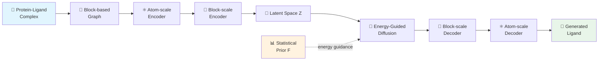

## 잘 붙는 약이 좋은 약은 아니다

AI로 약을 설계하는 시대다. 단백질 포켓 구조를 주면 거기에 딱 맞는 분자를 생성해주는 SBDD(Structure-Based Drug Design) 모델이 쏟아지고 있다. 그런데 한 가지 불편한 진실이 있다. 이 모델들이 만드는 분자는 **타겟에 잘 붙는 게 아니라, 아무 데나 잘 붙는다.**

Binding affinity 점수가 높으면 좋은 약일까? 전혀 아니다. 의도하지 않은 단백질에도 마구 결합하는 분자는 독성의 근원이고, 임상 실패의 주범이다. SpecLig는 이 "특이성(specificity)" 문제를 정면으로 다룬 최초의 통합 프레임워크다.

> 📄 [Paper](https://www.biorxiv.org/content/10.1101/2025.11.06.687093v1) \| 💻 [Code](https://github.com/CQ-zhang-2016/SpecLig)

---

## 기존 모델이 만드는 분자의 문제

논문 저자들은 기존 SBDD 모델(VoxBind, PepGLAD 등)이 생성한 분자를 체계적으로 분석했다. 결과가 꽤 충격적이다.

소분자 쪽에서는 specificity가 낮은 분자일수록 **polar group 비율이 5-10% 높았다.** 극성 작용기가 많으면 여러 단백질 표면과 비특이적으로 수소결합을 형성하기 쉽다. 펩타이드 쪽에서는 specificity가 높은 펩타이드일수록 **helical content가 3-10% 높았다.** 구조적으로 단단한 알파-헬릭스 구간이 유연한 루프보다 off-target 노출을 줄여주기 때문이다.

> 기존 SBDD 벤치마크는 단일 타겟에 대한 docking score만 측정한다. "다른 단백질에는 얼마나 붙는가?"라는 질문 자체를 하지 않았다.
{: .prompt-warning }

핵심은, 단일 타겟 affinity를 최적화하는 것만으로는 specificity가 보장되지 않는다는 것이다. 오히려 affinity를 올리면 off-target binding이 함께 증가하는 경향이 있었다. 그렇다면 어떻게 해야 할까?

---

## 핵심 아이디어: 자연이 알려주는 궁합표

SpecLig의 발상은 의외로 단순하다. **자연에 이미 존재하는 단백질-리간드 복합체에서 "어떤 조각끼리 잘 어울리는지"를 통계적으로 배우자.** 

ZINC15, ChEMBL에서 소분자 fragment 간의 공출현 빈도를, PDB와 PepBDB에서 단백질-리간드 간 수소결합 패턴을, PDBbind와 Binding-MOAD에서 실제 상호작용 빈도를 수집한다. 이걸 하나의 block-block frequency matrix $F$로 압축하면, 일종의 **"분자 궁합표"**가 만들어진다.

이 궁합표를 분자 생성 과정(diffusion)에 에너지 함수로 주입하면, 포켓의 구성에 맞는 fragment 조합만 선택적으로 유도할 수 있다. 타겟 포켓과 궁합이 좋은 조각들이 자연스럽게 모이고, 다른 포켓과는 궁합이 맞지 않는 조합이 만들어지는 것이다.

---

## 어떻게 작동하는가

### 전체 파이프라인

SpecLig는 크게 세 부분으로 나뉜다: (1) block 기반 분자 표현, (2) 계층적 VAE로 잠재 공간 학습, (3) 에너지 가이드 diffusion으로 특이성 있는 분자 생성.

### Block 기반 표현: 원자가 아니라 조각 단위로

대부분의 SBDD 모델은 원자 하나하나를 생성한다. SpecLig는 다르다. 분자를 **fragment(block) 단위**로 표현한다. 아미노산 잔기 하나, 또는 소분자의 의미 있는 fragment 하나가 하나의 block이다.

왜 이렇게 할까? 두 가지 이유가 있다. 첫째, 개별 원자보다 fragment가 화학적으로 의미 있는 단위다. 약물화학자도 원자가 아니라 functional group 단위로 사고한다. 둘째, block 단위로 표현해야 block-block frequency matrix를 자연스럽게 적용할 수 있다. 궁합표의 행과 열이 block이니까.

각 block $v_i$는 원소 타입과 3D 좌표의 집합 $\{(a_k, x_k)\}$로 표현되고, block vocabulary $S$에서 타입이 정해진다. 펩타이드 생성 시에는 controllable flag $p_i = 1$로 canonical amino acid만 나오도록 제한할 수도 있다.

### 계층적 VAE: 원자 스케일에서 블록 스케일로

인코딩은 두 단계다. 먼저 **atom-scale encoder**가 개별 원자 수준의 특징(원소 타입, 부모 block 타입, chain ID 등)을 SE(3)-equivariant transformer로 처리한다. 여기서 중요한 디테일이 하나 있다: 포켓과 리간드 사이에 KNN 그래프를 따로 구성해서 **정보 누출을 차단**한다. 학습 시 리간드 정보가 포켓 인코딩에 섞이면 생성 시 문제가 되니까.

그 위에 **block-scale encoder**가 원자 수준 출력을 block 단위로 풀링하고, coarser KNN 그래프를 구성해서 block 간 관계를 잡아낸다. 최종적으로 각 block의 잠재 벡터 $Z_i = [z_i^h, z_i^x] \in \mathbb{R}^8$이 만들어진다. attribute 정보와 좌표 정보가 분리되어 있는 게 특징이다.

전체 생성 확률은 이렇게 표현된다:

$$p(G_L | G_P) = \int p_\phi(G_L | Z_L^0, Z_P) \cdot p_\theta(Z_L^0 | Z_P) \, dZ_L^0$$

VAE가 잠재 공간을 학습하고, diffusion이 그 잠재 공간에서 샘플링하는 구조다.

### Statistical Prior: 궁합표는 어디서 오는가

Block-block frequency matrix $F \in \mathbb{R}^{n_s \times n_s}$는 여러 데이터베이스에서 구축된다:

| 출처 | 정보 |
|---|---|
| ZINC15 + ChEMBL | Fragment 간 공출현 빈도 (100만+ 소분자) |
| RCSB PDB + PepBDB | 단백질 체인 간 수소결합 잔기 쌍 |
| PDBbind + Binding-MOAD | 단백질-리간드 상호작용 빈도 (BINANA 분석) |

각 출처별로 정규화한 뒤 log-transform을 거쳐 연속적인 statistical potential로 변환한다. 이 행렬의 $(i, j)$ 원소가 크다는 건 block type $i$와 $j$가 자연에서 자주 함께 나타난다는 뜻이다.

### Energy-Guided Diffusion: 핵심 혁신

여기가 SpecLig의 진짜 차별점이다. Reverse diffusion의 매 스텝에서, frozen decoder가 현재 잠재 벡터로부터 block-type probability vector $\hat{s}_i$를 예측한다. 이걸 궁합표 $F$와 결합해 에너지를 계산한다:

$$E_{ij} = -\hat{s}_i^\top \left(\frac{F}{\tau}\right) \hat{s}_j \cdot \omega_{ij}$$

$\tau$는 temperature, $\omega_{ij}$는 거리 기반 감쇠 함수다. 가까운 block 쌍일수록 궁합이 더 중요하다는 직관을 반영한다.

이 에너지의 gradient를 noise space로 역전파해서 sampling을 조정한다:

$$\hat{\epsilon}_t' = \hat{\epsilon}_t - \omega_t \cdot \text{clip}(\nabla_{\epsilon} E, G_{\text{set}})$$

직관적으로 말하면, "자연에서 이 포켓 구성과 잘 어울리는 fragment 조합 쪽으로 생성 궤적을 밀어준다." Classifier guidance와 비슷한 원리인데, 별도의 classifier가 아니라 **데이터 통계 자체**가 가이드 역할을 한다. 추가 학습이 필요 없다는 점이 실용적이다.

> Energy guidance는 model-agnostic하다. Diffusion이 아니라 flow matching이든 어디든 gradient를 주입할 수 있는 프레임워크라면 적용 가능하다.
{: .prompt-tip }

이 가이드가 왜 specificity를 높이는가? 궁합표에는 "특정 포켓 구성에만 잘 맞는 fragment 조합"이 인코딩되어 있다. 에너지가 낮은 방향으로 생성하면, 해당 포켓에는 잘 맞지만 다른 포켓과는 궁합이 안 맞는 분자가 나온다. Affinity와 specificity를 동시에 잡는 셈이다.

---

## 실험 결과

### Small Molecule (CrossDocked2020)

| Model | Specificity | Interaction | Chemistry | Overall |
|---|---|---|---|---|
| **SpecLig** | **1st** | **1st** | **1st** | **0.829** |
| VoxBind | 2nd | 3rd | 6th | 0.686 |
| UniMoMo | 6th | 2nd | 4th | 0.614 |
| DecompDiff | 3rd | 5th | 5th | 0.571 |

SpecLig가 세 카테고리 모두 1위를 차지했다. 특히 specificity 지표에서 MPBG(Mean Predicted Binding Gap)가 15.17로, 2위 VoxBind(9.88) 대비 **53.4% 개선**이다. 2000개 단백질에 대한 breadth 테스트에서 $\text{Ratio}_\text{pair} = 58.73\%$로 타겟에 더 강하게 결합하는 비율이 가장 높았다.

### Peptide (PepBench, ProtFrag, LNR)

| Model | Specificity | Interaction | Recovery | Overall |
|---|---|---|---|---|
| **SpecLig** | **1st** | **1st** | **1st** | **0.850** |
| UniMoMo | 2nd | 2nd | 2nd | 0.700 |
| PepGLAD | 3rd | 3rd | 4th | 0.500 |
| RFDiffusion | 5th | 4th | 5th | 0.200 |

펩타이드 결과가 더 인상적이다. $\text{Ratio}_{20}$에서 기존 best 52.91%를 **75.00%**로 끌어올렸고(native ligand: 78.31%), 가장 주목할 점은 **SpecLig만 유일하게 음수 $\Delta G$를 달성**했다는 것이다($\Delta G = -1.92$, 2위 UniMoMo: 29.21). 음수 $\Delta G$는 타겟에 대한 결합이 non-target보다 열역학적으로 유리하다는 뜻이다.

> 소분자보다 펩타이드에서 성능 차이가 더 크다. Block이 amino acid 잔기에 자연스럽게 대응되는 펩타이드가 block-based representation의 이점을 더 크게 누리는 것으로 보인다.
{: .prompt-info }

---

## 내 생각

**Energy guidance의 확장성이 가장 인상적이다.** Statistical prior에서 에너지를 계산하고 gradient로 밀어주는 구조는 diffusion에만 국한되지 않는다. Flow matching의 velocity field에 같은 gradient를 주입하면 바로 적용 가능하다. 모델 자체를 바꾸지 않고 "외부 지식"을 주입하는 방식이라 plug-and-play로 쓸 수 있다는 점이 실용적이다.

다만 **소분자에서의 한계**는 분명히 보인다. 펩타이드와 달리 소분자는 block vocabulary가 더 복잡하고, fragment 간 연결의 자유도가 높아서 궁합표만으로 포착하기 어려운 상호작용이 많다. 논문 저자들도 인정하듯, 정전기적 상호작용이나 force field term을 추가하면 소분자 쪽 성능이 더 올라갈 여지가 있다.

가장 큰 아쉬움은 **실험적 검증의 부재**다. 모든 결과가 in silico이고, Vina/PyRosetta score에 의존한다. Drug discovery에서 specificity를 주장하려면 결국 selectivity assay나 proteome-wide off-target profiling 같은 wet-lab 데이터가 필요하다. 하지만 computational 논문으로서는 precision/breadth 테스트 패러다임 자체가 의미 있는 기여이고, 향후 SBDD 벤치마크의 새로운 기준이 될 수 있다.

---

## TL;DR

1. **기존 SBDD 모델은 affinity는 높지만 specificity가 낮은 "아무 데나 잘 붙는" 분자를 만든다.**
2. **SpecLig는 자연 복합체의 block-block 접촉 통계를 에너지 함수로 변환해 diffusion 과정을 가이드하여, 특정 타겟에만 선택적으로 결합하는 분자를 생성한다.**
3. **소분자·펩타이드 모두에서 specificity 1위, 특히 펩타이드에서는 유일하게 음수 $\Delta G$를 달성했다.**
