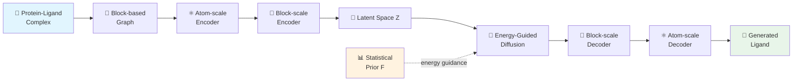

## 잘 붙는 약이 좋은 약은 아니다

AI로 약을 설계하는 시대다. protein pocket 구조를 주면 거기에 딱 맞는 molecule을 생성해주는 SBDD(Structure-Based Drug Design) 모델이 쏟아지고 있다. 그런데 한 가지 불편한 진실이 있다. 이 모델들이 만드는 분자는 **타겟에 잘 붙는 게 아니라, 아무 데나 잘 붙는다.**

Binding affinity 점수가 높으면 좋은 약일까? 전혀 아니다. 의도하지 않은 protein에도 마구 binding하는 molecule은 toxicity의 근원이고, clinical failure의 주범이다. SpecLig는 이 "특이성(specificity)" 문제를 정면으로 다룬 최초의 통합 프레임워크다.

> 📄 [Paper](https://www.biorxiv.org/content/10.1101/2025.11.06.687093v1) \| 💻 [Code](https://github.com/CQ-zhang-2016/SpecLig)

---

## 기존 모델이 만드는 분자의 문제

논문 저자들은 기존 SBDD 모델(VoxBind, PepGLAD 등)이 생성한 분자를 체계적으로 분석했다. 결과가 꽤 충격적이다.

Small molecule 쪽에서는 specificity가 낮은 molecule일수록 **polar group 비율이 5-10% 높았다.** Polar functional group이 많으면 여러 protein surface와 비특이적으로 hydrogen bond를 형성하기 쉽다. Peptide 쪽에서는 specificity가 높은 peptide일수록 **helical content가 3-10% 높았다.** 구조적으로 rigid한 alpha-helix 구간이 flexible한 loop보다 off-target exposure를 줄여주기 때문이다.

> 기존 SBDD 벤치마크는 단일 타겟에 대한 docking score만 측정한다. "다른 단백질에는 얼마나 붙는가?"라는 질문 자체를 하지 않았다.
{: .prompt-warning }

핵심은, single-target affinity를 optimize하는 것만으로는 specificity가 보장되지 않는다는 것이다. 오히려 affinity를 올리면 off-target binding이 함께 증가하는 경향이 있었다. 그렇다면 어떻게 해야 할까?

---

## 핵심 아이디어: 자연이 알려주는 궁합표

SpecLig의 발상은 의외로 단순하다. **자연에 이미 존재하는 protein-ligand complex에서 "어떤 조각끼리 잘 어울리는지"를 통계적으로 배우자.** 

ZINC15, ChEMBL에서 small molecule fragment 간의 co-occurrence frequency를, PDB와 PepBDB에서 protein-ligand 간 hydrogen bond 패턴을, PDBbind와 Binding-MOAD에서 실제 interaction frequency를 수집한다. 이걸 하나의 block-block frequency matrix $F$로 압축하면, 일종의 **"분자 궁합표"**가 만들어진다.

이 궁합표를 molecule generation 과정(diffusion)에 energy function으로 주입하면, pocket 구성에 맞는 fragment 조합만 선택적으로 유도할 수 있다. Target pocket과 궁합이 좋은 조각들이 자연스럽게 모이고, 다른 pocket과는 궁합이 맞지 않는 조합이 만들어지는 것이다.

---

## 어떻게 작동하는가

### 전체 파이프라인

SpecLig는 크게 세 부분으로 나뉜다: (1) block-based molecular representation, (2) hierarchical VAE로 latent space 학습, (3) energy-guided diffusion으로 specificity 있는 분자 생성.

### Block 기반 표현: 원자가 아니라 조각 단위로

대부분의 SBDD 모델은 원자 하나하나를 생성한다. SpecLig는 다르다. 분자를 **fragment(block) 단위**로 표현한다. 아미노산 잔기 하나, 또는 소분자의 의미 있는 fragment 하나가 하나의 block이다.

왜 이렇게 할까? 두 가지 이유가 있다. 첫째, 개별 원자보다 fragment가 화학적으로 의미 있는 단위다. 약물화학자도 원자가 아니라 functional group 단위로 사고한다. 둘째, block 단위로 표현해야 block-block frequency matrix를 자연스럽게 적용할 수 있다. 궁합표의 행과 열이 block이니까.

각 block $v_i$는 element type과 3D coordinate의 집합 $\{(a_k, x_k)\}$로 표현되고, block vocabulary $S$에서 type이 정해진다. Peptide generation 시에는 controllable flag $p_i = 1$로 canonical amino acid만 나오도록 제한할 수도 있다.

### Hierarchical VAE: Atom-scale에서 Block-scale로

Encoding은 두 단계다. 먼저 **atom-scale encoder**가 개별 atom 수준의 feature(element type, parent block type, chain ID 등)를 SE(3)-equivariant transformer로 처리한다. 여기서 중요한 디테일이 하나 있다: pocket과 ligand 사이에 KNN graph를 따로 구성해서 **information leakage를 차단**한다. Training 시 ligand 정보가 pocket encoding에 섞이면 generation 시 문제가 되니까.

그 위에 **block-scale encoder**가 atom-level output을 block 단위로 pooling하고, coarser KNN graph를 구성해서 block 간 관계를 잡아낸다. 최종적으로 각 block의 latent vector $Z_i = [z_i^h, z_i^x] \in \mathbb{R}^8$이 만들어진다. Attribute 정보와 coordinate 정보가 분리되어 있는 게 특징이다.

전체 생성 확률은 이렇게 표현된다:

$$p(G_L | G_P) = \int p_\phi(G_L | Z_L^0, Z_P) \cdot p_\theta(Z_L^0 | Z_P) \, dZ_L^0$$

VAE가 latent space를 학습하고, diffusion이 그 latent space에서 sampling하는 구조다.

### Statistical Prior: 궁합표는 어디서 오는가

Block-block frequency matrix $F \in \mathbb{R}^{n_s \times n_s}$는 여러 데이터베이스에서 구축된다:

| Source | 정보 |
|---|---|
| ZINC15 + ChEMBL | Fragment co-occurrence frequency (100만+ small molecules) |
| RCSB PDB + PepBDB | Inter-chain hydrogen bond residue pairs |
| PDBbind + Binding-MOAD | Protein-ligand interaction frequency (BINANA 분석) |

각 source별로 normalization한 뒤 log-transform을 거쳐 연속적인 statistical potential로 변환한다. 이 matrix의 $(i, j)$ entry가 크다는 건 block type $i$와 $j$가 자연에서 자주 함께 나타난다는 뜻이다.

### Energy-Guided Diffusion: 핵심 혁신

여기가 SpecLig의 진짜 차별점이다. Reverse diffusion의 매 step에서, frozen decoder가 현재 latent vector로부터 block-type probability vector $\hat{s}_i$를 예측한다. 이걸 frequency matrix $F$와 결합해 energy를 계산한다:

$$E_{ij} = -\hat{s}_i^\top \left(\frac{F}{\tau}\right) \hat{s}_j \cdot \omega_{ij}$$

$\tau$는 temperature, $\omega_{ij}$는 distance-dependent decay function이다. 가까운 block pair일수록 궁합이 더 중요하다는 직관을 반영한다.

이 energy의 gradient를 noise space로 backpropagation해서 sampling을 조정한다:

$$\hat{\epsilon}_t' = \hat{\epsilon}_t - \omega_t \cdot \text{clip}(\nabla_{\epsilon} E, G_{\text{set}})$$

직관적으로 말하면, "자연에서 이 pocket 구성과 잘 어울리는 fragment 조합 쪽으로 generation trajectory를 밀어준다." Classifier guidance와 비슷한 원리인데, 별도의 classifier가 아니라 **data statistics 자체**가 guide 역할을 한다. 추가 training이 필요 없다는 점이 실용적이다.

> Energy guidance는 model-agnostic하다. Diffusion이 아니라 flow matching이든 어디든 gradient를 주입할 수 있는 프레임워크라면 적용 가능하다.
{: .prompt-tip }

이 guidance가 왜 specificity를 높이는가? Frequency matrix에는 "특정 pocket 구성에만 잘 맞는 fragment 조합"이 encoded되어 있다. Energy가 낮은 방향으로 생성하면, 해당 pocket에는 잘 맞지만 다른 pocket과는 궁합이 안 맞는 분자가 나온다. Binding affinity와 specificity를 동시에 잡는 셈이다.

---

## 실험 결과

### Small Molecule (CrossDocked2020)

| Model | Specificity | Interaction | Chemistry | Overall |
|---|---|---|---|---|
| **SpecLig** | **1st** | **1st** | **1st** | **0.829** |
| VoxBind | 2nd | 3rd | 6th | 0.686 |
| UniMoMo | 6th | 2nd | 4th | 0.614 |
| DecompDiff | 3rd | 5th | 5th | 0.571 |

SpecLig가 세 카테고리 모두 1위를 차지했다. 특히 specificity metric에서 MPBG(Mean Predicted Binding Gap)가 15.17로, 2위 VoxBind(9.88) 대비 **53.4% 개선**이다. 2000개 protein에 대한 breadth test에서 $\text{Ratio}_\text{pair} = 58.73\%$로 target에 더 강하게 binding하는 비율이 가장 높았다.

### Peptide (PepBench, ProtFrag, LNR)

| Model | Specificity | Interaction | Recovery | Overall |
|---|---|---|---|---|
| **SpecLig** | **1st** | **1st** | **1st** | **0.850** |
| UniMoMo | 2nd | 2nd | 2nd | 0.700 |
| PepGLAD | 3rd | 3rd | 4th | 0.500 |
| RFDiffusion | 5th | 4th | 5th | 0.200 |

Peptide 결과가 더 인상적이다. $\text{Ratio}_{20}$에서 기존 best 52.91%를 **75.00%**로 끌어올렸고(native ligand: 78.31%), 가장 주목할 점은 **SpecLig만 유일하게 음수 $\Delta G$를 달성**했다는 것이다($\Delta G = -1.92$, 2위 UniMoMo: 29.21). 음수 $\Delta G$는 target에 대한 binding이 non-target보다 thermodynamically favorable하다는 뜻이다.

> Small molecule보다 peptide에서 성능 차이가 더 크다. Block이 amino acid residue에 자연스럽게 대응되는 peptide가 block-based representation의 이점을 더 크게 누리는 것으로 보인다.
{: .prompt-info }

---

## Discussion

저자들은 몇 가지 limitation을 명시적으로 밝히고 있다.

**Small molecule에서의 한계.** Peptide와 달리 small molecule은 block vocabulary가 더 복잡하고, fragment 간 연결의 자유도가 높다. Block-block frequency matrix만으로는 electrostatic interaction 등 세밀한 energy landscape를 충분히 포착하기 어렵다. 저자들은 explicit force field term이나 electrostatic field를 추가하는 것을 향후 방향으로 제시한다.

**Experimental validation의 부재.** 모든 결과가 in silico이며 Vina/PyRosetta score에 의존한다. 저자들은 wet-lab validation을 핵심 후속 과제로 언급하고 있다.

**향후 방향.** 저자들은 energy guidance mechanism이 model-agnostic하다는 점을 강조하며, 다른 generative framework에도 적용 가능함을 시사한다. 또한 precision/breadth test paradigm을 SBDD benchmark의 새로운 evaluation standard로 제안하고 있다.

---

## TL;DR

1. **기존 SBDD 모델은 affinity는 높지만 specificity가 낮은 "아무 데나 잘 붙는" 분자를 만든다.**
2. **SpecLig는 자연 복합체의 block-block 접촉 통계를 에너지 함수로 변환해 diffusion 과정을 가이드하여, 특정 타겟에만 선택적으로 결합하는 분자를 생성한다.**
3. **Small molecule·peptide 모두에서 specificity 1위, 특히 peptide에서는 유일하게 음수 $\Delta G$를 달성했다.**

---

> 이 글은 LLM(Large Language Model)의 도움을 받아 작성되었습니다. 
> 논문의 내용을 기반으로 작성되었으나, 부정확한 내용이 있을 수 있습니다.
> 오류 지적이나 피드백은 언제든 환영합니다.
{: .prompt-info }
