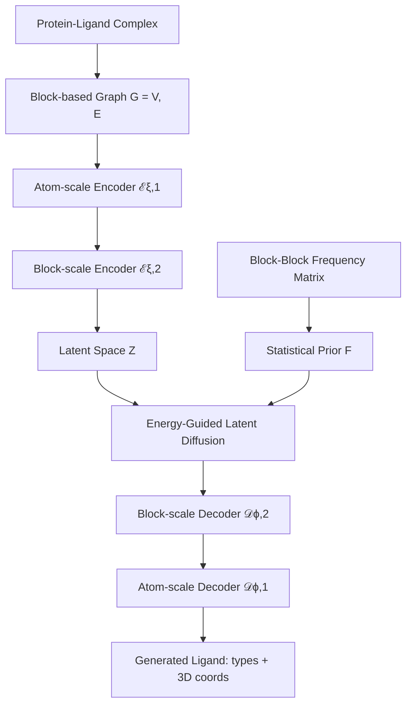

> **Hierarchical SE(3)-equivariant VAE + energy-guided latent diffusion으로 친화도와 특이성을 동시에 달성하는 통합 리간드 생성 프레임워크**
{: .prompt-tip }

| 항목 | 내용 |
|---|---|
| **약어** | SpecLig |
| **중요도** | ⭐⭐⭐⭐⭐ |
| **Track** | 🧬 Protein-Ligand |
| **Paper** | [bioRxiv 2025.11.06.687093](https://www.biorxiv.org/content/10.1101/2025.11.06.687093v1) |
| **Code** | [GitHub: CQ-zhang-2016/SpecLig](https://github.com/CQ-zhang-2016/SpecLig) |
| **Funding** | NSFC T2541010, National Key R&D 2024YFF1207103, BNRist |

---

## 🎯 핵심 기여 (Key Contributions)

1. **Specificity-aware SBDD**: 기존 SBDD 모델이 무시하던 **target specificity**를 명시적으로 모델링한 최초의 통합 프레임워크. 단일 타겟 affinity만 최적화하면 off-target binding이 증가한다는 문제를 체계적으로 분석하고 해결
2. **Block-based hierarchical representation**: 분자를 atom 수준이 아닌 **fragment(block) 단위**로 표현하고, atom-scale → block-scale의 계층적 SE(3)-equivariant VAE로 multi-scale 정보를 포착
3. **Energy-guided latent diffusion**: 자연 복합체에서 추출한 block-block 접촉 빈도 통계를 에너지 함수로 변환하여 diffusion sampling 과정에서 **pocket-complementary fragment 조합**을 유도
4. **Unified small molecule + peptide design**: 하나의 프레임워크로 소분자와 펩타이드를 모두 생성. Specificity를 정량화하는 **precision/breadth 테스트 패러다임** 제안

---

## 📊 주요 결과 (Key Results)

### Small Molecule Design (CrossDocked2020)

| Model | Specificity Rank | Interaction Rank | Chemistry Rank | Overall Score |
|---|---|---|---|---|
| **SpecLig** | **1st** | **1st** | **1st** | **0.829** |
| VoxBind | 2nd | 3rd | 6th | 0.686 |
| UniMoMo | 6th | 2nd | 4th | 0.614 |
| DecompDiff | 3rd | 5th | 5th | 0.571 |
| MolCRAFT | 5th | 4th | 3rd | 0.571 |

**핵심 수치:**
- $\Delta E_{\text{pair}} = -0.83$ (target vs non-target docking score 차이)
- $\text{Ratio}_{\text{pair}} = 58.73\%$ (target에 더 강하게 결합하는 비율)
- $\text{MPBG} = 15.17$ (VoxBind 대비 **53.4% 상대 개선**)

### Peptide Design (PepBench, ProtFrag, LNR)

| Model | Specificity Rank | Interaction Rank | Recovery Rank | Overall Score |
|---|---|---|---|---|
| **SpecLig** | **1st** | **1st** | **1st** | **0.850** |
| UniMoMo | 2nd | 2nd | 2nd | 0.700 |
| PepGLAD | 3rd | 3rd | 4th | 0.500 |
| PepFlow | 4th | 5th | 3rd | 0.350 |
| RFDiffusion | 5th | 4th | 5th | 0.200 |

**핵심 수치:**
- $\text{Ratio}_{\text{pair}}$: 기존 best 68.75% → **75.43%** (native ligand: 80.72%)
- $\text{Ratio}_{20}$: 기존 best 52.91% → **75.00%** (native ligand: 78.31%)
- 유일하게 **음수 ΔG** 달성: $\Delta G = -1.92$ (2위 UniMoMo: 29.21)

---

## 🧭 배경 (Background)

### 문제 정의

Structure-based drug design (SBDD)은 수용체의 3D 구조를 활용하여 리간드를 생성하는 접근법이다. 기존 SBDD 모델들은 **단일 타겟에 대한 docking score 최적화**에 집중하지만, 이는 심각한 문제를 야기한다:

> 높은 predicted affinity를 가진 생성 분자가 **의도하지 않은 단백질에도 강하게 결합** (off-target binding)
{: .prompt-warning }

### 기존 한계

논문은 VoxBind, PepGLAD 등 기존 모델의 생성물을 분석하여 체계적인 문제를 발견했다:

1. **Promiscuous binder 생성**: 타겟 affinity는 높지만 off-target에도 강하게 결합
2. **Small molecule에서**: 낮은 specificity 분자는 **polar group 비율이 5-10% 높음** → 여러 타겟에 비특이적 결합
3. **Peptide에서**: 높은 specificity 펩타이드는 **helical 구조 비율이 3-10% 높음** → 비헬릭스 유연 세그먼트가 off-target 노출 증가
4. **기존 specificity 측정**: 단일 랜덤 non-target과 비교하는 방식으로 불충분

### 핵심 인사이트

> Target specificity를 달성하려면 단일 구조 conditioning을 넘어 **진화적 binding preference**를 반영해야 한다. 자연 복합체의 fragment-fragment 접촉 빈도 통계가 이 정보를 담고 있다.
{: .prompt-info }

---

## 🔬 방법론 (Methodology)

### Step 1: Block-based Graph Representation

단백질-리간드 복합체를 **block-based graph** $G = (V, E)$로 표현한다:
- 각 노드 $v_i \in V$는 block(fragment) 단위 — amino acid residue 또는 small-molecule fragment
- 각 block: $v_i = \{(a_k, x_k)\}_{k=1}^{n_i}$ (원소 타입 + 3D 좌표)
- Block vocabulary $S$: canonical amino acids + predefined small-molecule fragments
- **Controllable flag** $p_i \in \{0, 1\}$: $p_i = 1$이면 canonical residue로만 sampling

### Step 2: Hierarchical SE(3)-Equivariant VAE

2단계 계층적 인코딩-디코딩:

$$p(G_L | G_P) = \int p_\phi(G_L | Z_L^0, Z_P) \cdot p_\theta(Z_L^0 | Z_P) \, dZ_L^0$$

1. **Atom-scale encoder** $\mathcal{E}_{\xi,1}$: atom-level features (원소 타입, 부모 block 타입, residue flag, chain id) + empirical frequency matrix $F$에서 학습한 correlated projection
2. **Block-scale encoder** $\mathcal{E}_{\xi,2}$: atom-level output 위에 coarser KNN graph 구성

### Step 3: Statistical Prior Construction

자연 복합체로부터 block-block 접촉 빈도 행렬 $F \in \mathbb{R}^{n_s \times n_s}$ 구축:

| Source | Data |
|---|---|
| ZINC15 + ChEMBL | Fragment-fragment 공출현 빈도 (100만+ small molecules) |
| RCSB PDB + PepBDB | Inter-chain hydrogen bond residue pairs |
| PDBbind + Binding-MOAD | Protein-ligand interaction 빈도 (BINANA 분석) |

→ Source별 정규화 후 log-transform → 연속 statistical potential

### Step 4: Energy-Guided Latent Diffusion

Reverse diffusion step마다 에너지 항으로 가이드:

$$E_{ij} = -\hat{s}_i^\top \left(\frac{F}{\tau}\right) \hat{s}_j \cdot \omega_{ij}$$

여기서:
- $\hat{s}_i$: 디코더가 예측한 block-type probability vector
- $\tau$: temperature smoothing factor
- $\omega_{ij}$: distance-dependent decay

에너지 gradient를 noise space로 backpropagation하여 sampling 조정:

$$\hat{\epsilon}_t' = \hat{\epsilon}_t - \omega_t \cdot \text{clip}(\nabla_{\epsilon} E, G_{\text{set}})$$

---

## 🏗️ 모델 아키텍처 (Architecture Detail)

### 전체 파이프라인



### Module A: Atom-scale Encoder ($\mathcal{E}_{\xi,1}$)

| Parameter | Value |
|---|---|
| **Input features** | Element type, parent block type, canonical-residue flag, chain id |
| **Graph construction** | KNN graph (intra-$G_L$ and intra-$G_P$ separately, no cross-information) |
| **Edge features** | Same-block indicator $e_{ab}$, relative distance $d_{ab}$, candidate bond type $\beta_{ab}$ |
| **Architecture** | SE(3)-equivariant transformer |
| **Augmentation** | Correlated projection from frequency matrix $F$ (temperature-scaled normalization) |

> **핵심**: KNN graph 구성 시 $G_L$과 $G_P$ 사이 정보 교환을 **차단**하여 information leakage 방지
{: .prompt-info }

### Module B: Block-scale Encoder ($\mathcal{E}_{\xi,2}$)

| Parameter | Value |
|---|---|
| **Input** | Atom-scale encoder output (pooled per block) |
| **Graph construction** | Coarser KNN graph on block centroids |
| **Edge features** | Relative distances between block centroids |
| **Output** | Distributional parameters $(\mu_\xi, \sigma_\xi)$ for reparameterized sampling |
| **Latent dimension** $d$ | 8 |
| **Architecture** | SE(3)-equivariant transformer |

Latent representation: $Z_i = [z_i^h, z_i^x] \in \mathbb{R}^d$ (attribute latent $z^h$ + coordinate latent $z^x$)

### Module C: Energy-Guided Geometric Diffusion

| Parameter | Value |
|---|---|
| **Diffusion space** | Latent space (not atom space) |
| **Energy function** | Block-block frequency matrix-based statistical potential |
| **Temperature** $\tau$ | Smoothing factor for probability |
| **Gradient clipping** | Norm-based, bound $G_{\text{set}}$ |
| **Guidance weight** $\omega_t$ | Time-step dependent decay |
| **Noise injection** | Gaussian noise to model deviations during diffusion (robustness) |

### Module D: Hierarchical Decoder ($\mathcal{D}_{\phi}$)

Block-scale decoder $\mathcal{D}_{\phi,2}$:
- Block type 분류 + coarse centroid regression
- 에너지 가이드 시 frozen 상태로 block-type probability vector 생성

Atom-scale decoder $\mathcal{D}_{\phi,1}$:
- Full-atom 3D coordinate 재구성
- Iterative decoding with velocity field supervision

### Pocket 정의

> Pocket = native ligand atom으로부터 **10Å 이내**에 reference point ($C_\beta$ 또는 fragment centroid)가 있는 block들
{: .prompt-info }

---

## 🧩 Pseudocode

### Training (VAE Stage)

```python
# Hierarchical VAE Training
for complex in dataset:
    G_P, G_L = build_block_graph(complex)
    
    # Atom-scale encoding (separate KNN for pocket and ligand)
    h_atom_P = atom_encoder(G_P, knn_graph='intra')
    h_atom_L = atom_encoder(G_L, knn_graph='intra')
    
    # Block-scale encoding
    mu, sigma = block_encoder(h_atom_P, h_atom_L)
    Z = reparameterize(mu, sigma)  # Z = [z_h, z_x], d=8
    
    # Decoding
    block_types, centroids = block_decoder(Z)
    atom_coords, bonds = atom_decoder(block_types, centroids)
    
    # Loss computation
    L_atom = focal_bond_loss + velocity_mse + paired_distance_loss
    L_block = KL_divergence + block_type_CE + centroid_regression
    L_global = triplet_contrastive_loss(ligand_desc, pocket_desc)
    
    loss = L_atom + L_block + L_global
    loss.backward()
```

### Sampling (Energy-Guided Diffusion)

```python
# Energy-Guided Latent Diffusion Sampling
Z_T ~ N(0, I)  # Start from noise

for t in reversed(range(T)):
    # Predict noise
    eps_pred = noise_network(Z_t, Z_P, t)
    
    # Denoise to get Z_0 estimate
    Z_0_hat = denoise(Z_t, eps_pred, t)
    
    # Decode block types (frozen decoder)
    s_hat = frozen_block_decoder(Z_0_hat)  # probability vectors
    
    # Compute energy from block-block prior
    E = 0
    for (i, j) in block_pairs:
        E_ij = -s_hat[i].T @ (F / tau) @ s_hat[j] * omega_dist(i, j)
        E += E_ij
    E = E / molecular_mass  # normalize
    
    # Energy gradient guidance
    grad = backprop(E, eps_pred)
    grad = clip_by_norm(grad, G_set)
    eps_guided = eps_pred - omega_t * grad
    
    # Reverse step with guided noise
    Z_{t-1} = reverse_step(Z_t, eps_guided, t)

# Final decoding
ligand = full_decoder(Z_0)
```

---

## 🧪 실험 셋업 (Experimental Setup)

### 데이터셋

| Dataset | Task | Split | Usage |
|---|---|---|---|
| **CrossDocked2020** | Small molecule design | Standard (by CBGBench) | Train + Test |
| **PepBench** | Peptide design | Author-recommended | Train + Test |
| **ProtFrag** | Peptide design | Author-recommended | Test |
| **LNR** | Peptide design | Author-recommended | Test |
| **ChEMBL** (100K) | Small molecule augmentation | 20% structural masking | Train augmentation |
| **ZINC15** | Fragment statistics | N/A | Prior construction |
| **PDBbind + Binding-MOAD** | Interaction statistics | N/A | Prior construction |
| **RCSB PDB + PepBDB** | H-bond statistics | N/A | Prior construction |

### Training Configuration

| Parameter | Detail |
|---|---|
| **Training strategy** | Sequential: VAE first → Latent diffusion |
| **VAE teacher forcing** | Atomic types, intra-block bonds, 50% inter-block bonds exposed |
| **Pocket masking** | 5% of pocket residues masked during training |
| **Equivariant backbone** | SE(3)-equivariant transformer |
| **Latent dimension** | $d = 8$ |
| **Paired-distance loss** | Adjacent atoms (≤6Å), early decoding steps ($t \leq 0.25$) only |
| **Diffusion loss** | Denoising MSE + Latent Perceptual Loss (LPL) |
| **Contrastive loss** | Triplet-based: ligand ↔ cognate pocket (positive), random pocket (negative) |

### Specificity Evaluation Protocols

| Protocol | Tool | Target Set Size | Ligand Type |
|---|---|---|---|
| **Precision (Peptide)** | PyRosetta side-chain docking | 1 target + 1 non-target | Peptide |
| **Breadth (Peptide)** | PyRosetta | 100 proteins | Peptide |
| **Precision (Small mol)** | AutoDock Vina | 1 target + 1 non-target | Small molecule |
| **Breadth (Small mol)** | Uni-Dock (GPU-accelerated) | 2000 proteins | Small molecule |

---

## 🔗 연구 연결점 (Research Connection)

### Protein-Ligand AI 관점

- **Specificity as a first-class objective**: 기존 SBDD 벤치마크가 affinity만 측정하는 한계를 지적하고, specificity 메트릭을 체계적으로 도입. 이는 향후 PL 모델 평가의 새로운 기준이 될 수 있음
- **Block-based representation**: Atom 수준이 아닌 fragment 수준의 표현은 chemical space의 의미 있는 단위를 보존하면서 계산 효율성을 확보

### Flow Matching 관점

- 논문은 diffusion 기반이지만, **energy guidance 메커니즘은 flow matching에도 직접 적용 가능**
- Conditional flow matching의 velocity field에 energy gradient를 주입하는 방식으로 확장 가능
- Statistical prior (block-block frequency)는 model-agnostic한 guidance signal

### Drug Discovery 관점

> Off-target toxicity는 drug development failure의 주요 원인 중 하나. SpecLig의 specificity-aware generation은 **hit-to-lead 과정에서 safety profile 개선**에 직접적으로 기여할 수 있다.
{: .prompt-tip }

- Precision/breadth 테스트 패러다임은 기존 논문의 다소 임의적인 specificity 평가를 대체하는 체계적 프로토콜
- 소분자와 펩타이드를 하나의 프레임워크로 다루므로, multi-modality drug design pipeline에 통합 가능

---

## 💭 Open Questions / 후속 실험 아이디어

1. **Flow matching adaptation**: Energy guidance를 flow matching framework (e.g., FlowSite, PepFlow)에 적용하면 어떤 성능 차이가 나는가?
2. **Force field integration**: 논문 자체도 인정하듯, block-block frequency만으로는 소분자의 복잡한 energy landscape를 충분히 포착하기 어려움. Explicit force-field terms, electrostatic fields를 추가하면?
3. **Conformational ensemble**: 단일 crystal structure가 아닌 MD ensemble을 conditioning하면 specificity가 더 개선되는가?
4. **Scalability**: Block vocabulary 크기 $n_s$가 커지면 frequency matrix의 sparsity 문제 → learned embedding으로 대체 가능?
5. **Diversity-specificity trade-off**: 에너지 가이드가 강할수록 mode collapse → adaptive guidance scheduling이나 classifier-free guidance와의 결합은?
6. **Experimental validation**: In silico 결과만 있음 → wet-lab validation이 핵심 후속 과제
7. **AF3/Boltz-2 integration**: SpecLig의 생성물을 AF3나 Boltz-2로 re-docking하여 specificity를 추가 검증하는 파이프라인

---

## 🔧 재현성 평가 (Reproducibility)

| 항목 | 평가 |
|---|---|
| **코드 공개** | ✅ [GitHub](https://github.com/CQ-zhang-2016/SpecLig) |
| **학습 데이터 접근성** | ✅ 공개 (CrossDocked2020, PepBench, ChEMBL, ZINC15 등 모두 public) |
| **Statistical prior data** | ✅ 공개 DB (PDB, PDBbind, Binding-MOAD, PepBDB) |
| **필요 GPU 리소스** | 미명시 (Supplementary에 있을 수 있음) |
| **재현 난이도** | ⭐⭐⭐ (코드+데이터 공개이나 2-stage training + energy guidance 튜닝 필요) |

> Statistical prior 구축 자체가 상당한 전처리를 요구 (BINANA 분석, hydrogen bond trajectory 분석 등). 코드에 포함되어 있는지 확인 필요.
{: .prompt-warning }

---

## 📎 리소스 (Resources)

- 📄 **Paper**: [bioRxiv 2025.11.06.687093](https://www.biorxiv.org/content/10.1101/2025.11.06.687093v1)
- 💻 **Code**: [GitHub: CQ-zhang-2016/SpecLig](https://github.com/CQ-zhang-2016/SpecLig)
- 📊 **Benchmark**: [CBGBench](https://github.com/cbgbench) (small molecule), PepBench (peptide)
- 🔧 **Docking tools used**: AutoDock Vina, Uni-Dock, PyRosetta, Schrödinger Glide

### Baselines Referenced

| Model | Paradigm | Paper |
|---|---|---|
| Pocket2Mol | 3D Autoregressive | Peng et al., ICML 2022 |
| TargetDiff | Diffusion | Guan et al., 2023 |
| DecompDiff | Decomposed Diffusion | Guan et al., 2024 |
| FLAG | Fragment-based | Zhang et al., ICLR 2023 |
| D3FG | Functional-group Diffusion | Lin et al., NeurIPS 2023 |
| VoxBind | Voxel-based Denoising | Pinheiro et al., 2024 |
| MolCRAFT | Continuous-space | Qu et al., 2024 |
| UniMoMo | Unified Multimodal | Kong et al., 2025 |
| RFDiffusion | Diffusion (Protein) | Watson et al., Nature 2023 |
| PepFlow | Flow Matching (Peptide) | Lin et al., 2024 |
| PepGLAD | Latent Diffusion (Peptide) | Kong et al., NeurIPS 2024 |

---

## 📐 주요 수식 정리

### Generation Probability (Marginalized Form)

$$p(G_L | G_P) = \int p_\phi(G_L | Z_L^0, Z_P) \cdot p_\theta(Z_L^0 | Z_P) \, dZ_L^0$$

### Pairwise Energy Term

$$E_{ij} = -\hat{s}_i^\top \left(\frac{F}{\tau}\right) \hat{s}_j \cdot \omega_{ij}$$

### Guided Noise Prediction

$$\hat{\epsilon}_t' = \hat{\epsilon}_t - \omega_t \cdot \text{clip}\left(\nabla_{\epsilon} E, \, G_{\text{set}}\right)$$

### Training Loss (VAE Stage)

$$\mathcal{L}_{\text{VAE}} = \underbrace{\mathcal{L}_{\text{focal}} + \mathcal{L}_{\text{bond-CE}} + \mathcal{L}_{\text{velocity-MSE}} + \mathcal{L}_{\text{paired-dist}}}_{\text{Atom-scale}} + \underbrace{\mathcal{L}_{\text{KL}} + \mathcal{L}_{\text{block-type}} + \mathcal{L}_{\text{centroid}}}_{\text{Block-scale}} + \mathcal{L}_{\text{contrastive}}$$

### Training Loss (Diffusion Stage)

$$\mathcal{L}_{\text{diffusion}} = \mathcal{L}_{\text{denoise-MSE}} + \lambda \cdot \mathcal{L}_{\text{LPL}}$$
