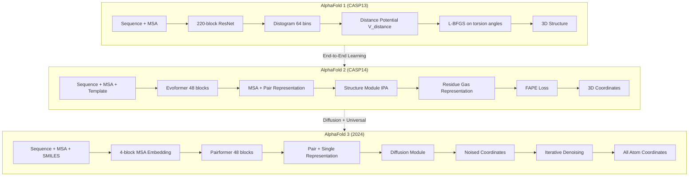

## Hook

AlphaFold 시리즈는 단백질 구조 예측의 패러다임을 세 번 바꿨다. Fragment assembly에서 distance prediction으로, MSA 기반 end-to-end 예측으로, 그리고 모든 생체분자를 아우르는 diffusion 기반 통합 모델로. 이 글은 그 진화의 궤적을 추적한다.

### AlphaFold가 단백질 구조 예측을 바꾼 방법

2018년, AlphaFold는 CASP13에서 등장해 단백질 구조 예측 커뮤니티를 놀라게 했다. 2020년 CASP14에서 AlphaFold 2는 experimental accuracy에 근접한 예측으로 "단백질 접힘 문제 해결"을 선언했다. 그리고 2024년, AlphaFold 3는 단백질을 넘어 nucleic acid, ligand, ion, modified residue까지 **모든 생체분자의 상호작용**을 하나의 통합 프레임워크로 예측하기 시작했다.

이 세 세대의 AlphaFold는 단순한 성능 개선이 아니라, **근본적인 패러다임 전환**을 담고 있다. Distance prediction → End-to-end structure prediction → Diffusion-based universal prediction. 이 포스트에서는 AlphaFold 1, 2, 3를 나란히 놓고 **무엇이 달라졌고, 왜 그렇게 진화했는지**를 비교한다.

---

## Problem

### Fragment Assembly의 한계

단백질 구조 예측의 전통적 접근법은 fragment assembly였다. PDB에서 추출한 통계적 potential을 사용해 simulated annealing으로 구조를 샘플링한다. 하지만 두 가지 근본적 한계가 있었다:

1. **Hand-crafted potential의 한계**: PDB summary statistics로 만든 potential은 covariation 정보를 제대로 활용하지 못했다.
2. **Sampling의 비효율성**: 수천~수만 번의 stochastic move가 필요했고, long-range contact를 만족하는 구조를 찾기 어려웠다.

CASP13 이전까지 contact prediction이 발전했지만, 이를 structure prediction에 효과적으로 통합하는 방법이 명확하지 않았다. Neural network로 contact를 예측하고, 그것을 statistical potential에 추가하는 방식이 주류였다.

---

## Key Idea

### AlphaFold 1 — Distance Prediction as a Learned Potential

AlphaFold 1의 핵심 아이디어는 간단하다: **neural network로 residue 간 거리 분포를 예측하고, 그것을 potential로 삼아 gradient descent로 구조를 최적화**한다.

기존 fragment assembly 방법들은 PDB에서 추출한 통계적 potential을 사용했다. 하지만 AlphaFold 1은 MSA와 covariation feature를 input으로 받아 $L \times L$ distogram을 출력하는 deep convolutional residual network (220 blocks)를 학습했다. 이 distogram은 각 residue pair $i, j$에 대해 64개 bin의 distance distribution $P(d_{ij} \mid S, \text{MSA}(S))$를 예측한다.

구조는 backbone torsion angle $(\phi, \psi)$로 parameterize하고, distance potential $V_{\text{distance}}$를 negative log probability의 spline fit으로 구성한다:

$$
V_{\text{distance}}(\phi, \psi) = \sum_{i,j} -\log P(d_{ij}(\phi, \psi) \mid S, \text{MSA}(S))
$$

여기에 torsion potential $V_{\text{torsion}}$과 Rosetta의 van der Waals term을 더해 L-BFGS로 최적화한다.

<details markdown="1">
<summary>📝 AlphaFold 1 Architecture Pseudocode (클릭하여 펼치기)</summary>

```python
# AlphaFold 1 (CASP13) — Distance-Based Optimization
class AlphaFold1:
    def __init__(self):
        # 220-block ResNet for distogram prediction
        self.distogram_net = DeepResNet(blocks=220, filters=128)
        self.torsion_net = TorsionPredictor()
    
    def predict_structure(self, sequence, msa):
        # Step 1: Predict distance distribution
        features = extract_features(sequence, msa)  # MSA + covariation
        distogram = self.distogram_net(features)    # (L, L, 64 bins)
        
        # Step 2: Construct potential
        V_distance = spline_fit(-log(distogram))
        V_torsion = self.torsion_net.predict_potential(sequence)
        V_total = V_distance + V_torsion + V_vdw_rosetta
        
        # Step 3: Optimize with L-BFGS
        phi, psi = sample_from_torsion_distribution()
        for restart in range(5000):
            phi, psi = lbfgs_minimize(V_total, phi, psi)
            pool.add((phi, psi, V_total(phi, psi)))
        
        # Return lowest-potential structure
        best_phi, best_psi = pool.lowest()
        return torsions_to_coordinates(best_phi, best_psi)
```

</details>

CASP13에서 AlphaFold 1은 FM category에서 summed z-score 52.8로 2위(36.6)를 압도했다.

**한계**: Contact prediction 정확도는 높았지만, 최종 구조 정확도는 여전히 TBM에 못 미쳤다. 수천 번의 gradient descent restart가 필요했고, 긴 단백질은 domain segmentation이 필수였다.

---

## How It Works

### 3세대 아키텍처 진화

### AlphaFold 2: End-to-End Structure Prediction with Evoformer

AlphaFold 2는 **end-to-end learnable structure prediction**으로의 전환이다. Distogram을 intermediate representation으로 두지 않고, MSA representation과 pair representation을 직접 3D coordinates로 변환한다.

핵심은 **Evoformer**와 **Structure Module**이다. Evoformer는 48개 block으로 구성되며, MSA representation ($N_{\text{seq}} \times N_{\text{res}}$)과 pair representation ($N_{\text{res}} \times N_{\text{res}}$)을 동시에 처리한다. Triangle multiplicative update와 triangle attention은 pair representation에 3D consistency constraint를 주입한다 — 거리가 삼각 부등식을 만족하도록 학습한다.

Structure Module은 residue gas representation (각 residue마다 독립적인 rotation/translation)에서 시작해 **Invariant Point Attention (IPA)**로 구조를 iterative refinement한다. IPA는 각 residue의 local frame에서 query/key/value points를 생성하고, global frame에서 interaction을 계산한 뒤 다시 local frame으로 돌아온다 — 이 과정이 global rotation/translation에 invariant하다.

Loss는 **Frame Aligned Point Error (FAPE)**를 사용한다. 각 residue frame에 align했을 때 atom position error를 clamped L1으로 penalize한다:

$$
\text{FAPE} = \frac{1}{N_{\text{frames}} N_{\text{atoms}}} \sum_{k,i} \text{clamp}(\|x_i - R_k (x_i^{\text{true}} - t_k^{\text{true}}) - t_k\|)
$$

<details markdown="1">
<summary>📝 AlphaFold 2 Architecture Pseudocode (클릭하여 펼치기)</summary>

```python
# AlphaFold 2 (CASP14) — End-to-End Structure Prediction
class AlphaFold2:
    def __init__(self):
        self.evoformer = Evoformer(blocks=48)
        self.structure_module = StructureModule(
            ipa_blocks=8,
            residue_gas=True
        )
    
    def forward(self, sequence, msa, templates):
        # Step 1: Evoformer processes MSA + pair representation
        msa_repr, pair_repr = self.evoformer(sequence, msa, templates)
        # msa_repr: (N_seq, N_res, 256), pair_repr: (N_res, N_res, 128)
        
        # Step 2: Structure module iteratively refines structure
        # Initialize residue gas (independent rotation/translation per residue)
        frames = init_residue_gas(N_res)
        
        for iteration in range(3):  # Recycling
            for ipa_block in self.structure_module.ipa_blocks:
                # Invariant Point Attention
                frames = ipa_block(frames, msa_repr[0], pair_repr)
            
            # Predict side-chain torsions
            torsions = predict_torsions(frames, msa_repr[0])
            coords = frames_to_coordinates(frames, torsions)
        
        return coords
    
    def loss(self, pred_coords, true_coords):
        # Frame Aligned Point Error (FAPE)
        fape = 0.0
        for k in range(N_res):
            aligned_pred = align_to_frame(pred_coords, true_coords, k)
            fape += clamped_l1(aligned_pred, true_coords)
        return fape / N_res
```

</details>

CASP14에서 AlphaFold 2는 median backbone r.m.s.d. 0.96 Å (2위는 2.8 Å)를 달성했다. Experimental structure와 구분이 안 될 정도의 정확도다.

**한계**: 단백질에만 적용 가능하다. Ligand, nucleic acid, modified residue는 다루지 못한다. MSA depth < 30이면 성능이 급격히 떨어진다.

### AlphaFold 3: Diffusion to Universal Biomolecular Prediction

AlphaFold 3는 **diffusion model**을 도입해 단백질을 넘어 **모든 생체분자**로 확장한다. Protein, DNA, RNA, ligand, ion, modified residue를 하나의 unified framework로 예측한다.

아키텍처는 크게 두 부분이다. **Pairformer**는 Evoformer를 단순화한 것으로, MSA processing을 4개 block으로 줄이고 MSA representation을 중간에 버린다. 대신 pair representation만 48개 block으로 deep하게 처리한다.

**Diffusion Module**은 AF2의 Structure Module을 대체한다. Residue gas나 torsion angle 대신 **raw atom coordinates를 직접 예측**한다. Training 시 noised coordinates를 받아 true coordinates를 예측하도록 학습한다:

$$
\epsilon_\theta(\mathbf{x}_t, t) \approx \mathbf{x}_0
$$

Inference는 random noise에서 시작해 iterative denoising으로 structure를 생성한다. Diffusion의 multiscale nature 덕분에 — low noise level에서 local stereochemistry, high noise level에서 global fold — stereochemical violation loss 없이도 화학적으로 타당한 구조를 만든다.

<details markdown="1">
<summary>📝 AlphaFold 3 Architecture Pseudocode (클릭하여 펼치기)</summary>

```python
# AlphaFold 3 (2024) — Diffusion-Based Universal Prediction
class AlphaFold3:
    def __init__(self):
        self.msa_embedding = MSAEmbedding(blocks=4)  # Simplified
        self.pairformer = Pairformer(blocks=48)
        self.diffusion = DiffusionModule(
            denoising_steps=20,
            noise_schedule='cosine'
        )
    
    def forward(self, sequence, msa, ligand_smiles):
        # Step 1: Shallow MSA processing
        msa_repr = self.msa_embedding(sequence, msa)
        # Discard MSA representation after embedding
        
        # Step 2: Deep pair processing
        pair_repr, single_repr = self.pairformer(
            sequence, ligand_smiles, msa_repr
        )
        
        # Step 3: Diffusion module generates structure
        # Initialize with random noise
        x_T = sample_gaussian_noise(all_atoms)
        
        # Iterative denoising
        for t in reversed(range(T)):
            noise_pred = self.diffusion.predict_noise(
                x_t, t, pair_repr, single_repr
            )
            x_{t-1} = denoise_step(x_t, noise_pred, t)
        
        return x_0  # Final structure (all heavy atoms)
    
    def loss(self, x_0_pred, x_0_true):
        # Diffusion denoising loss
        t = random_timestep()
        noise = sample_gaussian()
        x_t = add_noise(x_0_true, noise, t)
        noise_pred = self.diffusion.predict_noise(x_t, t, ...)
        return mse_loss(noise_pred, noise)
```

</details>

**한계**: Chirality violation (4.4%), atom clash, hallucination (disordered region을 compact structure로 예측), antibody–antigen prediction에 많은 seed 필요 (1,000 seeds에서도 계속 개선).

---

### AlphaFold 진화 비교


_Figure: AlphaFold 3 아키텍처 개요. 출처: Abramson et al. Nature 2024_

| 항목 | **AlphaFold 1** | **AlphaFold 2** | **AlphaFold 3** |
|---|---|---|---|
| **입력 형태** | Sequence, MSA, covariation features | Sequence, MSA, template | Sequence, MSA, template, ligand SMILES |
| **핵심 아키텍처** | 220-block ResNet (distogram prediction) | 48-block Evoformer (MSA + pair) | 4-block MSA + 48-block Pairformer |
| **MSA 처리** | Input feature로만 사용 | Evoformer에서 deep processing | Shallow processing (4 blocks) 후 버림 |
| **구조 모듈** | Gradient descent on torsion angles | Structure module (IPA, residue gas) | Diffusion module (raw atom coordinates) |
| **출력** | Distance distribution → torsion angles | 3D coordinates (backbone + side chain) | 3D coordinates (all heavy atoms) |
| **Loss** | Distance potential + torsion + Rosetta | FAPE (frame-aligned point error) | Diffusion denoising + FAPE |
| **대상 분자** | Protein only | Protein, protein–protein complex | Protein, nucleic acid, ligand, ion, modifications |

## Results

### CASP13, 14, 15를 가로지르는 성능 진화

### CASP13 (AlphaFold 1)
- **FM category**: Summed z-score 52.8 (2위는 36.6)
- Contact prediction precision (top L/5): **~66%** (당시 최고)
- TM score: 0.6–0.7 range에서 가장 많은 domain 예측
- **한계**: TBM에 비해 여전히 낮은 정확도, domain segmentation 필수

### CASP14 (AlphaFold 2)
- **압도적 1위**: Median backbone r.m.s.d. **0.96 Å** (2위는 2.8 Å)
- GDT (Global Distance Test): 평균 **92.4** (experimental accuracy 수준)
- All-atom r.m.s.d.: **1.5 Å** (side-chain까지 정확)
- Full chain prediction without domain segmentation

### CASP15 & Beyond (AlphaFold 3)
- **PoseBusters**: Protein–ligand success rate **76%** (Vina 21%, RoseTTAFold All-Atom 52%)
- **Protein–nucleic**: Interface LDDT higher than RoseTTAFold2NA
- **CASP15 RNA**: Competitive with AIchemy_RNA (AI-based top submission)
- **Antibody–antigen**: DockQ > 0.23 success rate significantly higher than AF2

> AlphaFold 3는 단백질 구조 예측을 넘어 **생체분자 상호작용 예측**이라는 새로운 영역을 열었다.
{: .prompt-tip }

---

## Discussion

### 진화의 방향성과 남은 과제

---

### 아키텍처 진화: 3세대를 하나의 다이어그램으로



---

### 핵심 전환점 1: AF1 → AF2 — Intermediate Representation의 제거

AlphaFold 1은 distance prediction을 intermediate step으로 두고, 별도의 optimization 과정을 거쳤다. 이는 두 가지 문제가 있었다:

1. **Gradient flow 단절**: Distogram prediction과 structure optimization이 분리되어 있어, end-to-end learning이 불가능했다.
2. **Domain segmentation 필수**: 긴 단백질은 독립적으로 folding된다고 가정하고 domain으로 쪼갰는데, 이 가정이 틀리면 실패했다.

AlphaFold 2는 이를 **end-to-end differentiable architecture**로 통합했다. Evoformer → Structure Module → FAPE loss까지 하나의 gradient가 흐른다. Residue gas representation은 chain constraint를 무시해 모든 residue를 동시에 local refinement할 수 있게 했다 (loop closure 문제 회피).

결과적으로 CASP14에서 median backbone r.m.s.d. 0.96 Å — experimental accuracy와 구분 불가능한 수준에 도달했다.

### 핵심 전환점 2: AF2 → AF3 — Equivariance의 포기와 Diffusion의 도입

AlphaFold 2의 Structure Module은 SE(3)-equivariant architecture였다. IPA는 global rotation/translation에 invariant하도록 설계되었다. 하지만 이는 복잡도를 높이고, 일반적인 molecular graph (ligand의 arbitrary bonding pattern)에 적용하기 어려웠다.

AlphaFold 3는 **equivariance를 버렸다**. Diffusion module은 raw atom coordinates를 직접 다루고, global rotation/translation invariance도 없다. 대신 data augmentation (random rotation during training)으로 해결한다.

Diffusion의 multiscale denoising은 또 다른 이점을 준다:

- **Low noise**: Local stereochemistry를 학습 (bond length, angle)
- **High noise**: Global fold topology를 학습 (secondary structure packing)

이 덕분에 stereochemical violation loss 없이도 화학적으로 타당한 구조를 생성한다. Ligand, nucleic acid, modified residue를 단백질과 동일한 방식으로 다룰 수 있게 된 것이다.

**Trade-off**: Generative model이라 hallucination이 생긴다. Disordered region을 compact structure로 예측하는 경향이 있다. Cross-distillation (AF2 prediction을 training data로 추가)으로 완화했지만, 완전히 제거하지는 못했다.

### 핵심 전환점 3: MSA Processing의 간소화

AlphaFold 1과 2는 MSA를 deep하게 처리했다 (220 blocks / 48 blocks). AlphaFold 3는 MSA processing을 **4 blocks로 줄이고 중간에 버린다**. 대신 pair representation만 48 blocks로 처리한다.

왜 가능했을까? 저자들은 AlphaFold 2에서 관찰한 결과를 인용한다: MSA depth가 충분하면 (>100 sequences), local structure는 빠르게 수렴하고 refinement는 MSA 없이도 가능하다. Pairformer는 coarse structure finding을 MSA로 하고, fine-tuning은 pair representation만으로 한다.

결과적으로 computation은 줄이고 확장성은 높였다 (ligand, nucleic acid 등 MSA가 없는 entity에도 적용 가능).

### 남은 과제

AlphaFold 3가 생체분자 상호작용 예측의 새 지평을 열었지만, 여전히 한계가 있다:

1. **Dynamics**: 정적 구조만 예측 가능. Solution ensemble이나 conformational change는 다루지 못함.
2. **Chirality & Stereochemistry**: 4.4% chirality violation, 가끔 atom clash 발생.
3. **Antibody 예측**: 1,000 seeds 필요 (일반 protein–protein은 5 seeds로 충분).
4. **Hallucination**: Disordered region을 compact하게 예측하는 경향.
5. **Hetero-complex**: Heterotypic contact가 많은 단백질은 정확도 낮음.

다음 세대 AlphaFold는 아마도 **dynamics modeling**, **multistate prediction**, **complex stoichiometry reasoning**을 다룰 것이다.

---

## Limitations

1. **MSA 의존성의 지속**: AF3에서 간소화되었지만 여전히 MSA 기반이며, single-sequence prediction은 정확도가 크게 떨어진다.
2. **Dynamic structure 미예측**: 세 버전 모두 static structure만 출력하며, conformational ensemble이나 allosteric motion을 포착하지 못한다.
3. **데이터 편향의 누적**: PDB의 crystallizable protein 편향이 모든 세대에 걸쳐 반영되어, membrane protein이나 intrinsically disordered protein에서 약점을 보인다.
4. **AF3의 hallucination**: Diffusion 기반 생성의 고질적 문제로, 물리적으로 불가능한 구조가 생성될 수 있다.
5. **라이선스의 점진적 폐쇄**: AF2는 오픈소스였으나, AF3는 상업적 사용 제한으로 연구 커뮤니티의 접근성이 줄었다.

## Conclusion

AlphaFold 시리즈는 단백질 구조 예측의 세 번의 패러다임 전환을 이끌었다. AF1의 distogram + gradient descent, AF2의 Evoformer + Structure Module, AF3의 Pairformer + Diffusion으로 이어지는 진화는 각각 CASP13, 14, 15에서의 압도적 성과로 검증되었다. 핵심 전환점은 intermediate representation의 제거(AF1→AF2), equivariance의 포기와 diffusion 도입(AF2→AF3), MSA processing의 간소화(AF2→AF3)이다. 이 시리즈는 구조 생물학의 landscape를 근본적으로 변화시켰으며, 단백질을 넘어 모든 생체분자 상호작용 예측으로의 확장 가능성을 보여주었다.

## TL;DR

AlphaFold 1은 distance를 learned potential로, AlphaFold 2는 end-to-end structure prediction으로, AlphaFold 3는 diffusion 기반 universal prediction으로 진화했다. 세 세대를 관통하는 핵심은 **inductive bias의 제거와 data-driven learning의 강화**다. Equivariance를 버리고, MSA processing을 줄이고, ligand까지 다루면서도 정확도는 계속 올라갔다. 이제 단백질 구조 예측은 "solved problem"이 아니라 "생체분자 상호작용 예측의 시작점"이다.

---

### 시리즈 상세 리뷰

각 AlphaFold 버전의 상세 분석은 아래 포스트를 참고:

- [AlphaFold 1 상세 리뷰](/posts/alphafold1-improved-protein-structure-prediction/) — Distance prediction과 gradient descent
- [AlphaFold 2 상세 리뷰](/posts/alphafold2-highly-accurate-protein-structure-prediction/) — Evoformer, IPA, FAPE loss
- [AlphaFold 3 상세 리뷰](/posts/alphafold3-accurate-biomolecular-interactions/) — Diffusion module, pairformer, universal prediction

---

## Paper Info

| 항목 | AlphaFold 1 | AlphaFold 2 | AlphaFold 3 |
|---|---|---|---|
| **Title** | Improved protein structure prediction using potentials from deep learning | Highly accurate protein structure prediction with AlphaFold | Accurate structure prediction of biomolecular interactions with AlphaFold 3 |
| **Authors** | Senior et al. (DeepMind) | Jumper et al. (DeepMind) | Abramson et al. (Google DeepMind) |
| **Venue** | Nature (2020) | Nature (2021) | Nature (2024) |
| **Paper** | [Nature](https://www.nature.com/articles/s41586-019-1923-7) | [Nature](https://www.nature.com/articles/s41586-021-03819-2) | [Nature](https://www.nature.com/articles/s41586-024-07487-w) |
| **Published** | Nature 2020 | Nature 2021 | Nature 2024 |
| **Link** | [doi:10.1038/s41586-019-1923-7](https://doi.org/10.1038/s41586-019-1923-7) | [doi:10.1038/s41586-021-03819-2](https://doi.org/10.1038/s41586-021-03819-2) | [doi:10.1038/s41586-024-07487-w](https://doi.org/10.1038/s41586-024-07487-w) |
| **Code** | [GitHub](https://github.com/deepmind/deepmind-research/tree/master/alphafold_casp13) | [GitHub](https://github.com/deepmind/alphafold) | 미공개 (AlphaFold Server만 제공) |

---

> 이 글은 LLM(Large Language Model)의 도움을 받아 작성되었습니다. 
> 논문의 내용을 기반으로 작성되었으나, 부정확한 내용이 있을 수 있습니다.
> 오류 지적이나 피드백은 언제든 환영합니다.
{: .prompt-info }
