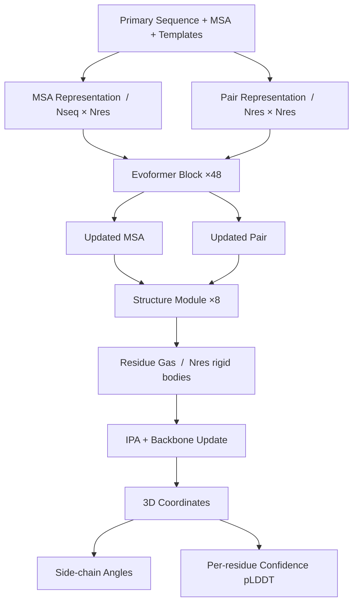

> 이 글은 AlphaFold 시리즈의 두 번째 글입니다. 시리즈: AlphaFold 1, **AlphaFold 2 (이 글)**, AlphaFold 3, AlphaFold Summary.
{: .prompt-info }

## Hook

단백질 구조를 실험으로 규명하는 데는 수개월에서 수년이 걸린다. 100,000개의 단백질 구조가 PDB에 등록되어 있지만, 이는 수십억 개의 알려진 단백질 서열의 극히 일부에 불과하다. 50년 이상 풀리지 않은 **protein folding problem**—아미노산 서열만으로 단백질의 3D 구조를 예측하는 문제—이 2020년, AlphaFold 2의 등장으로 돌파구를 맞았다.

AlphaFold 2는 CASP14에서 실험 구조와 경쟁할 수 있는 수준의 정확도를 보여주며, **처음으로 원자 수준(atomic accuracy)의 단백질 구조 예측**을 가능하게 한 시스템이다. 탄소 원자의 폭이 1.4Å인데, AlphaFold 2의 median backbone accuracy는 0.96Å r.m.s.d.95에 달한다.

## Problem

단백질 구조 예측은 크게 두 가지 접근법으로 발전해왔다. **물리 기반 접근법(physical interaction programme)**은 분자 간 상호작용을 시뮬레이션하여 구조를 예측하지만, 중간 크기 단백질조차 계산적으로 다루기 어렵고 충분히 정확한 물리 모델을 만들기 힘들다는 한계가 있었다. **진화 기반 접근법(evolutionary programme)**은 다중 서열 정렬(MSA)과 진화적 상관관계를 활용하지만, homologous structure가 없거나 MSA depth가 얕을 때 정확도가 크게 떨어졌다.

기존 방법들은 대부분 **distance matrix를 중간 예측 단계로** 사용했다. 즉, MSA로부터 pairwise distance를 예측한 뒤, heuristic system으로 3D 좌표를 재구성하는 2단계 과정이었다. 이 접근법은 정보 손실과 최적화 어려움을 초래했다.

또한 **homologue가 없는 경우** 정확도가 급격히 떨어지는 문제가 있었다. Template-based modeling은 유사한 구조가 PDB에 있을 때만 잘 작동하며, 새로운 fold에 대해서는 무력했다.

## Key Idea

AlphaFold 2의 핵심은 **진화적, 물리적, 기하학적 제약을 neural network architecture에 직접 통합**하는 것이다. 세 가지 혁신이 돌파구를 제공했다:

**1. Evoformer: MSA와 pair representation의 공동 임베딩**

기존 방법들이 MSA에서 feature를 추출한 뒤 고정된 입력으로 사용한 반면, AlphaFold 2는 MSA representation과 pair representation을 **매 layer에서 상호 교환**하며 진화시킨다. Triangle multiplicative update와 triangle self-attention을 통해 pairwise 관계에서 삼각 부등식(triangle inequality) 같은 기하학적 제약을 암묵적으로 학습한다.

**2. End-to-end 3D 좌표 예측**

Distance matrix를 예측하는 대신, AlphaFold 2는 **각 residue의 rotation과 translation을 직접 예측**한다. 이를 "residue gas"라 부르며, 각 residue는 독립적인 rigid body로 표현된다. 이는 peptide bond constraint를 임시로 위반하며 전역 최적화 문제를 병렬화 가능한 local refinement로 바꾼다.

**3. Frame Aligned Point Error (FAPE) loss**

FAPE는 예측된 원자 좌표를 **각 residue의 local frame에서** 평가한다. 전역 정렬(global alignment) 대신 수많은 local alignment에서 오차를 측정함으로써, side chain의 orientation과 chirality를 정확하게 학습할 수 있다.

> AlphaFold 2는 물리 법칙을 명시적으로 코딩하지 않고도, 수소 결합이나 side chain packing 같은 상호작용을 데이터로부터 학습한다.
{: .prompt-tip }

## How It Works

### 4.1 Overview

AlphaFold 2는 크게 두 단계로 구성된다: **Evoformer trunk**와 **Structure Module**.



전체 아키텍처는 다음과 같다:

<details markdown="1">
<summary>📝 Overall Architecture Pseudocode (클릭하여 펼치기)</summary>

```python
class AlphaFold2(nn.Module):
    """AlphaFold 2 end-to-end architecture"""
    def __init__(self, c_m=256, c_z=128, n_evo_blocks=48, n_struct_blocks=8):
        super().__init__()
        self.evoformer = EvoformerStack(c_m, c_z, n_blocks=n_evo_blocks)
        self.structure_module = StructureModule(c_s=c_m, c_z=c_z, n_blocks=n_struct_blocks)
        self.side_chain_net = SideChainNet(c_s=c_m)
        self.plddt_head = PerResidueLDDTHead(c_s=c_m)
        
    def forward(self, sequence, msa, templates):
        # Step 1: Initialize representations
        msa_repr = self.init_msa_repr(sequence, msa)  # (Nseq, Nres, c_m)
        pair_repr = self.init_pair_repr(sequence, templates)  # (Nres, Nres, c_z)
        
        # Step 2: Evoformer trunk (48 blocks)
        for recycle in range(3):  # Recycling iterations
            msa_repr, pair_repr = self.evoformer(msa_repr, pair_repr)
        
        # Step 3: Structure module (8 blocks)
        single_repr = msa_repr[0]  # First row: query sequence
        frames = self.structure_module(single_repr, pair_repr)
        # frames: (Nres,) of SE(3) transformations (R, t)
        
        # Step 4: Side chains and confidence
        chi_angles = self.side_chain_net(single_repr, frames)
        plddt = self.plddt_head(single_repr)
        
        # Step 5: Convert to 3D coordinates
        coords = frames_to_atom_coords(frames, chi_angles)
        return coords, plddt
```

</details>

### 4.2 Representation

**MSA representation** ($N_{seq} \times N_{res} \times c_m$): 각 행(row)은 homologous sequence, 각 열(column)은 query sequence의 residue position을 나타낸다. 초기값은 raw MSA를 one-hot encoding한 후 linear projection으로 임베딩한다.

**Pair representation** ($N_{res} \times N_{res} \times c_z$): residue $i$와 $j$ 사이의 관계를 인코딩한다. 초기값은 relative position encoding과 template structure에서 추출한 pairwise distance/angle feature로 구성된다.

**Single representation** ($N_{res} \times c_s$): MSA representation의 첫 번째 row로, query sequence 자체를 나타낸다. Structure module의 입력으로 사용된다.

### 4.3 Core Architecture: Evoformer

Evoformer block은 AlphaFold 2의 핵심으로, MSA와 pair representation을 **상호 업데이트**하며 구조적 가설을 점진적으로 정제한다.


_Figure 3: Evoformer block과 Structure module의 세부 구조. 출처: 원 논문_

<details markdown="1">
<summary>📝 Evoformer Block Implementation (클릭하여 펼치기)</summary>

```python
class EvoformerBlock(nn.Module):
    """Single Evoformer block with MSA and pair updates"""
    def __init__(self, c_m=256, c_z=128, n_heads=8):
        super().__init__()
        # MSA stack
        self.msa_row_attention = MSARowAttentionWithPairBias(c_m, c_z, n_heads)
        self.msa_column_attention = MSAColumnAttention(c_m, n_heads)
        self.msa_transition = Transition(c_m)
        
        # Communication: MSA → Pair
        self.outer_product_mean = OuterProductMean(c_m, c_z)
        
        # Pair stack
        self.triangle_multiplication_outgoing = TriangleMultiplication(c_z, 'outgoing')
        self.triangle_multiplication_incoming = TriangleMultiplication(c_z, 'incoming')
        self.triangle_attention_starting = TriangleAttention(c_z, 'starting')
        self.triangle_attention_ending = TriangleAttention(c_z, 'ending')
        self.pair_transition = Transition(c_z)
        
    def forward(self, msa, pair):
        # MSA row-wise attention with pair bias
        # Pair representation influences MSA through attention bias
        msa = msa + self.msa_row_attention(msa, pair_bias=pair)
        msa = msa + self.msa_column_attention(msa)
        msa = msa + self.msa_transition(msa)
        
        # Outer product: MSA → Pair
        pair = pair + self.outer_product_mean(msa)
        
        # Triangle updates for geometric consistency
        pair = pair + self.triangle_multiplication_outgoing(pair)
        pair = pair + self.triangle_multiplication_incoming(pair)
        pair = pair + self.triangle_attention_starting(pair)
        pair = pair + self.triangle_attention_ending(pair)
        pair = pair + self.pair_transition(pair)
        
        return msa, pair


class TriangleMultiplication(nn.Module):
    """Triangle multiplicative update for pair representation"""
    def __init__(self, c_z=128, mode='outgoing'):
        super().__init__()
        self.mode = mode
        self.layer_norm = nn.LayerNorm(c_z)
        self.linear_a = nn.Linear(c_z, c_z)
        self.linear_b = nn.Linear(c_z, c_z)
        self.linear_g = nn.Linear(c_z, c_z)
        self.linear_out = nn.Linear(c_z, c_z)
        
    def forward(self, z):
        # z: (Nres, Nres, c_z) pair representation
        # Update edge (i,j) using edges (i,k) and (k,j) for all k
        z = self.layer_norm(z)
        
        a = self.linear_a(z).sigmoid()  # (Nres, Nres, c_z)
        b = self.linear_b(z).sigmoid()  # (Nres, Nres, c_z)
        g = self.linear_g(z).sigmoid()  # gate
        
        if self.mode == 'outgoing':
            # z_ij update uses z_ik, z_kj
            ab = torch.einsum('ikc,kjc->ijc', a, b)
        else:  # incoming
            # z_ij update uses z_ki, z_kj
            ab = torch.einsum('kic,kjc->ijc', a, b)
        
        return self.linear_out(g * ab)
```

</details>

**Triangle multiplicative update**는 세 residue $i, j, k$ 사이의 관계를 고려한다. Edge $(i,j)$를 업데이트할 때, 모든 중간 node $k$에 대해 $(i,k)$와 $(k,j)$ edge의 정보를 곱셈으로 결합한다. 이는 거리의 삼각 부등식 $d_{ij} \leq d_{ik} + d_{kj}$를 암묵적으로 강제한다.

**Triangle self-attention**은 axial attention에 "missing edge" 정보를 bias로 추가한다. 예를 들어, $(i,j)$에 대한 attention을 계산할 때, $(i,k)$와 $(k,j)$의 정보를 logit bias로 제공한다.

**MSA row attention with pair bias**: MSA의 각 sequence(row)에 대해 self-attention을 수행하되, pair representation으로부터 추가 logit bias를 받는다. 이는 pair → MSA 정보 흐름을 만든다.

**Outer product mean**: MSA representation을 pair representation으로 변환한다. 각 position $(i, j)$에 대해 MSA의 모든 sequence에서 $(i, j)$ 위치의 activation을 outer product한 뒤 평균을 낸다.

$$
z_{ij} \gets z_{ij} + \frac{1}{N_{seq}} \sum_s m_{si} \otimes m_{sj}
$$

여기서 $m_{si}$는 MSA representation의 $s$번째 sequence, $i$번째 residue의 activation이다.

### 4.4 Key Innovation: Structure Module

Structure module은 **residue gas** 표현을 사용한다. 각 residue는 독립적인 SE(3) transformation $(R_i, t_i)$로 표현되며, peptide bond constraint는 무시된다. 이는 전역 루프 클로저(loop closure) 문제를 피하면서 모든 residue를 병렬로 정제할 수 있게 한다.

<details markdown="1">
<summary>📝 Invariant Point Attention (IPA) Implementation (클릭하여 펼치기)</summary>

```python
class InvariantPointAttention(nn.Module):
    """IPA: geometry-aware attention in 3D space"""
    def __init__(self, c_s=384, c_z=128, n_heads=12, n_query_points=4, n_value_points=8):
        super().__init__()
        self.n_heads = n_heads
        self.n_query_points = n_query_points
        self.n_value_points = n_value_points
        
        # Standard attention projections
        self.linear_q = nn.Linear(c_s, n_heads * 16)
        self.linear_k = nn.Linear(c_s, n_heads * 16)
        self.linear_v = nn.Linear(c_s, n_heads * 16)
        
        # 3D point projections (in local frame)
        self.linear_q_points = nn.Linear(c_s, n_heads * n_query_points * 3)
        self.linear_k_points = nn.Linear(c_s, n_heads * n_query_points * 3)
        self.linear_v_points = nn.Linear(c_s, n_heads * n_value_points * 3)
        
        # Pair bias
        self.linear_b = nn.Linear(c_z, n_heads)
        
        self.head_weights = nn.Parameter(torch.zeros(n_heads))
        
    def forward(self, s, z, frames):
        # s: (Nres, c_s) single representation
        # z: (Nres, Nres, c_z) pair representation  
        # frames: (Nres,) list of (R, t) in SE(3)
        
        Nres = s.shape[0]
        
        # Standard attention
        q = self.linear_q(s).view(Nres, self.n_heads, 16)
        k = self.linear_k(s).view(Nres, self.n_heads, 16)
        v = self.linear_v(s).view(Nres, self.n_heads, 16)
        
        # 3D query/key points in local frames
        q_pts = self.linear_q_points(s).view(Nres, self.n_heads, self.n_query_points, 3)
        k_pts = self.linear_k_points(s).view(Nres, self.n_heads, self.n_query_points, 3)
        v_pts = self.linear_v_points(s).view(Nres, self.n_heads, self.n_value_points, 3)
        
        # Transform points to global frame
        q_pts_global = [frames[i].R @ q_pts[i] + frames[i].t for i in range(Nres)]
        k_pts_global = [frames[i].R @ k_pts[i] + frames[i].t for i in range(Nres)]
        
        # Compute attention logits
        attn_logits = torch.einsum('ihc,jhc->hij', q, k) / (16 ** 0.5)
        
        # Add 3D point contribution: squared distances
        for h in range(self.n_heads):
            for i in range(Nres):
                for j in range(Nres):
                    # Squared distance between query points i and key points j
                    dist_sq = torch.sum((q_pts_global[i][h] - k_pts_global[j][h])**2)
                    attn_logits[h, i, j] -= self.head_weights[h] * dist_sq
        
        # Add pair bias
        pair_bias = self.linear_b(z).permute(2, 0, 1)  # (n_heads, Nres, Nres)
        attn_logits = attn_logits + pair_bias
        
        # Softmax attention
        attn = F.softmax(attn_logits, dim=-1)  # (n_heads, Nres, Nres)
        
        # Apply attention to values (both scalar and 3D points)
        out_scalar = torch.einsum('hij,jhc->ihc', attn, v)
        
        # Aggregate value points, then transform back to local frames
        out_points = []
        for i in range(Nres):
            pts_i = torch.zeros(self.n_heads, self.n_value_points, 3)
            for j in range(Nres):
                v_pts_j_global = frames[j].R @ v_pts[j] + frames[j].t
                pts_i += attn[:, i, j].unsqueeze(-1).unsqueeze(-1) * v_pts_j_global
            # Transform back to local frame of residue i
            pts_i_local = frames[i].R.T @ (pts_i - frames[i].t)
            out_points.append(pts_i_local)
        
        return out_scalar, out_points
```

</details>

**Invariant Point Attention (IPA)**은 3D 공간에서 geometry-aware attention을 수행한다. 각 residue는 query/key/value를 scalar와 **3D points**로 생성한다. 이 점들은 local frame에서 정의되며, global frame으로 변환되어 attention 계산에 사용된다. 점 간의 **squared distance**가 attention logit에 기여하여, 공간적으로 가까운 residue에 높은 attention weight를 준다.

IPA의 핵심은 **SE(3) invariance**다. 전체 구조를 회전/평행이동해도 IPA의 출력은 변하지 않는다. 이는 global frame을 통해 거리를 계산한 뒤, 다시 local frame으로 변환하는 방식으로 달성된다.

### 4.5 Training & Inference

**Frame Aligned Point Error (FAPE)**는 AlphaFold 2의 주요 loss function이다. 각 residue $k$의 frame $(R_k, t_k)$에 대해 예측 원자 위치와 실제 원자 위치를 정렬한 뒤, 모든 원자의 거리 오차를 계산한다:

$$
\text{FAPE} = \frac{1}{N_{\text{frames}} \cdot N_{\text{atoms}}} \sum_{k} \sum_{i} \text{clamp}(\|R_k(x_i^{\text{pred}} - t_k) - R_k(x_i^{\text{true}} - t_k)\|)
$$

이는 각 residue의 local frame에서 원자들이 정확하도록 강제하며, side chain의 orientation과 chirality를 보존한다.

<details markdown="1">
<summary>📝 Training Loop Pseudocode (클릭하여 펼치기)</summary>

```python
# Training Loop
for epoch in range(num_epochs):
    for batch in dataloader:
        sequence, msa, templates, true_coords, true_frames = batch
        
        # Forward pass with recycling
        for recycle in range(3):
            if recycle > 0:
                # Feed previous prediction back as input
                msa, pair = prev_msa, prev_pair
            
            pred_coords, pred_frames, plddt = model(sequence, msa, templates)
            
            # Intermediate loss at each recycle
            fape_loss = compute_fape(pred_coords, true_coords, pred_frames, true_frames)
            distogram_loss = compute_distogram_loss(pair, true_coords)
            masked_msa_loss = compute_masked_msa_loss(msa, true_msa)
            
            loss = fape_loss + 0.3 * distogram_loss + 0.1 * masked_msa_loss
            
            prev_msa, prev_pair = msa.detach(), pair.detach()
        
        # Backprop
        optimizer.zero_grad()
        loss.backward()
        optimizer.step()


def compute_fape(pred_coords, true_coords, pred_frames, true_frames):
    """Frame Aligned Point Error"""
    # pred_coords, true_coords: (Nres, 3) for backbone atoms
    # pred_frames, true_frames: (Nres,) of (R, t)
    
    total_error = 0.0
    for k in range(len(pred_frames)):
        R_k, t_k = true_frames[k]
        
        # Align predicted and true coordinates to frame k
        pred_aligned = R_k @ (pred_coords - t_k)
        true_aligned = R_k @ (true_coords - t_k)
        
        # Clamped L1 distance
        dist = torch.norm(pred_aligned - true_aligned, dim=-1)
        clamped = torch.clamp(dist, max=10.0)
        total_error += clamped.sum()
    
    return total_error / (len(pred_frames) * len(pred_coords))
```

</details>

**Recycling**은 전체 네트워크를 여러 번 반복 실행하여 예측을 정제한다. 이전 iteration의 MSA와 pair representation을 다음 iteration의 입력으로 사용한다. CASP14에서는 3회 recycling을 사용했다.

**Self-distillation**: AlphaFold 2는 PDB 데이터로 학습한 모델로 Uniclust30의 35만 개 서열에 대한 구조를 예측하고, 이를 추가 학습 데이터로 사용하는 noisy student self-distillation을 수행했다. 이는 unlabeled sequence 데이터를 활용하여 정확도를 크게 향상시켰다.

**Masked MSA loss**: BERT와 유사하게, MSA의 일부 residue를 마스킹하고 복원하는 보조 loss를 사용한다. 이는 네트워크가 진화적 상관관계를 학습하도록 유도한다.

### 4.6 Iterative Refinement

AlphaFold 2는 구조를 점진적으로 개선한다. 각 Evoformer block 뒤에 중간 structure module을 배치하여, 네트워크가 어느 시점에 올바른 구조를 찾는지 관찰할 수 있다.


_Figure 4: (a) Ablation study — 각 구성 요소의 기여도. (b) Structure trajectory — 48 Evoformer block과 4회 recycling 동안 GDT 변화. 출처: 원 논문_

일부 단백질(T1024)은 초기 몇 block에서 이미 최종 구조를 찾는 반면, 어려운 단백질(T1064, SARS-CoV-2 ORF8)은 수십 개 layer를 거치며 secondary structure element를 재배열한다.

### 4.7 Confidence Estimation

AlphaFold 2는 두 가지 confidence score를 출력한다:

- **pLDDT** (predicted lDDT-Cα): 각 residue의 예측 정확도. 0-100 사이 값으로, 실제 lDDT-Cα와 높은 상관관계를 보인다 (Pearson's r=0.76).
- **pTM** (predicted TM-score): 전체 chain의 global accuracy. pairwise error prediction으로부터 계산된다.

이 confidence score들은 예측 구조의 신뢰성을 판단하는 데 매우 유용하다.

## Results

AlphaFold 2는 CASP14에서 압도적인 성능을 보였다. Median backbone accuracy는 **0.96Å r.m.s.d.95** (95% CI = 0.85-1.16Å)로, 차순위 방법의 2.8Å r.m.s.d.95를 크게 앞섰다. All-atom accuracy는 **1.5Å r.m.s.d.95**로, 탄소 원자의 폭(1.4Å)과 비슷한 수준이다.


_Figure 1: AlphaFold 2의 CASP14 성능. (a) 상위 15개 팀과의 비교. (b-d) 예측 구조 예시 — T1049(단일 도메인), T1056(아연 결합 부위), T1044(2,180 residue 단일 체인). 출처: 원 논문_

| Metric | AlphaFold 2 | 2nd Best | Improvement |
|---|---|---|---|
| Backbone r.m.s.d.95 | 0.96 Å | 2.8 Å | **2.9×** |
| All-atom r.m.s.d.95 | 1.5 Å | 3.5 Å | **2.3×** |
| Median GDT (CASP14) | ~92 | ~75 | +17 points |

**Table 1:** CASP14 결과 요약. AlphaFold 2는 모든 지표에서 2위를 압도적으로 앞선다.

CASP 이후 공개된 PDB 구조에서도 높은 정확도를 유지했다. Template coverage가 30% 미만인 어려운 단백질에서도 median lDDT-Cα는 **70 이상**을 기록했다.


_Figure 2: 최근 PDB 구조에 대한 정확도. (a) Backbone r.m.s.d. 분포. (b) Backbone vs side-chain accuracy 상관관계. (c) pLDDT vs lDDT-Cα 선형 관계. (d) pTM vs TM-score 상관관계. 출처: 원 논문_

**Side-chain accuracy**: Backbone이 정확할 때(lDDT-Cα > 90), **80% 이상의 rotamer가 정확**하게 예측되었다 (torsion angle 40° 이내). 이는 AlphaFold 2가 backbone뿐 아니라 side chain packing도 매우 잘 예측함을 보여준다.

**Intertwined homomers**: AlphaFold 2는 입력 stoichiometry 없이도 intertwined homotrimer (PDB 6SK0) 같은 복잡한 구조를 정확히 예측했다.

> AlphaFold 2는 수소 결합 점수 함수나 명시적 물리 법칙 없이도, 데이터로부터 수소 결합과 side chain packing을 효과적으로 학습한다.
{: .prompt-tip }

## Discussion

AlphaFold 2는 **bioinformatics와 physics 접근법의 통합**을 보여준다. 물리적·기하학적 inductive bias를 neural network에 내장하되, handcrafted feature는 최소화하여 PDB 데이터로부터 효율적으로 학습한다.

**한계점**:
1. **MSA depth 의존성**: MSA depth가 30 미만일 때 정확도가 급격히 떨어진다. Shallow MSA를 가진 orphan protein이나 신규 단백질 family에서는 성능이 제한된다.
2. **Cross-chain contacts**: Hetero-complex에서 대부분의 contact가 다른 chain과 이루어진 경우(bridging domain 등) 정확도가 낮다. Homotypic contact가 많은 homodimer/trimer는 잘 예측하지만, heteromer는 아직 어렵다.
3. **Missing cofactors/ligands**: 구조가 haem group이나 특정 이온에 의존하는 경우, AlphaFold 2는 이를 명시적으로 고려하지 않으므로 일부 오차가 발생할 수 있다. 다만, 논문에서는 haem 없이도 올바른 구조를 예측한 사례를 보고했다.


_Figure 5: (a) MSA depth가 정확도에 미치는 영향. (b) Intertwined homotrimer (PDB 6SK0) 예측 성공 사례. 출처: 원 논문_

**저자들이 밝힌 향후 방향**:
- **Hetero-complex 예측**: AlphaFold의 아이디어를 확장하여 multi-chain complex 예측 시스템 개발
- **Proteome-scale prediction**: GPU 분 단위의 빠른 예측 속도를 활용한 전체 proteome 구조 예측 (companion paper에서 human proteome 예측 수행)
- **Molecular replacement와 cryo-EM map 해석**: 실험 커뮤니티에서 이미 AlphaFold를 활용 중

**계산 효율성**: AlphaFold 2는 V100 GPU에서 384 residue 단백질을 **약 1분**에 예측한다 (ensembling 없이). 2,500 residue 단백질도 약 2시간이면 충분하다. 이는 기존 template-based method보다 훨씬 빠르며, proteome-scale 예측을 현실화한다.

## Limitations

1. **MSA 의존성 지속**: 깊은 MSA가 확보되지 않는 단백질(예: de novo designed proteins, orphan sequences)에서는 정확도가 크게 떨어진다.
2. **단백질만 예측**: Ligand, nucleic acid, cofactor 등 non-protein 분자와의 상호작용을 예측하지 못한다.
3. **Static structure만 예측**: 단백질의 conformational ensemble이나 dynamics를 포착하지 못하며, 단일 구조만 출력한다.
4. **pLDDT의 불완전한 신뢰도**: pLDDT가 높아도 실제로 틀린 경우가 있으며, 특히 intrinsically disordered region에서 과신하는 경향이 있다.
5. **훈련 데이터 편향**: PDB의 crystallizable protein 편향이 모델에 반영되어, membrane protein이나 대형 complex에서 성능이 상대적으로 낮다.

## Conclusion

AlphaFold 2는 단백질 구조 예측 문제를 사실상 해결한 것으로 평가받는다. Evoformer의 MSA-pair representation 상호작용, Structure Module의 SE(3)-equivariant coordinate generation, 그리고 iterative recycling의 조합으로 CASP14에서 GDT > 90의 성과를 달성했다. End-to-end 학습으로 feature engineering의 필요성을 제거하고, FAPE loss로 물리적으로 의미 있는 구조를 직접 학습한 것이 핵심이다. 200M+ 구조의 AlphaFold Protein Structure Database 공개는 구조 생물학 연구의 landscape를 근본적으로 변화시켰다.

## TL;DR

- AlphaFold 2는 단백질 서열만으로 **원자 수준 정확도(~1Å)**의 3D 구조를 예측하는 최초의 AI 시스템
- **Evoformer**: MSA와 pair representation을 공동으로 진화시키며, triangle update로 기하학적 제약 학습
- **Structure Module**: Residue gas 표현과 Invariant Point Attention(IPA)으로 3D 좌표를 직접 예측
- **FAPE loss**: Local frame에서 원자 위치를 평가하여 side chain orientation과 chirality 보존
- CASP14에서 median 0.96Å r.m.s.d.95 달성, 2위 대비 **3배 정확**
- MSA depth < 30에서 성능 저하, hetero-complex 예측은 향후 과제

## Paper Info

| 항목 | 내용 |
|---|---|
| **Title** | Highly accurate protein structure prediction with AlphaFold |
| **Authors** | John Jumper, Richard Evans, Alexander Pritzel et al. (DeepMind) |
| **Venue** | Nature, Vol. 596, August 2021 |
| **Submitted** | 2021-07-15 (published 2021-08-02) |
| **Published** | Nature, Vol. 596, August 2021 |
| **Link** | [doi:10.1038/s41586-021-03819-2](https://doi.org/10.1038/s41586-021-03819-2) |
| **Paper** | [Nature](https://www.nature.com/articles/s41586-021-03819-2) |
| **Code** | [GitHub - AlphaFold](https://github.com/deepmind/alphafold) |

---

> 이 글은 LLM(Large Language Model)의 도움을 받아 작성되었습니다. 
> 논문의 내용을 기반으로 작성되었으나, 부정확한 내용이 있을 수 있습니다.
> 오류 지적이나 피드백은 언제든 환영합니다.
{: .prompt-info }
