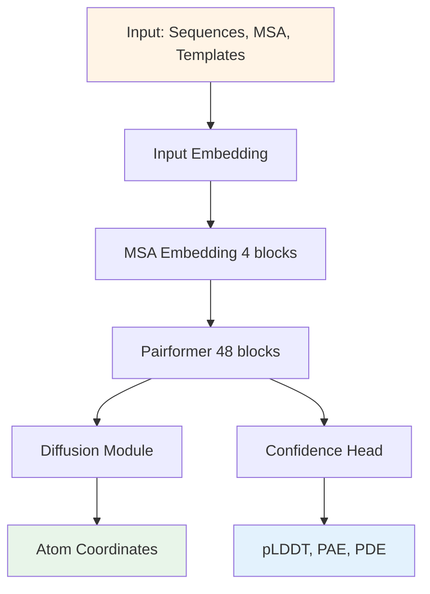

## Hook

AlphaFold 2가 단백질 구조 예측의 혁명을 일으킨 지 3년. 이제 단백질만으로는 부족하다. 약물 개발을 위해서는 단백질과 리간드가 어떻게 결합하는지 알아야 하고, 유전자 조절을 이해하려면 단백질과 DNA의 상호작용이 필요하며, 항체 치료제 설계에는 항체-항원 복합체의 구조가 핵심이다. 기존에는 각 상호작용 유형마다 특화된 도구가 따로 필요했다.

AlphaFold 3는 이 모든 것을 하나의 모델로 해결한다. 단백질, 핵산, 작은 분자, 이온, 수정된 잔기를 포함하는 복합체의 구조를 단일 딥러닝 프레임워크에서 예측하며, 각 분야의 특화 도구들보다 훨씬 높은 정확도를 달성한다. 이 글은 AlphaFold 시리즈의 세 번째 글로, AF2의 IPA 기반 구조 모듈에서 diffusion 기반 아키텍처로의 전환, 그리고 단백질 전용 모델에서 전체 생체분자 공간을 다루는 일반화된 모델로의 진화를 다룬다.

## Problem

AlphaFold 2가 단백질 구조 예측 문제를 거의 해결한 것처럼 보였지만, 실제 생물학적 과정은 단백질 단독으로 일어나지 않는다. 세포 내에서는 단백질-DNA, 단백질-RNA, 단백질-리간드, 항체-항원 등 다양한 생체분자 간 상호작용이 일어난다.

기존 접근법들은 각 상호작용 유형마다 특화된 도구를 개발해왔다. 단백질-리간드 docking을 위한 AutoDock Vina, 단백질-RNA 예측을 위한 RoseTTAFold2NA, 항체 구조 예측을 위한 특화 모델 등. 그러나 이런 분절된 접근법은 몇 가지 근본적인 한계가 있다.

첫째, **일반화 능력의 부족**이다. 각 도구는 특정 상호작용 유형에만 작동하며, 여러 유형의 분자가 동시에 존재하는 복잡한 복합체를 다룰 수 없다. 둘째, **정확도의 한계**다. 특히 단백질-리간드 docking 같은 경우 물리 기반 방법들이 여전히 사용되지만, 정확도가 충분하지 않아 실제 약물 개발에 제한적이다. 셋째, **데이터 효율성 문제**다. 각 특화 모델은 해당 분야의 데이터만 사용하므로, 다른 생체분자 상호작용에서 얻은 구조적 지식을 활용하지 못한다.

AlphaFold 2를 단순히 확장해서 이 문제들을 해결할 수 있을까? AF2의 구조 모듈은 아미노산 특화된 프레임(backbone frame)과 side-chain torsion angle 표현을 사용한다. 이는 단백질에는 잘 작동하지만, 임의의 화학 구조를 가진 리간드나 핵산의 다양한 형태에는 적용하기 어렵다. 또한 AF2는 stereochemical violation을 막기 위해 복잡하게 조정된 penalty를 사용하는데, 이는 일반적인 분자 그래프로 확장하기 어렵다.

## Key Idea

AlphaFold 3의 핵심 아이디어는 **diffusion 기반 생성 모델을 사용해 원자 좌표를 직접 예측**하는 것이다. AF2의 IPA (Invariant Point Attention) 기반 structure module을 버리고, 대신 노이즈가 추가된 원자 좌표를 받아 실제 좌표를 예측하도록 학습하는 diffusion module을 도입했다.

이 변화는 단순한 아키텍처 교체가 아니라 철학적 전환이다. AF2는 "단백질의 구조적 제약을 명시적으로 인코딩"하는 접근이었다면, AF3는 "모델이 데이터로부터 모든 생체분자의 기하학적 제약을 학습"하도록 한다. Diffusion 모델은 다양한 noise level에서 구조를 학습하는데, 낮은 노이즈에서는 local stereochemistry를, 높은 노이즈에서는 large-scale 구조를 학습한다. 이는 stereochemical violation penalty나 torsion angle 표현 없이도 화학적으로 타당한 구조를 생성할 수 있게 한다.

두 번째 핵심은 **MSA 처리의 간소화**다. AF2의 evoformer는 MSA를 집중적으로 처리했지만, AF3는 이를 pairformer로 교체하여 MSA 처리를 최소화하고 pair representation에 집중한다. 이는 단백질 간 진화 정보는 풍부하지만, 단백질-리간드나 단백질-RNA 간에는 cross-entity evolutionary information이 거의 없는 현실을 반영한다. 

세 번째는 **cross-distillation**을 통한 hallucination 방지다. 생성 모델은 unstructured region에서도 그럴듯한 구조를 만들어내는 경향(hallucination)이 있다. AF3는 AlphaFold-Multimer v.2.3로 예측한 구조를 training data에 추가하여, unstructured region을 긴 extended loop으로 표현하도록 학습한다.

> 핵심은 "범용성을 위한 단순화"다. 단백질 특화 제약을 제거하고, diffusion을 통해 모든 생체분자의 기하학을 동등하게 다룬다.
{: .prompt-tip }

## How it works

### 4.1 Overview

AlphaFold 3의 전체 아키텍처는 크게 세 단계로 구성된다: (1) **Input embedding** — 서열, MSA, template 정보를 embedding, (2) **Pairformer trunk** — pair와 single representation을 진화시킴, (3) **Diffusion module** — 원자 좌표를 생성.



AF2와 비교했을 때 가장 큰 변화는:
- **Evoformer (48 blocks) → MSA embedding (4 blocks) + Pairformer (48 blocks)**: MSA 처리를 대폭 축소
- **Structure module (IPA-based) → Diffusion module**: 아미노산 frame 대신 원자 좌표 직접 예측
- **Deterministic prediction → Generative sampling**: 단일 예측이 아닌 분포로부터 샘플링

<details>
<summary>📝 Overall Architecture Pseudocode (클릭하여 펼치기)</summary>

```python
class AlphaFold3(nn.Module):
    """AlphaFold 3 overall architecture"""
    def __init__(self, config):
        super().__init__()
        # Input processing
        self.input_embedder = InputEmbedder(config)
        
        # MSA processing (reduced from AF2)
        self.msa_module = MSAModule(
            n_blocks=4,  # AF2 had 48 evoformer blocks
            pair_dim=128,
            msa_dim=64
        )
        
        # Pairformer trunk (replaces evoformer)
        self.pairformer = Pairformer(
            n_blocks=48,
            pair_dim=128,
            single_dim=384
        )
        
        # Diffusion-based structure module
        self.diffusion_module = DiffusionModule(
            pair_dim=128,
            single_dim=384,
            atom_encoder_depth=3,
            token_transformer_depth=24,
            atom_decoder_depth=3
        )
        
        # Confidence prediction
        self.confidence_head = ConfidenceHead(
            pair_dim=128,
            predict_plddt=True,
            predict_pae=True,
            predict_pde=True
        )
    
    def forward(self, batch, num_diffusion_steps=200):
        """
        Args:
            batch: dict containing sequences, MSA, templates, etc.
            num_diffusion_steps: number of denoising steps
        Returns:
            atom_positions: (n_atoms, 3) final coordinates
            confidences: dict of pLDDT, PAE, PDE
        """
        # Step 1: Input embedding
        # Creates initial pair (n, n, 128) and single (n, 384) representations
        # n = number of tokens (residues + atoms)
        input_feats = self.input_embedder(batch)
        pair_repr = input_feats['pair']  # (n, n, 128)
        single_repr = input_feats['single']  # (n, 384)
        msa_repr = input_feats['msa']  # (n_seq, n, 64)
        
        # Step 2: MSA processing (lightweight)
        # Updates pair representation using MSA
        pair_repr = self.msa_module(
            msa_repr=msa_repr,
            pair_repr=pair_repr
        )
        # MSA is discarded after this point (unlike AF2)
        
        # Step 3: Pairformer trunk
        # Iteratively refines pair and single representations
        for block in self.pairformer.blocks:
            pair_repr, single_repr = block(pair_repr, single_repr)
        
        # Step 4: Diffusion-based structure generation
        # Start from random noise
        atom_pos_noised = torch.randn(n_atoms, 3)
        
        # Iterative denoising
        for t in reversed(range(num_diffusion_steps)):
            atom_pos_noised = self.diffusion_module.denoise_step(
                atom_pos_noised,
                t,
                pair_repr,
                single_repr,
                input_feats
            )
        
        atom_positions = atom_pos_noised  # Final denoised coordinates
        
        # Step 5: Confidence prediction
        # Uses pair representation to predict accuracy metrics
        confidences = self.confidence_head(pair_repr, atom_positions)
        
        return atom_positions, confidences
```

</details>

### 4.2 Representation

**Token representation**: AF3는 polymer residue와 atom을 **token**으로 표현한다. 단백질/핵산의 경우 각 residue가 하나의 token, 리간드의 경우 각 heavy atom이 하나의 token이다. 이렇게 하면 최대 5,120 tokens까지 처리 가능하며, 이는 수천 개의 residue를 가진 복합체도 다룰 수 있다.

**Input features** (Supplementary Table 5):
- **Single representation** (n, 384): 각 token의 특성 (residue type, atom type, charge 등)
- **Pair representation** (n, n, 128): token 간 관계 (distance, bond type, template 정보 등)
- **MSA representation** (n_seq, n, 64): 진화 정보 (단백질만 해당)

Template 구조가 있는 경우, template의 원자 간 거리와 단위 벡터가 pair representation에 인코딩된다. 리간드의 경우 SMILES 문자열로부터 RDKit을 사용해 3D conformer를 생성하고, 이를 "reference position" feature로 사용한다 (단, training set cutoff 이후 데이터는 제외).


_Figure 2: AF3의 핵심 모듈들. (a) Pairformer module, (b) Diffusion module, (c) Training setup, (d) Training curves_

### 4.3 Core Architecture

#### Pairformer Module

Pairformer는 AF2의 evoformer를 대체하며, **MSA representation을 유지하지 않고** pair와 single representation만 처리한다. 각 block은 다음으로 구성된다:

1. **Triangle multiplicative update** (pair → pair): 삼각 관계를 통해 pair representation 업데이트
2. **Triangle self-attention** (pair → pair): pair의 각 edge에 대해 attention
3. **Pair-to-single transition**: pair 정보를 single로 집계
4. **Single self-attention with pair bias**: single에 대한 attention (pair가 bias로 작용)
5. **Single-to-pair transition**: 업데이트된 single 정보를 다시 pair로 전파

<details>
<summary>📝 Pairformer Block Implementation (클릭하여 펼치기)</summary>

```python
class PairformerBlock(nn.Module):
    """
    Single pairformer block that updates pair and single representations
    without maintaining MSA (unlike AF2 evoformer)
    """
    def __init__(self, pair_dim=128, single_dim=384, n_heads=8):
        super().__init__()
        self.pair_dim = pair_dim
        self.single_dim = single_dim
        
        # Pair representation updates
        self.triangle_mult_outgoing = TriangleMultiplication(
            dim=pair_dim, mode='outgoing'
        )
        self.triangle_mult_incoming = TriangleMultiplication(
            dim=pair_dim, mode='incoming'
        )
        self.triangle_attn_start = TriangleAttention(
            dim=pair_dim, orientation='per_row'
        )
        self.triangle_attn_end = TriangleAttention(
            dim=pair_dim, orientation='per_column'
        )
        
        # Pair to single
        self.pair_to_single = nn.Linear(pair_dim, single_dim)
        
        # Single representation update
        self.single_self_attn = SingleSelfAttention(
            dim=single_dim,
            pair_dim=pair_dim,
            n_heads=n_heads
        )
        
        # Single to pair
        self.single_to_pair = nn.Linear(single_dim * 2, pair_dim)
        
    def forward(self, pair_repr, single_repr):
        """
        Args:
            pair_repr: (n, n, pair_dim) pairwise representation
            single_repr: (n, single_dim) per-token representation
        Returns:
            updated pair_repr, single_repr
        """
        n = pair_repr.shape[0]
        
        # --- Pair updates (triangle operations) ---
        # These enforce consistency: if i-j and j-k are close,
        # then i-k should also be considered
        pair_update1 = self.triangle_mult_outgoing(pair_repr)
        pair_update2 = self.triangle_mult_incoming(pair_repr)
        pair_update3 = self.triangle_attn_start(pair_repr)
        pair_update4 = self.triangle_attn_end(pair_repr)
        pair_repr = pair_repr + pair_update1 + pair_update2 + pair_update3 + pair_update4
        
        # --- Pair to single ---
        # Aggregate pairwise information for each token
        # Average over all partners: mean over axis 1
        pair_aggregated = pair_repr.mean(dim=1)  # (n, pair_dim)
        single_update1 = self.pair_to_single(pair_aggregated)
        single_repr = single_repr + single_update1
        
        # --- Single update with pair bias ---
        # Self-attention over tokens, but attention logits are biased
        # by pairwise representation
        single_update2 = self.single_self_attn(single_repr, pair_bias=pair_repr)
        single_repr = single_repr + single_update2
        
        # --- Single to pair ---
        # Outer sum: combine single_i and single_j for each pair (i,j)
        single_i = single_repr.unsqueeze(1).expand(n, n, -1)  # (n, n, single_dim)
        single_j = single_repr.unsqueeze(0).expand(n, n, -1)  # (n, n, single_dim)
        single_outer = torch.cat([single_i, single_j], dim=-1)  # (n, n, 2*single_dim)
        pair_update = self.single_to_pair(single_outer)
        pair_repr = pair_repr + pair_update
        
        return pair_repr, single_repr


class TriangleMultiplication(nn.Module):
    """
    Triangle multiplicative update from AF2
    Enforces geometric consistency: d(i,k) ~ d(i,j) + d(j,k)
    """
    def __init__(self, dim, mode='outgoing'):
        super().__init__()
        self.mode = mode
        self.layer_norm = nn.LayerNorm(dim)
        self.left_proj = nn.Linear(dim, dim)
        self.right_proj = nn.Linear(dim, dim)
        self.gate = nn.Linear(dim, dim)
        self.out_proj = nn.Linear(dim, dim)
        
    def forward(self, pair_repr):
        """
        Args:
            pair_repr: (n, n, dim)
        Returns:
            update: (n, n, dim)
        """
        pair_repr = self.layer_norm(pair_repr)
        
        left = self.left_proj(pair_repr)  # (n, n, dim)
        right = self.right_proj(pair_repr)  # (n, n, dim)
        gate = torch.sigmoid(self.gate(pair_repr))
        
        # Triangle equation: sum over intermediate node j
        if self.mode == 'outgoing':
            # out[i,k] = sum_j left[i,j] * right[j,k]
            update = torch.einsum('ijd,jkd->ikd', left, right)
        else:  # incoming
            # out[i,k] = sum_j left[j,i] * right[k,j]
            update = torch.einsum('jid,kjd->ikd', left, right)
        
        update = self.out_proj(update)
        return gate * update


class SingleSelfAttention(nn.Module):
    """Self-attention on single representation with pair bias"""
    def __init__(self, dim, pair_dim, n_heads=8):
        super().__init__()
        self.n_heads = n_heads
        self.head_dim = dim // n_heads
        
        self.q_proj = nn.Linear(dim, dim)
        self.k_proj = nn.Linear(dim, dim)
        self.v_proj = nn.Linear(dim, dim)
        self.pair_bias_proj = nn.Linear(pair_dim, n_heads)
        self.out_proj = nn.Linear(dim, dim)
        
    def forward(self, single_repr, pair_bias):
        """
        Args:
            single_repr: (n, dim)
            pair_bias: (n, n, pair_dim)
        Returns:
            output: (n, dim)
        """
        n = single_repr.shape[0]
        
        # Q, K, V projections
        Q = self.q_proj(single_repr).view(n, self.n_heads, self.head_dim)
        K = self.k_proj(single_repr).view(n, self.n_heads, self.head_dim)
        V = self.v_proj(single_repr).view(n, self.n_heads, self.head_dim)
        
        # Attention logits: Q @ K^T
        attn_logits = torch.einsum('ihd,jhd->hij', Q, K) / math.sqrt(self.head_dim)
        
        # Add pair bias (n, n, pair_dim) -> (n, n, n_heads)
        bias = self.pair_bias_proj(pair_bias).permute(2, 0, 1)  # (n_heads, n, n)
        attn_logits = attn_logits + bias
        
        # Softmax and apply to V
        attn_weights = F.softmax(attn_logits, dim=1)  # (n_heads, n, n)
        output = torch.einsum('hij,jhd->ihd', attn_weights, V)
        output = output.reshape(n, -1)  # (n, dim)
        
        return self.out_proj(output)
```

</details>

#### Diffusion Module

Diffusion module은 AF3의 가장 혁신적인 부분이다. 노이즈가 추가된 원자 좌표를 입력받아 실제 좌표를 예측하도록 학습된다. 이는 **score-based generative model**의 일종으로, 다음 세 단계로 구성된다:

1. **Atom encoder**: 각 token에 속한 원자들의 noised 좌표를 인코딩
2. **Token transformer**: token-level에서 pair/single representation과 상호작용
3. **Atom decoder**: token representation을 다시 원자 좌표로 디코딩

**Training objective**:

$$
\mathcal{L}_{\text{diffusion}} = \mathbb{E}_{t, \epsilon, \mathbf{x}_0} \left[ \left\| \epsilon - \epsilon_\theta(\mathbf{x}_t, t, c) \right\|^2 \right]
$$

여기서 $\mathbf{x}_0$는 실제 원자 좌표, $\mathbf{x}_t = \sqrt{\bar{\alpha}_t} \mathbf{x}_0 + \sqrt{1 - \bar{\alpha}_t} \epsilon$는 noised 좌표, $\epsilon_\theta$는 예측 노이즈, $c$는 conditioning (pair, single representation).

논문은 standard diffusion process를 따르지만, 중요한 점은 **rotation/translation invariance를 명시적으로 강제하지 않는다**는 것이다. 대신 random rotation/translation augmentation을 학습 시 적용하여 암묵적으로 학습한다.

<details>
<summary>📝 Diffusion Module Implementation (클릭하여 펼치기)</summary>

```python
class DiffusionModule(nn.Module):
    """
    Diffusion-based structure module for AF3
    Predicts atom coordinates directly via iterative denoising
    """
    def __init__(
        self,
        pair_dim=128,
        single_dim=384,
        atom_encoder_depth=3,
        token_transformer_depth=24,
        atom_decoder_depth=3,
        atom_channels=128
    ):
        super().__init__()
        self.atom_encoder = AtomEncoder(
            depth=atom_encoder_depth,
            channels=atom_channels
        )
        self.token_transformer = TokenTransformer(
            depth=token_transformer_depth,
            single_dim=single_dim,
            pair_dim=pair_dim,
            atom_channels=atom_channels
        )
        self.atom_decoder = AtomDecoder(
            depth=atom_decoder_depth,
            channels=atom_channels
        )
        
        # Noise schedule (similar to DDPM)
        self.register_buffer('betas', self._cosine_beta_schedule(1000))
        self.register_buffer('alphas', 1.0 - self.betas)
        self.register_buffer('alphas_cumprod', torch.cumprod(self.alphas, dim=0))
        
    def _cosine_beta_schedule(self, timesteps, s=0.008):
        """Cosine schedule as in Improved DDPM"""
        steps = timesteps + 1
        x = torch.linspace(0, timesteps, steps)
        alphas_cumprod = torch.cos(((x / timesteps) + s) / (1 + s) * math.pi * 0.5) ** 2
        alphas_cumprod = alphas_cumprod / alphas_cumprod[0]
        betas = 1 - (alphas_cumprod[1:] / alphas_cumprod[:-1])
        return torch.clip(betas, 0.0001, 0.9999)
    
    def forward_diffusion(self, x_0, t, noise=None):
        """
        Add noise to ground truth coordinates (training)
        Args:
            x_0: (n_atoms, 3) ground truth coordinates
            t: (batch,) timestep
            noise: (n_atoms, 3) optional noise (sampled if None)
        Returns:
            x_t: noised coordinates
            noise: the noise that was added
        """
        if noise is None:
            noise = torch.randn_like(x_0)
        
        sqrt_alpha_cumprod = torch.sqrt(self.alphas_cumprod[t])
        sqrt_one_minus_alpha_cumprod = torch.sqrt(1.0 - self.alphas_cumprod[t])
        
        # x_t = sqrt(ᾱ_t) * x_0 + sqrt(1 - ᾱ_t) * ε
        x_t = sqrt_alpha_cumprod * x_0 + sqrt_one_minus_alpha_cumprod * noise
        return x_t, noise
    
    def denoise_step(self, x_t, t, pair_repr, single_repr, input_feats):
        """
        Single denoising step (inference)
        Args:
            x_t: (n_atoms, 3) noised coordinates at timestep t
            t: current timestep
            pair_repr: (n_tokens, n_tokens, pair_dim)
            single_repr: (n_tokens, single_dim)
            input_feats: additional input features
        Returns:
            x_{t-1}: denoised coordinates
        """
        # Predict noise ε_θ(x_t, t, c)
        pred_noise = self.predict_noise(
            x_t, t, pair_repr, single_repr, input_feats
        )
        
        # DDPM reverse process
        alpha = self.alphas[t]
        alpha_cumprod = self.alphas_cumprod[t]
        alpha_cumprod_prev = self.alphas_cumprod[t-1] if t > 0 else torch.tensor(1.0)
        
        # Predicted x_0
        pred_x0 = (x_t - torch.sqrt(1 - alpha_cumprod) * pred_noise) / torch.sqrt(alpha_cumprod)
        
        # Direction pointing to x_t
        dir_xt = torch.sqrt(1 - alpha_cumprod_prev) * pred_noise
        
        # Compute x_{t-1}
        x_prev = torch.sqrt(alpha_cumprod_prev) * pred_x0 + dir_xt
        
        if t > 0:
            noise = torch.randn_like(x_t)
            sigma = torch.sqrt((1 - alpha_cumprod_prev) / (1 - alpha_cumprod) * (1 - alpha))
            x_prev = x_prev + sigma * noise
        
        return x_prev
    
    def predict_noise(self, x_t, t, pair_repr, single_repr, input_feats):
        """
        Predict noise ε_θ given noised coordinates and conditioning
        Args:
            x_t: (n_atoms, 3) noised atom coordinates
            t: timestep
            pair_repr: (n_tokens, n_tokens, pair_dim) conditioning
            single_repr: (n_tokens, single_dim) conditioning
            input_feats: dict with token_to_atom mapping
        Returns:
            pred_noise: (n_atoms, 3) predicted noise
        """
        # Embed timestep
        t_emb = self.timestep_embedding(t)  # (emb_dim,)
        
        # Step 1: Atom encoder
        # Encode per-atom positions into per-token representation
        # Each token may have multiple atoms (e.g., residue with side chain)
        atom_feats = self.atom_encoder(
            x_t, 
            input_feats['atom_to_token'],  # maps each atom to its token
            t_emb
        )  # (n_tokens, atom_channels)
        
        # Step 2: Token transformer
        # Update token representation using pair/single context
        token_repr = self.token_transformer(
            atom_feats,
            pair_repr,
            single_repr,
            t_emb
        )  # (n_tokens, atom_channels)
        
        # Step 3: Atom decoder
        # Decode token representation back to per-atom noise predictions
        pred_noise = self.atom_decoder(
            token_repr,
            input_feats['token_to_atom'],  # maps each token to its atoms
            t_emb
        )  # (n_atoms, 3)
        
        return pred_noise
    
    @staticmethod
    def timestep_embedding(timesteps, dim=128):
        """Sinusoidal timestep embedding"""
        half_dim = dim // 2
        emb = math.log(10000) / (half_dim - 1)
        emb = torch.exp(torch.arange(half_dim) * -emb)
        emb = timesteps[:, None] * emb[None, :]
        emb = torch.cat([torch.sin(emb), torch.cos(emb)], dim=-1)
        return emb


class AtomEncoder(nn.Module):
    """Encode noised atom positions into token-level features"""
    def __init__(self, depth=3, channels=128):
        super().__init__()
        self.layers = nn.ModuleList([
            nn.Sequential(
                nn.Linear(3 + channels, channels),
                nn.ReLU(),
                nn.Linear(channels, channels)
            ) for _ in range(depth)
        ])
        
    def forward(self, atom_pos, atom_to_token, t_emb):
        """
        Args:
            atom_pos: (n_atoms, 3) noised positions
            atom_to_token: (n_atoms,) token index for each atom
            t_emb: (emb_dim,) timestep embedding
        Returns:
            token_feats: (n_tokens, channels)
        """
        n_tokens = atom_to_token.max() + 1
        
        # Initial atom features: concatenate position + timestep embedding
        atom_feats = torch.cat([atom_pos, t_emb.expand(len(atom_pos), -1)], dim=-1)
        
        # Process through layers
        for layer in self.layers:
            atom_feats = layer(atom_feats)
        
        # Aggregate atoms to tokens (mean pooling)
        token_feats = torch.zeros(n_tokens, atom_feats.shape[-1])
        for i, tok_idx in enumerate(atom_to_token):
            token_feats[tok_idx] += atom_feats[i]
        
        # Normalize by number of atoms per token
        token_counts = torch.bincount(atom_to_token, minlength=n_tokens)
        token_feats = token_feats / token_counts.unsqueeze(-1).clamp(min=1)
        
        return token_feats


class AtomDecoder(nn.Module):
    """Decode token features to per-atom noise predictions"""
    def __init__(self, depth=3, channels=128):
        super().__init__()
        self.layers = nn.ModuleList([
            nn.Sequential(
                nn.Linear(channels, channels),
                nn.ReLU()
            ) for _ in range(depth)
        ])
        self.final = nn.Linear(channels, 3)  # Output: 3D displacement
        
    def forward(self, token_feats, token_to_atom, t_emb):
        """
        Args:
            token_feats: (n_tokens, channels)
            token_to_atom: list of lists, token_to_atom[i] = atom indices for token i
            t_emb: (emb_dim,) timestep embedding
        Returns:
            atom_noise: (n_atoms, 3)
        """
        # Broadcast token features to atoms
        atom_feats = token_feats[token_to_atom]  # (n_atoms, channels)
        
        # Process through layers
        for layer in self.layers:
            atom_feats = layer(atom_feats)
        
        # Final projection to 3D coordinates
        atom_noise = self.final(atom_feats)  # (n_atoms, 3)
        
        return atom_noise
```

</details>

### 4.4 Key Innovation

AF3의 차별화 포인트는 세 가지다:

**1. Direct coordinate prediction without equivariance**: AF2는 SE(3)-equivariant IPA를 사용했지만, AF3는 rotation/translation invariance를 명시적으로 강제하지 않는다. 대신 학습 시 random augmentation을 적용해 암묵적으로 학습한다. 이는 아키텍처를 크게 단순화하면서도 성능 저하가 없다는 것을 보여준다.

**2. Multiscale learning through diffusion**: Diffusion 과정은 자연스럽게 multiscale learning을 유도한다. 높은 노이즈 레벨에서는 전체적인 fold를 학습하고, 낮은 노이즈 레벨에서는 side-chain packing과 stereochemistry를 학습한다. 이는 stereochemical violation loss 없이도 화학적으로 타당한 구조를 생성할 수 있게 한다.

**3. Cross-distillation for disorder prediction**: 생성 모델의 hallucination 문제를 해결하기 위해, AlphaFold-Multimer v.2.3의 예측을 training data에 포함한다. AF-M은 disordered region을 extended loop으로 표현하므로, AF3도 이를 학습하여 hallucination을 줄인다.

### 4.5 Training & Inference

**Training loss**는 여러 요소로 구성된다:

$$
\mathcal{L}_{\text{total}} = \mathcal{L}_{\text{diffusion}} + \lambda_{\text{conf}} \mathcal{L}_{\text{confidence}} + \lambda_{\text{dist}} \mathcal{L}_{\text{distogram}}
$$

- $\mathcal{L}_{\text{diffusion}}$: 위에서 설명한 denoising loss
- $\mathcal{L}_{\text{confidence}}$: pLDDT, PAE, PDE 예측 loss
- $\mathcal{L}_{\text{distogram}}$: auxiliary distogram prediction (AF2와 동일)

**Confidence prediction**은 diffusion 학습과 별도로 진행된다. Diffusion 학습 중에는 single step만 학습하므로, full structure를 생성할 수 없다. 이를 해결하기 위해 **mini-rollout** 방식을 사용한다: 학습 중 일부 step에서 larger step size로 전체 구조를 생성하고, 이를 ground truth와 비교하여 confidence head를 학습한다.

<details>
<summary>📝 Training Loop Pseudocode (클릭하여 펼치기)</summary>

```python
def train_alphafold3(model, dataloader, optimizer, config):
    """
    Training loop for AlphaFold 3
    """
    model.train()
    
    for epoch in range(config.num_epochs):
        for batch in dataloader:
            # batch contains:
            # - sequences, MSA, templates
            # - ground_truth_coords: (n_atoms, 3)
            # - metadata (chain boundaries, atom types, etc.)
            
            optimizer.zero_grad()
            
            # --- Forward pass through trunk ---
            # Input embedding + MSA module + Pairformer
            input_feats = model.input_embedder(batch)
            pair_repr = input_feats['pair']  # (n, n, 128)
            single_repr = input_feats['single']  # (n, 384)
            msa_repr = input_feats['msa']  # (n_seq, n, 64)
            
            # Update pair using MSA
            updated_pair = model.msa_module(msa_repr, pair_repr)
            # Refine with pairformer
            final_pair, final_single = model.pairformer(updated_pair, single_repr)
            
            # --- Diffusion training ---
            # Sample random timestep for each example in batch
            B = len(batch['ground_truth_coords'])
            t = torch.randint(0, config.diffusion_steps, (B,))
            
            # Add noise to ground truth
            x_0 = batch['ground_truth_coords']  # (n_atoms, 3)
            noise = torch.randn_like(x_0)
            x_t, noise = model.diffusion_module.forward_diffusion(x_0, t, noise)
            
            # Predict noise
            pred_noise = model.diffusion_module.predict_noise(
                x_t, t, pair_repr, single_repr, input_feats
            )
            
            # Diffusion loss (MSE on predicted noise)
            loss_diffusion = F.mse_loss(pred_noise, noise)
            
            # --- Mini-rollout for confidence training ---
            # Perform full denoising with larger step size
            # (only for some batches to save compute)
            if random.random() < config.confidence_training_freq:
                with torch.no_grad():
                    # Start from high noise
                    x_rollout = torch.randn_like(x_0)
                    rollout_steps = config.diffusion_steps // 10  # Larger steps
                    
                    for step in range(rollout_steps):
                        t_rollout = torch.full((B,), step * 10)
                        x_rollout = model.diffusion_module.denoise_step(
                            x_rollout, t_rollout, final_pair, final_single, input_feats
                        )
                
                # Predict confidence metrics from final pair
                conf_metrics = model.confidence_head(final_pair, x_rollout)
                
                # Compute ground truth metrics
                with torch.no_grad():
                    # Align prediction to ground truth (handle symmetry)
                    x_aligned = align_structures(x_rollout, x_0, batch['symmetries'])
                    
                    # Compute per-atom LDDT
                    true_plddt = compute_lddt(x_aligned, x_0, inclusion_radius=15.0)
                    
                    # Compute PAE (predicted aligned error)
                    true_pae = compute_pae(x_aligned, x_0)
                    
                    # Compute PDE (distance error)
                    true_pde = compute_pde(x_aligned, x_0)
                
                # Confidence losses (regression)
                loss_plddt = F.mse_loss(conf_metrics['plddt'], true_plddt)
                loss_pae = F.mse_loss(conf_metrics['pae'], true_pae)
                loss_pde = F.mse_loss(conf_metrics['pde'], true_pde)
                
                loss_confidence = loss_plddt + loss_pae + loss_pde
            else:
                loss_confidence = 0.0
            
            # --- Auxiliary distogram loss (from AF2) ---
            # Predict binned distance distribution from final pair
            pred_distogram = model.distogram_head(final_pair)
            true_distances = torch.cdist(x_0, x_0)  # (n_atoms, n_atoms)
            true_distogram = bin_distances(true_distances, num_bins=64, max_dist=22.0)
            loss_distogram = F.cross_entropy(
                pred_distogram.reshape(-1, 64),
                true_distogram.reshape(-1)
            )
            
            # --- Total loss ---
            loss = (
                config.lambda_diffusion * loss_diffusion +
                config.lambda_confidence * loss_confidence +
                config.lambda_distogram * loss_distogram
            )
            
            loss.backward()
            
            # Gradient clipping (important for stability)
            torch.nn.utils.clip_grad_norm_(model.parameters(), max_norm=1.0)
            
            optimizer.step()
            
        print(f"Epoch {epoch}, Loss: {loss.item():.4f}")


def inference_alphafold3(model, input_data, num_seeds=5, num_samples=5):
    """
    Inference with multiple seeds and diffusion samples
    
    Args:
        model: trained AlphaFold 3 model
        input_data: sequences, MSA, templates, etc.
        num_seeds: number of model seeds (different random init)
        num_samples: number of diffusion samples per seed
    
    Returns:
        best_structure: highest confidence structure
        all_structures: list of all generated structures with confidences
    """
    model.eval()
    all_structures = []
    
    with torch.no_grad():
        # Process input
        input_feats = model.input_embedder(input_data)
        pair_repr = input_feats['pair']
        single_repr = input_feats['single']
        msa_repr = input_feats['msa']
        
        pair_repr = model.msa_module(msa_repr, pair_repr)
        pair_repr, single_repr = model.pairformer(pair_repr, single_repr)
        
        # Generate multiple samples
        for seed in range(num_seeds):
            torch.manual_seed(seed)
            
            for sample in range(num_samples):
                # Start from random noise
                n_atoms = input_feats['num_atoms']
                x_t = torch.randn(n_atoms, 3)
                
                # Iterative denoising (typically 200 steps)
                for t in reversed(range(200)):
                    x_t = model.diffusion_module.denoise_step(
                        x_t, t, pair_repr, single_repr, input_feats
                    )
                
                # Final structure
                final_coords = x_t
                
                # Predict confidence
                confidences = model.confidence_head(pair_repr, final_coords)
                
                all_structures.append({
                    'coords': final_coords,
                    'plddt': confidences['plddt'],
                    'pae': confidences['pae'],
                    'ipTM': compute_iptm(confidences['pae'], input_feats)
                })
        
        # Rank by confidence (ipTM for interfaces, pLDDT for monomers)
        all_structures.sort(
            key=lambda x: x['ipTM'] if input_feats['has_interface'] else x['plddt'].mean(),
            reverse=True
        )
        
        best_structure = all_structures[0]
    
    return best_structure, all_structures
```

</details>

**Three-stage training**:
1. **Initial training** (384 tokens): 학습 초반, 작은 복합체에서 빠르게 수렴
2. **Fine-tuning 1** (640 tokens): crop size 증가, protein-protein interface 성능 향상
3. **Fine-tuning 2** (768 tokens): 최종 fine-tuning, 큰 복합체 성능 개선

초기 학습에서는 local structure (intrachain LDDT)가 빠르게 수렴하지만 (20,000 steps에서 97% 최대치), global structure (protein-protein interface)는 훨씬 느리게 학습된다 (60,000 steps). 이는 MSA가 제공하는 진화 정보가 intrachain structure에는 강력하지만, interchain에는 약하기 때문이다.

**Inference**: 기본적으로 5개의 model seed × 5개의 diffusion sample = 25개 구조를 생성하고, confidence metric으로 top-1을 선택한다. 항체-항원 복합체는 특히 어려워서, 1,000개의 seed를 사용해야 최고 성능을 달성한다.

## Results

AlphaFold 3의 성능을 세 가지 주요 벤치마크에서 평가했다: PoseBusters (protein-ligand), recent PDB set (protein-nucleic, modifications, protein-protein), CASP15 RNA.


_Figure 1: AF3의 다양한 생체분자 복합체에 대한 성능. (c) PoseBusters, recent PDB, CASP15 RNA에서의 정확도 비교_

**Protein-ligand binding (PoseBusters)**: PoseBusters는 428개의 최신 protein-ligand 구조로 구성되며, pocket-aligned ligand RMSD < 2Å를 성공으로 정의한다. AF3는 **76.3%**의 성공률을 달성하여, 전통적 docking tool인 AutoDock Vina (45.2%)와 deep learning 기반 RoseTTAFold All-Atom (56.1%)을 크게 앞선다 (Fisher's exact test, P < 10⁻¹⁰).

중요한 점은 AF3가 **blind docking**이라는 것이다. Vina나 Gold 같은 전통적 도구는 실험적으로 결정된 protein structure를 입력으로 받지만, AF3는 오직 서열과 SMILES만 사용한다. 실제 사용 시나리오에서는 AF3가 훨씬 유용하다.

| Method | Input | Success (%) | P-value |
|--------|-------|-------------|---------|
| **AF3** | Sequence + SMILES | **76.3** | - |
| RF All-Atom | Sequence + SMILES | 56.1 | 4.45×10⁻²⁵ |
| Vina | Structure + SMILES | 45.2 | 2.27×10⁻¹³ |
| Gold | Structure + SMILES | 51.3 | 8.31×10⁻¹⁸ |

**Protein-nucleic acid interactions**: Recent PDB set에서 protein-RNA와 protein-DNA 복합체를 평가했다 (<1000 residues). AF3는 interface LDDT **79.4%**를 달성하여 RoseTTAFold2NA (72.1%)보다 높다 (P = 2.78×10⁻³). CASP15 RNA targets에서도 평균 LDDT **72.8%**로 AIchemy_RNA (68.5%)을 앞섰지만, 인간 전문가가 개입한 AIchemy_RNA2 (77.3%)보다는 낮다.

**Covalent modifications**: Glycosylation, bonded ligands, modified residues의 pocket RMSD < 2Å 성공률은 각각 **46.1%** (n=167), **58.7%** (n=89), **74.3%** (n=156)이다. 이는 baseline이 없어 절대 평가는 어렵지만, AlphaFold-Multimer v.2.3이 이런 modification을 전혀 다루지 못하는 것과 비교하면 큰 진전이다.

**Protein-protein and antibody-antigen**: Protein-protein interface에서 DockQ > 0.23 성공률은 **78.9%**로 AlphaFold-Multimer v.2.3 (73.4%)보다 유의미하게 높다 (P = 1.8×10⁻¹⁸). 특히 항체-항원 복합체는 **69.2%** (1,000 seeds 사용)로 AF-M v.2.3 (56.9%)보다 크게 개선되었다 (P = 6.5×10⁻⁵).

> Protein monomer LDDT도 평균 **87.3%**로 AF-M v.2.3 (85.1%)보다 향상되었다 (P = 1.7×10⁻³⁴). AF3는 범용성을 얻으면서도 단백질 구조 예측 정확도를 유지했다.
{: .prompt-tip }

**Confidence calibration**: AF3의 confidence metrics (pLDDT, ipTM, PAE)는 실제 정확도와 잘 correlation된다. ipTM > 0.8인 protein-protein interface는 평균 DockQ 0.75, ipTM < 0.4는 DockQ 0.15로 뚜렷하게 구분된다. pLDDT > 90인 ligand는 90% 이상이 RMSD < 2Å를 달성한다.


_Figure 4: AF3 confidence metrics (ipTM, pLDDT)는 실제 accuracy (DockQ, LDDT)와 높은 상관관계를 보인다._

## Discussion

AlphaFold 3는 생체분자 구조 예측을 단일 프레임워크로 통합했다는 점에서 중요한 진전이다. 논문은 몇 가지 핵심 발견을 강조한다.

**첫째, cross-entity evolutionary information이 없어도 높은 정확도를 달성할 수 있다.** 단백질-단백질 상호작용은 MSA에서 co-evolution signal을 찾을 수 있지만, 단백질-리간드나 단백질-RNA에는 그런 signal이 없다. 그럼에도 AF3가 모든 interaction type에서 좋은 성능을 보인다는 것은, 모델이 chemistry와 physics를 직접 학습했다는 의미다.

**둘째, 항체-항원 예측 결과는 MSA-free prediction의 가능성을 시사한다.** 항체는 highly variable하여 MSA depth가 낮은데도, AF3가 AlphaFold-Multimer보다 훨씬 좋은 결과를 낸다. 이는 모델이 단순히 homology를 찾는 것이 아니라, 물리적 상호작용 원리를 학습했음을 보여준다.

**셋째, 단백질 구조 예측과 ligand docking의 인위적 분리가 더 이상 필요 없다.** 전통적으로 단백질 구조는 AlphaFold로, 리간드 docking은 AutoDock으로 따로 진행했다. AF3는 이를 end-to-end로 통합하여, 더 높은 정확도와 간단한 워크플로우를 제공한다.

논문은 또한 **한계**를 명확히 밝힌다:

1. **Stereochemistry violations**: Chirality violation이 4.4%에서 발생하며, 드물게 전체 chain이 겹치는 clashing도 관찰된다 (특히 큰 protein-nucleic complex).

2. **Hallucination**: Disordered region에서 spurious structure를 생성할 수 있다. Cross-distillation으로 많이 줄었지만 완전히 제거되지는 않았다.

3. **Conformational diversity 부족**: Diffusion sampling으로 여러 구조를 생성하지만, 이것이 solution ensemble을 대표하지는 않는다. 예를 들어 cereblon은 apo state에서 open conformation을 가져야 하는데, AF3는 항상 closed conformation을 예측한다.

4. **Antibody prediction의 높은 computational cost**: 항체-항원을 정확히 예측하려면 1,000개의 seed가 필요하여, 다른 target에 비해 200배 많은 계산이 필요하다.

논문은 향후 방향으로 **cryo-EM과 tomography의 발전**을 언급한다. 실험 구조 결정 기술이 발전하면서 더 많은, 더 다양한 복합체 구조가 PDB에 추가될 것이고, 이는 AF3 같은 모델의 일반화 능력을 더욱 향상시킬 것이라고 전망한다.

> 저자들은 "structural modelling will continue to improve not only due to advances in deep learning but also because continuing methodological advances in experimental structure determination"이라고 강조하며, 실험과 계산의 선순환 발전을 기대한다.
{: .prompt-info }

## TL;DR

- AlphaFold 3는 diffusion 기반 아키텍처로 단백질, 핵산, 리간드, 이온 등 모든 생체분자 복합체의 구조를 단일 프레임워크에서 예측한다.
- AF2의 IPA structure module을 diffusion module로 교체하고, evoformer를 pairformer로 간소화하여 MSA 의존성을 줄였다.
- PoseBusters (protein-ligand)에서 76.3% 성공률로 AutoDock Vina (45.2%)와 RoseTTAFold All-Atom (56.1%)을 크게 앞서며, 항체-항원 예측도 AlphaFold-Multimer v.2.3 대비 12.3%p 향상되었다.

## Paper Info

| 항목 | 내용 |
|---|---|
| **Title** | Accurate structure prediction of biomolecular interactions with AlphaFold 3 |
| **Authors** | Josh Abramson et al. (Google DeepMind) |
| **Venue** | Nature (2024) |
| **Published** | 8 May 2024 |
| **Paper** | [Nature](https://www.nature.com/articles/s41586-024-07487-w) |
| **Code** | AlphaFold Server (inference only, weights not released) |

---

> 이 글은 LLM(Large Language Model)의 도움을 받아 작성되었습니다. 
> 논문의 내용을 기반으로 작성되었으나, 부정확한 내용이 있을 수 있습니다.
> 오류 지적이나 피드백은 언제든 환영합니다.
{: .prompt-info }
