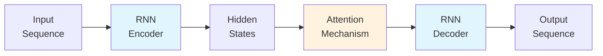
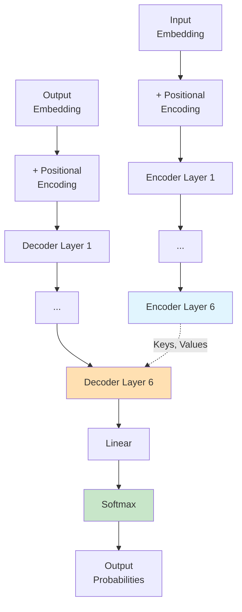

## RNN과 CNN을 버리고 Attention만으로

2017년, Google Brain팀이 발표한 "Attention Is All You Need"는 현대 AI의 판도를 바꾼 논문이다. 

**핵심 주장:**
- Recurrence (RNN) 필요 없다
- Convolution (CNN) 필요 없다
- **Attention mechanism만으로 충분하다**

이 논문이 제안한 **Transformer** 아키텍처는:
- Machine translation에서 state-of-the-art 달성
- Training 시간 획기적 단축 (8 GPUs, 12시간)
- 이후 BERT, GPT, LLM 시대의 foundation이 됨

> 📄 [Paper (arXiv)](https://arxiv.org/abs/1706.03762) | Google Brain, Google Research, University of Toronto | NIPS 2017

---

## 당시 배경: RNN의 지배와 한계

### Sequence Transduction의 표준: RNN

2017년 당시, sequence-to-sequence 모델의 표준은:

**Encoder-Decoder + Attention**

**대표적 모델:**
- **LSTM/GRU:** Long short-term memory, Gated recurrent units
- **Seq2Seq with Attention:** Bahdanau et al. (2015)

### RNN의 근본적 한계

**1. Sequential Computation**

RNN은 position $t$의 hidden state $h_t$를 계산하려면:

$$
h_t = f(h_{t-1}, x_t)
$$

- $h_{t-1}$이 먼저 계산되어야 함
- **Parallelization 불가능**
- Long sequence에서 **memory constraint** (batch size 제한)

**2. Long-Range Dependencies**

- Position 1과 position 100 사이의 dependency를 학습하려면 100 steps 거쳐야 함
- **Gradient vanishing/exploding** 문제
- LSTM/GRU가 완화했지만 근본적 해결은 못함

**3. Computational Complexity**

Sequence length $n$, representation dimension $d$에 대해:

| Layer Type | Operations | Sequential |
|---|---|---|
| **Recurrent** | $O(n \cdot d^2)$ | $O(n)$ |
| **Convolutional** | $O(k \cdot n \cdot d^2)$ | $O(1)$ |
| **Self-Attention** | $O(n^2 \cdot d)$ | $O(1)$ |

---

## 핵심 아이디어: Self-Attention으로 모든 것을

### Self-Attention이란?

**정의:** 하나의 sequence 내에서 서로 다른 position들 간의 relation을 계산하여 sequence representation을 만드는 메커니즘.

**직관:**
- "The animal didn't cross the street because **it** was too tired."
- "it"이 "animal"을 가리키는지 "street"를 가리키는지 → **attention**으로 학습

**기존 attention:**
- Decoder가 encoder의 모든 position을 attend
- Query는 decoder, Key/Value는 encoder

**Self-attention:**
- Query, Key, Value가 **모두 같은 sequence**에서 옴
- Encoder/Decoder 각각 내부에서 self-attention 수행

### Transformer의 대담한 선택

**"Recurrence와 convolution을 완전히 제거하고 attention만 사용하자"**

**장점:**
1. **Parallelization:** 모든 position을 동시에 계산 가능
2. **Constant path length:** 모든 position pair가 $O(1)$ step으로 연결
3. **Interpretability:** Attention weight를 시각화하여 model이 무엇을 보는지 파악 가능

---

## Transformer Architecture

### Overall Structure

**Encoder-Decoder 구조:**
- **Encoder:** $N=6$ layers (input sequence → continuous representations)
- **Decoder:** $N=6$ layers (representations → output sequence, auto-regressive)

### Encoder Layer

각 encoder layer는 **2개 sub-layer**:

1. **Multi-Head Self-Attention**
2. **Position-wise Feed-Forward Network**

각 sub-layer 후:

$$
\text{LayerNorm}(x + \text{Sublayer}(x))
$$

- **Residual connection** + **Layer normalization**

### Decoder Layer

각 decoder layer는 **3개 sub-layer**:

1. **Masked Multi-Head Self-Attention** (prevent looking ahead)
2. **Multi-Head Attention** over encoder output (encoder-decoder attention)
3. **Position-wise Feed-Forward Network**

역시 각 sub-layer 후 residual connection + layer normalization.

---

## Scaled Dot-Product Attention

### 수식

$$
\text{Attention}(Q, K, V) = \text{softmax}\left(\frac{QK^T}{\sqrt{d_k}}\right)V
$$

**구성 요소:**

- **Query $Q$:** "무엇을 찾고 있는가"
- **Key $K$:** "나는 무엇에 관한 것인가"
- **Value $V$:** "내가 전달할 정보"
- **Scaling factor $1/\sqrt{d_k}$:** Dot product magnitude를 normalize

### 왜 Scaling이 필요한가?

**문제:** $d_k$가 크면 dot product $q \cdot k$의 magnitude가 커진다.

**가정:** $q$와 $k$의 각 component가 independent, mean 0, variance 1이면:

$$
q \cdot k = \sum_{i=1}^{d_k} q_i k_i \sim N(0, d_k)
$$

- Variance가 $d_k$에 비례
- Large magnitude → softmax가 **extremely small gradient** 영역으로 이동

**해법:** $1/\sqrt{d_k}$로 scaling하여 variance를 1로 유지.

### Computational Efficiency

**Additive attention (Bahdanau et al.):**

$$
\text{score}(h_i, s_j) = v^T \tanh(W_1 h_i + W_2 s_j)
$$

- Feed-forward network 필요
- Theoretically similar complexity

**Dot-product attention:**

$$
\text{score}(Q, K) = QK^T
$$

- **Highly optimized matrix multiplication** (BLAS)
- 훨씬 빠르고 memory-efficient

---

## Multi-Head Attention

### 동기

**문제:** Single attention head는 하나의 representation subspace만 capture.

**해법:** $h$개의 parallel attention head를 사용하여 **다양한 representation subspace**를 학습.

### 수식

$$
\text{MultiHead}(Q, K, V) = \text{Concat}(\text{head}_1, \ldots, \text{head}_h)W^O
$$

여기서:

$$
\text{head}_i = \text{Attention}(QW_i^Q, KW_i^K, VW_i^V)
$$

**Parameter matrices:**

- $W_i^Q \in \mathbb{R}^{d_{\text{model}} \times d_k}$
- $W_i^K \in \mathbb{R}^{d_{\text{model}} \times d_k}$
- $W_i^V \in \mathbb{R}^{d_{\text{model}} \times d_v}$
- $W^O \in \mathbb{R}^{h \cdot d_v \times d_{\text{model}}}$

**Transformer 설정:**

- $h = 8$ heads
- $d_k = d_v = d_{\text{model}}/h = 64$
- **Total computational cost ≈ single-head full dimensionality** (dimension이 줄어든 만큼 head 수가 늘어남)

### 3가지 Attention 활용 방식

**1. Encoder Self-Attention**

- All queries, keys, values from **same encoder layer**
- 각 position이 encoder의 **모든 position을 attend**

**2. Decoder Self-Attention**

- All queries, keys, values from **same decoder layer**
- **Masking:** Position $i$는 position $< i$만 attend (prevent looking ahead)

**3. Encoder-Decoder Attention**

- **Queries:** Decoder layer
- **Keys, Values:** Encoder output
- Decoder의 각 position이 **input sequence의 모든 position을 attend**

---

## Position-wise Feed-Forward Networks

$$
\text{FFN}(x) = \max(0, xW_1 + b_1)W_2 + b_2
$$

**특징:**

- **Position-wise:** 각 position에 **independently and identically** 적용
- 2개 linear transformation + ReLU
- **$d_{\text{model}} = 512 \to d_{ff} = 2048 \to 512$**
- Kernel size 1인 2개 convolution으로 볼 수도 있음

---

## Positional Encoding

### 왜 필요한가?

**문제:** Attention은 **permutation-invariant** (순서 정보 없음)

**해법:** Input embedding에 **positional encoding 추가**.

### Sinusoidal Positional Encoding

$$
\begin{aligned}
PE_{(pos, 2i)} &= \sin(pos / 10000^{2i/d_{\text{model}}}) \\
PE_{(pos, 2i+1)} &= \cos(pos / 10000^{2i/d_{\text{model}}})
\end{aligned}
$$

**특징:**

- $pos$: Position index
- $i$: Dimension index
- **Sinusoid의 wavelength:** $2\pi \to 10000 \cdot 2\pi$

**장점:**

1. **Relative position을 학습하기 쉬움:**

$$
PE_{pos+k} = f(PE_{pos})
$$

(Linear function)

2. **Extrapolation:** Training 시보다 긴 sequence에도 적용 가능

**Learned positional embeddings vs Sinusoidal:**

- 거의 동일한 성능 (Table 3, row E)
- Sinusoidal 선택 이유: Extrapolation potential

---

## Training Details

### Datasets

**WMT 2014 English-German:**
- 4.5M sentence pairs
- Byte-pair encoding, shared vocab ~37K tokens

**WMT 2014 English-French:**
- 36M sentence pairs
- Word-piece vocab ~32K tokens

### Hardware & Schedule

**Base model:**
- **Hardware:** 1 machine, 8 NVIDIA P100 GPUs
- **Step time:** 0.4 seconds
- **Total:** 100K steps = **12 hours**

**Big model:**
- **Step time:** 1.0 seconds
- **Total:** 300K steps = **3.5 days**

### Optimizer: Adam

**Learning rate schedule:**

$$
\text{lrate} = d_{\text{model}}^{-0.5} \cdot \min(\text{step\_num}^{-0.5}, \text{step\_num} \cdot \text{warmup\_steps}^{-1.5})
$$

- **Warmup:** 처음 4000 steps 동안 linearly 증가
- 이후: Step number의 inverse square root에 비례하여 감소

### Regularization

**1. Residual Dropout:** $P_{drop} = 0.1$

**2. Label Smoothing:** $\epsilon_{ls} = 0.1$

- Perplexity는 약간 올라가지만
- **Accuracy와 BLEU score 향상**

---

## Results

### Machine Translation

**WMT 2014 English-to-German:**

| Model | BLEU | Training Cost |
|---|---|---|
| Previous SOTA (ensemble) | 26.4 | - |
| **Transformer (big)** | **28.4** | **3.5 days, 8 P100 GPUs** |
| Transformer (base) | 27.3 | 12 hours, 8 P100 GPUs |

**+2.0 BLEU over previous best (including ensembles)**

**WMT 2014 English-to-French:**

| Model | BLEU | Training Cost |
|---|---|---|
| Previous SOTA | 40.4 | - |
| **Transformer (big)** | **41.0** | **3.5 days, 8 P100 GPUs** |

**1/4 training cost of previous SOTA**

### Model Variations (Ablation Study)

**Key findings (Table 3):**

**Number of heads ($h$):**
- 1 head: 25.8 BLEU (worse)
- 4 heads: 25.5 BLEU
- **8 heads: 25.8 BLEU (best)**
- 16 heads: 25.8 BLEU
- 32 heads: 25.4 BLEU (too many heads hurts)

**Key dimension ($d_k$):**
- $d_k = 16$: 25.4 BLEU (too small)
- **$d_k = 64$: 25.8 BLEU (best)**
- $d_k = 128$: 25.5 BLEU

**Model size ($d_{\text{model}}$):**
- 256: 24.5 BLEU
- **512: 25.8 BLEU (base)**
- **1024: 26.0 BLEU (big, best)**

**Dropout:**
- 0.0: 24.6 BLEU (overfitting)
- **0.1: 25.8 BLEU (best)**
- 0.2: 25.5 BLEU

### English Constituency Parsing

**Penn Treebank:**

- **40K training sentences:** 91.3% F1 (outperforms all previous models)
- **Only 16K training sentences:** 88.4% F1 (competitive)

**Transformer generalizes well to other tasks beyond translation**

---

## Why Self-Attention?

논문은 self-attention을 선택한 이유를 **3가지 desiderata**로 설명:

### 1. Computational Complexity per Layer

| Layer Type | Complexity | Sequential |
|---|---|---|
| Self-Attention | $O(n^2 \cdot d)$ | $O(1)$ |
| Recurrent | $O(n \cdot d^2)$ | $O(n)$ |
| Convolutional | $O(k \cdot n \cdot d^2)$ | $O(1)$ |

**대부분의 경우 $n < d$** (sentence length < representation dim)
→ **Self-attention이 recurrent보다 빠름**

### 2. Parallelization

**Minimum sequential operations:**

- **Self-Attention:** $O(1)$ (모든 position 동시 계산)
- **Recurrent:** $O(n)$ (순차적)
- **Convolutional:** $O(1)$

### 3. Path Length Between Long-Range Dependencies

**Maximum path length:**

- **Self-Attention:** $O(1)$ (직접 연결)
- **Recurrent:** $O(n)$ (모든 step 거쳐야 함)
- **Convolutional:** $O(\log_k(n))$ (dilated convolution)

**짧은 path → 쉽게 long-range dependency 학습**

---

## Impact & Legacy

### 즉각적 영향

1. **Machine translation SOTA** (2017)
2. **Training efficiency 획기적 개선** (12 hours for competitive model)
3. **Attention mechanism의 중요성 입증**

### 장기적 영향

**Transformer는 현대 AI의 foundation이 되었다:**

**NLP:**
- **BERT** (2018): Bidirectional transformer for pre-training
- **GPT series** (2018-): Autoregressive transformer for language generation
- **T5, BART, etc.:** Various transformer variants

**Vision:**
- **Vision Transformer (ViT)** (2020): Image classification
- **DETR** (2020): Object detection
- **Swin Transformer** (2021): Hierarchical vision transformer

**Multimodal:**
- **CLIP** (2021): Vision-language pre-training
- **Flamingo, DALL-E, etc.:** Text-to-image generation

**Beyond:**
- **AlphaFold2** (2020): Protein structure prediction (attention-based)
- **MolCrystalFlow, SpecLig:** Molecular design (attention-based)

---

## Discussion: 의의와 한계

### 혁명적 의의

**1. Paradigm shift**

- RNN/CNN 중심 → **Attention 중심**
- Sequential processing → **Parallel processing**

**2. Scalability**

- Large model 학습 가능 (parallelization)
- Pre-training + fine-tuning paradigm의 기초

**3. Interpretability**

- Attention weight visualization
- Model이 "무엇을 보는지" 파악 가능

### 한계

**1. Quadratic complexity in sequence length**

$$
O(n^2 \cdot d)
$$

- Long sequence (document-level)에서 문제
- 향후: Sparse attention, linear attention (Performer, Linformer, etc.)

**2. Lack of inductive bias**

- RNN: Sequential bias
- CNN: Locality bias
- **Transformer: No bias** → 많은 data 필요

**3. Positional encoding**

- Sinusoidal encoding이 optimal인지 불명확
- 향후: Relative positional encoding (T5, DeBERTa)

---

## TL;DR

1. **Transformer는 recurrence와 convolution을 제거하고 attention mechanism만으로 sequence transduction을 수행하는 모델이다.**
2. **Scaled dot-product attention과 multi-head attention으로 다양한 representation subspace를 학습한다.**
3. **WMT 2014 En-De에서 BLEU 28.4로 +2.0 BLEU 개선, 1/4 training cost로 달성했다.**
4. **이후 BERT, GPT, ViT 등 현대 AI의 foundation이 되었다.**

---

## References

- [Paper (arXiv)](https://arxiv.org/abs/1706.03762)
- Vaswani, Ashish, et al. "Attention is all you need." NIPS 2017.
- Google Brain, Google Research, University of Toronto
- Implementation: [tensor2tensor](https://github.com/tensorflow/tensor2tensor)

---

> 이 글은 LLM의 도움을 받아 작성되었습니다. 
> 논문의 내용을 기반으로 작성되었으나, 부정확한 내용이 있을 수 있습니다.
> 오류 지적이나 피드백은 언제든 환영합니다.
{: .prompt-info }
