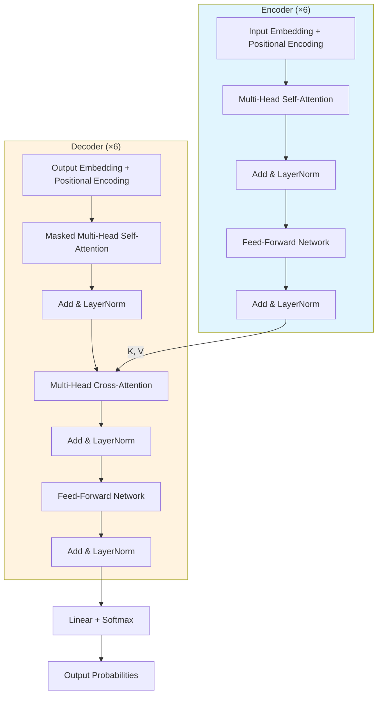

## 2017년, 모든 것이 바뀌었다

GPT, BERT, Vision Transformer, AlphaFold2 — 지금 우리가 쓰는 거의 모든 AI 모델의 뿌리를 하나만 꼽으라면, 이 논문이다. Vaswani et al.의 "Attention Is All You Need"는 RNN과 CNN 없이 **attention만으로** sequence-to-sequence 모델을 만들 수 있다는 걸 보여줬다. 2017년 NeurIPS에서 발표된 이 논문은 현재 인용 수 13만 회를 넘겼고, 말 그대로 딥러닝의 판을 바꿨다.

## RNN의 근본적 한계

2017년 이전, sequence modeling의 왕좌는 RNN(특히 LSTM, GRU)이 차지하고 있었다. 하지만 RNN에는 태생적인 문제가 있었다.

첫째, **순차적 연산**이라는 구조적 병목이 있다. RNN은 $h_t$를 계산하려면 반드시 $h_{t-1}$이 필요하다. 이건 GPU 병렬화와 정면으로 충돌한다. 시퀀스가 길어질수록 학습 속도는 선형으로 느려진다.

둘째, **장거리 의존성 학습이 어렵다.** 문장 앞쪽의 정보가 뒤쪽까지 도달하려면 여러 타임스텝을 거쳐야 하는데, gradient가 vanish하거나 explode하기 십상이다. LSTM이 이걸 완화하긴 했지만, 근본적으로 해결하진 못했다.

CNN 기반 접근(ByteNet, ConvS2S)도 병렬화 문제는 해결했지만, 두 위치 사이의 관계를 파악하려면 여러 레이어를 쌓아야 해서 — 거리에 비례하는 path length 문제가 남아있었다.

> 핵심 질문: RNN의 순차성도, CNN의 거리 제한도 없이 — 시퀀스의 모든 위치 간 관계를 **한 번에** 볼 수 있는 방법은 없을까?
{: .prompt-info }

## Attention만으로 충분하다

Transformer의 핵심 아이디어는 놀랍도록 간단하다. **Recurrence를 완전히 버리고, self-attention으로 대체한다.**

기존에도 attention은 쓰이고 있었다 — Bahdanau attention처럼, RNN 위에 얹혀서 encoder-decoder 사이를 연결하는 보조 장치로. 하지만 이 논문은 attention을 보조가 아닌 **주인공**으로 끌어올렸다. 시퀀스의 모든 위치가 다른 모든 위치를 직접 참조할 수 있으니, path length는 $O(1)$이 되고, 연산은 완전히 병렬화된다.

비유하자면 이런 거다. RNN이 "한 단어씩 차례로 읽는 사람"이라면, Transformer는 "문장 전체를 한눈에 보고, 관련 있는 단어들을 동시에 연결짓는 사람"이다.

## 어떻게 동작하는가

### 전체 아키텍처

Transformer는 전형적인 encoder-decoder 구조를 따른다. 다만 내부가 완전히 attention으로 채워져 있다는 게 다르다.

큰 그림은 이렇다: 입력 시퀀스가 Encoder를 통과해 연속 표현 $\mathbf{z}$로 변환되고, Decoder는 이 $\mathbf{z}$를 참조하면서 출력 토큰을 하나씩 auto-regressive하게 생성한다. Encoder와 Decoder 모두 6개의 동일한 레이어를 쌓아 올린다.

### 입력 표현: 토큰 임베딩 + 위치 인코딩

Transformer에는 recurrence가 없으니, 모델이 토큰의 순서를 알 방법이 없다. 이 문제를 해결하기 위해 **positional encoding**을 도입한다. 토큰 임베딩에 위치 정보를 더해주는 것이다.

$$PE_{(pos, 2i)} = \sin\left(\frac{pos}{10000^{2i/d_{\text{model}}}}\right), \quad PE_{(pos, 2i+1)} = \cos\left(\frac{pos}{10000^{2i/d_{\text{model}}}}\right)$$

각 차원마다 서로 다른 주파수의 사인/코사인 함수를 사용한다. 이렇게 하면 임의의 고정 오프셋 $k$에 대해 $PE_{pos+k}$를 $PE_{pos}$의 선형 함수로 표현할 수 있어서, 모델이 상대적 위치 관계를 쉽게 학습할 수 있다. Learned positional embedding과 성능 차이가 거의 없었지만, sinusoidal 방식은 학습 데이터보다 긴 시퀀스에 대한 외삽 가능성이 있다는 장점이 있다.

> 임베딩에 $\sqrt{d_{\text{model}}}$을 곱한다는 점도 주목할 만하다. Positional encoding의 스케일과 맞추기 위한 트릭이다.
{: .prompt-tip }

### Self-Attention: 이 논문의 심장

Self-attention은 시퀀스 내 모든 위치가 다른 모든 위치와의 관계를 직접 계산하는 메커니즘이다. 각 토큰이 Query, Key, Value 세 가지 역할을 동시에 수행한다.

**Scaled Dot-Product Attention:**

$$\text{Attention}(Q, K, V) = \text{softmax}\left(\frac{QK^T}{\sqrt{d_k}}\right)V$$

직관적으로 풀면 이렇다: Query가 "나는 무엇을 찾고 있는가", Key가 "나는 이런 정보를 갖고 있다", Value가 "내가 줄 수 있는 실제 정보"다. $QK^T$로 유사도를 구하고, softmax로 가중치를 만들어, Value의 가중합을 출력한다.

$\sqrt{d_k}$로 나누는 이유가 재밌다. $d_k$가 크면 내적 값의 분산이 $d_k$에 비례해서 커지는데, 이러면 softmax가 극단적인 분포(거의 one-hot)로 수렴해서 gradient가 사라진다. Scaling은 이걸 방지하는 간단하지만 핵심적인 트릭이다.

**Multi-Head Attention:**

단일 attention은 하나의 관점에서만 관계를 포착한다. Multi-head attention은 이걸 $h$개의 서로 다른 부분공간에서 병렬로 수행한다.

$$\text{MultiHead}(Q, K, V) = \text{Concat}(\text{head}_1, \dots, \text{head}_h)W^O$$

$$\text{where } \text{head}_i = \text{Attention}(QW_i^Q, KW_i^K, VW_i^V)$$

$d_{\text{model}} = 512$를 $h = 8$개 head로 나누면 각 head는 $d_k = d_v = 64$ 차원에서 작동한다. 총 연산량은 single-head full-dimension attention과 비슷하지만, 각 head가 서로 다른 패턴(구문 관계, 의미 관계, 위치 관계 등)을 독립적으로 학습할 수 있다. 논문의 attention visualization을 보면, 실제로 특정 head가 장거리 의존성(making...more difficult)이나 대명사 참조(its → Law)를 담당하는 것을 확인할 수 있다.

> Multi-head attention이 왜 잘 되는지 한 줄로 요약하면: **"여러 관점에서 동시에 바라보는 것이 하나의 관점보다 낫다."**
{: .prompt-tip }

### Encoder-Decoder 구조의 디테일

**Encoder 레이어**는 두 개의 sub-layer로 구성된다: (1) Multi-Head Self-Attention → (2) Position-wise Feed-Forward Network. 각 sub-layer 주위에 **residual connection**과 **layer normalization**이 감싸고 있다: $\text{LayerNorm}(x + \text{Sublayer}(x))$. 모든 sub-layer의 출력 차원은 $d_{\text{model}} = 512$로 통일된다.

**Decoder 레이어**는 여기에 하나를 더 끼워넣는다: encoder 출력을 참조하는 **cross-attention** sub-layer. 그리고 decoder의 self-attention에는 **masking**이 추가된다 — position $i$가 $i$ 이후의 위치를 참조하지 못하도록, 미래 정보를 차단하는 것이다. softmax 입력에서 해당 위치를 $-\infty$로 설정하면 간단히 구현된다.

**Feed-Forward Network**은 위치별로 독립적으로 적용되는 2-layer MLP다:

$$\text{FFN}(x) = \max(0, xW_1 + b_1)W_2 + b_2$$

내부 차원은 $d_{ff} = 2048$로, $d_{\text{model}}$의 4배다. 레이어마다 파라미터가 다르지만, 같은 레이어 내에서는 모든 위치에 동일하게 적용된다.

### 학습 디테일: 작은 트릭들의 합

Transformer의 학습에는 몇 가지 세심한 설계가 들어간다.

**Warmup + Inverse Square Root Schedule:** 학습률을 처음 4000스텝 동안 선형으로 올린 뒤, 그 후에는 step 수의 역제곱근에 비례해 감소시킨다. 이 스케줄은 이후 수많은 Transformer 변종들의 표준이 되었다.

$$lr = d_{\text{model}}^{-0.5} \cdot \min(step^{-0.5},\ step \cdot warmup^{-1.5})$$

**Label Smoothing** ($\epsilon_{ls} = 0.1$): 정답 레이블을 one-hot이 아닌 부드러운 분포로 만든다. Perplexity는 약간 나빠지지만 BLEU score와 accuracy는 올라간다 — 모델이 과도하게 확신하는 것을 방지하는 효과다.

**Dropout** ($P_{drop} = 0.1$): 각 sub-layer 출력과 embedding + positional encoding의 합에 dropout을 적용한다.

놀라운 건 학습 비용이다. Base 모델은 **P100 8장에서 12시간**, Big 모델도 **3.5일**이면 충분했다. 당시 경쟁 모델들이 수 주씩 걸렸던 것과 비교하면 압도적인 효율이다.

## 결과: 빠르고 강하다

| Model | EN-DE BLEU | EN-FR BLEU | Training Cost |
|---|---|---|---|
| GNMT + RL (ensemble) | 26.3 | 39.92 | — |
| ConvS2S (ensemble) | 25.16 | 40.46 | — |
| **Transformer (big)** | **28.4** | **41.0** | **3.5일 × 8 P100** |
| Transformer (base) | 27.3 | 38.1 | 12시간 × 8 P100 |

WMT 2014 EN-DE에서 기존 SOTA(앙상블 포함)를 **2 BLEU 이상** 갱신했다. 그것도 단일 모델로. EN-FR에서도 41.0 BLEU로 새로운 single-model SOTA를 달성했는데, 학습 비용은 이전 SOTA의 1/4에 불과했다.

Ablation study도 인상적이다. Head 수를 바꾸면 — 1개는 확실히 나쁘고, 8개가 최적이며, 32개는 오히려 살짝 떨어진다. $d_k$를 줄이면 성능이 하락하고, 모델을 키우면 올라간다. 각 구성 요소의 기여를 체계적으로 보여준 Table 3은 Transformer 이해의 필독 자료다.

English constituency parsing에서도 task-specific 튜닝 없이 거의 SOTA급 성능을 보여줬는데, 이는 Transformer의 **범용성**을 입증하는 결과였다.

## 내 생각: 역사의 분기점

이 논문을 2026년에 리뷰하는 건 좀 특별한 경험이다. 9년이 지난 지금, Transformer는 NLP를 넘어 vision, protein structure prediction, drug discovery, robotics까지 — 말 그대로 AI의 모든 영역을 점령했다. 저자들이 논문 마지막에 "text 외의 modality에도 확장하겠다"고 썼는데, 그게 이렇게까지 될 줄은 본인들도 몰랐을 거다.

개인적으로 가장 인상적인 건 아이디어의 **단순함**이다. Self-attention 자체는 이미 있던 개념이고, encoder-decoder도 기존 프레임워크고, positional encoding도 새로운 건 아니다. 하지만 "recurrence를 완전히 걷어내고 attention만 남기자"는 결단 — 이게 혁신이었다. 복잡한 새 모듈을 만든 게 아니라, 오히려 빼는 것으로 돌파구를 찾았다.

한계를 굳이 짚자면, self-attention의 $O(n^2)$ 복잡도는 긴 시퀀스에서 병목이 된다. 이후 Longformer, BigBird, Flash Attention 같은 후속 연구가 이 문제를 다뤘고, 아직도 진행 중이다. 그리고 positional encoding은 여전히 활발히 연구되는 영역이다 — RoPE, ALiBi 등 더 나은 대안들이 계속 나오고 있다.

> 어떤 논문이 "foundational"인지 판단하는 기준이 있다면, 그건 "이 논문이 없었으면 이후의 어떤 것들이 존재하지 않았을까"다. Transformer 없는 AI 연구를 상상하기가 이제는 불가능하다.
{: .prompt-warning }

## TL;DR

- **문제:** RNN은 순차적이라 느리고, 장거리 의존성을 잘 못 잡는다.
- **해법:** Self-attention만으로 encoder-decoder를 구성한 Transformer — 병렬화 가능, $O(1)$ path length.
- **결과:** WMT 2014에서 SOTA 갱신, 학습 비용 대폭 절감. 이후 GPT, BERT, ViT 등 AI 전체의 기반이 됨.
