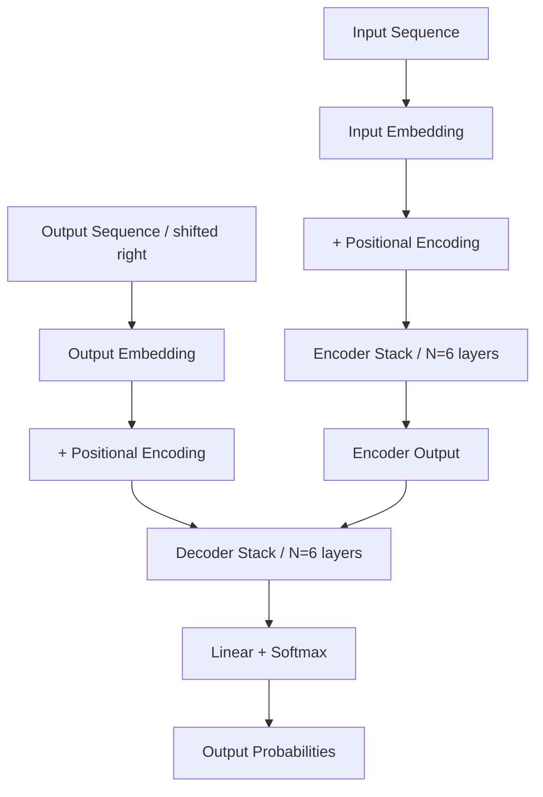

## Hook

RNN과 CNN 없이 번역이 가능할까? 2017년, Google의 연구진들은 이 질문에 "Yes"라고 답했다. **Attention Is All You Need**는 recurrent layer와 convolutional layer를 완전히 배제하고, **오직 attention mechanism만으로** sequence-to-sequence 모델을 구축한 Transformer를 제안한다. 학습 시간은 12시간, 성능은 기존 SOTA를 2 BLEU 이상 앞서는 결과. 이 논문은 NLP 역사의 분기점이 되었다.

## Problem

### Sequential Computation의 한계

RNN 기반 모델(LSTM, GRU)은 sequence modeling에서 오랫동안 SOTA를 유지해왔다. 하지만 근본적인 문제가 있다:

**병렬화 불가능성**: RNN은 본질적으로 sequential하다. 시점 $t$의 hidden state $h_t$는 이전 시점 $h_{t-1}$에 의존한다. 이는 학습 시 batch 내에서조차 병렬화를 막으며, 긴 시퀀스에서 메모리 제약으로 이어진다.

**Long-range dependency 학습의 어려움**: 두 단어 사이의 거리가 멀어질수록, gradient가 그 사이를 통과하며 전달되어야 한다. ConvS2S는 $O(n/k)$, ByteNet은 $O(\log_k(n))$개의 layer를 거쳐야 먼 거리의 dependency를 학습할 수 있다.

### Attention의 등장, 그러나...

Attention mechanism은 거리에 관계없이 dependency를 모델링할 수 있어 많은 task에서 필수가 되었다. 하지만 거의 모든 경우, attention은 **RNN과 함께** 사용되었다. "Attention은 보조 도구"라는 인식이 지배적이었다.

## Key Idea

### Attention만으로 충분하다

Transformer의 핵심 아이디어는 간단하지만 급진적이다: **recurrence를 완전히 제거하고, attention만으로 input과 output 간의 global dependency를 포착한다.**

구체적으로:
1. **Self-attention layer**: 한 sequence 내에서 각 position이 모든 position을 attend할 수 있다. 이를 통해 representation을 계산.
2. **Constant path length**: 두 position 간 dependency를 학습하는 데 필요한 연산 수가 $O(1)$. RNN의 $O(n)$, CNN의 $O(\log_k(n))$과 대비된다.
3. **Massive parallelization**: Sequential 연산이 없으므로 전체 sequence를 병렬로 처리 가능.

Transformer는 encoder-decoder 구조를 유지하되, 각 layer를 **multi-head self-attention + position-wise feedforward network**로 구성한다.

## How It Works

### 4.1 Overview

Transformer는 전형적인 encoder-decoder 구조를 따른다.


_Figure 1: Transformer 모델 아키텍처. 왼쪽이 Encoder, 오른쪽이 Decoder. 출처: 원 논문_



**전체 파이프라인**:
1. Input tokens → Embedding → Positional encoding 추가
2. Encoder: 6개 layer (self-attention + FFN)
3. Decoder: 6개 layer (masked self-attention + encoder-decoder attention + FFN)
4. Output: Linear projection + softmax

```python
# Overall Architecture
class Transformer(nn.Module):
    def __init__(self, 
                 src_vocab_size: int,
                 tgt_vocab_size: int,
                 d_model: int = 512,
                 n_heads: int = 8,
                 n_layers: int = 6,
                 d_ff: int = 2048,
                 dropout: float = 0.1):
        super().__init__()
        
        # Embeddings
        self.src_embed = nn.Embedding(src_vocab_size, d_model)
        self.tgt_embed = nn.Embedding(tgt_vocab_size, d_model)
        self.pos_encoding = PositionalEncoding(d_model, dropout)
        
        # Encoder stack
        self.encoder = nn.ModuleList([
            EncoderLayer(d_model, n_heads, d_ff, dropout)
            for _ in range(n_layers)
        ])
        
        # Decoder stack
        self.decoder = nn.ModuleList([
            DecoderLayer(d_model, n_heads, d_ff, dropout)
            for _ in range(n_layers)
        ])
        
        # Output projection
        self.output_proj = nn.Linear(d_model, tgt_vocab_size)
        
        # Share weights between embeddings and pre-softmax linear
        self.output_proj.weight = self.tgt_embed.weight
        
    def forward(self, src, tgt, src_mask=None, tgt_mask=None):
        # Encode
        src_emb = self.pos_encoding(self.src_embed(src) * math.sqrt(self.d_model))
        enc_output = src_emb
        for enc_layer in self.encoder:
            enc_output = enc_layer(enc_output, src_mask)
        
        # Decode
        tgt_emb = self.pos_encoding(self.tgt_embed(tgt) * math.sqrt(self.d_model))
        dec_output = tgt_emb
        for dec_layer in self.decoder:
            dec_output = dec_layer(dec_output, enc_output, src_mask, tgt_mask)
        
        # Output
        return self.output_proj(dec_output)
```

### 4.2 Representation: Positional Encoding

Transformer는 recurrence도 convolution도 사용하지 않으므로, **sequence의 순서 정보가 사라진다**. 이를 보완하기 위해 positional encoding을 embedding에 더한다.

논문은 sine/cosine 함수를 사용한 고정된 positional encoding을 제안한다:

$$
\begin{aligned}
PE_{(pos, 2i)} &= \sin(pos / 10000^{2i/d_{model}}) \\
PE_{(pos, 2i+1)} &= \cos(pos / 10000^{2i/d_{model}})
\end{aligned}
$$

여기서 $pos$는 position, $i$는 dimension index다. 각 dimension은 서로 다른 주파수의 sinusoid를 형성한다.

**왜 sinusoid인가?** 저자들은 "고정된 offset $k$에 대해, $PE_{pos+k}$를 $PE_{pos}$의 선형 함수로 표현 가능하다"고 가정했다. 이는 모델이 상대적 위치를 학습하기 쉽게 만든다. 실험 결과 learned positional embedding과 거의 동일한 성능을 보였으며, sinusoidal 버전은 학습 중 본 것보다 긴 sequence로 extrapolation 가능하다는 장점이 있다.

```python
class PositionalEncoding(nn.Module):
    """Sinusoidal positional encoding from Section 3.5"""
    def __init__(self, d_model: int, dropout: float = 0.1, max_len: int = 5000):
        super().__init__()
        self.dropout = nn.Dropout(p=dropout)
        
        # Compute positional encodings once
        pe = torch.zeros(max_len, d_model)  # (max_len, d_model)
        position = torch.arange(0, max_len).unsqueeze(1)  # (max_len, 1)
        
        # div_term = 10000^(2i/d_model)
        div_term = torch.exp(
            torch.arange(0, d_model, 2) * -(math.log(10000.0) / d_model)
        )
        
        pe[:, 0::2] = torch.sin(position * div_term)  # Even dimensions
        pe[:, 1::2] = torch.cos(position * div_term)  # Odd dimensions
        
        pe = pe.unsqueeze(0)  # (1, max_len, d_model) for broadcasting
        self.register_buffer('pe', pe)
    
    def forward(self, x: Tensor) -> Tensor:
        # x: (batch, seq_len, d_model)
        x = x + self.pe[:, :x.size(1)]
        return self.dropout(x)
```

### 4.3 Core Architecture: Multi-Head Attention

Transformer의 핵심은 **multi-head self-attention mechanism**이다.

#### Scaled Dot-Product Attention

가장 기본 단위는 scaled dot-product attention이다:

$$
\text{Attention}(Q, K, V) = \text{softmax}\left(\frac{QK^T}{\sqrt{d_k}}\right)V
$$

- $Q$ (queries), $K$ (keys), $V$ (values): 각각 $(batch, seq\_len, d_k)$ 또는 $(batch, seq\_len, d_v)$
- $QK^T$: query와 key의 유사도 행렬 $(batch, seq\_len, seq\_len)$
- $\sqrt{d_k}$로 scaling: $d_k$가 클 때 dot product 값이 커져 softmax gradient가 vanishing되는 것을 방지

```python
class ScaledDotProductAttention(nn.Module):
    """Section 3.2.1 - Scaled Dot-Product Attention"""
    def __init__(self, d_k: int, dropout: float = 0.1):
        super().__init__()
        self.scale = d_k ** -0.5
        self.dropout = nn.Dropout(dropout)
    
    def forward(self, Q: Tensor, K: Tensor, V: Tensor, 
                mask: Optional[Tensor] = None) -> Tuple[Tensor, Tensor]:
        # Q, K, V: (batch, n_heads, seq_len, d_k)
        
        # Compute attention scores
        attn = torch.matmul(Q, K.transpose(-2, -1)) * self.scale  # (batch, n_heads, seq_len, seq_len)
        
        # Apply mask (for padding or future positions)
        if mask is not None:
            attn = attn.masked_fill(mask == 0, -1e9)
        
        # Softmax over keys
        attn_weights = F.softmax(attn, dim=-1)
        attn_weights = self.dropout(attn_weights)
        
        # Apply attention to values
        output = torch.matmul(attn_weights, V)  # (batch, n_heads, seq_len, d_k)
        
        return output, attn_weights
```

#### Multi-Head Attention

Single attention보다 **여러 개의 attention head를 병렬로 실행**하는 것이 더 효과적이다. 각 head는 서로 다른 representation subspace에서 정보를 추출한다.

$$
\begin{aligned}
\text{MultiHead}(Q, K, V) &= \text{Concat}(head_1, \ldots, head_h)W^O \\
\text{where } head_i &= \text{Attention}(QW_i^Q, KW_i^K, VW_i^V)
\end{aligned}
$$

- $h=8$개의 head 사용
- $d_k = d_v = d_{model}/h = 64$: 각 head의 차원을 줄여 총 연산량은 single-head와 유사

```python
class MultiHeadAttention(nn.Module):
    """Section 3.2.2 - Multi-Head Attention"""
    def __init__(self, d_model: int = 512, n_heads: int = 8, dropout: float = 0.1):
        super().__init__()
        assert d_model % n_heads == 0, "d_model must be divisible by n_heads"
        
        self.d_model = d_model
        self.n_heads = n_heads
        self.d_k = d_model // n_heads
        
        # Linear projections for Q, K, V
        self.W_Q = nn.Linear(d_model, d_model)
        self.W_K = nn.Linear(d_model, d_model)
        self.W_V = nn.Linear(d_model, d_model)
        
        # Scaled dot-product attention
        self.attention = ScaledDotProductAttention(self.d_k, dropout)
        
        # Output projection
        self.W_O = nn.Linear(d_model, d_model)
        self.dropout = nn.Dropout(dropout)
        
    def forward(self, Q: Tensor, K: Tensor, V: Tensor, 
                mask: Optional[Tensor] = None) -> Tensor:
        batch_size = Q.size(0)
        
        # Linear projections and split into multiple heads
        # (batch, seq_len, d_model) -> (batch, seq_len, n_heads, d_k) -> (batch, n_heads, seq_len, d_k)
        Q = self.W_Q(Q).view(batch_size, -1, self.n_heads, self.d_k).transpose(1, 2)
        K = self.W_K(K).view(batch_size, -1, self.n_heads, self.d_k).transpose(1, 2)
        V = self.W_V(V).view(batch_size, -1, self.n_heads, self.d_k).transpose(1, 2)
        
        # Apply attention
        attn_output, attn_weights = self.attention(Q, K, V, mask)
        # attn_output: (batch, n_heads, seq_len, d_k)
        
        # Concatenate heads
        concat_output = attn_output.transpose(1, 2).contiguous()  # (batch, seq_len, n_heads, d_k)
        concat_output = concat_output.view(batch_size, -1, self.d_model)  # (batch, seq_len, d_model)
        
        # Final linear projection
        output = self.W_O(concat_output)
        return self.dropout(output)
```

Transformer는 multi-head attention을 **세 가지 방식**으로 사용한다:

1. **Encoder self-attention**: Encoder의 각 position이 encoder의 모든 position을 attend
2. **Decoder self-attention**: Decoder의 각 position이 해당 position까지의 모든 position을 attend (미래 정보 masking)
3. **Encoder-decoder attention**: Decoder의 query가 encoder output을 attend (전형적인 seq2seq attention)

### 4.4 Key Innovation: Position-wise Feed-Forward Networks

Attention 외에, 각 layer는 **position-wise fully connected feed-forward network**를 포함한다. 이는 각 position에 독립적으로 적용되는 2-layer MLP다: $\text{FFN}(x) = \max(0, xW_1 + b_1)W_2 + b_2$

- Input/output dimension: $d_{model} = 512$
- Hidden dimension: $d_{ff} = 2048$
- Activation: ReLU

"Position-wise"라는 것은 같은 FFN이 sequence의 모든 position에 동일하게 적용되지만, layer마다 다른 파라미터를 사용한다는 의미다. Kernel size 1의 convolution으로 볼 수도 있다.

```python
class PositionwiseFeedForward(nn.Module):
    """Section 3.3 - Position-wise Feed-Forward Networks"""
    def __init__(self, d_model: int = 512, d_ff: int = 2048, dropout: float = 0.1):
        super().__init__()
        self.linear1 = nn.Linear(d_model, d_ff)
        self.linear2 = nn.Linear(d_ff, d_model)
        self.dropout = nn.Dropout(dropout)
    
    def forward(self, x: Tensor) -> Tensor:
        # x: (batch, seq_len, d_model)
        x = self.linear1(x)           # (batch, seq_len, d_ff)
        x = F.relu(x)
        x = self.dropout(x)
        x = self.linear2(x)           # (batch, seq_len, d_model)
        return self.dropout(x)
```

각 sub-layer (attention 또는 FFN) 주변에는 **residual connection + layer normalization**이 적용된다: $\text{LayerNorm}(x + \text{Sublayer}(x))$

```python
class EncoderLayer(nn.Module):
    def __init__(self, d_model: int, n_heads: int, d_ff: int, dropout: float):
        super().__init__()
        self.self_attn = MultiHeadAttention(d_model, n_heads, dropout)
        self.feed_forward = PositionwiseFeedForward(d_model, d_ff, dropout)
        self.norm1 = nn.LayerNorm(d_model)
        self.norm2 = nn.LayerNorm(d_model)
        self.dropout = nn.Dropout(dropout)
    
    def forward(self, x: Tensor, mask: Optional[Tensor] = None) -> Tensor:
        # Self-attention + residual + norm
        attn_output = self.self_attn(x, x, x, mask)
        x = self.norm1(x + self.dropout(attn_output))
        
        # Feed-forward + residual + norm
        ff_output = self.feed_forward(x)
        x = self.norm2(x + self.dropout(ff_output))
        
        return x
```

Decoder layer는 encoder layer와 유사하지만, **encoder-decoder attention sub-layer가 추가**된다:

```python
class DecoderLayer(nn.Module):
    def __init__(self, d_model: int, n_heads: int, d_ff: int, dropout: float):
        super().__init__()
        self.self_attn = MultiHeadAttention(d_model, n_heads, dropout)
        self.enc_dec_attn = MultiHeadAttention(d_model, n_heads, dropout)  # Added
        self.feed_forward = PositionwiseFeedForward(d_model, d_ff, dropout)
        self.norm1 = nn.LayerNorm(d_model)
        self.norm2 = nn.LayerNorm(d_model)
        self.norm3 = nn.LayerNorm(d_model)
        self.dropout = nn.Dropout(dropout)
    
    def forward(self, x: Tensor, enc_output: Tensor, 
                src_mask: Optional[Tensor] = None,
                tgt_mask: Optional[Tensor] = None) -> Tensor:
        # Masked self-attention (prevent attending to future positions)
        self_attn_output = self.self_attn(x, x, x, tgt_mask)
        x = self.norm1(x + self.dropout(self_attn_output))
        
        # Encoder-decoder attention
        enc_dec_attn_output = self.enc_dec_attn(x, enc_output, enc_output, src_mask)
        x = self.norm2(x + self.dropout(enc_dec_attn_output))
        
        # Feed-forward
        ff_output = self.feed_forward(x)
        x = self.norm3(x + self.dropout(ff_output))
        
        return x
```

### 4.5 Training & Inference

#### Training

**Loss function**: Standard cross-entropy loss with label smoothing ($\epsilon_{ls}=0.1$). Label smoothing은 모델이 over-confident한 예측을 하지 않도록 한다. 정답 클래스에 $1-\epsilon_{ls}$, 나머지에 $\epsilon_{ls}/(V-1)$의 확률을 할당한다. Perplexity는 다소 상승하지만 accuracy와 BLEU는 향상된다.

**Optimizer**: Adam with custom learning rate schedule

$$
lrate = d_{model}^{-0.5} \cdot \min(step\_num^{-0.5}, step\_num \cdot warmup\_steps^{-1.5})
$$

처음 $warmup\_steps=4000$ step 동안은 learning rate를 선형 증가시키고, 이후 step number의 inverse square root에 비례하여 감소시킨다.

**Regularization**:
- Residual dropout: $P_{drop}=0.1$ (base model)
- Label smoothing: $\epsilon_{ls}=0.1$

```python
# Training loop (simplified)
def train_step(model, batch, optimizer, criterion):
    src, tgt = batch['src'], batch['tgt']
    tgt_input = tgt[:, :-1]  # Remove last token
    tgt_output = tgt[:, 1:]   # Remove first token (shifted)
    
    # Forward pass
    logits = model(src, tgt_input, src_mask, tgt_mask)  # (batch, seq_len, vocab_size)
    
    # Compute loss
    loss = criterion(
        logits.reshape(-1, logits.size(-1)),
        tgt_output.reshape(-1)
    )
    
    # Backward pass
    optimizer.zero_grad()
    loss.backward()
    optimizer.step()
    
    return loss.item()
```

#### Inference

**Autoregressive decoding**: Decoder는 이전에 생성한 token들을 input으로 받아 다음 token을 예측한다.

```python
def generate(model, src, max_len=100, start_token=2, end_token=3):
    """Greedy decoding"""
    model.eval()
    
    # Encode source
    src_mask = (src != 0).unsqueeze(1).unsqueeze(2)
    enc_output = model.encode(src, src_mask)
    
    # Initialize with start token
    tgt = torch.LongTensor([[start_token]]).to(src.device)
    
    for _ in range(max_len):
        # Create target mask
        tgt_mask = subsequent_mask(tgt.size(1)).to(src.device)
        
        # Decode
        logits = model.decode(tgt, enc_output, src_mask, tgt_mask)
        next_token = logits[:, -1].argmax(dim=-1, keepdim=True)
        
        # Append to sequence
        tgt = torch.cat([tgt, next_token], dim=1)
        
        # Stop if end token is generated
        if next_token.item() == end_token:
            break
    
    return tgt

def subsequent_mask(size):
    """Mask future positions in decoder self-attention"""
    attn_shape = (1, size, size)
    mask = torch.triu(torch.ones(attn_shape), diagonal=1).type(torch.uint8)
    return mask == 0  # Lower triangular matrix
```

실제로는 **beam search** (beam size=4, length penalty $\alpha=0.6$)를 사용하여 더 나은 번역 품질을 얻는다.

## Results

### Machine Translation: SOTA 달성

Transformer는 WMT 2014 영어-독일어/영어-프랑스어 번역 task에서 새로운 SOTA를 수립했다.

| Model | EN-DE BLEU | EN-FR BLEU | Training Cost |
|---|---|---|---|
| **Transformer (big)** | **28.4** | **41.8** | 8 P100 × 3.5 days |
| Transformer (base) | 27.3 | 38.1 | 8 P100 × 12 hours |
| ByteNet | 23.7 | - | - |
| Deep-Att + PosUnk | - | 39.2 | - |
| GNMT + RL | 24.6 | 39.9 | - |
| ConvS2S | 25.16 | 40.46 | - |

> **WMT 2014 EN-DE에서 28.4 BLEU**: 기존 최고 기록(ensemble 포함)을 2 BLEU 이상 앞선다. Base model도 기존 모든 single model을 능가하며, 학습 시간은 단 12시간.
{: .prompt-tip }

Transformer (big)는 8 P100 GPU에서 3.5일 학습하여 EN-FR에서 41.8 BLEU를 달성했다. 기존 SOTA 모델 대비 **학습 비용은 1/4 이하**다.

### 병렬화와 속도

| Layer Type | Complexity per Layer | Sequential Operations | Maximum Path Length |
|---|---|---|---|
| Self-Attention | $O(n^2 \cdot d)$ | $O(1)$ | $O(1)$ |
| Recurrent | $O(n \cdot d^2)$ | $O(n)$ | $O(n)$ |
| Convolutional | $O(k \cdot n \cdot d^2)$ | $O(1)$ | $O(\log_k(n))$ |

Self-attention의 핵심 장점:
- **Constant sequential operations**: 모든 position을 병렬로 처리 가능
- **Constant path length**: 먼 거리의 dependency도 $O(1)$ 연산으로 학습
- **Computational complexity**: $n < d$일 때 (대부분의 경우) recurrent보다 빠름

### English Constituency Parsing

번역 외에도 Transformer는 **English constituency parsing**에서도 강력한 일반화 능력을 보였다. WSJ 40K 문장만으로 학습한 4-layer Transformer는 91.3 F1을 달성했다. Semi-supervised 설정(17M 문장)에서는 92.7 F1로, 당시 최고 성능에 근접했다.

## Discussion

### Model Variations: 무엇이 중요한가?

저자들은 다양한 ablation study를 통해 Transformer의 design choice를 검증했다:

**Attention head 수** (Table 3, row A): Single-head는 최적 설정 대비 0.9 BLEU 낮다. 하지만 head가 너무 많아도 성능이 저하된다. $h=8$이 최적.

**Attention key size** (row B): $d_k$를 줄이면 성능이 하락한다. 이는 compatibility를 판단하는 것이 단순한 dot product보다 복잡할 수 있음을 시사한다.

**Model size와 dropout** (row C, D): 큰 모델일수록 성능이 좋다. Dropout ($P_{drop}=0.1$)은 overfitting 방지에 매우 효과적이다.

**Positional encoding** (row E): Learned positional embedding과 sinusoidal encoding은 거의 동일한 성능을 보인다. Sinusoidal 버전은 학습보다 긴 sequence로 extrapolation 가능하다는 이론적 이점이 있다.

### Attention의 해석 가능성

Self-attention은 단순히 성능만 좋은 것이 아니라, **해석 가능한 모델**을 제공한다. 저자들은 attention distribution을 분석하여 다양한 언어적 현상을 포착함을 확인했다:

- 일부 head는 long-range dependency를 학습 (예: "making...more difficult")
- 일부 head는 anaphora resolution에 관여 (예: "its"가 지칭하는 대상)
- 각 head는 서로 다른 syntactic/semantic 구조를 학습

이는 multi-head attention이 단순한 앙상블이 아니라, **서로 다른 representation subspace에서 complementary한 정보**를 추출함을 보여준다.

### 저자들이 밝힌 향후 방향

논문 결론부에서 저자들은 다음을 제시했다:

1. **Other modalities**: Text 외에 image, audio, video 등으로 확장
2. **Local, restricted attention**: 매우 긴 입력(이미지, 오디오)을 효율적으로 처리하기 위해 restricted attention mechanism 연구
3. **Less sequential generation**: Auto-regressive 생성을 개선하여 추론 속도 향상

> 논문에서 언급한 "향후 연구 방향"은 실제로 Vision Transformer (ViT), Sparse Transformer, Non-autoregressive Transformer 등으로 이어졌다.
{: .prompt-info }

## Limitations

1. **Quadratic complexity**: Self-attention의 O(n²) 시간/공간 복잡도로 인해 긴 시퀀스(수천 토큰 이상) 처리가 비효율적이다.
2. **위치 정보의 한계**: Sinusoidal positional encoding은 학습된 것이 아니며, 상대적 위치 관계를 명시적으로 포착하지 못한다. 이후 연구(RoPE, ALiBi 등)에서 개선되었다.
3. **Inductive bias 부재**: CNN의 local connectivity나 RNN의 sequential bias 같은 구조적 귀납 편향이 없어, 작은 데이터셋에서는 과적합 위험이 있다.
4. **Autoregressive decoding의 비효율성**: Inference 시 토큰을 하나씩 생성해야 하므로, 병렬화의 이점이 decoding 단계에서는 사라진다.
5. **Machine translation에 특화**: 원래 논문은 번역 task에 집중했으며, 다른 modality(이미지, 오디오 등)로의 확장은 후속 연구에서 이루어졌다.

## Conclusion

"Attention Is All You Need"는 deep learning 역사에서 가장 영향력 있는 논문 중 하나다. RNN/CNN 없이 attention mechanism만으로 sequence-to-sequence 학습이 가능함을 증명했으며, 이는 이후 BERT, GPT, Vision Transformer 등으로 이어지는 foundation model 혁명의 시발점이 되었다. Scaled dot-product attention, multi-head attention, positional encoding이라는 세 가지 핵심 component는 거의 변형 없이 현재까지 사용되고 있다. WMT 2014에서 BLEU 41.0으로 SOTA를 달성한 것을 넘어, 모든 AI 분야의 기본 아키텍처가 되었다는 점에서 그 기여는 측정하기 어려울 정도로 크다.

## TL;DR

- **Transformer**: Recurrence와 convolution을 완전히 제거하고 **오직 attention mechanism**만으로 sequence transduction을 수행하는 새로운 아키텍처
- **핵심 메커니즘**: Multi-head self-attention + position-wise FFN + positional encoding. Constant path length로 long-range dependency 학습, 대규모 병렬화 가능
- **성능**: WMT 2014 EN-DE에서 28.4 BLEU (기존 SOTA 대비 +2 BLEU), EN-FR에서 41.8 BLEU. 학습 시간은 경쟁 모델 대비 1/4 이하

## Paper Info

| 항목 | 내용 |
|---|---|
| **Title** | Attention Is All You Need |
| **Authors** | Ashish Vaswani et al. (Google Brain, Google Research, University of Toronto) |
| **Venue** | NeurIPS 2017 |
| **Submitted** | 2017-06-12 (arXiv v1) |
| **Paper** | [arXiv:1706.03762](https://arxiv.org/abs/1706.03762) |
| **Published** | NeurIPS 2017 |
| **Link** | [arXiv:1706.03762](https://arxiv.org/abs/1706.03762) |
| **Code** | [tensor2tensor](https://github.com/tensorflow/tensor2tensor) (TensorFlow), [fairseq](https://github.com/pytorch/fairseq) (PyTorch) |

---

> 이 글은 LLM(Large Language Model)의 도움을 받아 작성되었습니다. 
> 논문의 내용을 기반으로 작성되었으나, 부정확한 내용이 있을 수 있습니다.
> 오류 지적이나 피드백은 언제든 환영합니다.
{: .prompt-info }
