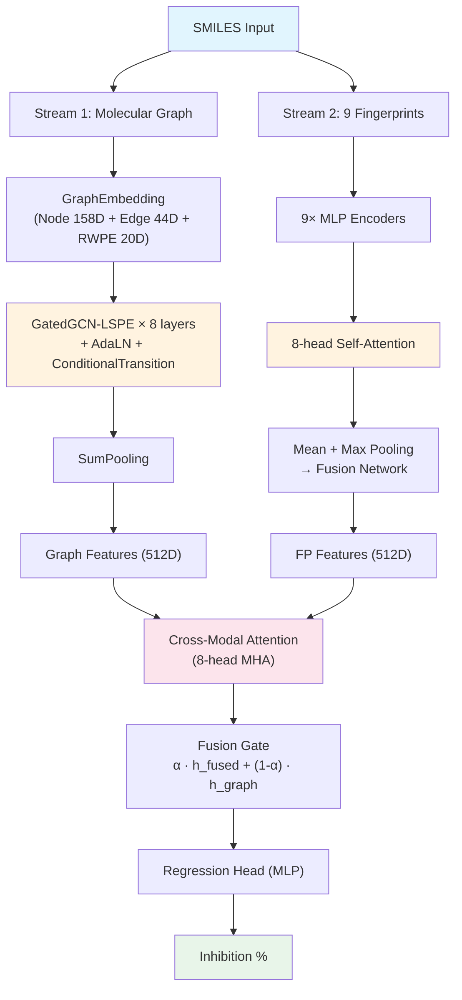
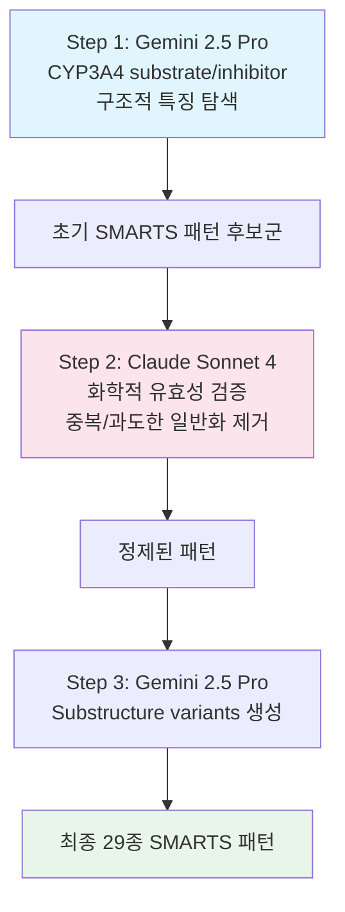

## Hook

신약 후보물질 하나가 CYP3A4를 강하게 억제하면 어떻게 될까? 병용 약물의 혈중 농도가 치솟고, 독성이 올라가고, 결국 임상에서 탈락한다. 인체 간에서 전체 의약품의 약 50%를 대사하는 이 효소의 억제 정도를 SMILES 하나로 예측할 수 있다면 — 신약 개발 초기 스크리닝이 근본적으로 달라진다. 이 프로젝트는 **분자 그래프와 9종의 molecular fingerprint를 cross-modal attention으로 융합**하여 CYP3A4 Inhibition %를 예측하고, Dacon 경진대회에서 **Private 4위**를 달성한 모델이다.

> Dacon [Boost up AI 2025: 신약 개발 경진대회](https://dacon.io/competitions/official/236518/overview/description) **Private 4위 (팀 팔미리)**  
> GitHub: [eightmm/CYP3A4](https://github.com/eightmm/CYP3A4)
{: .prompt-info }

## Problem

### CYP3A4 억제 예측의 어려움

**CYP3A4**(Cytochrome P450 3A4)는 인체 간에서 전체 의약품의 약 50%를 대사하는 핵심 효소다. 신약 후보물질이 CYP3A4를 강하게 억제하면:

- **약물-약물 상호작용(DDI)**: 병용 약물의 혈중 농도가 비정상적으로 상승
- **독성 위험 증가**: 대사되지 않은 약물이 체내 축적
- **임상 실패**: DDI 문제로 개발 중단

따라서 신약 개발 초기 단계에서 CYP3A4 억제 정도를 빠르게 스크리닝하는 것이 중요하다.

### 대회 설정

| 항목 | 내용 |
|------|------|
| **플랫폼** | [Dacon](https://dacon.io/competitions/official/236518/overview/description) |
| **Task** | Regression — CYP3A4 Inhibition (%) 예측 |
| **Input** | Canonical SMILES |
| **Target** | Inhibition 값 (range: 0.0 ~ 99.38) |
| **Train** | 1,681 samples |
| **Test** | 100 samples |

이 대회에서의 도전은 단순한 regression이 아니다.

**데이터 특성**:
- **Tanimoto Similarity**: Train-Test 간 최대 유사도가 0.6 미만 — 구조적으로 독립적인 분자들이 포함
- **Murcko Scaffold Split**: 95.7%가 singleton scaffolds — 매우 높은 구조적 다양성
- 이는 모델이 단순 암기가 아닌 **일반화된 분자-억제 관계**를 학습해야 함을 의미

전통적인 약물 대사 예측 모델은 도메인 전문가가 수작업으로 설계한 molecular descriptors에 의존한다. CYP3A4 같은 특정 효소에 대한 깊은 생화학적 지식이 없으면, 억제 메커니즘과 직접 연관된 구조적 패턴을 포착하기 어렵다.

## Key Idea

### Dual-Stream + LLM Feature Engineering

이 모델의 핵심은 두 가지다.

**첫째, 분자를 두 가지 관점에서 본다.** 하나의 SMILES에서 molecular graph(원자 간 연결 구조)와 9종의 molecular fingerprint(전역적 화학 기술자)를 독립적으로 추출한다. 전자는 local substructure를 정밀하게 인코딩하고, 후자는 전역적 화학적 성질을 포착한다. 두 stream을 cross-modal attention으로 통합하면, 어느 한쪽만으로는 잡을 수 없는 상보적 정보를 활용할 수 있다.

**둘째, LLM을 "Virtual Biochemist"로 활용한다.** Gemini 2.5 Pro와 Claude Sonnet 4을 반복적으로 사용하여 CYP3A4 inhibitor/substrate의 구조적 특징을 SMARTS 패턴으로 추출하고, 이를 molecular graph의 node feature로 직접 주입한다. 도메인 전문가 없이도 고품질의 효소 특화 feature를 생성하는 접근이다.

## How it works

### 4.1 Overview

전체 파이프라인은 **두 개의 독립적인 feature extraction stream**과 **cross-modal fusion**으로 구성된다.




_Figure 1: 5-Fold Cross-Validation 학습 곡선. 각 fold의 training/validation loss와 competition score 추이. 출처: eightmm/CYP3A4_

<details markdown="1">
<summary>📝 Overall Architecture Pseudocode (클릭하여 펼치기)</summary>

```python
class PropertyPredictor(nn.Module):
    """CYP3A4 Inhibition Prediction — Dual-Stream Architecture"""
    def __init__(self, node_dim=158, edge_dim=44, hidden_dim=512, num_layers=8):
        # Stream 1: Graph
        self.graph_extractor = GraphFeatureExtractor(
            node_dim, edge_dim, hidden_dim, num_layers
        )
        # Stream 2: Fingerprints
        self.molecular_extractor = MolecularFeatureExtractor(hidden_dim)
        # Cross-modal fusion
        self.cross_modal_attention = MultiheadAttention(hidden_dim, num_heads=8)
        self.fusion_gate = Sequential(Linear(hidden_dim * 2, hidden_dim), Sigmoid())
        self.regression_head = MLP(hidden_dim → 1)

    def forward(self, graph, fingerprints):
        h_graph = self.graph_extractor(graph)           # (B, 512)
        h_fp = self.molecular_extractor(fingerprints)   # (B, 512)
        stacked = stack([h_graph, h_fp], dim=1)         # (B, 2, 512)
        attended = self.cross_modal_attention(stacked)   # (B, 2, 512)
        gate = self.fusion_gate(concat(attended))        # (B, 512)
        h_final = gate * fused + (1 - gate) * h_graph   # gated residual
        return self.regression_head(h_final)             # (B, 1)
```

</details>

### 4.2 Representation

**Node features (158D)**: 기본 원자 속성(atomic number, period, group, 전기음성도, degree, valence) + 화학적 속성(혼성 궤도, formal charge, 방향족성, 키랄성) + **Random Walk Positional Encoding (RWPE, 20D)** + **CYP3A4-specific SMARTS features (29D)**

**Edge features (44D)**: 결합 유형, 입체화학, 공액/고리 여부, topological distance

**9종 Fingerprints**:

| Fingerprint | Dimension | 특성 |
|-------------|-----------|------|
| Descriptor | 27D | 물리화학적 성질 (MW, LogP, TPSA 등) |
| MACCS | 167D | 구조 키 (사전 정의된 substructure 패턴) |
| Morgan | 2048D | Circular fingerprint (원형 환경 인코딩) |
| Morgan Count | 2048D | 빈도 기반 Morgan variant |
| Feature Morgan | 2048D | Feature 기반 Morgan variant |
| RDKit | 2048D | Topological fingerprint |
| Atom Pair | 2048D | 원자쌍 기술자 |
| Topological Torsion | 2048D | Torsion 기반 구조 정보 |
| Pharmacophore2D | 1024D | 2D 약리작용단 패턴 |

각 fingerprint 타입은 분자의 서로 다른 화학적 측면을 포착하며, attention을 통해 예측에 유용한 표현에 동적으로 가중치를 부여한다.

### 4.3 Core Architecture

#### Stream 1: GatedGCN-LSPE + AlphaFold3-Inspired Layers

Graph stream은 **8개의 GatedGCN-LSPE 레이어**로 분자 그래프를 처리한다. 각 레이어는 gated message passing으로 이웃 원자의 기여도를 적응적으로 조절하고, positional encoding을 함께 업데이트한다.

핵심 수식 — edge gating:

$$\hat{\eta}_{ij} = B_1 h_i + B_2 h_j + B_3 e_{ij}$$

$$\eta_{ij} = \frac{\sigma(\hat{\eta}_{ij})}{\sum_{k \in \mathcal{N}(j)} \sigma(\hat{\eta}_{kj})}$$

$\sigma$는 sigmoid function이다. Edge의 중요도를 원자 쌍 + edge feature 정보로 계산하고, 이웃 전체에 대해 normalize하여 soft attention weight로 사용한다.

각 GatedGCN 레이어 뒤에는 **AlphaFold3에서 사용된 두 가지 컴포넌트**가 추가된다:

- **Adaptive Layer Normalization (AdaLN)**: $\sigma(W_1 \cdot \text{LN}(c)) \odot \text{LN}(x) + W_2 \cdot \text{LN}(c)$ — context-dependent normalization으로 분자마다 다른 정규화 적용
- **Conditional Transition Block**: SwiGLU activation 기반 gating — $\sigma(W_c \cdot c) \odot W_o(\text{SiLU}(W_1 a) \odot W_2 a)$

초기 embedding을 context로 유지하면서 각 레이어의 출력을 conditioning하는 구조다.

<details markdown="1">
<summary>📝 GatedGCN-LSPE Layer 구현 (클릭하여 펼치기)</summary>

```python
class GatedGCNLSPELayer(nn.Module):
    """GatedGCN with Learnable Spectral Positional Encoding"""
    def __init__(self, input_dim: int, output_dim: int, dropout: float, batch_norm: bool):
        super().__init__()
        # Node: h_new = A1[h||p] + Σ η_ij · A2[h_i||p_i]
        self.A1 = nn.Linear(input_dim * 2, output_dim)   # self-loop
        self.A2 = nn.Linear(input_dim * 2, output_dim)   # neighbor
        # Gating: η̂_ij = B1·h_src + B2·h_dst + B3·e_ij
        self.B1 = nn.Linear(input_dim, output_dim)
        self.B2 = nn.Linear(input_dim, output_dim)
        self.B3 = nn.Linear(input_dim, output_dim)
        # Positional encoding: p_new = C1·p_j + Σ η_ij · C2·p_i
        self.C1 = nn.Linear(input_dim, output_dim)
        self.C2 = nn.Linear(input_dim, output_dim)
        self.bn_node_h = nn.BatchNorm1d(output_dim)
        self.bn_node_e = nn.BatchNorm1d(output_dim)

    def forward(self, g, h, p, e):
        h_in, p_in, e_in = h, p, e  # for residual

        # Edge gating: η̂_ij = B1·h_src + B2·h_dst + B3·e_ij
        hat_eta = g.edata['B1_B2_h'] + self.B3(e)           # (E, D)
        sigma = torch.sigmoid(hat_eta)
        eta = sigma / (sum_of_neighbors(sigma) + 1e-6)      # normalized

        # Node update: A1[h||p] + Σ η_ij · A2[h_neighbor||p_neighbor]
        h = self.A1(cat([h, p], -1)) + aggregate(eta, self.A2(cat([h_nb, p_nb], -1)))
        p = self.C1(p) + aggregate(eta, self.C2(p_neighbor)) # PE update

        h = F.relu(self.bn_node_h(h)) + h_in                # BN → ReLU → residual
        p = torch.tanh(p) + p_in
        e = F.relu(self.bn_node_e(hat_eta)) + e_in
        return F.dropout(h), F.dropout(p), F.dropout(e)
```

</details>

<details markdown="1">
<summary>📝 AdaLN + ConditionalTransition 구현 (클릭하여 펼치기)</summary>

```python
class AdaLN(nn.Module):
    """Adaptive Layer Normalization (AlphaFold3-style)
    output = sigmoid(W1 · LN(context)) * LN(feat) + W2 · LN(context)
    """
    def __init__(self, dim: int):
        super().__init__()
        self.ln_feat = nn.LayerNorm(dim)
        self.ln_ctx = nn.LayerNorm(dim)
        self.gate = nn.Linear(dim, dim)          # sigmoid gate
        self.bias = nn.Linear(dim, dim, bias=False)  # additive bias

    def forward(self, feat, context):
        # feat, context: (N, D)
        return torch.sigmoid(self.gate(self.ln_ctx(context))) * self.ln_feat(feat) \
               + self.bias(self.ln_ctx(context))


class ConditionalTransitionBlock(nn.Module):
    """SwiGLU-gated transition conditioned on initial embeddings
    output = sigmoid(W_ctx · context) * W_out(SiLU(W1 · a) ⊙ W2 · a)
    """
    def __init__(self, dim: int, expansion: int = 4):
        super().__init__()
        self.ada_ln = AdaLN(dim)
        self.w1 = nn.Linear(dim, dim * expansion, bias=False)   # SiLU branch
        self.w2 = nn.Linear(dim, dim * expansion, bias=False)   # gate branch
        self.w_out = nn.Linear(dim * expansion, dim, bias=False)
        self.w_ctx = nn.Linear(dim, dim)                         # output gate

    def forward(self, feat, context):
        a = self.ada_ln(feat, context)                    # (N, D)
        b = F.silu(self.w1(a)) * self.w2(a)              # SwiGLU: (N, D*4)
        return torch.sigmoid(self.w_ctx(context)) * self.w_out(b)  # (N, D)
```

</details>

<details markdown="1">
<summary>📝 GraphFeatureExtractor 전체 Forward (클릭하여 펼치기)</summary>

```python
class GraphFeatureExtractor(nn.Module):
    """Stream 1: SMILES → Graph → GatedGCN-LSPE(8L) → 512D"""
    def __init__(self, node_dim=158, edge_dim=44, hidden_dim=512, num_layers=8):
        self.embedding = GraphEmbedding(node_dim, edge_dim, hidden_dim)
        self.node_adaln = AdaLN(hidden_dim)
        self.edge_adaln = AdaLN(hidden_dim)
        self.gnn_layers = ModuleList([GatedGCNLSPELayer(hidden_dim, hidden_dim) for _ in range(8)])
        self.node_transitions = ModuleList([ConditionalTransitionBlock(hidden_dim) for _ in range(8)])
        self.edge_transitions = ModuleList([ConditionalTransitionBlock(hidden_dim) for _ in range(8)])
        self.pool = SumPooling()

    def forward(self, graph):
        h, p, e = self.embedding(graph.ndata['feat'], graph.ndata['rwpe'], graph.edata['feat'])
        h = self.node_adaln(h, h)        # initial self-conditioning
        e = self.edge_adaln(e, e)
        h_raw, e_raw = h, e              # save as context for transitions

        for gnn, n_trans, e_trans in zip(self.gnn_layers, self.node_transitions, self.edge_transitions):
            h, p, e = gnn(graph, h, p, e)    # GatedGCN-LSPE
            h = n_trans(h, h_raw)             # condition on initial embedding
            e = e_trans(e, e_raw)

        return self.pool(graph, h)            # (B, 512)
```

</details>

#### Stream 2: Molecular Fingerprint Extractor

9종의 fingerprint 각각을 독립적인 MLP encoder(Linear → ReLU → Dropout → Linear)로 512D로 사영한 뒤, **8-head Multi-Head Self-Attention**으로 fingerprint 간 상호작용을 학습한다. Attention을 통해 현재 분자의 예측에 유용한 fingerprint 타입에 더 높은 가중치를 부여한다.

Attention 후 mean pooling + max pooling을 concatenate하여 fusion network(LayerNorm → MLP)로 통합한다.

<details markdown="1">
<summary>📝 MolecularFeatureExtractor 구현 (클릭하여 펼치기)</summary>

```python
class MolecularFeatureExtractor(nn.Module):
    """Stream 2: SMILES → 9 Fingerprints → Attention → 512D"""
    def __init__(self, hidden_dim=512, dropout=0.15):
        # 9종 fingerprint → 각각 MLP encoder
        self.fp_encoders = ModuleDict({
            'descriptor': MLP(27 → hidden_dim),
            'maccs': MLP(167 → hidden_dim),
            'morgan': MLP(2048 → hidden_dim),
            'morgan_count': MLP(2048 → hidden_dim),
            'feature_morgan': MLP(2048 → hidden_dim),
            'rdkit_fp': MLP(2048 → hidden_dim),
            'atom_pair': MLP(2048 → hidden_dim),
            'topo_torsion': MLP(2048 → hidden_dim),
            'pharmacophore': MLP(1024 → hidden_dim),
        })
        self.attention = MultiheadAttention(hidden_dim, num_heads=8)
        self.fusion = Sequential(LayerNorm(hidden_dim*2), MLP(hidden_dim*2 → hidden_dim))

    def forward(self, fingerprints: dict):
        encoded = [self.fp_encoders[k](v) for k, v in fingerprints.items()]
        stacked = torch.stack(encoded, dim=1)               # (B, 9, 512)
        attended, _ = self.attention(stacked, stacked, stacked)
        mean_pool = attended.mean(dim=1)                     # (B, 512)
        max_pool = attended.max(dim=1).values                # (B, 512)
        return self.fusion(cat([mean_pool, max_pool], -1))   # (B, 512)
```

</details>

### 4.4 Key Innovation

#### LLM-Based CYP3A4 Feature Engineering

**Gemini 2.5 Pro**와 **Claude Sonnet 4**을 반복적으로 활용하여 CYP3A4 inhibitor/substrate의 구조적 특징을 SMARTS 패턴으로 자동 생성했다.



최종 결과:
- **Inhibitor 패턴 (13종)**: azole 항진균제(imidazole, triazole), macrolide, HIV protease inhibitor 구조 등
- **Substrate 패턴 (16종)**: N-dealkylation, O-dealkylation, hydroxylation site 등

이 패턴들은 분자 그래프의 **node features로 직접 주입** — 각 원자가 CYP3A4 억제/기질 패턴에 해당하는지를 binary feature(29D)로 표현한다. 비전문가도 LLM을 활용해 도메인 특화 feature를 생성할 수 있다는 점에서, 향후 AI-driven drug discovery에 적용 가능한 접근이다.

### 4.5 Training & Inference

#### Loss Function

대회 평가 지표를 직접 loss로 사용하여, 학습 목표와 평가 목표를 일치시킨다:

$$\mathcal{L} = -\left[0.5 \times \left(1 - \min\left(\frac{\text{RMSE}}{\max(y) - \min(y)},\ 1\right)\right) + 0.5 \times r_{Pearson}\right]$$

Normalized RMSE와 Pearson Correlation의 가중합을 직접 최적화한다. 추가로 예측값이 유효 범위([0, 99.38])를 벗어나는 경우 range penalty를 적용한다.

#### Training Configuration

| 항목 | 값 |
|------|-----|
| Hidden Dimension | 512 |
| GNN Layers | 8 |
| MHA Heads | 8 |
| Optimizer | AdamW (lr=1e-5, weight_decay=5e-5) |
| Scheduler | CosineAnnealingWarmUpRestarts (T_0=20, T_up=5) |
| Batch Size | 32 |
| Epochs | 500 (Early Stopping patience=30) |
| Gradient Clipping | max_norm=1.0 |
| Dropout | 0.2 (GNN) / 0.15 (MLP) |
| Validation | 5-Fold CV |

<details markdown="1">
<summary>📝 Training Loop (클릭하여 펼치기)</summary>

```python
# 5-Fold Cross-Validation Training
for fold in range(5):
    model = PropertyPredictor(node_dim=158, edge_dim=44, hidden_dim=512, num_layers=8)
    optimizer = AdamW(model.parameters(), lr=1e-5, weight_decay=5e-5)
    scheduler = CosineAnnealingWarmUpRestarts(optimizer, T_0=20, T_up=5)

    for epoch in range(500):
        model.train()
        for graph_batch, fp_batch, target in train_loader:
            pred = model(graph_batch, fp_batch).squeeze(-1)  # (B,)

            # Competition-aligned loss
            rmse = torch.sqrt(F.mse_loss(pred, target))
            nrmse = rmse / (y_max - y_min)                   # normalized by range
            pearson = pearson_corrcoef(pred, target)
            loss = -(0.5 * (1 - clamp(nrmse, max=1.0)) + 0.5 * pearson)

            # Range penalty for out-of-bound predictions
            penalty = mean(relu(pred - y_max) + relu(y_min - pred))
            loss = loss + 0.1 * penalty

            loss.backward()
            clip_grad_norm_(model.parameters(), max_norm=1.0)
            optimizer.step()
            scheduler.step()

        # Early stopping on validation score
        if no_improvement_for(patience=30):
            break
```

</details>

<details markdown="1">
<summary>📝 Inference (클릭하여 펼치기)</summary>

```python
# Ensemble inference: average predictions from 5 fold models
fold_models = [load_model(f"fold_{i}/best.pt") for i in range(5)]

predictions = []
for model in fold_models:
    model.eval()
    with torch.no_grad():
        pred = model(test_graph, test_fingerprints)  # (N_test, 1)
        predictions.append(pred)

# Final prediction: mean of 5 folds
final = torch.stack(predictions).mean(dim=0)  # (N_test, 1)
```

</details>

## Results

### 최종 순위

| Private Ranking | Public Score | Private Score | Average Score |
|----------------|--------------|---------------|---------------|
| 1 | 0.81950 | 0.79153 | 0.80551 |
| 2 | 0.72054 | 0.74504 | 0.73279 |
| 3 | 0.76853 | 0.74396 | 0.75624 |
| **4 (팔미리)** | **0.79511** | **0.73914** | **0.76711** |
| 5 | <0.7800 | 0.73894 | 0.75947 |

Public → Private로 갈 때 상위 팀들의 점수가 전반적으로 하락했다. 팔미리 팀은 Public 2위권에서 Private 4위로 이동했으며, 1위 팀은 양쪽 모두 안정적인 성적을 유지했다.

### Seed Retraining

대회 종료 후, Seed만 42 → 123으로 변경하여 retraining한 결과:
- **Private Score**: 0.73914 → **0.75067** (+0.01153)

Seed sensitivity가 존재하며, 여러 seed의 ensemble로 추가 성능 향상 가능성이 있다. 이는 1,681 samples이라는 작은 데이터셋에서의 variance가 결과에 영향을 미치고 있음을 시사한다.

## Discussion

### 한계와 개선 방향

- **Small dataset**: 1,681 samples로는 deep GNN의 전체 용량을 활용하기 어렵다. External data(ChEMBL 등)의 실험 조건 차이가 없었다면 pre-training에 활용할 수 있었을 것이다.
- **Seed sensitivity**: 단일 seed 결과의 variance가 크다. Multi-seed ensemble이 필수적이나, 대회 기간 내 시간 제약이 있었다.
- **Public-Private gap**: Public에서 2위권이었으나 Private에서 4위로 하락한 것은, 100개 test sample의 분포 차이에 모델이 민감하게 반응했을 가능성을 시사한다.
- **LLM feature의 해석**: LLM이 생성한 29종 SMARTS 패턴이 실제 어떤 화학적 메커니즘을 포착하는지에 대한 체계적인 ablation은 아직 부족하다.

> **외부 데이터**: ChEMBL 등 공개 데이터베이스에 CYP3A4 관련 데이터가 존재하지만, 실험 조건(assay type, concentration, cell line)이 대회 데이터와 정확히 동일하지 않아 직접 사용하지 않았다.
{: .prompt-info }

## TL;DR

- **분자 그래프(GatedGCN-LSPE 8L) + 9종 fingerprint를 cross-modal attention으로 융합**하는 dual-stream 아키텍처로 CYP3A4 억제율 예측
- **LLM(Gemini + Sonnet)을 Virtual Biochemist로 활용**하여 CYP3A4 특화 SMARTS 패턴 29종을 자동 생성, node feature로 직접 주입
- Dacon 신약개발 경진대회 **Private 4위** (Score: 0.73914), seed retraining으로 0.75067까지 향상 가능

## Project Info

| 항목 | 내용 |
|---|---|
| **Project** | CYP3A4 Inhibition Prediction |
| **Team** | 팔미리 |
| **Competition** | Dacon Boost up AI 2025: 신약 개발 경진대회 |
| **Result** | Private 4위 (Score: 0.73914) |
| **Code** | [GitHub](https://github.com/eightmm/CYP3A4) |

---

> 이 글은 LLM(Large Language Model)의 도움을 받아 작성되었습니다. 
> 논문의 내용을 기반으로 작성되었으나, 부정확한 내용이 있을 수 있습니다.
> 오류 지적이나 피드백은 언제든 환영합니다.
{: .prompt-info }
