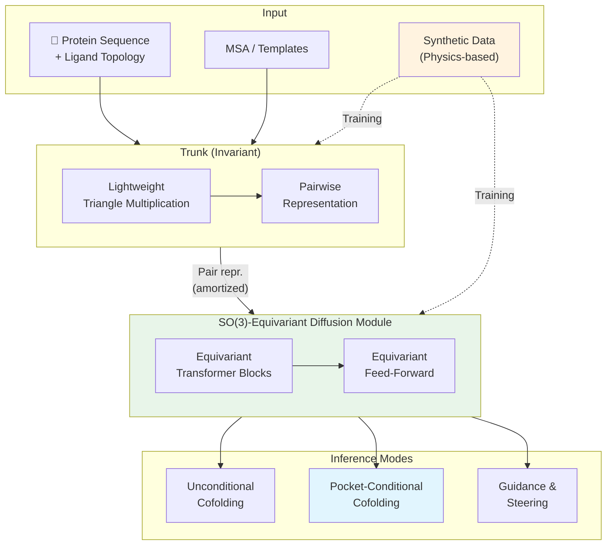

Protein-ligand cofolding — 단백질과 약물 후보 분자의 3D 결합 구조를 동시에 예측하는 문제 — 은 computational drug discovery의 핵심이다. AlphaFold 3가 이 분야의 패러다임을 연 이후, 수많은 후속 모델(Boltz-1, Chai-1, Protenix)이 등장했지만, **실제 약물 설계에 필요한 수준의 정확도와 물리적 타당성**에는 여전히 미치지 못한다.

Genesis Molecular AI와 NVIDIA의 Pearl은 이 문제에 세 가지 축으로 접근한다: (1) **대규모 synthetic data** — PDB의 147배 규모가 아닌 physics-based 방법으로 생성한 다양한 합성 복합체, (2) **SO(3)-equivariant diffusion module** — 회전 대칭을 아키텍처 수준에서 강제, (3) **multi-chain templating** — 추론 시 기존 구조 정보를 활용한 controllable generation.

결과는 인상적이다: Runs N' Poses 벤치마크에서 **RMSD < 2Å & PB-valid 기준 85.2%** 성공률로 AlphaFold 3(74.4%)를 **14.5% 상대 개선**. 더 엄격한 RMSD < 1Å에서는 격차가 더 벌어진다.

## Problem: Cofolding의 세 가지 벽

현재 protein-ligand cofolding 모델이 직면한 근본적 문제:

1. **데이터 부족과 편향**: PDB는 텍스트/이미지 도메인에 비해 orders of magnitude 적은 데이터를 가지고 있으며, 특정 타겟/화학형에 편향되어 있다. 모델이 일반화하지 못하고 학습 데이터를 **암기(memorization)**하는 현상이 보고된다.

2. **물리적 타당성 부재**: 기존 모델이 생성한 포즈가 표면적으로 그럴듯해 보이지만 ligand strain, shape complementarity, non-covalent interaction 등의 물리적 요건을 위반하는 "hallucination"이 빈번하다.

3. **제한된 controllability**: 실제 drug discovery에서는 homologous 구조, 알려진 binding pocket 등의 보조 정보가 있는 경우가 많지만, 기존 모델은 이를 활용할 수 있는 유연한 메커니즘이 부족하다.

> Pearl은 이 세 가지 문제를 각각 synthetic data, equivariant architecture, multi-chain templating으로 해결한다.
{: .prompt-tip }

## Key Idea: Data + Equivariance + Controllability

Pearl의 핵심을 한 문장으로 요약하면: **synthetic data로 데이터 부족을 극복하고, SO(3)-equivariant diffusion으로 물리적 대칭을 강제하며, multi-chain template으로 inference-time controllability를 제공한다.**

기존 cofolding 모델과의 핵심 차이:

| | AF3/Boltz/Chai | Pearl |
|---|---|---|
| Structure Module | 범용 Transformer (비등변) | **SO(3)-equivariant Transformer** |
| 학습 데이터 | PDB + monomer distillation | PDB + monomer distillation + **synthetic PL complexes** |
| Template | Protein-only | **Multi-chain (protein + ligand + cofactor)** |
| Controllability | 제한적 | Unconditional + **Conditional cofolding + Guidance** |

## How it works

### Overview

Pearl의 전체 파이프라인은 크게 두 단계로 나뉜다: (1) 회전/병진 불변인 **Trunk**이 pairwise representation을 학습하고, (2) **SO(3)-equivariant Diffusion Module**이 이를 conditioning으로 받아 3D 좌표를 생성한다.


_Figure 1: Pearl 개요. (a) SARS-CoV-2 예측 예시. (b) Unconditional cofolding 결과. (c) Pocket-conditional cofolding 결과. (d) Training/inference flow. 출처: 원 논문_



Trunk의 계산 비용이 비싼 pairwise representation은 한 번만 계산되고, diffusion module의 여러 denoising step에서 **amortize**되어 재사용된다. 이는 AF3와 유사한 설계지만, diffusion module 자체가 equivariant하다는 점이 다르다.

### Core Architecture: SO(3)-Equivariant Diffusion Module

Pearl의 아키텍처적 핵심은 **SO(3)-equivariant diffusion module**이다. 기존 cofolding 모델(AF3, Boltz-1, Chai-1)의 structure module은 범용 Transformer인데, Pearl은 여기에 **equivariant transformer (EqT) 블록**을 사용한다.


_Figure 2: Equivariant diffusion module의 핵심 컴포넌트. (좌) Equivariant self-attention — scalar/vector 입력을 분리하여 Q/K를 구성. (우) Equivariant feed-forward — vector에 대해 gated nonlinearity 적용. 출처: 원 논문_

EqT 블록은 **scalar feature**와 **vector feature**를 분리하여 처리한다:

- **Scalar (불변)**: 표준 attention과 유사하게 처리
- **Vector (등변)**: 3D 방향 정보를 보존하며, rotation에 대해 equivariant하게 변환

Vector 성분에 비선형성을 적용하기 위해 **gated nonlinearity**를 사용한다: scalar 성분이 gate 역할을 하여 vector 성분의 크기를 조절하되, 방향은 보존한다.

<details>
<summary>📝 Equivariant Transformer Block Pseudocode (클릭하여 펼치기)</summary>

```python
class EquivariantTransformerBlock(nn.Module):
    """
    SO(3)-equivariant transformer block for Pearl's diffusion module.
    Processes scalar (invariant) and vector (equivariant) features separately.
    """
    
    def __init__(self, d_scalar, d_vector, n_heads):
        super().__init__()
        self.n_heads = n_heads
        
        # Scalar Q/K/V projections
        self.scalar_qkv = nn.Linear(d_scalar, 3 * d_scalar)
        
        # Vector Q/K projections (no V — vectors mixed differently)
        self.vector_qk = nn.Linear(d_vector, 2 * d_vector)
        
        # Pair representation → attention bias
        self.pair_bias = nn.Linear(d_pair, n_heads)
        
        # Equivariant feed-forward (gated nonlinearity for vectors)
        self.scalar_ff = nn.Sequential(
            nn.Linear(d_scalar, 4 * d_scalar),
            nn.SiLU(),
            nn.Linear(4 * d_scalar, d_scalar),
        )
        self.vector_linear = nn.Linear(d_vector, d_vector)
        self.vector_gate = nn.Linear(d_scalar, d_vector)  # scalar → gate
    
    def forward(self, s, v, pair_repr):
        """
        s: (B, N, d_scalar)  — scalar (invariant) features
        v: (B, N, d_vector, 3) — vector (equivariant) features
        pair_repr: (B, N, N, d_pair) — pairwise representation from trunk
        """
        # === Equivariant Self-Attention ===
        # Scalar attention
        q_s, k_s, v_s = self.scalar_qkv(s).chunk(3, dim=-1)
        
        # Vector Q/K (dot products are invariant → can compute attention weights)
        q_v, k_v = self.vector_qk(v).chunk(2, dim=-2)
        
        # Attention weights: scalar dot product + vector dot product + pair bias
        # All three terms are SO(3)-invariant
        attn = (
            einsum(q_s, k_s, "b i d, b j d -> b i j")
            + einsum(q_v, k_v, "b i d c, b j d c -> b i j")  # vector dot prod
            + self.pair_bias(pair_repr).squeeze(-1)            # pair bias
        ) / math.sqrt(q_s.shape[-1])
        
        attn = F.softmax(attn, dim=-1)
        
        # Update scalar
        s_out = einsum(attn, v_s, "b i j, b j d -> b i d")
        
        # Update vector (equivariant: weighted sum of vectors)
        v_out = einsum(attn, v, "b i j, b j d c -> b i d c")
        
        s = s + s_out
        v = v + v_out
        
        # === Equivariant Feed-Forward ===
        # Scalar: standard FFN
        s = s + self.scalar_ff(s)
        
        # Vector: gated nonlinearity (scalar gates vector magnitude)
        gate = torch.sigmoid(self.vector_gate(s))  # (B, N, d_vector)
        v_linear = self.vector_linear(v)             # (B, N, d_vector, 3)
        v = v + gate.unsqueeze(-1) * v_linear        # gate preserves direction
        
        return s, v
```

</details>

**왜 equivariance가 중요한가?**

- **Sample efficiency**: 회전 대칭을 아키텍처가 보장하면, data augmentation만으로 equivariance를 학습해야 하는 것보다 훨씬 적은 데이터로 같은 성능에 도달
- **물리적 타당성**: 결과 구조가 입력의 임의 회전에 대해 자동으로 일관된 예측을 생성 — hallucination 감소

Pearl은 data augmentation과 equivariant architecture를 **함께** 사용하여 시너지를 얻는다.

### Key Innovation: Large-Scale Synthetic Data

Pearl의 가장 독특한 기여는 **physics-based 방법으로 생성한 대규모 합성 protein-ligand 복합체 데이터셋**이다. [SeedFold](/posts/seedfold-scaling-biomolecular-structure-prediction/)나 SimpleFold가 다른 AI 모델(AlphaFold2)로부터 distillation한 것과 다르게, Pearl은 physics-based docking/sampling으로 새로운 ligand-pocket 조합을 생성한다.


_Figure 6: Synthetic data 비율에 따른 성능 변화. 모델 성능이 synthetic data 비율에 단조증가. 910개 unique protein × 평균 640 ligands = 582,065 합성 구조 (스케일링 실험용). Flagship 모델은 더 큰 데이터셋 사용. 출처: 원 논문_

핵심 인사이트: AF3가 AF2의 IPA를 범용 Transformer로 대체하면서 **inductive bias가 사라졌기 때문에**, 데이터로 이를 보상해야 한다. Pearl은 synthetic data를 통해 **PDB에 존재하지 않는 화학적 다양성**을 모델에 노출시킨다.

### Multi-Chain Templating: Drug Discovery를 위한 Controllability

Pearl의 템플릿 시스템은 AF3의 protein-only template를 **non-polymeric 성분(ligand, cofactor)**까지 확장한다.

두 가지 inference 모드:

| Mode | Input | Use Case |
|---|---|---|
| **Unconditional** | Protein sequence + Ligand topology | 새로운 타겟, 알려진 pocket 없음 |
| **Conditional** | + Known apo/holo structure or pocket | Hit-to-lead, lead optimization |

Conditional 모드에서는 기존의 ligand-bound 구조를 "holo-like pocket environment"로 제공하여, 유사한 ligand의 포즈를 더 정확하게 예측한다. 추가로 **guidance/steering 기법**으로 denoising trajectory에 특정 물리적 제약을 강제할 수 있다.

### Training Recipe

Pearl은 **5단계 curriculum training**을 사용한다:

1. **초기 단계**: 작은 crop size, 단순한 데이터 (non-templated PDB, monomer distillation)
2. **중간 단계**: Template 정보 점진적 도입
3. **후기 단계**: Synthetic data 비율 증가, 복잡한 구조적 prior 포함

Mixed-precision 전략:
- **bfloat16**: Trunk 연산 (triangle ops, LayerNorm) — 22% 속도 향상, 11% 메모리 절감
- **float32**: Loss 계산, 좌표 projection, softmax — 수치 안정성 보장

NVIDIA cuEquivariance 커널로 추가 가속: 학습 15% 속도 향상, 추론 10~80% 향상 (긴 입력일수록 효과 큼).

## Results

### Unconditional Cofolding (Public Benchmarks)


_Figure 3: Public 벤치마크에서의 unconditional cofolding 결과. Runs N' Poses, PoseBusters, InternalXtals. Best@5 protocol. 출처: 원 논문_

| Model | RnP (RMSD<2Å & PB-valid) | PoseBusters (RMSD<2Å & PB-valid) | RnP (RMSD<1Å & PB-valid) |
|---|---|---|---|
| AlphaFold 3 | 74.4% | 60.4%* | 61.5% |
| Boltz-1x | 74.3% | 74.2% | 56.5% |
| Boltz-1 | 58.4% | 54.5% | 43.8% |
| Chai-1 | 69.9% | 68.7% | 56.3% |
| ProteniX | 63.0% | — | 49.1% |
| **Pearl** | **85.2%** | **84.7%** | **70.0%** |

(*AF3: max confidence from 25 samples, 나머지는 best@5)

Pearl의 두드러진 특징: **PB-valid 체크를 적용해도 성공률이 거의 떨어지지 않는다** (RnP에서 0.7% drop, PoseBusters에서 0.4% drop). 이는 Pearl이 거의 모든 포즈를 물리적으로 타당하게 생성한다는 의미다.

### Generalization


_Figure 4: Training set과의 유사도에 따른 성능 분석. 낮은 유사도 구간에서도 Pearl이 일관되게 우수. 출처: 원 논문_

Pearl은 **novel pocket** (유사도 < 0.2), **novel ligand** (빈도 = 0), **dissimilar chemotype** (Tanimoto < 0.2) 모든 축에서 다른 모델을 리드한다. 이는 Pearl이 memorization이 아닌 transferable rule을 학습했음을 시사한다.

### Conditional Cofolding


_Figure 5: Conditional cofolding 결과. Structural prior를 제공했을 때 모든 모델이 개선되지만, Pearl의 우위가 유지됨. 출처: 원 논문_

**InternalXtals** (challenging real-world drug targets)에서의 conditional 결과가 특히 인상적:

| Metric | Pearl | Boltz-1x | Boltz-2† |
|---|---|---|---|
| RMSD < 2Å & PB-valid | **73.9%** | 51.5% | 41.2% |
| RMSD < 1Å & PB-valid | **39.8%** | 10.6% | 18.1% |

(†Boltz-2는 2023-06-01까지의 데이터로 학습 — 직접 비교 주의)

RMSD < 1Å에서 Pearl은 Boltz-1x 대비 **~4배** 성능 향상.

### 왜 RMSD < 1Å가 중요한가


_Figure 8: Pearl의 성공과 실패 사례 분석. Green: training set 예시, Pink: Pearl, Blue: Boltz-2. 출처: 원 논문_

논문은 RMSD < 2Å를 만족하는 포즈에도 **ring flip, 핵심 interaction 누락, 미세한 translation** 등의 오류가 있어 실제 drug discovery에서는 사용 불가능한 경우가 많음을 강조한다. 예를 들어:
- Pyrazole ring이 뒤집혀 Val116과의 핵심 상호작용을 놓치는 경우 (RMSD 1.99Å)
- Phenol flip으로 Ser87/Met120 상호작용이 깨지는 경우 (RMSD 1.70Å)

따라서 RMSD < 1Å + PB-valid가 medicinal chemistry에서 실제로 유용한 기준이며, 이 기준에서 Pearl의 우위가 가장 두드러진다.

## Discussion

### 저자가 밝힌 한계

- **OOD 일반화**: 여전히 out-of-distribution 데이터에서 정확도가 하락. 특히 대규모 induced-fit 변화 예측이 어려움.
- **Memorization 잔존**: Synthetic data가 완화하지만 제거하지는 못함 — 학습 데이터에 많이 등장하는 pocket으로 ligand를 잘못 배치하는 경향이 여전히 존재 (Figure 8D, E).
- **Pose selection**: 고품질 포즈를 **생성**하는 것은 잘하지만 (높은 best@k), 가장 좋은 포즈를 **선택**하는 confidence model이 여전히 미흡 — top-ranked pose가 random sample보다 나을 게 없는 경우가 많다.
- **비공개 모델**: 코드 미공개, 상용 모델.

### 재현성

- **코드 공개**: ❌ (상용 모델, Genesis Molecular AI)
- **학습 데이터**: PDB (공개) + synthetic (비공개 pipeline) + 내부 데이터
- **필요 GPU**: NVIDIA H100/H200 클러스터, cuEquivariance v0.6.0
- **재현 난이도**: ⭐⭐⭐⭐⭐ (불가능 — 비공개 모델, 비공개 synthetic data pipeline)

> 같은 날 리뷰한 [SimpleFold](/posts/simplefold-folding-proteins-simpler/)와 [SeedFold](/posts/seedfold-scaling-biomolecular-structure-prediction/)가 protein folding에 집중한 반면, Pearl은 **protein-ligand cofolding**이라는 drug discovery에 직결되는 문제에 집중한다. 세 논문 모두 AlphaFold 계열을 넘어서는 데 성공했지만, 각각 다른 축(아키텍처 단순화 / 스케일링 / equivariance + synthetic data)에서 접근했다.
{: .prompt-info }

## TL;DR

- **Pearl은 protein-ligand cofolding SOTA**: Runs N' Poses에서 RMSD < 2Å & PB-valid 기준 **85.2%** (AlphaFold 3 대비 14.5% 상대 개선).
- **세 가지 핵심 혁신**: (1) Physics-based synthetic data → 일반화 향상, (2) SO(3)-equivariant diffusion module → sample efficiency + 물리적 타당성, (3) Multi-chain templating → controllable inference.
- **물리적 타당성**이 특히 뛰어남: PB-valid 체크 적용 시 성공률 하락이 0.4~0.7%에 불과.
- RMSD < 1Å 같은 **엄격한 기준**에서 성능 격차가 더 벌어짐 — 실제 drug discovery에 가장 관련성 높은 지표.

## Paper Info

| 항목 | 내용 |
|---|---|
| **Title** | Pearl: A Foundation Model for Placing Every Atom in the Right Location |
| **Authors** | Genesis Research Team (Alejandro Dobles†, Nina Jovic†, Kenneth Leidal† et al.) |
| **Affiliations** | Genesis Molecular AI, NVIDIA |
| **Venue** | arXiv preprint (Oct 2025) |
| **Paper** | [arXiv](https://arxiv.org/abs/2510.24670) |
| **Code** | 미공개 (상용) |

---

> 이 글은 LLM(Large Language Model)의 도움을 받아 작성되었습니다. 
> 논문의 내용을 기반으로 작성되었으나, 부정확한 내용이 있을 수 있습니다.
> 오류 지적이나 피드백은 언제든 환영합니다.
{: .prompt-info }
