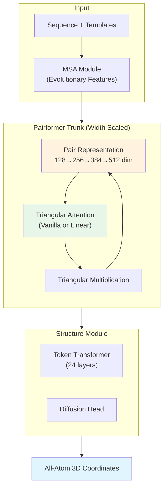

AlphaFold3 이후 folding 모델들은 대부분 비슷한 아키텍처 설정(128-width Pairformer, 48 layers)을 답습해왔다. ByteDance Seed 팀의 SeedFold는 이 관성에 정면으로 의문을 던진다: **현재 모델 용량이 정말 충분한가? 스케일링의 올바른 방향은 무엇인가?**

결론부터 말하면, **width가 답이다.** Pairformer의 pair representation 차원을 128에서 512로 키우는 것이 depth를 두 배로 늘리는 것보다 훨씬 효과적이라는 것을 실험으로 보여준다. 여기에 linear triangular attention으로 계산 병목을 해소하고, 26.5M 규모의 distillation 데이터셋으로 학습하여 FoldBench에서 AlphaFold3를 대부분의 task에서 능가한다.

## Problem: AlphaFold3 아키텍처의 스케일링 병목

AlphaFold3 이후 open-source folding 모델들(Boltz-1, Protenix, Chai-1)은 Pairformer 구조를 거의 그대로 사용한다. 일반적인 설정:

- **Pair representation dimension**: 128
- **Pairformer layers**: 48
- **Recycling**: 3~9회

문제는 **triangular attention의 $O(n^3 d)$ 복잡도**가 모델 스케일링을 근본적으로 제한한다는 점이다. Width를 키우면 계산 비용이 폭발하고, depth를 키우면 recycling과 겹치면서 한계 효과가 줄어든다.

또한 AlphaFold3의 Structure Module은 AlphaFold2의 IPA(Invariant Point Attention)를 범용 Transformer로 대체했는데, 이는 회전/병진 불변성이라는 inductive bias를 제거한 것이다. 따라서 **대규모 데이터 없이는 일반화가 어렵다.**

> SeedFold의 핵심 질문: depth가 아닌 **width**를 키우고, triangular attention을 **linear**으로 바꾸고, 데이터를 **147배** 늘리면 어떻게 되는가?
{: .prompt-tip }

## Key Idea: Width > Depth, 그리고 Linear Triangular Attention

SeedFold의 세 가지 기여를 한 문장씩 요약하면:

1. **Width Scaling**: Pairformer의 pair representation 차원을 128 → 512로 키우는 것이 가장 효과적인 스케일링 전략
2. **Linear Triangular Attention**: softmax 기반 triangular attention을 linear attention으로 대체하여 $O(n^3 d) \to O(n^2 d^2)$로 복잡도 감소
3. **대규모 Distillation**: AlphaFold2로 생성한 26.5M 구조 (PDB 180K의 147배)로 학습

## How it works

### Overview

SeedFold는 AlphaFold3의 전체 파이프라인을 따르되, 세 가지 축에서 스케일업한다.


_Figure 1: SeedFold 개요. Model(width scaling), Architecture(linear triangular attention), Data(26.5M distillation). 출처: 원 논문_



### Representation: Width Scaling이 중요한 이유

기존 folding 모델의 스케일링 전략은 주로 **depth**(layer 수 증가)에 집중했다. SeedFold는 세 가지 전략을 체계적으로 비교한다:

| Configuration | Pair Dim | MSA Dim | Pairformer Layers | Structure Layers | Params | Efficiency |
|---|---|---|---|---|---|---|
| Base (128-width) | 128 | 64 | 48 | 24 | 432M | 0.15 iter/s |
| Medium (256-width) | 256 | 128 | 48 | 24 | 533M | 0.10 iter/s |
| **Large (512-width)** | **512** | **256** | **48** | **24** | **923M** | **0.06 iter/s** |
| Deep Pairformer | 128 | 64 | **96** | 24 | 582M | 0.10 iter/s |
| Deep Structure | 128 | 64 | 48 | **48** | 706M | 0.10 iter/s |


_Figure 2: 스케일링 전략 비교. Width scaling(128→256→512)이 depth scaling(deeper trunk, deeper structure module)보다 일관되게 우수. 출처: 원 논문_

Width scaling이 더 효과적인 이유에 대해 논문은 두 가지 설명을 제시한다:

1. **Recycling이 이미 depth를 근사**: 9회 recycling × 48 layers = 효과적으로 432 layers. 물리적 depth를 96으로 늘려도 추가 이득이 적다.
2. **Pair representation이 핵심 병목**: 모든 pairwise interaction이 128차원으로 압축되면 representation capacity가 부족. DeepSeek-V3가 layer 수는 61인데 hidden size를 7168까지 키운 것과 같은 논리.

128 → 256 전환에서 가장 큰 성능 향상이 나타나고, 256 → 512에서는 diminishing returns가 관찰되었다.

### Core Architecture: Linear Triangular Attention

Triangular attention은 AlphaFold의 핵심 연산이다. Pair representation $\mathbf{Z} \in \mathbb{R}^{n \times n \times d}$의 각 행 $\mathbf{Z}_i$에 대해:

$$\text{TriAtt}(\mathbf{Z}_i) = \text{softmax}(\mathbf{Q}_i \mathbf{K}_i^T + \mathbf{B}) \mathbf{V}_i$$

여기서 bias $\mathbf{B} = \text{Linear}(\mathbf{Z}) \in \mathbb{R}^{n \times n}$가 $(j,k)$-th coupling 정보를 반영하여 "삼각형" 관계를 모델링한다. 이 연산의 복잡도는 $O(n^3 d)$ — 단백질 길이에 대해 **cubic**이다.


_Figure 3: (a) Linear Triangular Attention 아키텍처. (b) Vanilla vs Linear attention의 peak memory 및 시간 비교. 출처: 원 논문_

SeedFold는 LLM에서 발전한 linear attention 기법을 triangular attention에 적용한다. Softmax를 feature map $\phi(\cdot)$로 대체하면 "right product trick"으로 복잡도를 줄일 수 있다:

$$\underbrace{\phi(\mathbf{Q}_i) \phi(\mathbf{K}_i)^T}_{O(n^2 d)} \mathbf{V}_i \to \phi(\mathbf{Q}_i) \underbrace{\phi(\mathbf{K}_i)^T \mathbf{V}_i}_{O(n d^2)}$$

하지만 문제가 있다: triangular attention의 **bias term** $\mathbf{B}$를 어떻게 linear attention에 통합하는가? SeedFold는 두 가지 변형을 제안한다:

**Additive Linear Triangular Attention:**

$$\text{AdditiveLinearTriAtt}(\mathbf{Z}_i) = \phi(\mathbf{Q}_i) \underbrace{(\phi(\mathbf{K}_i)^T \mathbf{V}_i)}_{\text{linearized}} + \underbrace{\psi(\mathbf{B}) \mathbf{V}_i}_{\text{amortized}}$$

Bias term이 여전히 $\mathbb{R}^{n \times n}$이지만, **모든 행에서 공유**되므로 메모리가 amortize된다.

**Gated Linear Triangular Attention:**

$$\text{GatedLinearTriAtt}(\mathbf{Z}_i) = \left(\phi(\mathbf{Q}_i) \phi(\mathbf{K}_i^T) \odot \psi(\mathbf{B})\right) \mathbf{V}_i$$

$\psi = \text{sigmoid}$로 bias를 gating 메커니즘으로 사용. Right product trick은 적용 불가하지만, CUDA 최적화된 tiled 구현으로 메모리 효율을 확보.

<details markdown="1">
<summary>📝 Linear Triangular Attention Pseudocode (클릭하여 펼치기)</summary>

```python
class LinearTriangularAttention(nn.Module):
    """SeedFold's Linear Triangular Attention (Gated variant)"""
    
    def __init__(self, d_pair: int, n_heads: int, mode: str = "gated"):
        super().__init__()
        self.mode = mode
        self.n_heads = n_heads
        self.d_head = d_pair // n_heads
        
        # Q, K, V projections from pair representation
        self.proj_q = nn.Linear(d_pair, d_pair)
        self.proj_k = nn.Linear(d_pair, d_pair)
        self.proj_v = nn.Linear(d_pair, d_pair)
        
        # Bias from pair representation → (n, n) per head
        self.proj_bias = nn.Linear(d_pair, n_heads)
        
        # Output: gating + layer norm + linear
        self.gate = nn.Linear(d_pair, d_pair)
        self.layer_norm = nn.LayerNorm(d_pair)
        self.out_proj = nn.Linear(d_pair, d_pair)
    
    def forward(self, Z: Tensor) -> Tensor:
        """
        Z: (batch, n, n, d_pair) — pair representation
        Returns: (batch, n, n, d_pair) — updated pair representation
        """
        B, n, _, d = Z.shape
        
        for i in range(n):  # row-wise (실제 구현은 batched)
            Z_i = Z[:, i]  # (B, n, d)
            
            Q_i = self.proj_q(Z_i)  # (B, n, d)
            K_i = self.proj_k(Z_i)  # (B, n, d)
            V_i = self.proj_v(Z_i)  # (B, n, d)
            
            # Feature maps: φ = relu, ψ = sigmoid
            phi_Q = F.relu(Q_i)  # (B, n, d)
            phi_K = F.relu(K_i)  # (B, n, d)
            
            # Bias: triangular coupling (j,k)
            B_jk = self.proj_bias(Z)  # → (B, n, n, heads)
            
            if self.mode == "additive":
                # Linearized term: φ(Q) @ (φ(K)^T @ V) — O(n d^2)
                KV = torch.einsum("bnd,bnm->bdm", phi_K, V_i)  # (B, d, d)
                linear_out = torch.einsum("bnd,bdm->bnm", phi_Q, KV)
                # Amortized bias term: ψ(B) @ V — still O(n^2) but shared
                bias_out = F.relu(B_jk) @ V_i
                attn_out = linear_out + bias_out
                
            elif self.mode == "gated":
                # Compute full attention but with sigmoid gating
                attn = phi_Q @ phi_K.transpose(-1, -2)  # (B, n, n)
                gate = torch.sigmoid(B_jk)               # (B, n, n)
                attn = attn * gate                        # element-wise
                attn_out = attn @ V_i
            
            # Gated output (Lightning Attention style)
            gate_signal = torch.sigmoid(self.gate(Z_i))
            Z[:, i] = self.out_proj(gate_signal * self.layer_norm(attn_out))
        
        return Z
```

</details>

> Additive variant는 linear attention의 이론적 장점(right product trick)을 유지하고, Gated variant는 DNA/RNA task에서 더 강한 성능을 보인다. SeedFold-Linear는 최종적으로 GatedLinearTriAtt를 채택했다.
{: .prompt-info }

### Key Innovation: Width + Linear Attention의 시너지

Width scaling과 linear attention은 독립적이지 않다. Width를 키우면 triangular attention의 계산 비용이 $O(n^3 \cdot d_{\text{pair}})$로 더 커지는데, linear attention이 이를 $O(n^2 \cdot d_{\text{pair}}^2)$로 줄여준다. $d_{\text{pair}} < n$인 경우(대부분의 단백질)에는 이것이 큰 절감이 된다.

두 모델의 특성이 다른 점도 흥미롭다:
- **SeedFold (vanilla, 512-width)**: Antibody-antigen에서 최강 (DockQ 53.21%)
- **SeedFold-Linear (gated, 384-width)**: Protein-ligand에서 최강 (SR 66.48%)

논문은 이를 heterogeneous attention mechanism의 가치로 해석하며, 향후 MoE (Mixture of Experts)로의 확장을 제안한다.

### Training & Data

**대규모 Distillation 전략:**

| Dataset | Type | Samples | Weight |
|---|---|---|---|
| PDB | Experimental | 180K | 0.50 |
| AFDB | Distillation (UniProt) | 3.3M | 0.08 |
| **Mgnify** | **Distillation (Metagenomic)** | **23.1M** | **0.42** |

Mgnify 데이터셋이 핵심이다: 메타게노믹 데이터로서 AFDB와의 서열 중복이 극히 낮고(2M/23M만 클러스터 매칭), 중간 길이가 435 residues로 AFDB(95)보다 훨씬 길다. 이는 긴 단백질 모델링에 유리하다.

AlphaFold2의 IPA → AlphaFold3의 Transformer 전환에서 **inductive bias가 사라졌기 때문에**, 데이터 규모를 147배로 키워 이를 보상한다는 전략이다.

<details markdown="1">
<summary>📝 Training Configuration (클릭하여 펼치기)</summary>

```python
# Two-stage training
# Stage 1: Small crop size — fast iteration
config_stage1 = {
    "crop_size": 384,           # tokens
    "diffusion_batch_size": 64,
    "iterations": 60_000,
    "batch_size": 256,
    "optimizer": "AdamW",
    "lr": 0.0018,               # base model
    "warmup": 3000,             # extended for large models
    "msa_dropout": 0.10,
    "distillation_ratio": 0.50,
}

# Stage 2: Large crop size — handle longer sequences
config_stage2 = {
    "crop_size": 640,
    "diffusion_batch_size": 32,
    "iterations": 40_000,
}

# Precision: bfloat16 for MSA/Pairformer, float32 for Structure Module
# (bfloat16 in Structure Module → lDDT drops significantly)

# For 512-width model:
# - Learning rate reduced to 0.001 (stability)
# - Extended warmup to 3000 steps
```

</details>

**Training Stability 이슈**: Pairformer width가 256을 넘으면 gradient norm explosion과 loss collapse가 발생한다. Extended warmup (1000 → 3000)과 reduced learning rate (0.0018 → 0.001)로 해결.

## Results

### FoldBench Main Results

| Model | Monomer lDDT | Prot-Prot DockQ | Ab-Ag DockQ | Prot-Lig SR% | Prot-RNA DockQ | Prot-DNA DockQ |
|---|---|---|---|---|---|---|
| AlphaFold 3 | 0.88_ | 72.93% | 47.90% | 64.90% | 62.32% | **79.18%** |
| Boltz-1 | 0.87_ | 68.25% | 33.54% | 55.04% | 56.90% | 70.97% |
| Chai-1 | 0.87_ | 68.53% | 23.64% | 51.23% | 50.91% | 69.97% |
| Protenix-0.5 | 0.8773 | 71.50% | 41.00% | 62.30% | 50.70% | 71.38% |
| **SeedFold** | **0.8889** | 74.03% | **53.21%** | 63.12% | **65.31%** | 72.60% |
| **SeedFold-Linear** | 0.8861 | **74.14%** | 46.91% | **66.48%** | 61.80% | 76.00% |

SeedFold는 AlphaFold3를 **monomer, protein-protein, antibody-antigen, protein-RNA**에서 능가한다. 특히 antibody-antigen에서 47.90% → 53.21%로의 큰 도약이 주목할 만하다. SeedFold-Linear는 protein-ligand에서 66.48%로 최고 성능을 기록한다.

AlphaFold3가 여전히 protein-DNA(79.18%)와 RNA monomer(0.53)에서 우위를 보인다.


_Figure 4: Interface prediction 성공률의 cumulative distribution. SeedFold가 antibody-antigen과 protein-ligand에서 다른 모델을 일관되게 능가. 출처: 원 논문_

### Attention Mechanism Ablation


_Figure 5: Vanilla vs Additive Linear vs Gated Linear attention의 validation 곡선. Linear attention이 대부분의 task에서 vanilla와 동등하며, DNA/RNA에서 GatedLinearTriAtt가 더 우수. 출처: 원 논문_

Linear attention이 vanilla attention과 동등한 성능을 내면서 메모리/시간을 크게 절약한다는 결과다. DNA/RNA task에서 GatedLinearTriAtt가 특히 강한 이유는, sigmoid gating이 nucleic acid의 특수한 pairwise interaction pattern을 더 잘 포착하기 때문으로 추정된다.

### Distillation의 효과

Monomer distillation 데이터를 학습 중간에 제거하면 **intra-protein 구조 예측 정확도가 즉시 하락**한다. 이는 distillation 데이터가 단순히 초기 학습을 돕는 것이 아니라, 학습 전체 과정에서 지속적으로 필요함을 보여준다 — "knowledge decay" 방지 역할.

## Discussion

### 저자가 밝힌 향후 방향

논문은 두 가지 명확한 미래 방향을 제시한다:

1. **Mixture of Experts (MoE)**: (i) cubic 복잡도 아키텍처에서 계산 효율화, (ii) 다중 task(nucleic acid, monomer, ligand) 간의 gradient conflict 해결. 서로 다른 attention mechanism이 task별로 강점이 다르다는 관찰이 MoE의 동기를 직접적으로 뒷받침한다.

2. **Post-training Scaling**: Diffusion 기반 folding 모델의 hallucination 문제를 지적하며, reinforcement learning from "X" feedback (RLxF)과 test-time compute (TTC)를 통한 alignment 가능성을 제시한다.

### 재현성

- **코드 공개**: ❌ (2026년 2월 기준 미공개, project page: [seedfold.github.io](https://seedfold.github.io/))
- **학습 데이터**: PDB (공개), AFDB (공개), Mgnify (공개) — 접근 가능하나 distillation pipeline 재구성 필요
- **필요 GPU**: 논문 미명시, 1B 모델 규모 + 100K iterations으로 추정 시 대규모 클러스터 필요
- **재현 난이도**: ⭐⭐⭐⭐⭐ (매우 높음 — 26.5M distillation dataset 구축 자체가 큰 작업)

> 앞서 리뷰한 [SimpleFold](/posts/simplefold-folding-proteins-simpler/)가 "도메인 특화 모듈을 제거해도 되는가?"라는 질문이었다면, SeedFold는 "도메인 특화 모듈을 **제대로 스케일업**하면 어디까지 가는가?"라는 반대편 질문에 대한 답이다. 두 접근 모두 AlphaFold3 수준을 넘어서는 데 성공했지만, 그 전략은 정반대다.
{: .prompt-info }

## TL;DR

- **Width scaling이 depth scaling보다 효과적**: Pairformer의 pair representation 차원을 128→512로 키우는 것이 layer를 두 배로 늘리는 것보다 일관되게 우수.
- **Linear triangular attention**으로 $O(n^3) \to O(n^2)$ 복잡도 감소를 달성하면서 성능을 유지하고, DNA/RNA task에서는 오히려 vanilla를 능가.
- FoldBench에서 **AlphaFold3를 monomer, protein-protein, antibody-antigen, protein-ligand, protein-RNA 5개 task에서 능가**.

## Paper Info

| 항목 | 내용 |
|---|---|
| **Title** | SeedFold: Scaling Biomolecular Structure Prediction |
| **Authors** | Yi Zhou*, Chan Lu* et al. (ByteDance Seed) |
| **Venue** | arXiv preprint (Dec 2025) |
| **Paper** | [arXiv](https://arxiv.org/abs/2512.24354) |
| **Project** | [seedfold.github.io](https://seedfold.github.io/) |
| **Code** | 미공개 |

---

> 이 글은 LLM(Large Language Model)의 도움을 받아 작성되었습니다. 
> 논문의 내용을 기반으로 작성되었으나, 부정확한 내용이 있을 수 있습니다.
> 오류 지적이나 피드백은 언제든 환영합니다.
{: .prompt-info }
