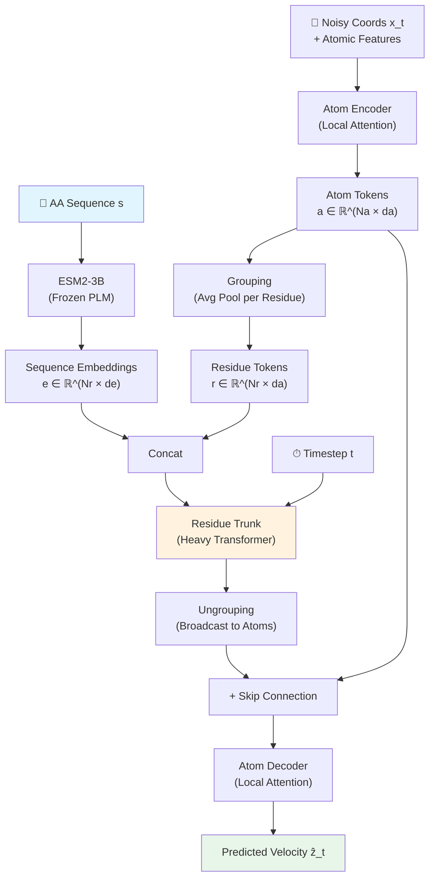

단백질 구조 예측에서 AlphaFold2가 제시한 triangle attention, pair representation, MSA — 이 모든 것이 정말 "필수"일까? Apple에서 나온 SimpleFold는 이 질문에 정면으로 도전한다. **일반 목적 Transformer + Flow Matching**만으로, 도메인 특화 모듈을 전부 제거하고도 competitive한 folding 성능을 달성했다. 심지어 ensemble prediction에서는 기존 방법들을 능가하기도 한다.

이 논문이 흥미로운 이유는 단순하다: protein folding을 "text-to-image" 생성 문제와 동일한 프레임워크로 풀 수 있다는 것을 보여주었기 때문이다. 아미노산 서열이 "텍스트 프롬프트"이고, 3D 원자 좌표가 "생성된 이미지"인 셈이다.

## Problem: 왜 SimpleFold가 필요한가

AlphaFold2 이후 protein folding 모델들은 공통적으로 복잡한 도메인 특화 아키텍처에 의존해왔다:

- **MSA (Multiple Sequence Alignment)**: 진화적 정보를 추출하기 위한 비용이 큰 검색 과정
- **Pair representation**: 잔기 쌍 간의 관계를 명시적으로 모델링하는 $O(N^2)$ 행렬
- **Triangle attention/updates**: pair representation을 업데이트하는 고비용 연산

이 설계들은 "단백질 구조 생성 과정에 대한 현재의 이해"를 모델에 하드코딩한 것이다. 하지만 vision 분야에서 범용 Transformer가 도메인 특화 아키텍처를 대체한 것처럼, protein folding에서도 같은 일이 가능하지 않을까?

또 다른 문제는 **ensemble generation**이다. 기존 folding 모델 대부분은 deterministic regression objective로 학습되어, 하나의 구조만 예측한다. 하지만 실제 단백질은 여러 conformation의 앙상블로 존재하며, 이를 모델링하는 것이 drug discovery에서 cryptic pocket 발견 등에 핵심적이다.

> SimpleFold는 이 두 가지 문제를 동시에 해결한다: 아키텍처 단순화 + 생성적 접근을 통한 ensemble modeling.
{: .prompt-tip }

## Key Idea: Text-to-3D로서의 Protein Folding

SimpleFold의 핵심 아이디어는 놀라울 정도로 직관적이다:

1. **아미노산 서열 → 3D 구조** 매핑을 conditional generative model로 캐스팅
2. **Flow Matching** objective로 noise에서 all-atom 구조를 생성
3. 아키텍처는 DiT (Diffusion Transformer) 스타일의 **adaptive layer가 있는 표준 Transformer 블록**만 사용
4. Pair representation, triangle update, MSA 모두 제거

기존 flow matching 기반 protein 모델들(AlphaFlow, ESMFlow, Proteina)이 여전히 AlphaFold2의 도메인 특화 모듈을 유지했던 것과 대비된다. SimpleFold는 처음부터 순수 생성 모델로 from scratch 학습한 최초의 flow matching protein folding 모델이다.

## How it works

### Overview

전체 파이프라인은 크게 세 단계다: (1) noisy 원자 좌표를 atom-level로 인코딩, (2) residue-level trunk에서 heavy 연산 수행, (3) 다시 atom-level로 디코딩하여 velocity field 예측.


_Figure 2: SimpleFold 아키텍처. Atom Encoder → Grouping → Residue Trunk → Ungrouping → Atom Decoder. 모든 모듈이 동일한 adaptive layer Transformer 블록을 공유한다. 출처: 원 논문_



### Representation: Hierarchical "Fine → Coarse → Fine"

SimpleFold는 단백질의 계층적 구조를 "fine → coarse → fine" 스킴으로 처리한다:

- **Fine (Atom level)**: Atom Encoder에서 각 원자의 noisy 좌표 + 원자 특성(type, charge)을 처리. **Local attention mask**를 사용하여 같은 잔기 및 인접 잔기의 원자들끼리만 attend.
- **Coarse (Residue level)**: **Grouping** 연산으로 한 잔기에 속한 atom token들을 평균 풀링하여 residue token을 생성. 여기서 ESM2-3B의 sequence embedding과 concat되어 Residue Trunk에 입력.
- **Fine (Atom level)**: **Ungrouping**으로 residue token을 다시 atom 수만큼 broadcast. Atom Encoder의 출력과 skip connection을 더한 후 Atom Decoder에서 최종 velocity field 예측.


_Figure 5: Grouping과 Ungrouping 연산. Grouping은 같은 잔기의 atom token을 평균 풀링, Ungrouping은 residue token을 atom 수만큼 복제. 출처: 원 논문_

### Core Architecture: Adaptive Layer Transformer

SimpleFold의 모든 모듈(Atom Encoder, Residue Trunk, Atom Decoder)은 **동일한 빌딩 블록**을 사용한다: adaptive layer normalization이 있는 표준 Transformer 블록.


_Figure 4: (a) AlphaFold2의 Evoformer — pair representation과 triangle attention이 포함된 복잡한 구조. (b) SimpleFold의 Transformer 블록 — adaptive layer만으로 구성된 단순한 구조. 출처: 원 논문_

각 Transformer 블록의 구성:

1. **Adaptive LayerNorm (adaLN)**: timestep $t$를 conditioning으로 받아 scale/shift 파라미터를 생성
2. **Multi-Head Attention (MHA)**: QK-normalization 적용
3. **SwiGLU FFN**: 표준 FFN 대신 SwiGLU 활성화 함수 사용
4. **RoPE**: Residue Trunk에서는 1D RoPE, Atom Encoder/Decoder에서는 **4D Axial RoPE** (3D 원자 좌표 + 1D residue index)

모델 구성 (최소 → 최대):

| Model | Params | GFLOPs | Trunk Dim | Trunk Heads | Trunk Blocks |
|---|---|---|---|---|---|
| SimpleFold-100M | 94M | 66.5 | 768 | 12 | 8 |
| SimpleFold-360M | 360M | 189.9 | 1024 | 16 | 18 |
| SimpleFold-700M | 687M | 310.4 | 1152 | 16 | 28 |
| SimpleFold-1.1B | 1.11B | 496.0 | 1280 | 20 | 36 |
| SimpleFold-3B | 2.86B | 1382.4 | 2048 | 32 | 36 |

AlphaFold2는 ~95M 파라미터인데 forward GFLOPs가 **~30,935**이다. SimpleFold-3B는 2.86B 파라미터임에도 **~1,382 GFLOPs**. Triangle update와 pair representation의 제거가 계산 효율을 극적으로 개선한다.

<details>
<summary>📝 Overall Architecture Pseudocode (클릭하여 펼치기)</summary>

```python
class SimpleFold(nn.Module):
    """SimpleFold: Flow Matching Protein Folding Model"""
    
    def __init__(self, config):
        super().__init__()
        # Frozen PLM for sequence conditioning
        self.plm = ESM2_3B(frozen=True)  # (Nr, de=2560)
        
        # Atom Encoder: local attention Transformer
        self.atom_encoder = TransformerStack(
            dim=config.atom_dim,      # e.g., 640 for 3B
            heads=config.atom_heads,  # e.g., 10
            blocks=config.atom_blocks,# e.g., 4
            local_attention=True,     # attend only within nearby residues
            rope_mode="4d_axial",     # 3D coords + 1D residue index
        )
        
        # Residue Trunk: heavy global attention Transformer
        self.residue_trunk = TransformerStack(
            dim=config.trunk_dim,     # e.g., 2048 for 3B
            heads=config.trunk_heads, # e.g., 32
            blocks=config.trunk_blocks,# e.g., 36
            local_attention=False,    # full global attention
            rope_mode="1d",           # residue sequence position
        )
        
        # Atom Decoder: symmetric to encoder
        self.atom_decoder = TransformerStack(
            dim=config.atom_dim,
            heads=config.atom_heads,
            blocks=config.atom_blocks,
            local_attention=True,
            rope_mode="4d_axial",
        )
        
        # Projections
        self.seq_proj = nn.Linear(config.atom_dim + config.de, config.trunk_dim)
        self.ungroup_proj = nn.Linear(config.trunk_dim, config.atom_dim)
        self.output_proj = nn.Linear(config.atom_dim, 3)  # velocity in R^3
    
    def forward(self, x_t, seq, t):
        """
        x_t: (B, Na, 3) noisy atom coords at timestep t
        seq: (B, Nr) amino acid sequence
        t: (B,) timestep in [0, 1]
        Returns: (B, Na, 3) predicted velocity field
        """
        # Step 1: Encode sequence with frozen PLM
        e = self.plm(seq)  # (B, Nr, de)
        
        # Step 2: Atom Encoder (fine level)
        atom_features = build_atom_features(x_t)  # concat coords + type + charge
        a = self.atom_encoder(atom_features, t)     # (B, Na, da)
        a_skip = a  # save for skip connection
        
        # Step 3: Grouping — avg pool atoms per residue
        r = grouping(a, residue_map)  # (B, Nr, da)
        
        # Step 4: Concat sequence embeddings + project
        r = self.seq_proj(torch.cat([r, e], dim=-1))  # (B, Nr, d_trunk)
        
        # Step 5: Residue Trunk (coarse level) — heavy computation
        r = self.residue_trunk(r, t)  # (B, Nr, d_trunk)
        
        # Step 6: Ungrouping — broadcast residue tokens to atoms
        a = self.ungroup_proj(ungrouping(r, residue_map))  # (B, Na, da)
        a = a + a_skip  # skip connection
        
        # Step 7: Atom Decoder (fine level)
        a = self.atom_decoder(a, t)  # (B, Na, da)
        
        # Step 8: Output velocity
        v_t = self.output_proj(a)  # (B, Na, 3)
        return v_t
```

</details>

### Key Innovation: 도메인 특화 모듈 없이 학습 가능한 이유

SimpleFold가 pair representation과 triangle attention 없이도 작동하는 이유는 두 가지다:

1. **ESM2-3B의 강력한 sequence embedding**: 진화적 정보를 MSA 대신 pretrained PLM에서 추출. ESM2는 이미 수억 개의 단백질 서열로 학습되어 풍부한 co-evolutionary 정보를 담고 있다.

2. **스케일의 힘**: 100M에서 3B까지 스케일업하면서 성능이 지속적으로 향상된다. 특히 어려운 벤치마크(CASP14)에서 스케일링 효과가 더 크게 나타난다. 이는 충분한 용량을 가진 범용 모델이 도메인 지식을 데이터로부터 직접 학습할 수 있음을 시사한다.

### Training & Inference

**Training Objective**: Flow Matching loss + LDDT loss의 가중합.

$$\ell = \ell_{\text{FM}} + \alpha(t) \cdot \ell_{\text{LDDT}}$$

Flow Matching loss는 표준 velocity matching이다:

$$\ell_{\text{FM}} = \mathbb{E}_{x, s, \epsilon, t} \left[ \frac{1}{N_a} \| v_\theta(x_t, s, t) - (x - \epsilon) \|^2 \right]$$

여기서 linear interpolant path $x_t = tx + (1-t)\epsilon$를 사용한다 (rectified flow와 동일).

LDDT loss는 생성된 구조의 local atomic distance 정확도를 측정한다:

$$\ell_{\text{LDDT}} = \mathbb{E} \left[ \frac{\sum_{i \neq j} \mathbf{1}(\delta_{ij} < C) \cdot \sigma(\| \delta_{ij} - \hat{\delta}^t_{ij} \|)}{\sum \mathbf{1}(\delta_{ij} < C)} \right]$$

<details>
<summary>📝 Training Loop Pseudocode (클릭하여 펼치기)</summary>

```python
# Training Loop
for batch in dataloader:
    x = batch["all_atom_coords"]      # (B, Na, 3) ground truth
    s = batch["aa_sequence"]           # (B, Nr) amino acid sequence
    
    # Sample timestep from shifted logistic-normal
    # Biased toward t=1 (clean data) for fine structure learning
    t = 0.98 * logistic_normal(0.8, 1.7) + 0.02 * uniform(0, 1)  # (B,)
    
    # Linear interpolant: noise → data
    eps = torch.randn_like(x)           # (B, Na, 3)
    x_t = t * x + (1 - t) * eps        # noisy coords
    v_target = x - eps                  # target velocity
    
    # Forward
    v_pred = model(x_t, s, t)           # (B, Na, 3)
    
    # Flow Matching loss
    loss_fm = F.mse_loss(v_pred, v_target)
    
    # One-step Euler estimate for LDDT loss
    x_hat = x_t + (1 - t) * v_pred     # estimated clean structure
    loss_lddt = compute_lddt_loss(x, x_hat, cutoff=C)
    
    # Combined loss
    loss = loss_fm + alpha(t) * loss_lddt
    loss.backward()
    optimizer.step()
```

</details>

<details>
<summary>📝 Inference (Sampling) Pseudocode (클릭하여 펼치기)</summary>

```python
# Inference: Stochastic sampling via Langevin-style SDE
def fold_protein(model, sequence, n_steps=200, tau=0.01):
    """
    sequence: amino acid sequence
    tau: stochasticity scale (0.01 for folding, 0.6 for ensemble)
    """
    Na = get_num_atoms(sequence)
    x_t = torch.randn(1, Na, 3)  # x_0 ~ N(0, I)
    dt = 1.0 / n_steps
    
    for i in range(n_steps):
        t = i * dt  # t: 0 → 1
        
        # Predict velocity
        v = model(x_t, sequence, t)
        
        # Compute score from velocity: s_θ = (t·v - x_t) / (1-t)
        score = (t * v - x_t) / (1 - t + 1e-8)
        
        # Diffusion coefficient
        eta = 1e-5  # numerical stability
        w_t = 2 * (1 - t) / (t + eta)
        
        # Euler-Maruyama step
        drift = v * dt + 0.5 * w_t * score * dt
        diffusion = math.sqrt(tau * w_t * dt) * torch.randn_like(x_t)
        x_t = x_t + drift + diffusion
    
    return x_t  # folded all-atom structure
```

</details>

**Training Data**: 총 ~9M 구조 (3B 모델 기준)

| Source | 규모 | 필터 조건 |
|---|---|---|
| PDB (experimental) | ~160K | cutoff: May 2020 |
| SwissProt (AFDB distilled) | ~270K | pLDDT > 85, std < 15 |
| AFESM-E (distilled) | ~8.6M | pLDDT > 80, max 10/cluster |

**Timestep resampling**이 흥미로운 포인트다: 이미지 생성에서는 $t \approx 0.5$ 근처를 dense하게 샘플링하지만, 단백질에서는 **$t \approx 1$ (clean data) 근처를 oversampling**한다. 단백질의 "secondary structure → backbone → side chain" 계층적 구조 때문에, 데이터 manifold 가까이에서 더 많이 학습해야 fine-grained side chain 위치를 정확하게 모델링할 수 있다.

## Results

### Protein Folding (CAMEO22 & CASP14)

| Model | Type | CAMEO22 TM↑ | CASP14 TM↑ | CASP14 GDT↑ |
|---|---|---|---|---|
| **AlphaFold2** | MSA + Regression | 0.863 / 0.942 | **0.845 / 0.907** | **0.783 / 0.855** |
| RoseTTAFold2 | MSA + Regression | 0.864 / 0.947 | 0.802 / 0.881 | 0.740 / 0.824 |
| ESMFold | PLM + Regression | 0.853 / 0.933 | 0.701 / 0.792 | 0.622 / 0.711 |
| ESMFlow | PLM + Flow Matching | 0.818 / 0.893 | 0.627 / 0.679 | 0.539 / 0.544 |
| **SimpleFold-3B** | PLM + Flow Matching | **0.837 / 0.916** | **0.720 / 0.792** | **0.639 / 0.703** |

(각 메트릭은 mean / median. Bold는 PLM 기반 모델 중 최고.)

SimpleFold-3B는 같은 PLM + Flow Matching 조합인 ESMFlow를 크게 능가하며, PLM + Regression인 ESMFold도 CASP14에서 앞선다. MSA 기반 AlphaFold2와의 격차는 여전히 존재하지만, MSA 없이 이 수준에 도달한 것이 핵심이다.

### Ensemble Generation (ATLAS MD & Two-State)

| Model | Pairwise RMSD r↑ | Global RMSF r↑ | Exposed Residue J↑ |
|---|---|---|---|
| AlphaFold2 | 0.10 | 0.21 | 0.32 |
| ESMFlow-MD | 0.19 | 0.31 | 0.49 |
| AlphaFlow-MD | 0.48 | 0.60 | 0.50 |
| **SimpleFold** (no tuning) | **0.44** | **0.45** | **0.39** |
| **SimpleFold-MD** (tuned) | 0.45 | 0.48 | **0.60** |

Ensemble prediction에서 SimpleFold는 **별도 fine-tuning 없이도** ESMFlow-MD보다 우수한 성능을 보인다. 특히 exposed residue (drug discovery에서 cryptic pocket 발견에 중요한 지표)에서 fine-tuned SimpleFold-MD가 0.60으로 최고 성능을 달성했다.


_Figure 3: SimpleFold의 스케일링 행동. 모델 크기와 데이터 증가에 따라 folding 성능이 지속적으로 향상된다. 출처: 원 논문_

### Scaling Behavior

위 Figure 3에서 확인할 수 있듯이, SimpleFold는 model size와 data size 양쪽 모두에서 **명확한 scaling 행동**을 보인다. 특히 CASP14 같은 어려운 벤치마크에서 스케일링 효과가 더 두드러진다. 논문에 따르면, protein folding에서 이러한 스케일링 행동을 체계적으로 보인 것은 SimpleFold가 처음이다.

## Discussion

### 저자가 밝힌 한계와 향후 방향

- SimpleFold는 AlphaFold2 수준에는 미치지 못한다. MSA 기반 모델과의 격차를 줄이는 것이 향후 과제.
- 현재는 single-chain folding에 집중했으며, protein complex prediction으로의 확장이 자연스러운 다음 단계.
- 논문에서는 더 큰 모델(3B 이상)과 더 많은 학습 데이터로 계속 성능이 향상될 것으로 기대하고 있다.

### 재현성

- **코드 공개**: ✅ [apple/ml-simplefold](https://github.com/apple/ml-simplefold) (Jupyter notebook 포함)
- **학습 데이터**: PDB (공개), AFDB/AFESM (공개) — 접근 가능
- **필요 GPU**: 논문 미명시, 3B 모델 규모로 추정 시 대규모 GPU 클러스터 필요
- **재현 난이도**: ⭐⭐⭐ (중간 — 학습 규모는 크지만 코드 공개됨)

> 이전에 리뷰한 [AlphaFold2](/posts/alphafold2-highly-accurate-protein-structure-prediction/)와 비교하면, SimpleFold는 아키텍처 단순화의 극단을 보여준다. AlphaFold2의 Evoformer에서 triangle attention과 pair representation이 핵심이었다면, SimpleFold는 이 모든 것을 표준 Transformer로 대체했다.
{: .prompt-info }

## TL;DR

- **SimpleFold는 도메인 특화 모듈(MSA, pair representation, triangle attention)을 전부 제거하고**, 표준 Transformer + Flow Matching만으로 protein folding을 수행하는 최초의 모델이다.
- 3B 파라미터까지 스케일하여 PLM 기반 모델 중 최고 성능을 달성하고, **ensemble prediction에서는 MSA 기반 모델도 능가**한다.
- Protein folding에서의 **scaling law**를 처음으로 체계적으로 보여, 범용 아키텍처 + 대규모 학습이 도메인 지식을 대체할 수 있는 방향을 제시했다.

## Paper Info

| 항목 | 내용 |
|---|---|
| **Title** | SimpleFold: Folding Proteins is Simpler than You Think |
| **Authors** | Yuyang Wang, Jiarui Lu, Navdeep Jaitly, Josh Susskind, Miguel Angel Bautista (Apple) |
| **Venue** | ICLR 2026 (Poster) |
| **Paper** | [OpenReview](https://openreview.net/forum?id=0j0MmK7EMA) · [arXiv](https://arxiv.org/abs/2509.18480) |
| **Code** | 미공개 |

---

> 이 글은 LLM(Large Language Model)의 도움을 받아 작성되었습니다. 
> 논문의 내용을 기반으로 작성되었으나, 부정확한 내용이 있을 수 있습니다.
> 오류 지적이나 피드백은 언제든 환영합니다.
{: .prompt-info }
