단백질 구조 예측에서 AlphaFold2가 제시한 triangle attention, pair representation, MSA — 이 모든 것이 정말 "필수"일까? Apple에서 나온 SimpleFold는 이 질문에 정면으로 도전한다. 일반 목적 [Transformer](/posts/attention-is-all-you-need/) + Flow Matching만으로, 도메인 특화 모듈을 전부 제거하고도 competitive한 folding 성능을 달성했다. 심지어 ensemble prediction에서는 기존 방법들을 능가하기도 한다.

이 논문이 흥미로운 이유는 단순하다: protein folding을 "text-to-image" 생성 문제와 동일한 프레임워크로 풀 수 있다는 것을 보여주었기 때문이다. 아미노산 서열이 "텍스트 프롬프트"이고, 3D 원자 좌표가 "생성된 이미지"인 셈이다.

## Problem: 왜 SimpleFold가 필요한가

[AlphaFold2](/posts/alphafold2-highly-accurate-protein-structure-prediction/) 이후 protein folding 모델들은 공통적으로 복잡한 도메인 특화 아키텍처에 의존해왔다:

- **MSA (Multiple Sequence Alignment)**: 진화적 정보를 추출하기 위한 비용이 큰 검색 과정
- **Pair representation**: 잔기 쌍 간의 관계를 명시적으로 모델링하는 $O(N^2)$ 행렬
- **Triangle attention/updates**: pair representation을 업데이트하는 고비용 연산

이 설계들은 "단백질 구조 생성 과정에 대한 현재의 이해"를 모델에 하드코딩한 것이다. 하지만 vision 분야에서 범용 Transformer가 도메인 특화 아키텍처를 대체한 것처럼, protein folding에서도 같은 일이 가능하지 않을까?

또 다른 문제는 ensemble generation이다. 기존 folding 모델 대부분은 deterministic regression objective로 학습되어, 하나의 구조만 예측한다. 하지만 실제 단백질은 여러 conformation의 앙상블로 존재하며, 이를 모델링하는 것이 drug discovery에서 cryptic pocket 발견 등에 핵심적이다.

SimpleFold는 이 두 가지 문제를 동시에 해결한다: 아키텍처 단순화 + 생성적 접근을 통한 ensemble modeling.

## Key Idea: Text-to-3D로서의 Protein Folding

SimpleFold의 핵심 아이디어는 놀라울 정도로 직관적이다:

- 아미노산 서열 → 3D 구조 매핑을 **conditional generative model**로 캐스팅
- **Flow Matching** objective로 noise에서 all-atom 구조를 생성
- 아키텍처는 **DiT (Diffusion Transformer)** 스타일의 adaptive layer가 있는 표준 Transformer 블록만 사용
- **Pair representation, triangle update, MSA 모두 제거**

기존 flow matching 기반 protein 모델들(AlphaFlow, ESMFlow, Proteina)이 여전히 AlphaFold2의 도메인 특화 모듈을 유지했던 것과 대비된다. SimpleFold는 처음부터 순수 생성 모델로 from scratch 학습한 최초의 flow matching protein folding 모델이다.

## How it works

### Overview

전체 파이프라인은 크게 세 단계다: (1) noisy 원자 좌표를 atom-level로 인코딩, (2) residue-level trunk에서 heavy 연산 수행, (3) 다시 atom-level로 디코딩하여 velocity field 예측.


_Figure 2: SimpleFold 아키텍처. Atom Encoder → Grouping → Residue Trunk → Ungrouping → Atom Decoder. 모든 모듈이 동일한 adaptive layer Transformer 블록을 공유한다. 출처: 원 논문_

```mermaid
graph TD
    A["🧬 AA Sequence s"] --> PLM["ESM2-3B<br/>(Frozen PLM)"]
    PLM --> E["Sequence Embeddings<br/>e ∈ ℝ<sup>N<sub>r</sub> × d<sub>e</sub></sup>"]

    N["🎲 Noisy Coords x<sub>t</sub><br/>+ Atomic Features"] --> AE["Atom Encoder<br/>(Local Attention)"]
    AE --> AT["Atom Tokens<br/>a ∈ ℝ<sup>N<sub>a</sub> × d<sub>a</sub></sup>"]
    AT --> G["Grouping<br/>(Avg Pool per Residue)"]
    G --> RT["Residue Tokens<br/>r ∈ ℝ<sup>N<sub>r</sub> × d<sub>a</sub></sup>"]

    RT --> CAT["Concat"]
    E --> CAT
    CAT --> TRUNK["Residue Trunk<br/>(Heavy Transformer)"]

    T["⏱ Timestep t"] --> TRUNK

    TRUNK --> UG["Ungrouping<br/>(Broadcast to Atoms)"]
    UG --> SKIP["+ Skip Connection"]
    AT --> SKIP
    SKIP --> AD["Atom Decoder<br/>(Local Attention)"]
    AD --> V["Predicted Velocity v̂<sub>t</sub>"]

    style A fill:#e1f5fe
    style V fill:#e8f5e9
    style TRUNK fill:#fff3e0
```



<details markdown="1">
<summary>📝 Overall Architecture Pseudocode (클릭하여 펼치기)</summary>

```python
class SimpleFold(nn.Module):
    """SimpleFold: Flow Matching Protein Folding Model"""
    
    def __init__(self, config):
        super().__init__()
        # Frozen PLM for sequence conditioning
        self.plm = ESM2_3B(frozen=True)  # → (Nr, de=2560)
        
        # Atom Encoder: local attention Transformer
        self.atom_encoder = TransformerStack(
            dim=config.atom_dim,       # e.g., 640 for 3B
            heads=config.atom_heads,   # e.g., 10
            blocks=config.atom_blocks, # e.g., 4
            local_attention=True,      # attend only within nearby residues
            rope_mode="4d_axial",      # 3D coords + 1D residue index
        )
        
        # Residue Trunk: heavy global attention Transformer
        self.residue_trunk = TransformerStack(
            dim=config.trunk_dim,       # e.g., 2048 for 3B
            heads=config.trunk_heads,   # e.g., 32
            blocks=config.trunk_blocks, # e.g., 36
            local_attention=False,      # full global attention
            rope_mode="1d",             # residue sequence position
        )
        
        # Atom Decoder: symmetric to encoder
        self.atom_decoder = TransformerStack(
            dim=config.atom_dim,
            heads=config.atom_heads,
            blocks=config.atom_blocks,
            local_attention=True,
            rope_mode="4d_axial",
        )
        
        # Projections
        self.seq_proj = nn.Linear(config.atom_dim + config.de, config.trunk_dim)
        self.ungroup_proj = nn.Linear(config.trunk_dim, config.atom_dim)
        self.output_proj = nn.Linear(config.atom_dim, 3)  # velocity in R^3
    
    def forward(self, x_t: Tensor, seq: Tensor, t: Tensor) -> Tensor:
        """
        x_t: (B, Na, 3) noisy atom coords at timestep t
        seq: (B, Nr) amino acid sequence
        t: (B,) timestep in [0, 1]
        Returns: (B, Na, 3) predicted velocity field v̂_t
        """
        # Step 1: Encode sequence with frozen PLM
        e = self.plm(seq)                               # (B, Nr, de)
        
        # Step 2: Atom Encoder (fine level)
        atom_features = build_atom_features(x_t)        # concat coords + type + charge
        a = self.atom_encoder(atom_features, t)          # (B, Na, da)
        a_skip = a                                       # save for skip connection
        
        # Step 3: Grouping — avg pool atoms per residue
        r = grouping(a, residue_map)                     # (B, Nr, da)
        
        # Step 4: Concat sequence embeddings + project
        r = self.seq_proj(torch.cat([r, e], dim=-1))     # (B, Nr, d_trunk)
        
        # Step 5: Residue Trunk (coarse level) — heavy computation
        r = self.residue_trunk(r, t)                     # (B, Nr, d_trunk)
        
        # Step 6: Ungrouping — broadcast residue tokens to atoms
        a = self.ungroup_proj(ungrouping(r, residue_map)) # (B, Na, da)
        a = a + a_skip                                    # skip connection
        
        # Step 7: Atom Decoder (fine level)
        a = self.atom_decoder(a, t)                      # (B, Na, da)
        
        # Step 8: Output velocity
        v_t = self.output_proj(a)                        # (B, Na, 3)
        return v_t
```

</details>


### Representation: Hierarchical "Fine → Coarse → Fine"

SimpleFold는 단백질의 계층적 구조를 "fine → coarse → fine" 스킴으로 처리한다:

- **Fine (Atom level)**: Atom Encoder에서 각 원자의 noisy 좌표 + 원자 특성(type, charge)을 처리. **Local attention mask**를 사용하여 같은 잔기 및 인접 잔기의 원자들끼리만 attend.
- **Coarse (Residue level)**: Grouping 연산으로 한 잔기에 속한 atom token들을 평균 풀링하여 residue token을 생성. 여기서 ESM2-3B의 sequence embedding과 concat되어 Residue Trunk에 입력.
- **Fine (Atom level)**: **Ungrouping**으로 residue token을 다시 atom 수만큼 broadcast. Atom Encoder의 출력과 skip connection을 더한 후 Atom Decoder에서 최종 velocity field 예측.


_Figure 5: Grouping과 Ungrouping 연산. Grouping은 같은 잔기의 atom token을 평균 풀링, Ungrouping은 residue token을 atom 수만큼 복제. 출처: 원 논문_

### Core Architecture: Adaptive Layer Transformer

SimpleFold의 모든 모듈(Atom Encoder, Residue Trunk, Atom Decoder)은 **동일한 빌딩 블록**을 사용한다: adaptive layer normalization이 있는 표준 Transformer 블록.


_Figure 4: (a) AlphaFold2의 Evoformer — pair representation과 triangle attention이 포함된 복잡한 구조. (b) SimpleFold의 Transformer 블록 — adaptive layer만으로 구성된 단순한 구조. 출처: 원 논문_

각 Transformer 블록의 구성:

1. **Adaptive LayerNorm (adaLN)**: timestep $t$를 conditioning으로 받아 scale/shift 파라미터를 생성
2. **Multi-Head Attention**: QK-normalization 적용
3. **SwiGLU FFN**: 표준 FFN 대신 SwiGLU 사용 (학습 안정성 + 성능)
4. **RoPE**: Residue Trunk에서는 1D RoPE, Atom Encoder/Decoder에서는 **4D Axial RoPE** (3D 원자 좌표 + 1D residue index)

<details markdown="1">
<summary>📝 Adaptive Layer Transformer Block (클릭하여 펼치기)</summary>

```python
class AdaptiveTransformerBlock(nn.Module):
    """SimpleFold의 기본 빌딩 블록 — DiT 스타일 adaptive layer"""
    
    def __init__(self, dim: int, heads: int, local_attention: bool = False):
        super().__init__()
        self.norm1 = nn.LayerNorm(dim)
        self.norm2 = nn.LayerNorm(dim)
        self.attn = MultiHeadAttention(
            dim=dim, heads=heads,
            qk_norm=True,                   # QK-normalization
            local_mask=local_attention,      # local attention for atom level
        )
        self.ffn = SwiGLU(dim)              # SwiGLU replaces standard FFN
        
        # adaLN: timestep t → (scale1, shift1, gate1, scale2, shift2, gate2)
        self.ada_proj = nn.Linear(dim, 6 * dim)
    
    def forward(self, x: Tensor, t_emb: Tensor) -> Tensor:
        """
        x: (B, N, dim) input tokens
        t_emb: (B, dim) timestep embedding
        """
        # Compute adaptive parameters from timestep
        s1, b1, g1, s2, b2, g2 = self.ada_proj(t_emb).chunk(6, dim=-1)
        
        # Attention with adaLN
        h = self.norm1(x) * (1 + s1) + b1           # adaLN modulation
        h = self.attn(h)                              # (B, N, dim)
        x = x + g1 * h                               # gated residual
        
        # FFN with adaLN
        h = self.norm2(x) * (1 + s2) + b2
        h = self.ffn(h)
        x = x + g2 * h
        
        return x
```

</details>


> SimpleFold는 AlphaFold2의 Evoformer에서 triangle attention과 pair representation이 핵심이었던 것과 달리, 이 모든 것을 표준 Transformer로 대체했다. Rotational symmetry는 equivariant architecture 대신 **SO(3) data augmentation**으로 처리한다.
{: .prompt-info }

### Key Innovation: 도메인 특화 모듈 없이 학습 가능한 이유

SimpleFold가 pair representation과 triangle attention 없이도 작동하는 이유는 두 가지다:

1. **ESM2-3B의 강력한 sequence embedding**: 진화적 정보를 MSA 대신 pretrained PLM에서 추출. ESM2는 이미 수억 개의 단백질 서열로 학습되어 풍부한 co-evolutionary 정보를 담고 있다.

2. **스케일의 힘**: 100M에서 3B까지 스케일업하면서 성능이 지속적으로 향상된다. 특히 어려운 벤치마크(CASP14)에서 스케일링 효과가 더 크게 나타난다. 이는 충분한 용량을 가진 범용 모델이 도메인 지식을 데이터로부터 직접 학습할 수 있음을 시사한다.


_Figure 3: SimpleFold의 모델 크기별 성능 스케일링과 consumer hardware에서의 inference 시간. 출처: 원 논문_

### Training & Inference

**Training Objective**: Flow Matching loss + LDDT loss의 가중합.

$$\ell = \ell_{\text{FM}} + \alpha(t) \cdot \ell_{\text{LDDT}}$$

Flow Matching loss는 표준 velocity matching이다:

$$\ell_{\text{FM}} = \mathbb{E}_{x, s, \epsilon, t} \left[ \frac{1}{N_a} \| v_\theta(x_t, s, t) - (x - \epsilon) \|^2 \right]$$

여기서 linear interpolant path $x_t = tx + (1-t)\epsilon$를 사용한다 (rectified flow와 동일).

LDDT loss는 생성된 구조의 local atomic distance 정확도를 측정한다. One-step Euler로 추정한 구조 $\hat{x} = x_t + (1-t)v_\theta$의 원자 간 거리와 ground truth 간 거리를 비교한다. 이 auxiliary loss가 특히 side chain 같은 세밀한 구조의 정확도를 높이는 데 기여한다.

**Timestep resampling**: 일반적인 image generation에서는 $t=0.5$ 근처를 oversampling하지만, SimpleFold는 **$t=1$ (clean data) 근처를 oversampling**한다: $p(t) = 0.98 \cdot \text{LN}(0.8, 1.7) + 0.02 \cdot \mathcal{U}(0, 1)$. 이는 단백질 구조의 "secondary structure → backbone → side chain" 계층 때문이다.

<details markdown="1">
<summary>📝 Training Loop Pseudocode (클릭하여 펼치기)</summary>

```python
# Training Loop
for batch in dataloader:
    x = batch["all_atom_coords"]       # (B, Na, 3) ground truth
    s = batch["aa_sequence"]           # (B, Nr) amino acid sequence
    
    # Sample timestep from shifted logistic-normal
    # Biased toward t=1 (clean data) for fine structure learning
    t = 0.98 * logistic_normal(0.8, 1.7) + 0.02 * uniform(0, 1)  # (B,)
    
    # Linear interpolant: noise → data
    eps = torch.randn_like(x)            # (B, Na, 3) — ε ~ N(0, I)
    x_t = t * x + (1 - t) * eps         # noisy coords — Eq. 2.1
    v_target = x - eps                   # target velocity — v_t = x - ε
    
    # Forward pass
    v_pred = model(x_t, s, t)           # (B, Na, 3) — predicted v̂_θ
    
    # Flow Matching loss — Eq. 2.2
    loss_fm = F.mse_loss(v_pred, v_target)
    
    # One-step Euler estimate for LDDT loss
    x_hat = x_t + (1 - t) * v_pred     # estimated clean structure
    loss_lddt = compute_lddt_loss(x, x_hat, cutoff=C)  # Eq. 2.3
    
    # Combined loss — Eq. 2.4
    # Pre-training: α(t) = 1
    # Finetuning:   α(t) = 1 + 8 * ReLU(t - 0.5)
    loss = loss_fm + alpha(t) * loss_lddt
    loss.backward()
    optimizer.step()
```

</details>


<details markdown="1">
<summary>📝 Inference (Sampling) Pseudocode (클릭하여 펼치기)</summary>

```python
# Inference: Stochastic sampling via Langevin-style SDE — Eq. 2.5
def fold_protein(model, sequence, n_steps=200, tau=0.01):
    """
    sequence: amino acid sequence
    tau: stochasticity scale
         0.01 for single structure folding
         0.6  for ensemble generation
    """
    Na = get_num_atoms(sequence)
    x_t = torch.randn(1, Na, 3)   # x_0 ~ N(0, I) — start from noise
    dt = 1.0 / n_steps
    
    for i in range(n_steps):
        t = i * dt                 # t: 0 → 1
        
        # Predict velocity field
        v = model(x_t, sequence, t)                    # v̂_θ(x_t, s, t)
        
        # Compute score from velocity — s_θ = (t·v - x_t) / (1-t)
        score = (t * v - x_t) / (1 - t + 1e-8)
        
        # Diffusion coefficient — w(t) = 2(1-t) / (t + η)
        eta = 1e-5
        w_t = 2 * (1 - t) / (t + eta)
        
        # Euler-Maruyama step
        drift = v * dt + 0.5 * w_t * score * dt
        diffusion = math.sqrt(tau * w_t * dt) * torch.randn_like(x_t)
        x_t = x_t + drift + diffusion
    
    return x_t  # folded all-atom structure
```

</details>


**Training Data**: 총 ~9M 구조 (3B 모델 기준)

| 데이터 소스 | 구조 수 | 설명 |
|---|---|---|
| **PDB** | ~160K | 실험 구조 (cutoff: May 2020) |
| **SwissProt (AFDB)** | ~270K | pLDDT > 85, std < 15 필터 |
| **AFESM** | ~1.9M | 클러스터 대표, pLDDT > 0.8 |
| **AFESM-E** (3B only) | ~8.6M | 클러스터당 최대 10개 |

2단계 학습: Pre-training (전체 데이터, max length 256) → Finetuning (PDB + SwissProt, max length 512, LDDT loss 가중치 증가).

## Results

핵심 벤치마크인 CAMEO22와 CASP14에서의 결과를 정리한다. SimpleFold는 MSA를 사용하지 않으면서도 PLM 기반 baseline들과 competitive하거나 더 나은 성능을 보인다.

| Model | Type | CAMEO22 TM↑ | CASP14 TM↑ | CASP14 LDDT↑ |
|---|---|---|---|---|
| **AlphaFold2** | MSA | **0.863 / 0.942** | **0.845 / 0.907** | **0.778 / 0.817** |
| RoseTTAFold2 | MSA | 0.864 / 0.947 | 0.802 / 0.881 | 0.638 / 0.669 |
| AlphaFlow | MSA+FM | 0.840 / 0.927 | 0.740 / 0.812 | 0.632 / 0.662 |
| ESMFold | PLM | 0.853 / 0.933 | 0.701 / 0.792 | 0.637 / 0.705 |
| ESMFlow | PLM+FM | 0.818 / 0.893 | 0.627 / 0.679 | 0.525 / 0.539 |
| **SimpleFold-3B** | PLM+FM | 0.837 / 0.916 | 0.720 / 0.792 | 0.666 / 0.709 |
| SimpleFold-100M | PLM+FM | 0.803 / 0.878 | 0.611 / 0.628 | 0.537 / 0.549 |

수치가 말해주는 것: SimpleFold-3B는 CASP14에서 ESMFold(TM 0.701)을 넘어서는 TM-score 0.720을 달성했다. 두 모델 모두 PLM 기반이고 MSA를 사용하지 않지만, SimpleFold는 도메인 특화 모듈 없이도 더 나은 성능을 보여준다. CAMEO22에서는 AlphaFold2 대비 95% 이상의 성능을 유지한다.

> AlphaFlow, ESMFlow 같은 flow matching 모델들은 오히려 원래의 regression 모델(AlphaFold2, ESMFold)보다 folding benchmark에서 낮은 성능을 보인다. 이는 벤치마크가 단일 ground truth만 포함하기 때문으로, deterministic regression이 유리한 구조이다. SimpleFold는 이런 불리한 평가 방식에서도 competitive한 결과를 달성했다는 점에서 주목할 만하다.
{: .prompt-info }

**Ensemble Generation**: SimpleFold는 stochasticity parameter $\tau$를 조절해 conformation ensemble을 생성할 수 있다. MD ensemble 평가에서 별도의 finetuning 없이도 Pairwise RMSD correlation 0.44를 달성하며, AlphaFold2(0.10)보다 ensemble diversity를 잘 모델링한다. MD 데이터로 finetuning한 SimpleFold-MD는 AlphaFlow-MD와 comparable한 성능을 보인다.

**Scaling**: 100M → 3B 스케일업에 따라 모든 벤치마크에서 성능이 지속적으로 향상된다. 특히 어려운 CASP14에서의 개선폭이 CAMEO22보다 크다 — 더 큰 모델이 복잡한 folding 문제를 더 잘 해결한다는 증거다.

## Discussion

### 한계

논문에서 밝힌 한계는 다음과 같다:

- SimpleFold는 [AlphaFold2](/posts/alphafold2-highly-accurate-protein-structure-prediction/) 수준에는 미치지 못한다. MSA 기반 모델과의 격차를 줄이는 것이 향후 과제.
- 현재는 single-chain folding에 집중했으며, protein complex prediction으로의 확장이 자연스러운 다음 단계.
- 논문에서는 더 큰 모델(3B 이상)과 더 많은 학습 데이터로 계속 성능이 향상될 것으로 기대하고 있다.

### 재현성

- **코드 공개**: ✅ [apple/ml-simplefold](https://github.com/apple/ml-simplefold) (Jupyter notebook 포함)
- **학습 데이터**: PDB (공개), AFDB/AFESM (공개) — 접근 가능
- **필요 GPU**: 논문 미명시, 3B 모델 규모로 추정 시 대규모 GPU 클러스터 필요
- **재현 난이도**: ⭐⭐⭐ (중간 — 학습 규모는 크지만 코드 공개됨)

> 이전에 리뷰한 [AlphaFold2](/posts/alphafold2-highly-accurate-protein-structure-prediction/)와 비교하면, SimpleFold는 아키텍처 단순화의 극단을 보여준다. AlphaFold2의 Evoformer에서 triangle attention과 pair representation이 핵심이었다면, SimpleFold는 이 모든 것을 표준 Transformer로 대체했다.
{: .prompt-info }

## TL;DR

1. **SimpleFold**: MSA, pair representation, triangle attention 없이 **표준 Transformer + Flow Matching**만으로 protein folding을 달성한 최초의 모델.
2. **핵심 구조**: Atom Encoder → Grouping → Residue Trunk → Ungrouping → Atom Decoder. ESM2-3B로 sequence conditioning.
3. **성능**: CASP14에서 ESMFold를 능가하고, AlphaFold2 대비 ~85% 수준. Ensemble generation에서는 기존 방법 능가.

## Paper Info

| 항목 | 내용 |
|---|---|
| **Title** | Folding Proteins is Simpler than You Think |
| **Authors** | Dingquan Li et al. (Apple) |
| **Venue** | arXiv preprint (December 2025) |
| **Submitted** | 2025-09-25 |
| **Paper** | [arXiv](https://arxiv.org/abs/2509.18480) |
| **Code** | [GitHub](https://github.com/apple/ml-simplefold) |

---

> 이 글은 LLM(Large Language Model)의 도움을 받아 작성되었습니다. 
> 논문의 내용을 기반으로 작성되었으나, 부정확한 내용이 있을 수 있습니다.
> 오류 지적이나 피드백은 언제든 환영합니다.
{: .prompt-info }
