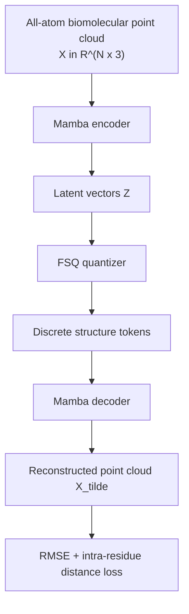

## Hook

요즘 biomolecular foundation model의 큰 흐름 중 하나는 구조를 **토큰화 가능한 표현**으로 바꾸는 것이다. sequence는 language model이 잘 다루지만, 3D structure는 그대로 집어넣기엔 너무 크고 무겁다. 그래서 실제 시스템들은 대개 residue-level backbone이나 coarse-grained representation으로 내려가고, atom-level detail은 별도 decoder나 후처리에 맡긴다. 문제는 이 과정에서 **정말 중요한 atomistic detail이 떨어져 나간다**는 점이다.

Bio2Token은 이 지점에서 정면으로 묻는다. “아예 처음부터 all-atom 구조를 discrete token sequence로 만들 수는 없을까?” 그리고 그 답으로, surprisingly simple한 **Mamba 기반 quantized auto-encoder(QAE)**를 제안한다. 이 모델은 단백질, RNA, small molecule을 모두 **원자 단위 point cloud**로 보고, 이를 discrete token으로 바꿨다가 다시 3D point cloud로 복원한다.

이 논문이 흥미로운 이유는 두 가지다. 첫째, 최근 구조 모델들이 너무 당연하게 받아들이는 **SE(3)-invariant architecture**를 꼭 쓰지 않아도, 충분한 학습 효율과 적절한 tokenizer design으로 sub-Å reconstruction이 가능하다고 주장한다. 둘째, Transformer나 IPA처럼 quadratic 또는 geometry-heavy한 모듈 대신 **Mamba state space model**을 써서, 거의 100,000 atoms에 가까운 구조까지 다루는 스케일을 보여준다.

즉, 이 논문은 generative structure modeling 자체를 푼다기보다, 그보다 앞단의 더 근본적인 질문을 푼다. **어떤 atomistic representation이 language-model-like downstream generative models의 입력이 될 수 있는가?** 이 글에서는 Bio2Token이 왜 굳이 all-atom tokenization을 노렸는지, QAE + FSQ + bidirectional Mamba 조합이 어떤 의미를 가지는지, 그리고 실제 결과가 어디까지 설득력 있는지를 정리해본다.

## Problem

구조 생성을 위한 biomolecular representation은 대체로 다음 딜레마를 안고 있다.

### 병목 1: coarse-graining은 계산을 줄여주지만 정보를 잃는다

단백질 구조 모델들은 종종 residue-level token이나 backbone-only representation을 사용한다. 대표적으로 ESM-3는 residue-level structure tokenizer를 쓰고, RFDiffusion-All-atom 같은 모델도 backbone 쪽을 더 중심적으로 다룬다. 이런 접근은 당연히 계산적으로 유리하다. 하지만 atom-level interaction, side-chain packing, ligand/RNA 접촉 같은 미세한 구조 정보는 따로 복원해야 한다.

즉, coarse-grained representation은 downstream generative model을 쉽게 만들지만, 동시에 **복원해야 할 정보량**도 크게 늘린다.

### 병목 2: all-atom representation은 길이가 너무 길다

반대로 원자 단위로 가면 구조는 point cloud 하나로 깔끔하게 표현된다. 하지만 sequence length가 급격히 늘어난다. residue-level이면 수백 길이인 단백질이 atom-level에서는 수천~수만 길이가 된다. RNA complex나 large protein assembly는 더 심하다.

이때 Transformer나 graph model은 다음 문제에 부딪힌다.

- self-attention의 $O(N^2)$ 비용
- long-range interaction을 읽기 위한 메모리 병목
- SE(3)-aware module의 추가 비용

그래서 all-atom tokenizer는 개념적으로 매력적이지만, 실제로는 **잘 안 스케일되는 문제**였다.

### 병목 3: structure tokenizer는 단순 압축이 아니라 reconstruction fidelity도 중요하다

구조 tokenizer는 그냥 latent compression model이 아니다. downstream에 discrete diffusion이나 language model을 얹으려면 token이 실제 구조를 충분히 잘 보존해야 한다. 특히 atomistic modeling에서는 작은 reconstruction error도 bond geometry, clash, stereochemistry를 무너뜨릴 수 있다.

즉, 좋은 structure tokenizer는 동시에 다음을 만족해야 한다.

- discrete token sequence를 만든다
- reconstruction RMSE가 낮다
- 대형 구조로 스케일된다
- 가능하면 biomolecule class를 가리지 않고 통합적으로 작동한다

Bio2Token은 바로 이 네 가지를 한 번에 노린다.

## Key Idea

Bio2Token의 핵심 아이디어는 한 문장으로 요약하면 이렇다.

> **all-atom biomolecular point cloud를 Mamba 기반 QAE로 연속 latent로 인코딩한 뒤, FSQ(Finite Scalar Quantization)로 discrete token으로 양자화하고 다시 point cloud로 복원한다.**

이 논문의 기여는 크게 네 가지다.

1. **All-atom tokenizer**
   - proteins, RNA, small molecules를 모두 원자 단위로 토큰화
   - unified tokenizer인 `bio2token`은 domain-specific tokenizer들을 넘어서는 범용성을 노린다

2. **Mamba backbone**
   - Transformer/IPA보다 긴 sequence에 더 효율적인 state space model 사용
   - long-context structure tokenization을 현실적인 GPU에서 돌릴 수 있게 함

3. **FSQ quantization**
   - VQ보다 학습이 안정적인 finite-scalar quantization 사용
   - codebook collapse를 피하면서 4096 vocabulary를 효율적으로 커버

4. **SE(3)-invariance 없이도 강한 reconstruction**
   - invariant feature engineering이나 IPA 없이도 sub-Å 수준 reconstruction 달성
   - inductive bias보다 학습 효율과 scale이 더 중요할 수 있음을 보여줌

핵심 비교는 아래처럼 볼 수 있다.

| | Residue-level tokenizers | IPA/SE(3)-heavy all-atom models | **Bio2Token** |
|---|---|---|---|
| 입력 해상도 | residue / backbone | all-atom 가능하지만 무거움 | **all-atom point cloud** |
| 주요 backbone | Transformer / GNN | IPA / equivariant modules | **Mamba SSM** |
| discrete tokenizer | 가능 | 가능하지만 비쌈 | **FSQ-based QAE** |
| scale | 중간 | 제한적 | **거대 biomolecule까지 확장** |
| 핵심 주장 | 압축 가능한 구조 표현 | geometry bias | **단순 architecture + 긴 컨텍스트 효율** |

내가 보기에 이 논문의 포인트는 “Mamba를 썼다”보다, **all-atom tokenizer를 실제로 돌아가게 만드는 최소한의 설계 조합**을 찾았다는 데 있다.

## How It Works

### Overview


_Figure 1: Bio2Token 전체 개요. 대형 biomolecular point cloud를 입력받아 Mamba 기반 encoder로 latent를 만들고, FSQ를 통해 discrete token으로 양자화한 뒤 decoder로 다시 all-atom point cloud를 복원한다. 출처: 원 논문_

전체 파이프라인은 다음처럼 이해할 수 있다.



입력은 biomolecular structure를 heavy-atom point cloud로 본 것이다.

$$
X \in \mathbb{R}^{N \times 3}
$$

중요한 점은 이 point cloud가 **atom identity-agnostic**하다는 설명이 논문에 나온다는 것이다. 즉, 기본 좌표 표현 자체는 원자 위치를 담지만 residue type이나 atom type 같은 semantic label을 직접 포함하지 않는다. 논문이 강조하는 건, 먼저 **공간적 구조 자체를 토큰화**하는 것이다.

### Representation / Problem Formulation

일반적인 auto-encoder는 입력을 더 짧은 latent space로 압축한다. 하지만 Bio2Token은 약간 다르게 출발한다. 이 논문에서 encoder는 우선 point cloud를 같은 길이의 latent sequence로 바꾼다.

$$
\mathrm{enc}_{\theta}(X) = Z
$$

$$
Z \in \mathbb{R}^{n \times d}, \qquad n = N
$$

즉, encoder 단계에서부터 길이를 줄이는 것이 아니라, **각 atom position을 tokenizable한 latent embedding으로 옮기는 것**에 가깝다. 진짜 compression은 그 다음 quantization에서 일어난다.

decoder는 반대로 latent에서 복원된 point cloud를 만든다.

$$
\mathrm{dec}_{\psi}(Z) = \tilde{X}
$$

블로그 문맥에서 직관적으로 말하면:

- 입력은 all-atom 3D point cloud
- encoder는 이걸 per-atom latent sequence로 바꾼다
- quantizer가 continuous latent를 discrete code로 바꾼다
- decoder가 다시 all-atom point cloud를 만든다

즉, Bio2Token은 **all-atom structure → all-atom tokens → all-atom structure**라는 round-trip을 학습한다.

### Why Mamba instead of Transformer or IPA?

논문은 Mamba를 고른 이유를 아주 실용적으로 설명한다. Transformer의 attention은:

$$
y = M(x)x
$$

처럼 쓸 수 있고, $M(x)$는 attention matrix다. 문제는 이 fully-connected interaction이 sequence length $N$에 대해 대략 $O(N^2)$ compute/memory를 유발한다는 점이다. atom-level biomolecular structure에선 이 비용이 너무 빠르게 커진다.

반면 Mamba가 기반한 linear time-invariant state space model은 recurrence:

$$
h_t = A h_{t-1} + B x_t, \qquad y_t = C h_t
$$

로 쓸 수 있고, convolutional form으로도 계산 가능해 긴 sequence에서 훨씬 효율적이다. 논문은 이를 통해 대략 $O(N \log N)$ 수준의 scaling intuition을 강조한다.

여기서 중요한 건, Bio2Token이 단지 “Transformer보다 빠른 Mamba를 썼다”가 아니라는 점이다. 이 논문의 숨은 메시지는 다음에 가깝다.

- all-atom tokenization에서는 긴 sequence 효율이 가장 중요한 병목 중 하나이고
- 이 병목을 해소하면
- 굳이 heavy SE(3)-invariant architecture를 쓰지 않아도 strong reconstruction이 가능하다

즉, 이 논문은 **geometric inductive bias보다 scalable sequence modeling을 우선순위에 둔다**.

### Quantization: why FSQ?

structure tokenizer의 핵심은 latent를 discrete token으로 바꾸는 것이다. 많은 tokenizer가 vector quantization(VQ)을 사용하지만, 논문은 VQ가:

- 학습이 까다롭고
- codebook collapse를 겪기 쉽고
- optimization이 불안정할 수 있다고 지적한다

그래서 Bio2Token은 **Finite Scalar Quantization (FSQ)**를 선택한다. 논문 설명에 따르면 FSQ는 입력을 정수 격자 hypercube로 투영한 뒤 각 축에서 가장 가까운 정수로 round한다. 이후 그 좌표 조합이 discrete code가 된다.

개념적으로 쓰면:

$$
\tilde{Z} \xrightarrow[]{\mathrm{FSQ}} Q
$$

여기서 $Q$는 discrete token sequence다. 논문은 최종 codebook size를 **4096**으로 고정한다. 이 값은 다른 structure tokenizer들과도 비교 가능한 수준이고, downstream modeling과 reconstruction fidelity 사이에서 적당한 절충이라고 본다.

이 choice가 중요한 이유는, tokenizer는 reconstruction만 잘하면 되는 게 아니라 나중에 downstream language model이나 discrete diffusion이 다룰 수 있어야 하기 때문이다. vocabulary가 너무 커지면 reconstruction은 좋아질 수 있어도, **downstream generative modeling이 더 어려워진다**.

### Architecture: bidirectional Mamba QAE

논문에서 encoder와 decoder는 모두 **bidirectional implementation of the original Mamba block**를 사용한다. Figure 1C의 아이디어를 풀어 말하면 이렇다.

- 한 branch는 원래 순서의 입력을 처리한다
- 다른 branch는 뒤집힌 입력을 처리한다
- 뒤집힌 branch의 출력을 다시 되돌린 뒤
- 두 출력을 합친다
- 두 branch는 동일한 weight를 공유한다

즉, causal sequence model의 directional bias를 줄이고, point cloud sequence의 양방향 문맥을 더 잘 읽기 위해 **weight-shared bidirectional Mamba**를 쓰는 셈이다.

개념적 pseudocode는 아래처럼 볼 수 있다.

```python
class BidirectionalMambaBlock(nn.Module):
    def __init__(self, dim):
        super().__init__()
        self.mamba = Mamba(dim)
        self.norm = nn.LayerNorm(dim)

    def forward(self, x):
        # forward branch
        y_fwd = self.mamba(x)

        # reverse branch with shared weights
        x_rev = torch.flip(x, dims=[1])
        y_rev = self.mamba(x_rev)
        y_rev = torch.flip(y_rev, dims=[1])

        y = y_fwd + y_rev
        return self.norm(y)
```

이 구조는 화려하진 않지만, 긴 context를 싸게 읽어야 하는 문제에는 꽤 적절하다. 특히 point cloud tokenization은 sequence order가 본질적이라기보다 serialization된 순서의 artifact일 가능성이 있으므로, bidirectionality가 더 자연스럽다.

### Training objective

Bio2Token의 reconstruction loss는 두 부분으로 구성된다.

첫 번째는 전체 point cloud reconstruction RMSE다.

$$
L_{\mathrm{RMSE}}(X, \tilde{X}) = \sqrt{\frac{1}{n} \sum_{i=1}^{n} \|x_i - \tilde{x}_i\|^2}
$$

논문은 ground-truth와 decoded point cloud를 먼저 **Umeyama-Kabsch alignment**로 맞춘 뒤 이 RMSE를 계산한다고 설명한다. 즉, rigid motion 차이로 인한 불필요한 오차를 제거하고 실제 shape reconstruction fidelity를 본다.

두 번째는 residue 내부의 pairwise distance를 보존하는 inter-atomic distance loss다.

$$
L_{\mathrm{atom\mbox{-}dist}} = \sqrt{
\sum_{r} \sum_{i \in \mathcal{R}_r} \sum_{\substack{j \in \mathcal{R}_r \\ j \neq i}}
\left( \|x_i - x_j\| - \|\tilde{x}_i - \tilde{x}_j\| \right)^2
}
$$

여기서 $\mathcal{R}_r$는 residue $r$에 속한 atom index 집합이다. small molecule의 경우는 residue 대신 molecule 전체에 대해 이 loss를 적용한다.

핵심 해석은 간단하다.

- RMSE는 전체적인 point cloud fidelity를 본다
- atom-distance loss는 local stereochemistry와 내부 geometry를 더 잘 맞추게 한다

즉, 단순히 좌표를 근처에 놓는 것보다 **분자 내부 거리 구조**를 같이 맞추려는 것이다.

### Why this objective matters

이 loss 설계는 tokenizer라는 문제의 성격과 잘 맞는다. 만약 RMSE만 보면, local geometry가 약간 틀어져도 전체적으로는 그럴듯해 보일 수 있다. 하지만 tokenizer의 출력은 나중에 generative model의 입력이나 중간 representation이 될 수 있으므로, local geometry를 무시하면 downstream quality가 크게 나빠질 수 있다.

Table 1 ablation에서도 이 점이 드러난다. inter-atomic distance loss를 넣으면 protein2token 기준 RMSE가:

- `0.55 ± 0.01` → `0.52 ± 0.01`

로 더 내려간다. 절대 차이는 작아 보이지만, 이미 낮은 error regime에 들어간 뒤의 개선이라 의미가 있다.

### Compressibility and codebook trade-off

논문은 tokenizer를 단순 reconstruction model로만 보지 않고, **downstream generative model이 다룰 수 있는 discrete vocabulary**라는 관점에서도 본다. 그래서 codebook size를 무작정 키우지 않는다.

저자들은 codebook size와 RMSE 사이에 대략 power-law 관계가 있다고 보고한다. vocabulary를 키우면 reconstruction fidelity는 좋아지지만, 그만큼 downstream language model이나 discrete diffusion이 다뤄야 하는 token space도 어려워진다. 그래서 최종적으로는 **4096 codebook**을 선택한다.

또 tokenizer sequence를 더 짧게 만들기 위해 추가 1D convolution으로 압축도 실험한다. 논문에 따르면 compression factor를 $k \in [1,2,4]$로 두고 sequence length를 $N/k$로 줄이면, RMSE는 대략 **1.7배**, **2.6배** 정도 악화된다. 이 결과는 atom-level tokenization에서 sequence compression이 가능하긴 하지만, fidelity 대가가 꽤 크다는 뜻이다.

즉, Bio2Token의 설계는 다음 trade-off를 택한 셈이다.

- sequence를 극단적으로 줄이지 않는다
- 대신 all-atom fidelity를 유지한다
- 그리고 긴 sequence 처리는 Mamba 쪽 효율로 해결한다

이 판단은 이 논문의 철학과도 일치한다. **representation을 coarse하게 만들기보다, sequence model을 더 잘 스케일시키자**는 쪽이다.

### Final model setup and scale

논문의 최종 모델들은 모두:

- **4 encoder layers**
- **6 decoder layers**
- **codebook size 4096**
- **1.2M parameters**

를 사용한다.

이 수치는 상당히 인상적이다. 요즘 biomolecular model 문맥에서 1.2M parameter는 거의 장난감처럼 작아 보일 정도인데, 이 모델은 그런 크기에서 다음을 노린다.

- small molecules
- proteins
- RNA
- 심지어 training에 없던 complexes

여기서 중요한 건 training recipe도 꽤 실용적이라는 점이다. 논문은 random rotation augmentation을 사용하고, bio2token 학습에는 AFDB subset까지 포함해 보다 다양한 macromolecular geometry를 보게 한다. 즉, architecture만이 아니라 **데이터 다양성 + 장문맥 효율 + 안정적 quantization**의 조합이 실제 scale을 만든다.

또 저자들은 IPA decoder와의 비교도 수행한다. 같은 all-atom QAE 문맥에서 IPA-decoder는 training step당 약 3배 느리고, 24시간 고정 예산에서 RMSE가 **2.2Å** 수준인 반면 Mamba QAE는 batch-size 1에서도 **0.8Å**, batch-size 32에서는 **0.6Å**까지 간다고 보고한다. 이 비교는 아주 중요한데, Bio2Token의 메시지가 단순히 “Mamba도 된다”가 아니라 **all-atom tokenizer를 conventional GPU hardware에서 현실적으로 돌리려면 Mamba류 효율이 사실상 필요하다**는 쪽에 가깝기 때문이다.

그리고 bio2token training은 최대 sequence length **10,000**까지 학습하면서, inference에선 더 큰 구조도 다룬다. 논문 abstract와 본문 설명을 종합하면, 실제로는 **거의 100,000 atoms** 규모까지의 적용 가능성을 보여주는 게 핵심 메시지다.

## Results

### Main result: 정말 all-atom tokenizer가 되는가?


_Figure 2: ground truth와 reconstruction의 3D rendering 예시. small molecule, protein-RNA complex, multi-chain RNA complex까지 all-atom point cloud reconstruction이 어떻게 보이는지 시각적으로 보여준다. 출처: 원 논문_

논문 Table 2의 핵심 수치는 다음과 같다.

| Best Model | Test set | RMSE ± std (95% CI) [Å] | Validity / TM-score |
|---|---|---:|---|
| Mol2Token on small molecules | test-conformers | 0.20 ± 0.04 | 41.7% chemical validity |
| Mol2Token on small molecules | test-structure | 0.20 ± 0.04 | 41.7% chemical validity |
| Mol2Token on small molecules | test-scaffolds | 0.20 ± 0.04 | 41.7% chemical validity |
| Bio2Token on proteins | CATH4.2 test | 0.56 ± 0.06 | TMprot = 0.98 ± 0.01 |
| Bio2Token on proteins | CASP14 | 0.58 ± 0.10 | TMprot = 0.99 ± 0.01 |
| Bio2Token on proteins | CASP15 | 0.59 ± 0.11 | TMprot = 0.98 ± 0.02 |
| Bio2Token on RNA | RNA3DB-test | 0.66 ± 0.21 | TMRNA = 0.96 ± 0.12 |
| ESM-3 tokenizer on proteins | CASP14 | 1.3 ± 0.2 | – |
| ESM-3 tokenizer on proteins | CASP15 | 1.7 ± 0.4 | – |
| InstaDeep on proteins | PDB subset | backbone 1.89 | TMprot = 0.94 |

이 표만 봐도 논문의 핵심 메시지는 꽤 명확하다.

- small molecule reconstruction은 **0.2Å 수준**으로 매우 정확하다
- protein과 RNA도 **sub-Å에 가까운 reconstruction**을 보인다
- 특히 protein CASP holdout에서 ESM-3 tokenizer reconstruction보다 훨씬 낮은 RMSE를 기록한다

### Small molecules: reconstruction은 훌륭하지만 validity는 절반 이하

small molecule 쪽은 아주 강하다. domain-specific tokenizer인 `mol2token`은 unseen conformer, unseen structure, unseen scaffold family에서 모두 평균 **0.2Å** 정도의 RMSE를 낸다. combined model인 `bio2token`은 이보다 약간 나빠져 **0.36Å** 정도라고 논문이 말한다.

다만 여기서 중요한 caveat가 있다. reconstruction RMSE가 좋다고 chemical validity가 자동으로 보장되지는 않는다. 실제로 논문이 보고한 small-molecule validity pass rate는 **41.7%**다.

이건 이 논문에서 가장 중요한 한계 중 하나다.

- point cloud reconstruction 자체는 매우 정확하지만
- 그걸 실제 molecule로 해석했을 때
- bond inference, angle, torsion, energy 기준까지 모두 통과하는 비율은 절반이 안 된다

즉, Bio2Token은 **structure tokenizer로서는 강하지만, chemically guaranteed decoder는 아니다**.

### Proteins: bio2token이 ESM-3 tokenizer reconstruction보다 훨씬 좋다

단백질 쪽 결과는 이 논문이 가장 자신 있어 하는 부분이다.

- CATH4.2 test: **0.56Å**
- CASP14: **0.58Å**
- CASP15: **0.59Å**

반면 ESM-3 tokenizer reconstruction은:

- CASP14: **1.3Å**
- CASP15: **1.7Å**

이다. 태스크 세부 조건이 완전히 같다고 단정하긴 어렵지만, 적어도 저자 주장 기준으로는 **all-atom tokenizer reconstruction fidelity에서 꽤 큰 차이**가 난다.

여기서 흥미로운 건 domain-specific `protein2token`보다 오히려 combined `bio2token`이 CASP holdout에서 더 잘 나온다는 점이다. 논문은 그 이유를, bio2token이 훨씬 더 다양한 point cloud density와 geometry를 학습했기 때문이라고 해석한다.

즉, unified tokenizer가 반드시 specialization에 밀리는 것은 아니고, 오히려 **더 넓은 geometry prior를 학습해 일반화가 좋아질 수 있다**는 것이다.

### RNA와 complexes: unified tokenizer의 범용성 테스트

RNA 쪽에서는 bio2token이 RNA3DB test에서 **0.66Å** RMSE를 기록하고, TMRNA는 **0.96** 수준이다. domain-specific `rna2token`보다 평균 RMSE가 더 좋다고 논문은 말한다.

또 하나 재미있는 건, training에 complex를 넣지 않았는데도 inference 시점에:

- protein-RNA complex
- multi-chain RNA complex

를 reasonably reconstruct한다는 점이다. 예를 들어:

- protein-RNA complex 3WBM: **0.77Å**
- multi-chain RNA complex 7PTL: **0.82Å**

정도의 RMSE를 보고한다.

이건 tokenizer가 biomolecule class-specific object라기보다, **원자 point cloud density와 geometry의 공통 구조**를 어느 정도 학습했다는 해석을 가능하게 한다.

### Ablation: 무엇이 성능을 올렸는가

논문 Table 1의 ablation을 보면 다음 순서로 개선이 누적된다.

| Modification | RMSE (protein2token, CATH 4.2) | Improvement |
|---|---:|---:|
| Baseline Mamba small (2 enc / 4 dec) | 0.72 ± 0.01 | – |
| + Rotation augmentation | 0.70 ± 0.01 | -1.91% |
| + Bi-directionality | 0.61 ± 0.01 | -12.89% |
| + Deeper model (4 enc / 6 dec) | 0.55 ± 0.01 | -11.13% |
| + Inter-atomic distance loss | 0.52 ± 0.01 | -4.53% |

여기서 읽을 수 있는 건 세 가지다.

1. **bidirectionality의 효과가 크다**
   - 단순한 Mamba보다 양방향 구조가 point cloud sequence 처리에 훨씬 낫다

2. **깊이를 조금 늘리는 것이 의미 있다**
   - 4/6 layer가 compute와 batch size trade-off 상 최적점처럼 작동한다

3. **distance loss가 local geometry fidelity를 보강한다**
   - 이미 낮은 RMSE regime에서 추가 개선을 만든다

즉, 성능 향상의 핵심은 복잡한 equivariant block보다, **simple architecture + 올바른 training recipe**에 있다.

### Visualization result도 논문의 메시지와 일치한다


_Figure 3: test set 전반의 reconstruction 결과 요약. in-domain tokenizer와 unified bio2token이 각 biomolecule class에서 어떤 RMSE 분포를 보이는지 비교하는 그림이다. 출처: 원 논문_

시각화에서도 분명한 패턴이 보인다.

- small molecule는 `mol2token`이 가장 잘한다
- proteins와 RNA에서는 `bio2token`이 매우 경쟁력 있다
- `mol2token`은 macromolecule reconstruction에 사실상 실패한다

이건 너무 당연해 보이지만 중요하다. 토큰 vocabulary는 단순 codebook이 아니라, **학습 데이터가 정의한 geometry support** 자체다. small-molecule-only vocabulary로는 macromolecular point cloud를 제대로 커버할 수 없다.

### Rotational invariance가 없어도 괜찮은가?


_Figure 4: 회전에 따른 token circularity. architecture 자체는 rotationally invariant하지 않지만, 회전에 따라 token id가 주기적으로 변하면서도 reconstruction error는 특정 방향에 편향되지 않는다는 점을 보여주려는 그림이다. 출처: 원 논문_

이 논문에서 가장 논쟁적인 부분 중 하나는 “SE(3)-invariant architecture 없이도 충분하다”는 주장이다. Figure 4는 바로 이 지점을 시각화한다. 특정 아미노산(GLN)을 회전시키면 atom token id는 주기적으로 변하지만, reconstruction error 자체가 특정 orientation에 bias되지 않는다는 것이다.

이 결과를 어떻게 해석할지는 조심해야 한다.

- 긍정적으로 보면: invariant architecture 없이도 학습이 충분히 잘 된다
- 비판적으로 보면: tokenizer 자체는 orientation-dependent하고, 단지 reconstruction이 견딜 만한 수준이라는 뜻일 수 있다

내가 보기엔 이 논문이 보여준 것은 “invariance가 쓸모없다”가 아니라, **all-atom tokenizer라는 문제에서는 scale과 optimization efficiency가 더 우선적인 병목일 수 있다**는 점이다.

## Discussion

Bio2Token은 generative biomolecular modeling의 front-end representation 문제를 꽤 날카롭게 찌른다. 최근 큰 모델들은 종종 decoder 쪽의 표현력에 집중하지만, 사실 그보다 먼저 “무엇을 토큰으로 볼 것인가”가 중요하다. 이 논문은 residue-level abstraction 대신 **all-atom point cloud tokenizer**를 택했고, surprisingly small한 model size로 꽤 강한 결과를 냈다.

특히 흥미로운 건 이 논문이 지나치게 sophisticated하지 않다는 점이다. Equivariant Transformer도 아니고, diffusion도 아니고, huge codebook도 아니다. 오히려:

- Mamba
- bidirectionality
- FSQ
- RMSE + local distance loss

같은 비교적 단순한 부품들을 잘 조합했다. 그래서 결과가 더 설득력 있다. “엄청난 inductive bias가 있어서 잘 된다”가 아니라, **긴 sequence를 효율적으로 보는 tokenizer는 이것만으로도 꽤 강하다**는 메시지이기 때문이다.

또 unified tokenizer인 bio2token이 proteins와 RNA, 일부 complexes까지 커버하는 모습은 꽤 중요하다. atomistic resolution로 맞춰 놓으면 biomolecule class가 달라도 공유되는 geometry prior가 있다는 뜻이기 때문이다. 이건 장기적으로 protein-only, RNA-only, ligand-only tokenizer가 아니라 **cross-domain structure vocabulary**가 가능하다는 방향성을 준다.

## Limitations

좋은 논문이지만, 한계도 꽤 분명하다.

### 1) small-molecule chemical validity는 아직 낮다

small-molecule reconstruction RMSE는 매우 좋지만, all checks pass chemical validity가 **41.7%**라는 점은 무시하기 어렵다. tokenizer가 좌표를 잘 복원해도, 실제 chemistry까지 온전히 보존하는 것은 별개의 문제다.

즉, 이 모델은 **point-cloud tokenizer**로는 강하지만, molecule validity까지 보장하는 완성형 all-atom generator는 아니다.

### 2) atom identity를 직접 jointly 모델링하지 않는다

논문 마지막 discussion에서도 암시하듯, 현재 모델은 기본적으로 point cloud geometry를 중심으로 본다. atom identity와 coordinate를 joint하게 discrete representation으로 묶는 문제는 future work로 남아 있다. 이건 tokenizer의 표현력을 더 키우는 동시에 문제도 훨씬 어렵게 만들 것이다.

### 3) rotational invariance를 버린 선택은 여전히 논쟁적이다

실험적으로는 괜찮아 보여도, 더 어려운 downstream task나 data regime에서 invariance 부재가 언제 병목이 될지는 아직 알기 어렵다. Bio2Token은 “학습 효율로 만회 가능하다”를 보였지, invariance가 불필요하다는 걸 증명한 것은 아니다.

### 4) reconstruction metric과 downstream usefulness는 다르다

낮은 RMSE와 높은 TM-score는 tokenizer quality의 중요한 신호지만, 결국 중요한 건 이 token sequence가 downstream generative model에서 얼마나 잘 쓰이느냐다. 논문도 이 점은 future-facing하게만 말하고 있고, 실제 discrete diffusion이나 language model generation 실험은 아직 중심 결과가 아니다.

## Conclusion

Bio2Token은 all-atom biomolecular representation learning에서 꽤 중요한 논문이다. 이 논문은 “구조를 토큰화한다”는 아이디어를 residue/backbone 수준에 머무르게 두지 않고, **proteins, RNA, small molecules 전체를 아우르는 atom-level tokenizer**로 밀어붙인다.

가장 중요한 takeaway는 세 가지다.

- **Mamba 기반 long-context sequence modeling은 all-atom tokenizer에 실제로 잘 맞는다**
- **FSQ를 이용한 discrete tokenization은 충분히 강한 reconstruction fidelity를 제공한다**
- **SE(3)-invariant architecture 없이도, 적절한 학습 설계와 scale 효율로 sub-Å reconstruction이 가능하다**

물론 chemical validity나 downstream generation까지 완전히 해결한 것은 아니다. 하지만 representation layer만 놓고 보면, Bio2Token은 “all-atom token vocabulary”가 실제로 가능하다는 걸 꽤 설득력 있게 보여준다. 앞으로 biomolecular language model이 truly atomistic direction으로 더 확장된다면, 이런 tokenizer 계열은 그 입구가 될 가능성이 높다.

## TL;DR

- **Bio2Token은 proteins, RNA, small molecules를 all-atom point cloud 수준에서 discrete token sequence로 바꾸는 Mamba 기반 QAE**다.
- 핵심 설계는 **bidirectional Mamba + FSQ + RMSE/inter-atomic distance loss** 조합이다.
- 최종 모델은 **1.2M parameters**, **codebook 4096**, 그리고 최대 **거의 100,000 atoms** 규모까지의 스케일을 겨냥한다.
- 결과는 강하다: small molecules는 **0.2Å**, proteins는 **0.56–0.59Å**, RNA는 **0.66Å** 수준 reconstruction을 보인다.
- 다만 small-molecule **chemical validity pass rate는 41.7%**로 아직 낮다.
- 이 논문의 진짜 의미는, **all-atom structure tokenization이 residue-level abstraction 없이도 현실적인 계산비로 가능하다**는 걸 보여준 데 있다.

## Paper Info

| 항목 | 내용 |
|---|---|
| **Title** | Bio2Token: All-atom tokenization of any biomolecular structure with Mamba |
| **Authors** | Andrew Liu, Axel Elaldi, Nathan Russell, Olivia Viessmann |
| **Affiliations** | Flagship Pioneering |
| **Venue** | arXiv preprint |
| **Published** | 2025-04-08 |
| **Link** | [arXiv:2410.19110](https://arxiv.org/abs/2410.19110) |
| **Paper** | [PDF](https://arxiv.org/pdf/2410.19110.pdf) |
| **Code** | [github.com/flagshippioneering/bio2token](https://github.com/flagshippioneering/bio2token) |

---

> 이 글은 LLM(Large Language Model)의 도움을 받아 작성되었습니다. 
> 논문의 내용을 기반으로 작성되었으나, 부정확한 내용이 있을 수 있습니다.
> 오류 지적이나 피드백은 언제든 환영합니다.
{: .prompt-info }
