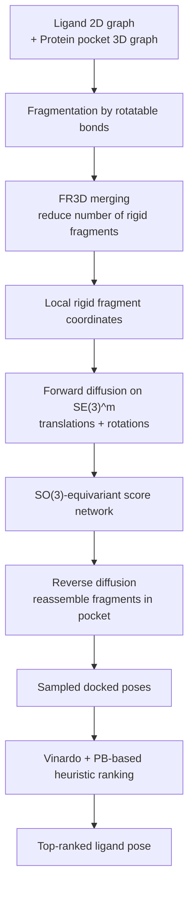

## Hook

protein-ligand docking은 drug discovery에서 여전히 이상한 위치에 있다. 실제 현업에서는 여전히 AutoDock Vina 같은 physics-based 방법이 널리 쓰이지만, 논문만 보면 diffusion 기반 딥러닝이 이미 다 끝낸 문제처럼 보일 때가 많다. 문제는 평가 기준이다. 단순 RMSD만 보면 그럴듯해 보여도, 실제로는 bond length나 angle이 깨지고 steric clash가 심한 **chemical nonsense pose**가 섞여 있을 수 있다. 그래서 PoseBusters 이후의 docking 논문은 이제 “맞게 꽂았냐”만이 아니라 **화학적으로 말이 되는가(PB-valid)**까지 동시에 봐야 한다.

Oxford의 **SIGMA-Dock**은 이 지점에서 꽤 흥미롭다. 이 논문은 “all-atom diffusion이나 co-folding으로 문제를 크게 푸는 대신, 정말 필요한 자유도만 남기면 어떨까?”라는 질문을 던진다. 리간드를 rotatable bond 기준으로 **rigid-body fragment**로 쪼개고, 각 fragment의 pose를 $SE(3)$ 위에서 diffusion으로 예측한 뒤 다시 조립한다.

결과는 강하다. 논문 기준으로 SIGMA-Dock은 PoseBusters에서 **Top-1 79.9% (RMSD < 2Å & PB-valid)**를 달성했고, 기존 딥러닝 도킹 모델들의 12.7–30.8%를 크게 넘는다. 더 나아가 **PB train-test split에서 classical docking을 넘는 첫 딥러닝 방법**이라고 주장한다. AlphaFold 3 수준의 성능을, 훨씬 적은 데이터와 계산으로 달성했다는 메시지도 분명하다.

내가 보기에 이 논문의 핵심은 단순히 “fragment를 썼다”가 아니다. **어떤 자유도를 버리고 어떤 기하학적 prior를 남길 것인지**를 아주 집요하게 설계했다는 데 있다. 이 글에서는 왜 torsional model이 생각보다 잘 안 됐는지, SIGMA-Dock이 그 문제를 어떻게 fragment-based $SE(3)$ diffusion으로 우회하는지, 그리고 실험 결과가 어디까지 설득력 있는지를 정리해본다.

## Problem

분자 도킹의 생성 모델은 대체로 두 방향으로 나뉜다.

1. **all-atom / co-folding 계열**
   - 단백질과 리간드 전체를 함께 모델링
   - 표현력이 높고 범용적이지만 학습/추론 비용이 비싸다
   - virtual screening처럼 수백만 쌍을 쳐야 하는 상황에는 느리다

2. **torsional model 계열**
   - ligand의 global roto-translation + torsion angle만 모델링
   - 화학적으로 더 자연스러운 저차원 manifold 위에서 움직인다
   - 이론상 더 data-efficient하고 빠를 것 같지만 실제 성능은 기대 이하였다

논문은 torsional model이 기대보다 약했던 이유를 꽤 명확하게 짚는다.

### 병목 1: torsion → Cartesian mapping이 너무 비선형이다

리간드의 torsion angle을 직접 diffusion한다고 해도, 최종적으로 우리가 원하는 건 3D Cartesian 좌표다. 그런데 torsion 한 개를 살짝 바꾸는 것이 분자의 먼 원자 위치까지 연쇄적으로 흔들 수 있다. 즉, **local update가 non-local Cartesian displacement**를 만든다.

이건 score model 입장에서 까다롭다. 모델이 사실상 다음을 암묵적으로 배워야 하기 때문이다.

- torsion 변화가 3D 좌표를 어떻게 바꾸는지
- 어떤 torsion 조합이 chemically valid한지
- 그 변화가 pocket interaction에 어떤 영향을 주는지

논문의 표현을 빌리면, 이는 **non-local, highly nonlinear, and sometimes ambiguous inverse problem**이다.

### 병목 2: RMSD만 맞추면 그럴듯한 가짜 포즈가 나온다

도킹 논문에서 RMSD < 2Å는 오랫동안 표준 지표처럼 쓰였지만, PoseBusters가 보여준 건 그걸로는 부족하다는 점이다. ligand가 target pose 근처에 있어도 bond length, bond angle, chirality, clash가 엉망이면 drug discovery에서 실제로 쓸 수 없다.

즉, 도킹 모델은 단순 위치 예측이 아니라 **화학적 타당성과 구조적 일관성**을 같이 만족해야 한다.

### 병목 3: co-folding은 강하지만 너무 무겁다

[AlphaFold 3](/posts/alphafold3-accurate-biomolecular-interactions/)나 후속 co-folding 계열은 확실히 강력하다. 하지만 단백질과 리간드를 함께 다루는 범용 모델인 만큼:

- massive data / massive compute가 필요하고
- inference가 느리며
- docking-only workload에는 과한 접근일 수 있다

논문이 노리는 건 딱 이 틈새다. **co-folding보다 훨씬 가볍지만, torsional model보다는 구조적 bias를 더 잘 쓰는 도킹 전용 생성 모델**.

## Key Idea

SIGMA-Dock의 핵심 아이디어는 한 문장으로 요약하면 이렇다.

> **리간드의 내부 geometry는 rigid fragment 단위로 고정하고, fragment들의 translation/rotation만 $SE(3)^m$에서 diffusion으로 예측해 바인딩 포즈를 재조립한다.**

이 접근의 포인트는 세 가지다.

1. **Structurally-aware fragmentation**
   - rotatable bond를 끊어 ligand를 rigid-body fragment로 분해
   - 하지만 단순히 잘게 자르는 게 아니라, 불필요한 fragment 수를 줄이도록 merging 전략(FR3D)을 사용

2. **SE(3) Riemannian diffusion**
   - 각 fragment의 pose를 translation + rotation으로 표현
   - torsion angle을 직접 모델링하지 않고 rigid-body transformation을 diffusion

3. **Structural inductive biases 추가**
   - fragment 간 bond length / bond angle 보존을 위한 **soft triangulation constraints**
   - fragment geometry와 pocket interaction을 읽기 위한 **SO(3)-equivariant architecture**

핵심 비교를 표로 정리하면 대략 이렇다.

| | Torsional docking models | Co-folding models | **SIGMA-Dock** |
|---|---|---|---|
| 기본 자유도 | global pose + torsions | all-atom coordinates | **fragment-wise rigid poses in $SE(3)^m$** |
| 화학적 prior | 명시적이지만 좌표 mapping이 복잡 | 비교적 약함, 데이터로 학습 | **rigid fragments + triangulation priors** |
| 계산 비용 | 낮음 | 높음 | **낮음~중간** |
| 추론 속도 | 빠름 | 느림 | **매우 빠름** |
| 목표 | 도킹 | 범용 co-folding | **도킹 특화** |

논문 메시지는 분명하다. docking에서는 모든 자유도를 모델링하는 것이 꼭 정답이 아닐 수 있고, 오히려 **잘 정의된 저차원 geometric process**가 더 잘 풀리는 문제일 수 있다는 것.

## How It Works

### Overview


_Figure 1: SIGMA-Dock 논문 1페이지. 문제 정의와 핵심 메시지—ligand를 fragment로 분해하고 $SE(3)$ diffusion으로 재조립하는 접근이 요약돼 있다. 출처: 원 논문_

SIGMA-Dock의 파이프라인은 개념적으로 아래처럼 볼 수 있다.



입력은 다음 두 가지다.

- ligand의 **2D graph**: atom / bond 정보
- protein pocket의 **3D graph**: pocket 원자 좌표와 feature

출력은 ligand의 bound pose, 즉 pocket 안에 배치된 3D coordinates다.

다만 생성 공간을 all-atom 좌표 전체로 잡지 않는다. 먼저 ligand를 fragment로 나누고, 각 fragment의 local coordinates $\tilde{x}_{F_i}$를 정의한다. 이후 모델은 각 fragment에 대해 rigid-body transform:

$$z = (p, R) \in SE(3)^m$$

만 예측한다. 여기서 $m$은 fragment 수, $p$는 fragment translation들, $R$은 fragment rotation들이다.

즉, **리간드 포즈 생성 = rigid-body fragment들의 재조립**으로 바뀐다.

### Why fragments instead of torsions?

논문의 중요한 이론적 주장 중 하나는, torsion space에서의 diffusion보다 fragment space에서의 diffusion이 더 단순한 학습 문제라는 것이다.

torsional model에서는 좌표 변화가 torsion chain을 따라 entangled된다. 반면 disjoint rigid fragments 위에서는 각 조각의 global pose가 더 직접적으로 정의되므로, induced measure가 더 factorized된 형태를 가진다. 논문은 이를 “torsional density in Cartesian space is generally not a product distribution”이라는 식으로 설명한다.

직관적으로 말하면:

- torsion 한 개를 바꾸면 멀리 있는 원자들까지 연쇄적으로 흔들린다
- rigid fragment 하나를 옮기면 그 fragment 자체는 깨지지 않고 통째로 움직인다

후자가 score network가 배우기 훨씬 쉽다.

### 1) Conformational manifold와 rigid fragment 가정

SIGMA-Dock은 ligand의 conformational space가 bond length와 bond angle 같은 local geometry constraint를 강하게 따르고, 실제 큰 변화는 주로 **rotatable bond를 따라 생기는 dihedral 변화**에서 온다고 본다.

논문은 이를 constrained Boltzmann manifold $\mathcal{M}_c$로 적는다:

$$
\mathcal{M}_c = \{x_c \in \mathbb{R}^{|G_{ligand}| \times 3} : g(x_c) \approx 0\}
$$

여기서 $g(\cdot)$는 bond lengths, bond angles 같은 holonomic constraints를 인코딩한다. 핵심은 이렇다.

- bond length / angle은 대체로 보존된다
- torsion만 상대적으로 자유도가 크다
- 따라서 rotatable bond를 기준으로 자른 fragment 내부 geometry는 거의 rigid하다고 볼 수 있다

이 가정이 성립해야 fragment-based parametrization이 docking target distribution에서 크게 벗어나지 않는다. 논문은 conformer를 bound pose에 joint rigid+torsional alignment했을 때 RMSD가 충분히 작다는 실험으로 이 정당화를 제공한다.

### 2) Structurally-aware fragmentation: FR3D

단순히 rotatable bond마다 끊으면 fragment 수가 너무 많아지고, 오히려 자유도가 다시 늘어난다. SIGMA-Dock은 이를 줄이기 위해 **FR3D(fragment reduction to irreducible form)**라는 merging 전략을 제안한다.

아이디어는 이렇다.

1. 초기에는 rotatable bond 기준으로 과분해(over-fragmentation)한다
2. 이후 인접 fragment를 stochastic search로 합치며
3. stereochemical symmetry를 해치지 않는 범위에서 **최소한의 irreducible fragment set**을 찾는다

논문이 말하는 목표는 “fragmentation의 장점은 유지하되 fragment 개수 $m$은 줄이는 것”이다. 결국 학습해야 할 자유도는 $6m$에 비례하기 때문에, 이 단계가 성능과 효율 양쪽에 중요하다.

### 3) Soft triangulation constraints

fragment로 나누면 torsion angle을 직접 모델링하지 않는 대신, fragment 사이 bond connection이 유지되어야 한다. 이를 위해 논문은 **soft triangulation constraints**를 둔다.

핵심은 fragment를 가로지르는 결합에 대해 다음 geometric prior를 penalty 형태로 걸어주는 것이다.

- 연결 원자 간 **bond length**가 유지되어야 함
- 연결을 정의하는 주변 **bond angle**이 크게 무너지면 안 됨

즉, rigid body를 자유롭게 움직이게 두되, fragment 간 stitching이 완전히 헐거워지지 않도록 하는 것이다.

개념적으로는 다음과 비슷한 regularizer로 생각할 수 있다.

$$
\mathcal{L}_{tri}(z) = \lambda_d \sum_{(i,j) \in \mathcal{B}} \| d_{ij}(z) - d_{ij}^{(0)} \|^2
+ \lambda_\tau \sum_{(i,j,k) \in \mathcal{A}} \| \tau_{ijk}(z) - \tau_{ijk}^{(0)} \|^2
$$

여기서 $\mathcal{B}$는 fragment-crossing bond 집합, $\mathcal{A}$는 angle constraint 집합이다. 논문에서는 이 triangulation prior가 docking에서 필요한 stereochemical consistency를 주는 핵심 bias 중 하나로 작동한다.

### 4) Diffusion on $SE(3)^m$

SIGMA-Dock의 생성 과정은 각 fragment의 translation과 rotation에 대한 Riemannian diffusion이다.

- translation: $\mathbb{R}^3$에서 Gaussian diffusion
- rotation: $SO(3)$에서 isotropic Gaussian 계열 확산
- 전체 ligand: fragment마다 이를 독립 조합한 $SE(3)^m$

핵심 장점은 representation이 **explicit rigid-body pose**라는 점이다. score model은 “어떤 torsion을 어떻게 바꿀까?”를 역으로 추론하는 대신, “이 fragment를 pocket 안 어디로, 어느 방향으로 놓을까?”를 직접 예측한다.

이를 아주 러프하게 쓰면 다음과 같은 reverse process를 생각할 수 있다.

```python
class SigmaDockSampler:
    """Conceptual pseudocode for fragment-wise SE(3) reverse diffusion."""

    def __init__(self, score_net, n_steps=20):
        self.score_net = score_net
        self.n_steps = n_steps

    def sample(self, protein_graph, ligand_fragments, seeds=10):
        samples = []
        for _ in range(seeds):
            # Each fragment has translation p_i and rotation R_i
            z_t = self.initialize_random_pose(ligand_fragments)  # in SE(3)^m

            for t in reversed(range(self.n_steps)):
                score = self.score_net(
                    protein_graph=protein_graph,
                    ligand_fragments=ligand_fragments,
                    fragment_poses=z_t,
                    time_step=t,
                )

                # score contains translation and rotation updates
                z_t = self.reverse_step(z_t, score, t)
                z_t = self.apply_soft_triangulation(z_t, ligand_fragments)

            pose = self.compose_fragments(ligand_fragments, z_t)
            samples.append(pose)

        return samples
```

논문 부록에 따르면 sampling은 20-step 정도만으로도 충분했고, 더 많은 step은 diminishing returns를 보였다고 한다. 이것도 SIGMA-Dock의 practical한 장점이다.

### 5) SO(3)-equivariant architecture

fragment pose를 다루는 모델이므로, 회전에 대해 일관된 추론을 하려면 equivariance가 중요하다. 논문은 **SO(3)-equivariant architecture tailored for fragment geometry and protein-ligand interactions**를 사용한다고 설명한다.

정확한 세부 구현은 부록 쪽에 더 많이 있지만, 개념적으로는 다음 정보를 함께 읽는다.

- fragment 내부 local geometry
- fragment 간 relative geometry
- fragment와 pocket 원자/feature 간 상호작용
- chemical features (atom type, bond features 등)

이를 토대로 네트워크는 각 fragment에 대해

- translation score
- rotation score

를 예측한다.

```python
class FragmentScoreNet(nn.Module):
    """Simplified view of SIGMA-Dock's equivariant score model."""

    def __init__(self, hidden_dim=256):
        super().__init__()
        self.protein_encoder = EquivariantGraphEncoder(hidden_dim)
        self.fragment_encoder = EquivariantGraphEncoder(hidden_dim)
        self.cross_attention = GeometricCrossAttention(hidden_dim)
        self.head_trans = nn.Linear(hidden_dim, 3)
        self.head_rot = nn.Linear(hidden_dim, 3)  # Lie algebra update in so(3)

    def forward(self, protein_graph, ligand_fragments, fragment_poses, time_step):
        h_p = self.protein_encoder(protein_graph)
        h_f = self.fragment_encoder(ligand_fragments, fragment_poses)
        h = self.cross_attention(h_f, h_p, time_embedding=time_step)

        delta_p = self.head_trans(h)
        delta_r = self.head_rot(h)
        return {"translation": delta_p, "rotation": delta_r}
```

중요한 건 “equivariance를 썼다”는 사실 자체보다, 이 모델이 **fragment-level rigid geometry**를 중심으로 문제를 본다는 점이다. all-atom level에서 everything-to-everything interaction을 다 학습시키는 것보다 훨씬 좁고 명시적인 hypothesis class를 선택한 셈이다.

### 6) Training and ranking without a separate confidence model

많은 generative docking 모델은 pose를 여러 개 뽑은 다음, 별도의 confidence model로 rerank한다. SIGMA-Dock은 이 비용을 줄이기 위해 학습된 별도 confidence model 대신 **cheap heuristic**을 사용한다.

논문에서 샘플 $i$의 score는 대략 다음 꼴이다.

$$
s_i = - b_i p_i^{\beta}
$$

- $b_i$: Vinardo binding energy
- $p_i \in [0,1]$: PoseBusters validity 기반 penalty
- $\beta = 4$: validity penalty 강도

즉,
- binding energy가 좋고
- stereochemical violation이 적은
샘플이 높은 점수를 받는다.

이건 의외로 중요하다. SIGMA-Dock이 높은 PB-valid를 보이는 이유 중 하나가, 모델 자체가 geometry prior를 강하게 쓰기 때문에 **후처리용 confidence model에 덜 의존해도 된다**는 점이기 때문이다.

### 7) Computational efficiency

부록 기준으로 SIGMA-Dock은 NVIDIA A40 GPU에서:

- **0.57 s/mol/seed**
- 20 discretisation step
- batch size 64

를 기록한다. 논문은 이를 바탕으로:

- `Nseed=10`이면 **5.7 s/mol**
- `Nseed=40`이면 **22.8 s/mol**

수준이라고 말한다. 비교 대상으로는:

- **AF3**: 평균 **16 min/mol**
- **DiffDock**: 평균 **72 s/mol**

을 든다. 숫자만 봐도 이 모델의 목표가 “범용성 최대화”가 아니라 **빠르고 실용적인 docking 전용 생성기**라는 게 분명하다.

## Results

### Main benchmark: PoseBusters와 Astex


_Figure 2: 논문 후반부 페이지 일부. 성능 요약, AF3 비교, 그리고 restricted re-docking setting에 대한 caveat가 포함되어 있다. 출처: 원 논문_

논문이 가장 강하게 내세우는 수치는 PoseBusters에서의 성능이다.

- **Top-1 success rate (RMSD < 2Å & PB-valid): 79.9%**
- 기존 딥러닝 방법들은 논문 기준 **12.7–30.8%**
- Astex diverse set에서는 **Top-1 90%+** 수준

특히 저자들은 SIGMA-Dock이 **PB train-test split에서 classical docking을 넘는 최초의 딥러닝 접근**이라고 주장한다. docking 문맥에서는 꽤 큰 claim이다.

또 하나 중요한 메시지는 **unseen proteins로의 generalisation**이다. 단순히 train-test leakage가 높은 setup에서만 잘 맞는 게 아니라, sequence similarity split에서도 꽤 일관된 성능을 보인다고 한다. 논문은 오히려 AF3 쪽이 leakage 측면에서 더 유리했을 가능성을 지적하면서, 자신들은 PDBBind(v2020)의 약 **19k datapoints**만으로 AF3 수준 성능을 냈다고 강조한다.

### AF3-level performance, but much smaller and faster

논문이 직접 비교하는 포인트는 세 가지다.

1. **데이터 규모**
   - AF3류 co-folding보다 훨씬 적은 데이터
2. **샘플링 속도**
   - AF3보다 훨씬 빠름
3. **test-train leakage**
   - 더 엄격한 split에서 평가했다고 주장

논문 후반 코멘트에 따르면 AF3는 PoseBusters에서 Top-1 최대 **84%** 수준을 보고했지만, train-test overlap이 상당히 높았을 수 있다고 해석한다. SIGMA-Dock은 이를 완전히 같은 조건의 apples-to-apples 비교라고 말하긴 어렵지만, 적어도 **도킹 문제만 놓고 보면 fragment-based diffusion도 AF3급 정확도에 근접할 수 있다**는 메시지는 충분히 전달한다.

### Ablation: triangulation, fragment merging, energy scoring이 다 중요하다

논문에서 제공한 ablation 결과를 보면 다음이 눈에 띈다.

- **(-) Triangulation constraint**: RMSD<2 71.9 / PB-valid 67.1
- **(-) Protein-ligand interactions**: RMSD<2 79.2 / PB-valid 76.3
- **(-) Fragment merging**: RMSD<2 74.4 / PB-valid 73.7
- **Sampling from $\mathcal{M}_b$**: RMSD<2 86.4 / PB-valid 85.4
- **(-) Energy scoring**: RMSD<2 67.2 / PB-valid 66.1
- **(-) PB scoring**: RMSD<2 82.1 / PB-valid 70.8
- **SIGMA-Dock (Nseeds=10)**: RMSD<2 74.7 / PB-valid 72.2
- **SIGMA-Dock (Nseeds=40)**: RMSD<2 80.5 / PB-valid 79.9

이 표는 몇 가지를 보여준다.

1. **fragment merging이 진짜 중요하다**
   - 그냥 많이 쪼개는 것이 능사가 아니다
2. **triangulation prior가 PB-valid 유지에 크게 기여한다**
   - chemical plausibility를 강하게 밀어주는 bias다
3. **energy scoring + PB scoring heuristic도 실제 Top-1에 중요하다**
   - 생성만 잘한다고 끝이 아니라, 좋은 pose를 잘 골라야 한다

특히 `(-) PB scoring`의 경우 RMSD<2 자체는 꽤 높지만 PB-valid가 많이 떨어진다. 즉, 이 모델의 장점은 단순히 “근처에 놓는다”가 아니라 **유효한 pose를 우선 선택한다**는 데도 있다.

### Co-factor가 있는 복잡한 환경에서는 약해진다

Table 2 분석도 흥미롭다. SIGMA-Dock은 설계상 cofactor를 명시적으로 모델링하지 않기 때문에, 실제 bound pose가 ion, natural ligand, crystallisation aid 같은 추가 artefact와 함께 형성되는 경우 실패율이 높아진다.

논문 예시를 보면:
- **Natural ligands가 있는 subset (17개)**: RMSD<2 / PB-valid 모두 **58.8%**, failure rate **41.2%**
- **Ions subset (57개)**: **75.4%**, failure rate **23.6%**
- **Other cofactors subset (60개)**: **76.7%**, failure rate **28.1%**

이 결과는 SIGMA-Dock이 무조건 memorization하는 모델이라기보다, **부분 관측(partially observable) 조건에서 합리적으로 깨지는 모델**이라는 해석도 가능하게 한다. 저자도 이 점을 generalisation evidence로 사용한다.

## Discussion

내가 보기에 SIGMA-Dock의 가장 좋은 점은 “도킹에서 정말 필요한 자유도만 남기자”는 판단이 **기하학적으로 설계되어 있다는 것**이다. 요즘 많은 구조 생성 모델은 더 큰 모델, 더 많은 데이터, 더 많은 범용성으로 밀어붙이는데, 이 논문은 반대로 문제를 잘 쪼갰다.

특히 [Pearl](/posts/pearl-foundation-model-placing-every-atom/) 같은 최신 cofolding 계열이 synthetic data + equivariance + templating으로 protein-ligand cofolding을 정면 돌파했다면, SIGMA-Dock은 거의 반대편 전략이다.

- Pearl: 더 큰 범용 모델
- SIGMA-Dock: 더 좁고 잘 정의된 docking 전용 모델

둘 다 “물리적으로 말이 되는 pose”를 중요하게 보지만, Pearl은 all-atom generative modeling에서 이를 해결하고, SIGMA-Dock은 아예 **문제의 자유도를 줄여** 해결한다.

또한 이 논문은 DiffDock류 torsional docking이 왜 생각보다 약했는지를 꽤 설득력 있게 설명한다. 단순히 “torsion은 좋은 prior다”에서 끝나는 게 아니라, **그 prior를 score model이 학습하기 좋은 representation으로 다시 써줘야 한다**는 것이다. fragment-based $SE(3)$ parametrization은 바로 그 representation engineering의 결과로 읽힌다.

실무적으로도 장점이 크다. virtual screening에서는 속도가 정말 중요하고, AF3급 co-folding을 매 pair마다 돌리는 건 아직 너무 비싸다. SIGMA-Dock처럼 **seconds-per-molecule 수준**에서 높은 PB-valid accuracy를 주는 모델은 실제 워크플로우에 얹을 여지가 있다.

## Limitations

좋은 논문이지만 한계도 분명하다.

### 1) 평가가 re-docking에 제한된다

저자들이 스스로 밝히듯, 이 논문의 메인 평가는 **re-docking only**다. 즉, bound pocket conformation이 주어진 상황에서 리간드 포즈를 복원하는 문제다. 현실 drug discovery에서는 다음이 더 어렵다.

- cross-docking
- apo structure docking
- induced fit이 큰 경우

즉, “실제 현업 전체를 다 해결했다”기보다는 **rigid-pocket docking에서 매우 강한 모델**에 가깝다.

### 2) cofactor를 명시적으로 모델링하지 않는다

논문도 인정하듯 natural ligand, ion, 기타 cofactor가 pose 형성에 중요한 경우 성능이 떨어진다. 이는 모델이 단순해서 생기는 trade-off다. 더 빠르고 더 단순한 대신, **부분 관측 환경에서 정보 손실**이 있다.

### 3) Top-1과 oracle 사이 gap이 남아 있다

부록에 따르면 sample pool이 커지면 Top-k가 빠르게 좋아지고, empirical oracle은 `(RMSD < 2Å & PB-valid)` 기준 **거의 90% 근처**까지 간다. 반면 practical Top-1은 그보다 약 10% 정도 낮다. 즉, 생성 분포는 꽤 좋지만 **sample selection / ranking**은 아직 개선 여지가 크다.

### 4) AF3 비교는 완전한 apples-to-apples는 아니다

논문은 leakage 이슈를 근거로 AF3와 자신들을 비교하지만, 태스크 자체가 다르다.

- AF3는 co-folding
- SIGMA-Dock은 rigid-pocket re-docking에 더 특화

그래서 “AF3-level performance”라는 문구는 방향성 있는 메시지로는 이해되지만, **직접 동급 비교**로 받아들이기에는 조건 차이를 염두에 둬야 한다.

## Conclusion

SIGMA-Dock은 molecular docking에서 꽤 모범적인 논문이다. 더 큰 모델을 만들기보다, 문제의 구조를 다시 보고 **rigid fragment + $SE(3)$ diffusion**이라는 더 단순한 생성 공간을 설계했다. 그리고 그 결과가 단순 RMSD가 아니라 **PB-valid까지 포함한 강한 PoseBusters 성능**으로 이어졌다.

가장 중요한 takeaway는 이거다. docking에서는 반드시 all-atom co-folding이 정답일 필요가 없고, **잘 설계된 geometric inductive bias**가 오히려 더 빠르고 더 신뢰할 만한 모델을 만들 수 있다. 특히 rigid-pocket setting과 대규모 screening 문맥에서는 더 그렇다.

다만 이 접근이 cross-docking, apo docking, induced fit까지 자연스럽게 확장되는지는 아직 별개의 질문이다. SIGMA-Dock은 “도킹을 어떻게 더 크게 풀까?”보다 **“도킹을 어떻게 더 잘 정의할까?”**에 가까운 논문이고, 바로 그 점 때문에 인상적이다.

## TL;DR

- **SIGMA-Dock은 리간드를 rigid-body fragment로 분해하고 $SE(3)^m$ 위에서 diffusion으로 재조립하는 docking 모델**이다.
- 핵심은 torsion을 직접 diffusion하지 않고, **fragment pose prediction**으로 문제를 다시 쓰는 데 있다.
- PoseBusters에서 **Top-1 79.9% (RMSD < 2Å & PB-valid)**를 달성해 기존 딥러닝 도킹과 classical docking을 넘어섰다고 주장한다.
- **triangulation prior, fragment merging, Vinardo+PB heuristic ranking**이 실제 성능에 모두 중요하다.
- 매우 빠르다: 논문 부록 기준 **0.57 s/mol/seed**, 즉 `Nseed=10`이면 약 **5.7 s/mol** 수준이다.
- 다만 메인 평가는 **re-docking**, 그리고 **cofactor를 명시적으로 다루지 않는 제한**이 있다.

## Paper Info

| 항목 | 내용 |
|---|---|
| **Title** | SIGMA-Dock: Untwisting Molecular Docking with Fragment-Based SE(3) Diffusion |
| **Authors** | Alvaro Prat, Leo Zhang, Charlotte M. Deane, Yee Whye Teh, Garrett M. Morris |
| **Affiliations** | Department of Statistics, University of Oxford |
| **Venue** | arXiv preprint |
| **Published** | 2025-11-06 |
| **Link** | [arXiv:2511.04854](https://arxiv.org/abs/2511.04854) |
| **Paper** | [arXiv:2511.04854](https://arxiv.org/abs/2511.04854) |
| **Code** | 논문 본문 기준 미확인 / 비공개로 보임 |

---

> 이 글은 LLM(Large Language Model)의 도움을 받아 작성되었습니다. 
> 논문의 내용을 기반으로 작성되었으나, 부정확한 내용이 있을 수 있습니다.
> 오류 지적이나 피드백은 언제든 환영합니다.
{: .prompt-info }
