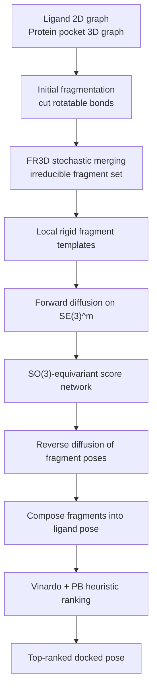

## Hook

protein-ligand docking은 이상하게도 늘 “거의 해결된 것처럼 보이지만 실제로는 아직 아니다”에 가까운 문제다. 한쪽에는 AutoDock Vina 같은 classical docking이 있고, 다른 한쪽에는 DiffDock이나 co-folding 계열처럼 더 학습 기반인 접근이 있다. 그런데 최근 몇 년간 분명해진 건, **RMSD만 보면 되는 시대는 끝났다**는 점이다. pose가 crystallographic answer 근처에 있더라도 bond length, bond angle, chirality, clash가 무너지면 실제 drug discovery에서는 거의 쓸모가 없다. PoseBusters가 등장한 이후 docking의 질문은 “맞는 위치에 놨는가?”에서 “**화학적으로 말이 되는 방식으로 맞는 위치에 놨는가?**”로 바뀌었다.

SIGMA-Dock은 이 문제에 대해 꽤 정교한 답을 내놓는다. 이 논문은 all-atom generative model을 더 크게 만드는 대신, 오히려 질문을 바꾼다. “도킹에서 정말 필요한 자유도는 무엇인가?” 리간드 전체를 원자 단위로 흔드는 대신, rotatable bond를 기준으로 ligand를 **rigid-body fragment**로 나누고, 각 fragment의 translation과 rotation만 $SE(3)^m$ 위에서 diffusion으로 예측한다. 다시 말해, torsion을 직접 생성하는 것도 아니고, 단백질-리간드 전체를 co-folding하는 것도 아니다. **fragment pose assembly**로 도킹을 다시 쓰는 셈이다.

논문이 내세우는 결과도 강하다. PoseBusters에서 **Top-1 79.9% (RMSD < 2Å & PB-valid)**를 달성했고, recent deep learning docking methods의 12.7–30.8%보다 훨씬 높다고 주장한다. 더 나아가 intended PoseBusters split에서 **classical physics-based docking을 넘어선 첫 딥러닝 방법**이라고 말한다. 또 AF3 수준의 accuracy에 근접하면서도 훨씬 적은 데이터와 빠른 sampling 속도를 보였다고 강조한다.

하지만 이 논문의 진짜 재미는 숫자보다 설계 철학에 있다. 왜 torsional model이 이론상 매력적인데 실전에서는 약했는지, 왜 fragment-based $SE(3)$ space가 더 잘 정의된 generative space인지, 그리고 그걸 실제로 학습 가능한 형태로 만들기 위해 FR3D, triangulation conditioning, SO(3)-equivariant score model을 어떻게 엮었는지가 핵심이다. 이 글에서는 그 부분을 조금 더 수식과 구조 중심으로 풀어보려 한다.

## Problem

도킹 모델을 크게 나누면 세 부류가 있다.

1. **classical docking**
   - scoring function + search 기반
   - 여전히 빠르고 robust하지만 sampling diversity와 accuracy에 한계가 있다

2. **torsional generative docking**
   - ligand의 global roto-translation과 torsion angle만 모델링
   - 화학적으로 자연스러운 저차원 manifold를 직접 다루는 아이디어
   - 이론상 data-efficient하고 빠를 것 같지만 empirical result는 들쭉날쭉했다

3. **all-atom / co-folding 모델**
   - 단백질과 리간드를 함께 모델링
   - 표현력은 크지만 data/compute cost가 높고 inference가 느리다

SIGMA-Dock이 겨냥하는 문제는, 이 셋의 장단점 사이에서 **도킹에 필요한 inductive bias는 최대한 쓰면서도, 문제를 너무 크게 만들지 않는 것**이다.

### 병목 1: torsional model은 생각보다 “간단한 모델”이 아니다

표면적으로 torsional model은 자유도를 크게 줄인다. 리간드의 내부 bond length와 bond angle은 거의 고정하고, rotatable bond에 대한 dihedral만 모델링하면 되니까 그럴듯해 보인다. 문제는 모델이 최종적으로 관찰하는 것이 **Cartesian coordinates**라는 점이다.

논문이 지적하는 핵심은 이거다.

- torsion space에서는 update가 local해 보인다
- 하지만 Cartesian space로 옮기면 그 변화가 **non-local**하다
- 하나의 torsion 변화가 분자 끝쪽 원자들을 크게 흔들 수 있다
- 그래서 independent torsional perturbation이 좌표 공간에서는 강하게 entangled된다

논문은 이를 이론적으로 정리해, standard molecular topology에서는 torsional density가 Cartesian space에서 일반적으로 **product distribution이 아니게 된다**고 말한다. 즉, low-dimensional prior는 매력적이지만, 실제 학습 문제는 그렇게 깔끔하지 않다.

### 병목 2: docking은 위치 예측 문제가 아니라 geometry + chemistry 문제다

RMSD < 2Å는 여전히 중요하지만 충분하지 않다. PoseBusters 이후에는 최소한 다음이 동시에 맞아야 한다.

- pose가 crystallographic pose 근처에 있어야 하고
- bond length / bond angle이 크게 무너지지 않아야 하고
- steric clash가 없어야 하고
- chirality가 깨지면 안 된다

즉, 도킹 모델은 단순 localization이 아니라 **chemically plausible structured generation** 문제를 푸는 셈이다.

### 병목 3: co-folding은 강하지만 너무 비싸다

[AlphaFold 3](/posts/alphafold3-accurate-biomolecular-interactions/) 같은 모델은 범용 biomolecular interaction prediction이라는 더 큰 문제를 푼다. 하지만 그만큼:

- 데이터가 많이 필요하고
- 학습이 무겁고
- inference가 느리다
- docking-only setting에는 overkill일 수 있다

가령 virtual screening처럼 수백만 ligand를 스캔해야 하는 상황에선, co-folding의 accuracy가 아무리 좋아도 throughput이 문제다. SIGMA-Dock의 질문은 결국 이것이다.

> **도킹을 더 크게 푸는 대신, 더 잘 정의된 생성 공간으로 다시 쓸 수는 없는가?**

## Key Idea

SIGMA-Dock의 아이디어를 가장 압축적으로 적으면 다음과 같다.

> **리간드를 torsion-free rigid fragments로 분해하고, 각 fragment의 pose를 $SE(3)^m$ 위에서 diffusion으로 예측하여 pocket 안에서 재조립한다.**

이 아이디어를 가능하게 하는 축은 세 가지다.

1. **FR3D (fragment reduction to irreducible form)**
   - 단순히 rotatable bond를 모두 자르지 않고
   - 불필요하게 많은 fragment를 줄여 학습 자유도를 낮춘다

2. **Soft triangulation constraints**
   - fragment 사이 bond length / bond angle 정보를 soft하게 유지해
   - torsion을 직접 모델링하지 않아도 stereochemical consistency를 유도한다

3. **SO(3)-equivariant score model on $SE(3)^m$**
   - rigid fragment geometry와 pocket interaction을 회전 일관적으로 읽는다
   - translation score와 rotation score를 직접 예측한다

기존 계열과 비교하면 다음처럼 볼 수 있다.

| | Torsional models | Co-folding models | **SIGMA-Dock** |
|---|---|---|---|
| 생성 공간 | $T^k \times SE(3)$ | all-atom coordinates | **$SE(3)^m$ for rigid fragments** |
| 장점 | 저차원 prior | 높은 표현력 | **저차원 + 잘 정의된 rigid-body geometry** |
| 어려움 | torsion→Cartesian entanglement | 높은 compute / 느린 inference | **fragmentation 설계와 stitching 필요** |
| 핵심 inductive bias | torsion | data-driven | **rigid fragments + triangulation** |

핵심은 단순히 “fragment를 썼다”가 아니다. **학습하기 어려운 torsional inverse problem을, rigid-body assembly problem으로 재매개화(reparameterize)했다**는 데 있다.

## How It Works

### Overview


_Figure 1: SIGMA-Dock 논문 첫 페이지. 문제 정의와 fragment-based SE(3) diffusion의 핵심 아이디어가 요약돼 있다. 출처: 원 논문_

전체 파이프라인을 개념적으로 그리면 아래와 같다.



입력은:

- ligand의 2D graph $G_{ligand}^{2D} = \{v, b\}$
- protein의 3D graph $G_{protein} = \{y, v_y, b_y\}$

출력은 ligand의 bound pose $x \in \mathbb{R}^{|G_{ligand}| \times 3}$이다.

하지만 직접 $x$를 diffusion하지 않는다. 논문은 ligand를 rigid fragment $\{G_{F_i}\}_{i=1}^m$로 나누고, 각 fragment의 local coordinate $\tilde{x}_{F_i}$를 원점 중심으로 정의한다. 이후 각 fragment의 global pose는:

$$
x_{F_i} = (p_{F_i}, R_{F_i}) \cdot \tilde{x}_{F_i}
$$

로 표현된다. 따라서 ligand 전체 pose는

$$
z = (p, R) \in SE(3)^m
$$

이라는 product manifold 위의 점으로 parameterize된다.

즉, SIGMA-Dock의 핵심 변환은:

$$
\text{all-atom ligand pose generation} \quad \longrightarrow \quad \text{fragment pose generation in } SE(3)^m
$$

이다.

### Representation / Problem Formulation

논문이 문제를 세팅하는 방식은 꽤 중요하다. ligand의 local conformational geometry는 임의가 아니라, structural chemistry가 강하게 제한하는 manifold 위에 놓인다고 본다. 이를 논문은 conformational manifold $\mathcal{M}_c$로 쓴다:

$$
\mathcal{M}_c = \{x_c \in \mathbb{R}^{|G_{ligand}| \times 3} : g(x_c) \approx 0\}
$$

여기서 $g(\cdot)$는 bond lengths, bond angles 같은 holonomic constraints를 의미한다. 핵심 아이디어는 이렇다.

- 분자의 local geometry 대부분은 bond length / angle로 사실상 고정된다
- 큰 structural variation은 주로 **dihedral / torsion**에서 나온다
- 따라서 rotatable bond를 끊으면, 각 fragment 내부는 거의 rigid body로 볼 수 있다

이 전제를 바탕으로, ligand의 pose는 fragment local geometry $\tilde{x}_{F_i}$와 fragment-wise rigid motion $(p_{F_i}, R_{F_i})$의 합성으로 나타난다. 이때 좌표 복원 mapping을 논문은:

$$
\phi : SE(3)^m \to \mathbb{R}^{|G_{ligand}| \times 3}
$$

로 둔다. 결국 모델이 샘플링하는 것은 $x$ 자체가 아니라, **$\phi^{-1}(x)$에 해당하는 fragment pose configuration**이다.

### Why torsional models become entangled

SIGMA-Dock의 이론적 동기 중 가장 중요한 부분은 torsional model 비판이다. 논문은 torsion space에서의 독립적인 update가 Cartesian space로 가면 일반적으로 entangled된 induced measure를 만든다고 주장한다.

직관적으로 보면 torsion model은 다음 공간에서 움직인다.

$$
T^k \times SE(3)
$$

여기서 $T^k = (S^1)^k$는 $k$개의 torsion angle 공간이다. 얼핏 보면 fragment model보다 자유도가 적다. 하지만 학습은 Cartesian 좌표와 pocket interaction 위에서 일어나기 때문에, 모델은 사실상 다음 mapping을 상대해야 한다.

$$
(\phi_1, \dots, \phi_k, p, R) \mapsto x \in \mathbb{R}^{|G_{ligand}| \times 3}
$$

이 mapping은:

- 비선형이고
- 비국소적이며
- extrinsic realization이 여러 가지일 수 있고
- torsion chain 길이가 길수록 lever effect가 커진다

즉, 한 torsion의 작은 변화가 멀리 있는 원자 좌표를 크게 바꿀 수 있다. 독립적인 torsion perturbation이 좌표 공간에서는 독립적이지 않다. 논문은 이 점을 Theorem 1로 요약한다.

> **Theorem 1 요지:** standard molecular topology에서 torsional models는 Cartesian space에서 entangled, non-product induced measure를 만들고, 반면 disjoint rigid fragments는 $SE(3)^m$ 위 Haar measure의 factorized product 구조를 갖는다.

이 theorem의 포인트는 단순 형식적 사실이 아니다. **왜 fragment space가 학습하기 더 쉬운가**에 대한 정당화다.

- torsional model: low-dimensional이지만 geometry가 복잡하게 엮임
- fragment model: 차원은 늘 수 있어도 rigid-body structure가 명시적이고 더 잘 factorized됨

내가 보기엔 이 논문의 가장 강한 주장 중 하나가 바로 여기다. “자유도 수”만 보고 단순성을 판단하면 안 되고, **모델이 실제로 학습하는 induced geometry**를 봐야 한다는 것.

### Irreducible Fragmentation: FR3D

처음부터 모든 rotatable bond를 끊으면 fragment 수가 $\hat{m} = k+1$까지 갈 수 있다. 그러면 fragment마다 6 DoF가 있으니 총 자유도가 $6\hat{m}$로 늘어나고, 오히려 torsional model의 $k + 6$보다 더 많아질 수 있다. 그래서 SIGMA-Dock은 단순 fragmentation에 멈추지 않고, **fragment reduction to irreducible form (FR3D)**를 제안한다.

핵심은:

1. rotatable bond 기준으로 초기 과분해를 만들고
2. 인접 fragment를 stochastic search로 merge하며
3. stereochemical symmetry를 해치지 않는 범위에서 fragment 수를 줄이는 것

논문 본문에 따르면 FR3D는 평균 fragment 수를 약 **66% 감소**시킨다. 이건 꽤 큰 차이다. 왜냐하면 SIGMA-Dock에서 학습 복잡도는 사실상 $m$에 크게 의존하기 때문이다.

개념적으로는 아래 같은 절차로 이해할 수 있다.

```python
class FR3D:
    """Conceptual fragment reduction to irreducible form."""

    def run(self, ligand_graph):
        fragments = self.cut_all_rotatable_bonds(ligand_graph)
        candidates = [fragments]
        best = fragments

        while candidates:
            current = candidates.pop()
            best = self.select_better(current, best)

            for pair in self.mergeable_neighbors(current):
                merged = self.merge(current, pair)
                if self.preserves_required_symmetry(merged):
                    merged = self.remove_overconstrained_dummies(merged)
                    candidates.append(merged)

        return best
```

논문에서 더 흥미로운 부분은, merge 과정에서 **dummy atom**을 유지/제거하는 세심한 처리다. fragment 사이 bond length와 angle 정보를 보존하기 위해 dummy atom을 두되, 이미 merge되면서 과잉제약(over-constrained)이 된 dummy는 제거해야 한다. 그렇지 않으면 원래 자유로워야 할 dihedral을 암묵적으로 고정해, conformational manifold와 bound manifold의 overlap이 깨질 수 있다.

즉, FR3D는 단순한 heuristic optimization이 아니라, **fragment space가 여전히 올바른 generative support를 갖도록 정리하는 단계**다.

### Soft geometric constraints and triangulation

fragment-based model이 torsion을 직접 모델링하지 않는다면, fragment 사이 stitching이 망가지지 않도록 뭔가가 필요하다. 논문은 이를 위해 **triangulation conditioning**을 사용한다.

상황은 이렇다. torsional bond $BC$가 인접한 fragment를 잇는다고 하자. 그러면 그 주변 원자 $A, B, C, D$를 이용해 두 개의 triangle $(A,B,C)$, $(B,C,D)$를 정의할 수 있다. 이때 cross-fragment distance $\|A-C\|$와 $\|B-D\|$를 추가로 condition하면, bond angle $\angle(A,B,C)$와 $\angle(B,C,D)$가 유일하게 결정된다는 게 논문의 Lemma 1이다.

요약하면:

> **Lemma 1 요지:** triangulation conditioning을 주면 bond lengths와 bond angles는 결정되지만, dihedral 변화는 여전히 자유롭게 남겨둘 수 있다.

이게 굉장히 예쁘다. torsion을 직접 parameterize하지 않으면서도, torsion을 제외한 local stereochemistry는 soft하게 붙잡아 두는 셈이다.

개념적으로는 다음 같은 conditioning / regularization으로 생각할 수 있다.

$$
\Delta d_{A,C}(x_t) = \|A^{(t)} - C^{(t)}\| - \|A^{(0)} - C^{(0)}\|
$$

$$
\Delta d_{B,D}(x_t) = \|B^{(t)} - D^{(t)}\| - \|B^{(0)} - D^{(0)}\|
$$

이 mismatch를 cross-fragment edge feature로 넣어주거나, loss / guidance signal로 사용할 수 있다. 논문은 compact notation으로 이 relative distance mismatch를 conditioning feature로 주고, $t \to 0$에서 mismatch가 0에 가까워지도록 유도한다고 설명한다.

중요한 건 triangulation이 **hard constraint가 아니라 soft boundary condition**이라는 점이다. 그래서 자유도를 완전히 죽이지 않으면서, score model이 스스로 geometry를 맞추도록 bias를 준다.

### SE(3) diffusion: forward process

SIGMA-Dock은 Yim et al. (2023) 계열의 $SE(3)$ diffusion framework를 따르며, ligand pose를 $z=(p,R) \in SE(3)^m$로 보고 forward process를 정의한다.

논문 본문 식 (1)은 다음과 같다.

$$
dZ^{(t)} = -\frac{1}{2}[p^{(t)}, 0]dt + [dB_{\mathbb{R}^{m\times 3}}, dB_{SO(3)^m}]
$$

여기서 핵심은:

- translation 쪽은 drift가 있는 Gaussian diffusion
- rotation 쪽은 $SO(3)^m$ 위 Brownian motion
- 충분히 큰 $T$에서 stationary distribution은

$$
q(z) = \mathcal{N}(p;0,I) \otimes U_{SO(3)^m}(R)
$$

로 간다는 점이다.

즉, forward process는 ground-truth fragment pose를 점점 translation noise + rotational noise로 망가뜨리는 과정이다.

### Reverse process와 score matching objective

생성은 reverse SDE를 통해 수행된다. 논문 식 (2)의 요지는 다음과 같다.

$$
d\overleftarrow{Z}^{(t)} = \Bigg[\frac{1}{2}p^{(t)} + \nabla_p \log p_{T-t}(\overleftarrow{Z}^{(t)}|G_{dock}),\; \nabla_R \log p_{T-t}(\overleftarrow{Z}^{(t)}|G_{dock})\Bigg]dt + [dB_{\mathbb{R}^{m\times 3}}, dB_{SO(3)^m}]
$$

문제는 진짜 score function이 intractable하다는 것이다. 그래서 score network $s_\theta(z,t,G_{dock})$를 학습한다. 본문 식 (3)은 다음 꼴이다.

$$
\mathcal{L}(\theta)
=
\mathbb{E}\Big[
\|s_\theta(Z^{(t)}, t, G_{dock}) - \nabla_z \log p_{t|0}(Z^{(t)}|Z^{(0)})\|^2_{SE(3)^m}
\Big]
$$

여기서 중요한 포인트는:

- score는 translation gradient와 rotation gradient를 동시에 포함한다
- gradient는 Euclidean gradient가 아니라 **Riemannian gradient**다
- 생성 후에는 $\hat{z} \sim p_\theta(z|G_{dock})$를 샘플링하고
- 최종 좌표는 $\hat{x} = \phi(\hat{z})$로 복원한다

이걸 구현 느낌으로 쓰면 다음과 비슷하다.

```python
class SigmaDockScoreModel(nn.Module):
    def forward(self, z_t, t, G_dock):
        # z_t = (fragment translations, fragment rotations)
        h = self.encode_hierarchical_graph(G_dock, z_t, t)
        score_p = self.translation_head(h)
        score_R = self.rotation_head(h)  # tangent vectors in so(3)
        return score_p, score_R


def training_step(model, batch):
    z0 = batch["fragment_pose"]
    zt, target_score = forward_sample_and_score(z0)
    pred_score = model(zt, batch["time"], batch["G_dock"])
    loss = se3_score_matching_loss(pred_score, target_score)
    return loss
```

### Architecture: EquiformerV2 backbone + rigid-body prediction head

SIGMA-Dock의 score network는 EquiformerV2를 backbone으로 사용하고, 여기에 protein-ligand diffusion에 맞는 구조를 얹는다. 논문이 강조하는 architectural contribution은 세 가지다.

1. **hierarchical topology with virtual nodes / edges**
   - original chemical graph 위에 virtual node/edge를 추가
   - global information flow를 더 빠르게 전달
   - oversquashing과 oversmoothing을 줄이는 목적

2. **structural role-aware featurization**
   - node와 edge를 전부 똑같이 다루지 않고
   - protein atom, ligand atom, fragment 관계, triangulation edge 등 역할별로 feature를 다르게 준다

3. **distance cutoff 부근에서 smooth decay**
   - local interaction edge의 message/gradient가 cutoff 근처에서 매끈하게 0으로 가게 설계
   - diffusion 중 graph topology가 갑자기 바뀌며 생기는 instability를 줄인다

논문은 또 중요한 좌표계 문제를 짚는다. fragment local coordinate $\tilde{x}_F$의 orientation은 canonical하게 정해지지 않는다. 즉, 같은 fragment라도 local axes를 어떻게 잡느냐에 따라 $(p,R)$ 표현이 달라질 수 있다. 이를 해결하기 위해 저자들은 rigid-body mechanics의 Newton–Euler equation에서 영감을 받은 **SO(3)-equivariant prediction head**를 사용한다.

여기서 Theorem 2의 의미가 나온다.

> **Theorem 2 요지:** local coordinate orientation choice에 대해 training objective와 sampling procedure가 invariant하고, score model은 SO(3)-equivariant하다.

이 정리는 꽤 실무적이다. fragment local frame choice가 arbitrary한데, 그 choice가 학습과 sampling 결과를 흔들면 모델이 불안정해진다. Theorem 2는 SIGMA-Dock이 representation gauge에 덜 민감하도록 설계됐다는 걸 보장한다.

### Inference / Sampling / Ranking

학습이 끝나면 먼저 prior에서 noise pose를 샘플링한다:

$$
Z^{(T)} \sim q(z) = \mathcal{N}(0, I) \otimes U_{SO(3)^m}
$$

이후 reverse SDE를 여러 step 적분해 $\hat{z}$를 얻고, 이를 좌표로 복원한다. 논문 부록 기준으로 20–30 step 정도에서 diminishing returns가 보였다고 한다.

SIGMA-Dock의 재미있는 부분은 별도의 learned confidence model을 두지 않는다는 점이다. 대신 각 sample $i$에 대해:

- Vinardo binding energy $b_i$
- PoseBusters validity 기반 score $p_i \in [0,1]$

를 조합해

$$
s_i = -b_i p_i^{\beta}, \qquad \beta = 4
$$

로 ranking한다. higher $s_i$일수록 더 좋은 sample이다.

이건 단순한 후처리처럼 보이지만, 사실 docking에서 꽤 중요한 설계다. 많은 generative docking 모델이 confidence model이나 energy minimization에 크게 기대는데, SIGMA-Dock은 **geometry prior가 강해서 generated sample 자체가 비교적 valid**하다는 걸 전제로 좀 더 싼 heuristic ranking을 쓴다.

부록의 속도 수치를 보면 A40 GPU에서:

- **0.57 s/mol/seed**
- 20 diffusion step
- batch size 64

정도다. 따라서

- `Nseed=10`: 약 **5.7 s/mol**
- `Nseed=40`: 약 **22.8 s/mol**

수준이다. 논문이 비교 대상으로 든 값은:

- **AF3**: 평균 **16 min/mol**
- **DiffDock**: 평균 **72 s/mol**

이다. 정확도뿐 아니라 throughput이 중요한 docking 문맥에선 꽤 큰 장점이다.

## Results

### Main benchmark: PoseBusters와 Astex


_Figure 2: 논문 후반부 결과 페이지 일부. PoseBusters/Astex 성능, AF3 관련 코멘트, restricted re-docking caveat가 함께 제시된다. 출처: 원 논문_

논문이 가장 강하게 내세우는 결과는 PoseBusters(v2)와 Astex diverse set이다.

- PoseBusters는 2021년 이후의 unseen protein sequence를 포함하는 temporal split validation set
- Astex는 docking algorithm 평가를 위해 오래 쓰이는 curated benchmark

논문 기준 메인 수치는 다음과 같다.

- **PoseBusters Top-1 (RMSD < 2Å & PB-valid): 79.9%**
- 기존 deep learning docking methods: **12.7–30.8%**
- Astex diverse set: **Top-1 90%+**

이 논문이 특히 강조하는 건 PB-validity다. 저자들은 SIGMA-Dock이 DiffDock 대비 **6.3× higher PB-validity**라고 말한다. 이건 단순 RMSD gain보다 훨씬 중요할 수 있다. docking 모델이 pose를 비슷한 위치에 두는 것보다, **chemically usable pose를 내는가**가 실제 활용 가능성과 더 직접적으로 연결되기 때문이다.

### Generalisation to unseen proteins

논문은 sequence similarity split에서도 SIGMA-Dock이 잘 버틴다고 주장한다. 여기에는 두 층위가 있다.

1. **memorization 비판에 대한 반박**
   - train과 비슷한 pocket만 외운 게 아니라는 주장
2. **AF3 비교 서사**
   - 더 적은 데이터와 더 적은 leakage로도 AF3-level performance를 냈다는 주장

저자에 따르면 SIGMA-Dock은 PDBBind(v2020)의 약 **19,443 complexes**만으로 학습했고, intended PoseBusters split에서 평가했다. 반면 AF3는 더 큰 데이터와 더 높은 overlap 가능성이 있었다고 논문은 지적한다.

다만 이 부분은 해석에 주의가 필요하다. AF3와 SIGMA-Dock은 정확히 같은 태스크를 푸는 모델이 아니다.

- AF3: co-folding, 더 넓은 biomolecular interaction problem
- SIGMA-Dock: rigid-pocket re-docking에 더 특화된 모델

그래서 “AF3-level performance”는 인상적인 메시지이긴 하지만, **동일 난이도 조건의 완전 직접 비교**로 받아들이기보다는, docking 전용으로 잘 설계된 모델이 얼마나 강해질 수 있는지 보여주는 포인트로 보는 편이 더 정확하다.

### Ablation study: 이 논문이 어디서 성능을 얻는가

논문 Table 1의 ablation은 꽤 informative하다.

| Setting | RMSD < 2 | PB-valid |
|---|---:|---:|
| (-) Triangulation constraint | 71.9 | 67.1 |
| (-) Protein-ligand interactions | 79.2 | 76.3 |
| (-) Fragment merging | 74.4 | 73.7 |
| Sampling from $\mathcal{M}_b$ | 86.4 | 85.4 |
| (-) Energy scoring | 67.2 | 66.1 |
| (-) PB scoring | 82.1 | 70.8 |
| SIGMA-Dock ($N_{seeds}=10$) | 74.7 | 72.2 |
| SIGMA-Dock ($N_{seeds}=40$) | 80.5 | 79.9 |

여기서 읽을 수 있는 건 몇 가지다.

#### 1) triangulation prior는 PB-valid에 중요하다

triangulation을 빼면 RMSD도 떨어지지만 특히 PB-valid가 크게 내려간다. 이건 triangulation이 단순한 geometry decoration이 아니라, **fragment stitching 과정의 stereochemical regularizer**로 실제로 작동한다는 의미다.

#### 2) fragment merging은 성능뿐 아니라 문제 정의 자체에 중요하다

FR3D를 제거하면 성능이 꽤 떨어진다. 이는 SIGMA-Dock의 성능이 단순히 Equiformer backbone에서 나오는 게 아니라, **어떤 fragment space를 정의하느냐**에 크게 의존한다는 뜻이다. 다시 말해 representation engineering이 모델 성능의 핵심이다.

#### 3) ranking heuristic도 무시할 수 없다

`(-) PB scoring`을 보면 RMSD<2는 높지만 PB-valid가 크게 떨어진다. 이는 생성 자체뿐 아니라 **good sample selection**도 실제 Top-1 quality에 중요하다는 걸 보여준다.

또 `Nseed=10 → 40`으로 늘리면 성능이 올라간다. 논문 부록에서도 Top-k curve가 빠르게 오르고 oracle ceiling이 practical Top-1보다 꽤 높다는 점을 보여준다. 즉, 생성 분포는 더 좋을 수 있는데 ranking이 아직 완전히 optimal하지 않다.

### Subset analysis: cofactors가 있는 경우

Table 2도 꽤 중요하다. SIGMA-Dock은 의도적으로 cofactor를 모델링하지 않는다. 그래서 실제 bound pose가 ion, natural ligand, crystallisation aid 등과 함께 형성되는 경우는 부분 관측 문제가 된다.

논문 수치:

- **Natural ligands subset (17)**: RMSD<2 / PB-valid = **58.8%**, failure rate **41.2%**
- **Ions subset (57)**: **75.4%**, failure rate **23.6%**
- **Other cofactors subset (60)**: **76.7%**, failure rate **28.1%**

이건 한편으로는 limitation이고, 다른 한편으로는 모델이 “무조건 memorization해서 다 맞춘다”는 비판을 약화시키기도 한다. 즉, 관측되지 않은 cofactor에 의존하는 경우 합리적으로 실패한다는 뜻이기 때문이다.

### Efficiency: docking 전용 모델로서의 강점

논문이 정말 말하고 싶은 건 accuracy만이 아니다. SIGMA-Dock은 docking-specific throughput에서도 강하다.

- A40에서 **0.57 s/mol/seed**
- `Nseed=10`이면 **5.7 s/mol**
- `Nseed=40`이면 **22.8 s/mol**

이 정도면 AF3 같은 co-folding보다 훨씬 실용적이다. 정확도와 PB-valid가 이 수준으로 유지된다면, **screening pipeline의 first-pass 혹은 reranking-aware docking generator**로 현실성이 높아진다.

## Discussion

내가 보기에 SIGMA-Dock의 가장 인상적인 점은 “문제를 잘게 쪼갰다”가 아니라 **문제를 올바른 기하학적 공간에 다시 썼다**는 데 있다. diffusion 모델에서 종종 잊기 쉬운 게, 어떤 노이즈를 넣느냐보다 **무슨 상태공간에서 노이즈를 넣느냐**가 더 중요할 수 있다는 점이다.

이 논문은 그걸 docking에 대해 아주 선명하게 보여준다.

- torsional model은 low-dimensional이지만 geometry가 entangled됨
- co-folding은 표현력은 크지만 문제를 너무 크게 품음
- SIGMA-Dock은 rigid fragment assembly로 문제를 재매개화해 두 극단 사이를 잡음

비슷한 시기 논문들과 비교해도 이 방향은 흥미롭다. [Pearl](/posts/pearl-foundation-model-placing-every-atom/)처럼 all-atom cofolding을 더 강하게 만드는 접근은 synthetic data, equivariance, templating으로 정면 돌파한다. 반면 SIGMA-Dock은 오히려 **문제의 자유도를 구조적으로 줄여** 실용성과 reliability를 확보한다. 둘 다 “물리적으로 타당한 pose”를 중시하지만, 해결 방식은 거의 반대다.

또 이 논문은 docking에서 inductive bias의 역할을 다시 생각하게 만든다. modern deep learning이 data-driven으로 모든 걸 학습할 수 있다고 해도, rigid-body chemistry처럼 이미 잘 아는 구조는 **좋은 parametrization으로 직접 넣는 편이 더 낫다**는 메시지다. 이건 docking뿐 아니라 molecular generation 전반에도 꽤 일반적인 교훈처럼 읽힌다.

## Limitations

좋은 논문이지만, 그대로 믿기 전에 분명히 봐야 할 한계가 있다.

### 1) 메인 평가는 re-docking only

저자들이 직접 밝히듯, 이 논문의 메인 평가는 **re-docking**이다. 즉, 이미 bound pocket conformation이 주어진 상태에서 ligand pose를 복원하는 문제다. 현실에선 다음이 더 어렵다.

- cross-docking
- apo structure docking
- induced-fit이 큰 pocket

그래서 SIGMA-Dock은 현재 기준으로는 **rigid-pocket docking에서 매우 강한 모델**이지, protein flexibility를 포함한 일반 docking 전체를 해결한 모델은 아니다.

### 2) cofactor 미모델링은 명확한 trade-off다

cofactor를 안 넣는 덕분에 모델이 단순하고 빠르지만, 반대로 실제 binding이 cofactor-mediated인 경우 성능이 꺾인다. 특히 natural ligand가 있는 subset에서 failure rate가 높다는 건 이 limitation을 잘 보여준다.

### 3) ranking은 아직 개선 여지가 있다

부록의 Top-k / oracle 분석을 보면, sample pool이 커질수록 성능이 빠르게 오르고 empirical oracle은 practical Top-1보다 더 높다. 즉, **생성 품질에 비해 sample selection이 아직 완전하지 않다**는 뜻이다. learned confidence model을 안 쓰는 장점이 있지만, 동시에 더 나은 ranking 전략을 넣을 여지도 남는다.

### 4) AF3 비교는 서사적으로는 강하지만 완전 직접 비교는 아니다

논문이 AF3와의 leakage 차이, 데이터 규모 차이, 속도 차이를 강조하는 건 이해된다. 하지만 태스크 범위 자체가 다르기 때문에 “AF3-level”이라는 문구는 caveat와 함께 읽어야 한다. 이건 이 논문의 약점이라기보다, 비교 서사를 받아들이는 독자 쪽에서 주의해야 할 지점이다.

### 5) open-source / reproducibility 측면은 더 확인이 필요하다

본문 기준으로 코드 공개 여부는 명확히 확인되지 않았다. 만약 코드나 pretrained model이 충분히 공개되지 않는다면, FR3D 세부 구현이나 sampling heuristic까지 포함한 재현은 생각보다 까다로울 수 있다.

## Conclusion

SIGMA-Dock은 molecular docking에서 꽤 보기 드문 종류의 좋은 논문이다. 더 큰 모델로 밀어붙이지 않고, **어떤 공간에서 문제를 풀어야 학습이 쉬워지는가**를 묻는다. 그리고 그 답으로 rigid fragment + $SE(3)^m$ diffusion이라는 잘 정의된 생성 공간을 제시한다.

특히 이 논문의 진짜 강점은 세 가지가 예쁘게 맞물린다는 점이다.

- FR3D로 자유도를 줄이고
- triangulation으로 local stereochemistry를 soft하게 묶고
- equivariant score model로 fragment-pose assembly를 직접 학습한다

결과적으로 SIGMA-Dock은 “도킹은 꼭 all-atom co-folding이어야 하나?”라는 질문에 꽤 강한 반례를 제공한다. 최소한 rigid-pocket re-docking이라는 중요한 하위 문제에서는, **더 작고 더 빠르면서도 geometry-aware한 모델이 훨씬 실용적일 수 있다**는 걸 보여준다.

동시에 이 논문은 다음 단계도 분명히 남긴다. cross-docking, apo docking, cofactor-aware docking, 더 나은 ranking까지 확장될 수 있다면, fragment-based diffusion은 단순한 niche trick이 아니라 docking의 꽤 중요한 계열로 자리잡을 가능성이 있다.

## TL;DR

- **SIGMA-Dock은 ligand를 rigid-body fragment로 분해하고, 각 fragment의 pose를 $SE(3)^m$ 위에서 diffusion으로 생성하는 docking 모델**이다.
- 핵심 이론적 주장: torsional model은 Cartesian space에서 entangled된 induced measure를 만들지만, fragment model은 더 잘 factorized된 rigid-body product space를 제공한다.
- 핵심 기술 요소는 **FR3D fragment reduction**, **soft triangulation conditioning**, **SO(3)-equivariant score network**다.
- PoseBusters에서 **Top-1 79.9% (RMSD < 2Å & PB-valid)**를 기록했고, intended split에서 기존 딥러닝 도킹과 classical docking을 넘었다고 주장한다.
- 매우 빠르다: 부록 기준 **0.57 s/mol/seed**, 즉 `Nseed=10`이면 약 **5.7 s/mol** 수준이다.
- 다만 메인 평가는 **re-docking**이고, **cofactor를 명시적으로 모델링하지 않는 한계**가 있다.

## Paper Info

| 항목 | 내용 |
|---|---|
| **Title** | SIGMA-Dock: Untwisting Molecular Docking with Fragment-Based SE(3) Diffusion |
| **Authors** | Alvaro Prat, Leo Zhang, Charlotte M. Deane, Yee Whye Teh, Garrett M. Morris |
| **Affiliations** | Department of Statistics, University of Oxford |
| **Venue** | arXiv preprint |
| **Published** | 2025-11-06 |
| **Link** | [arXiv:2511.04854](https://arxiv.org/abs/2511.04854) |
| **Paper** | [arXiv:2511.04854](https://arxiv.org/abs/2511.04854) |
| **Code** | 논문 본문 기준 미확인 / 비공개로 보임 |

---

> 이 글은 LLM(Large Language Model)의 도움을 받아 작성되었습니다. 
> 논문의 내용을 기반으로 작성되었으나, 부정확한 내용이 있을 수 있습니다.
> 오류 지적이나 피드백은 언제든 환영합니다.
{: .prompt-info }
