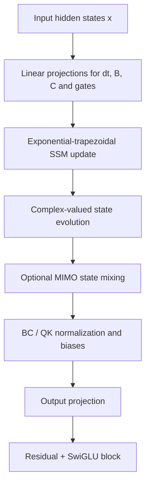

## Hook

LLM 아키텍처 이야기를 할 때 우리는 너무 쉽게 Transformer를 기본값으로 받아들인다. 실제로 지금의 frontier model 대부분은 Transformer 또는 그 hybrid 변형 위에 서 있다. 하지만 추론 비용까지 포함해 생각하면, 이 기본값은 점점 더 비싸지고 있다. 긴 컨텍스트, agentic workflow, 반복 호출, test-time compute scaling이 중요해질수록 병목은 학습보다 오히려 **추론 단계의 메모리와 latency** 쪽으로 더 또렷하게 드러난다.

Mamba 계열이 주목받았던 이유도 여기에 있다. self-attention의 quadratic cost와 KV cache 부담 대신, recurrent한 state update로 **linear-time decoding**과 **constant-memory inference**를 노릴 수 있기 때문이다. 다만 지난 1~2년간의 분위기를 냉정하게 보면, “빠를 수 있다”와 “실제로 Transformer를 대체할 만큼 강하다” 사이에는 아직 거리가 있었다. Mamba-1은 신선했지만 다소 heuristic했고, Mamba-2는 더 깔끔한 SSD(Structured State Space Duality) 관점과 학습 효율을 줬지만, 일부 설정에서는 표현력과 capability 쪽에서 아쉬움이 남았다.

**Mamba-3: Improved Sequence Modeling using State Space Principles**는 바로 그 빈틈을 정면으로 건드린다. 이 논문은 단순히 블록 몇 개를 바꾸는 incremental update가 아니다. 저자들은 “SSM 관점에서 보면 아직 더 밀 수 있는 축이 있다”는 입장에서 세 가지를 동시에 바꾼다. 더 표현력 있는 discretization, state-tracking을 살리는 complex-valued update, 그리고 실제 GPU decode 효율을 높이기 위한 MIMO formulation이다.

중요한 건 이 논문이 단지 수식적으로 예쁜 제안을 하는 데서 멈추지 않는다는 점이다. 저자들은 language modeling, retrieval, synthetic state-tracking task, state-size/latency tradeoff까지 묶어서 **성능-효율 frontier를 어떻게 옮겼는지**를 보이려 한다. 이 글에서는 Mamba-3가 정확히 무엇을 바꿨는지, 왜 그 변화가 Mamba-2와 다른지, 그리고 결과를 어디까지 믿어야 하는지를 long-form으로 정리해보겠다.

## Problem

Mamba-3가 겨냥하는 문제는 “선형 시퀀스 모델이 왜 아직 Transformer의 완전한 대안이 되지 못했는가”로 요약할 수 있다. 논문을 읽고 나면 이 문제는 크게 세 병목으로 쪼개진다.

### 병목 1: 선형 모델은 효율을 얻는 대신 표현력을 잃기 쉽다

최근 linear attention, SSM, DeltaNet 류의 모델은 모두 같은 약속을 건다.

- attention보다 더 싼 복잡도
- 긴 컨텍스트에서 더 좋은 scaling
- KV cache에 덜 의존하는 inference

문제는 그 대가다. 실제로 이런 모델들은 종종 **표현력 있는 sequence interaction을 희생**한다. 특히 selective mechanism이 있더라도, recurrence 자체가 너무 단순하면 최근 토큰과 먼 과거 토큰의 상호작용을 풍부하게 모델링하기 어렵다. Mamba-2는 Mamba-1보다 더 단정한 구조와 더 빠른 학습을 제공했지만, 논문이 직접 인정하듯 어떤 설정에서는 inference-matched model에서 expressivity가 부족할 수 있다.

즉, 문제는 단순히 “linear model이 느리다/빠르다”가 아니라, **같은 추론 비용 안에서 얼마나 강한 recurrence를 만들 수 있는가**다.

### 병목 2: 많은 선형 모델은 state tracking에 약하다

선형 모델이 attention보다 종종 불리한 또 다른 이유는 **상태를 제대로 추적해야 하는 작업**에서 취약하다는 점이다. 논문은 parity나 modular arithmetic 같은 synthetic task를 예로 든다. 이런 문제는 단지 언어 perplexity만 낮추면 되는 문제가 아니라, 입력 시퀀스 속에서 특정 구조적 상태를 업데이트하고 유지하는 능력을 요구한다.

기존 Mamba/linear 계열이 여기서 흔들린다는 건 꽤 치명적이다. 왜냐하면 retrieval, long-context reasoning, tool-use 같은 실제 LLM 워크로드도 결국 “중간 상태를 어떻게 유지하느냐”와 연결되기 때문이다. 다시 말해 state tracking은 toy task가 아니라, **모델 capability의 민감한 probe**로 볼 수 있다.

### 병목 3: 이론상 linear여도 실제 decode는 하드웨어 친화적이지 않을 수 있다

이 논문에서 특히 좋았던 부분은 “linear-time”이라는 말 자체를 비판적으로 본다는 점이다. GPU에서 중요한 건 big-O뿐 아니라 **arithmetic intensity**, 즉 메모리 트래픽 대비 연산량이다. 어떤 recurrent update는 복잡도는 예뻐도 실제 decoding에서는 메모리 바운드가 심해서 하드웨어를 충분히 못 태운다.

그래서 실제 질문은 이렇게 바뀐다.

> **이론상 linear한 모델을, 실제 GPU decode에서도 성능 대비 효율이 좋은 모델로 만들 수 있는가?**

Mamba-3는 이 세 병목—표현력, state tracking, 하드웨어 효율—을 한 번에 건드리려는 논문이다.

## Key Idea

Mamba-3의 핵심 아이디어를 가장 압축하면 다음과 같다.

> **Mamba-2의 SSM 블록을 유지하되, recurrence의 이산화 방식, state 표현, decode-time update 구조를 모두 더 inference-first한 방향으로 재설계한다.**

논문의 핵심 기여는 세 가지다.

1. **Exponential-trapezoidal discretization**
   - Mamba-1/2의 exponential-Euler 계열보다 더 표현력 있는 recurrence를 만든다.
   - 결과적으로 implicit convolution 같은 효과를 recurrence 안에 녹여, short convolution에 대한 의존을 줄이는 방향을 연다.

2. **Complex-valued state space model**
   - state update를 복소수 공간까지 확장해 richer dynamics를 허용한다.
   - 논문은 이 구조가 data-dependent RoPE와 연결된다고 설명하며, state-tracking capability를 크게 끌어올린다.

3. **MIMO (Multi-Input, Multi-Output) SSM**
   - 기존 outer-product 기반 state update를 더 matrix-multiplication 친화적인 형태로 바꿔 decode arithmetic intensity를 높인다.
   - 핵심은 state size를 늘리지 않고도 더 많은 연산을 유의미하게 태워 성능을 개선하는 것이다.

Mamba-2와 대비하면 차이는 아래처럼 정리할 수 있다.

| 축 | Mamba-2 | **Mamba-3** | 기대 효과 |
|---|---|---|---|
| Discretization | exponential-Euler 성격의 selective recurrence | **exponential-trapezoidal recurrence** | 더 표현력 있는 state update |
| State representation | real-valued SSM | **complex-valued SSM** | state tracking, richer dynamics |
| Decode update | SISO 중심 | **MIMO 확장 가능** | GPU 활용률 개선, 성능 증가 |
| Architecture details | SSD-based clean design | **QK/BC normalization, bias refinements 포함** | 안정성 및 실전 성능 개선 |
| 주요 메시지 | 학습/구현 단순화와 efficiency | **inference-first frontier 개선** | quality + capability + efficiency 동시 개선 |

중요한 건 이 세 축이 서로 독립적인 tweak가 아니라는 점이다. 논문 전체를 관통하는 관점은 “선형 모델을 attention의 약한 근사치로 보지 말고, **SSM 고유의 설계 원리에서 다시 밀어붙이자**”에 가깝다.

## How It Works

### Overview


_Figure 1: Mamba-2와 Mamba-3 아키텍처 비교. Mamba-3는 exponential-trapezoidal discretization, complex state update, MIMO projection, data-dependent RoPE, normalization/bias refinements를 함께 도입한다. 출처: 원 논문_

Mamba-3 블록은 크게 보면 여전히 “입력을 받아 selective state update를 수행하고, gating 및 MLP와 함께 다음 representation을 만든다”는 큰 틀을 유지한다. 하지만 내부 recurrence의 모양이 달라지고, state 자체가 더 표현력 있게 바뀌며, decode에서 더 많은 연산을 효율적으로 태울 수 있도록 설계가 바뀐다.

개념적인 전체 흐름은 아래처럼 볼 수 있다.



더 단순한 pseudocode로 쓰면 다음 정도다.

```pseudocode
Algorithm: Mamba-3 block
Input: token sequence x_1, ..., x_T
Project token-dependent parameters: Δ_t, B_t, C_t, gates
For each timestep t:
    update hidden state with exponential-trapezoidal recurrence
    optionally rotate/update complex state with data-dependent phase
    optionally apply MIMO state transition/output mixing
    produce y_t from normalized readout of the state
Return projected outputs with residual connection
```

겉으로 보면 작은 수정처럼 보일 수 있지만, 실제 변화의 핵심은 recurrence 식이 2-term에서 **3-term 구조**로 더 풍부해지고, 그 위에 복소수 위상 정보와 MIMO 출력을 쌓는다는 데 있다.

### Representation / Problem Formulation

Mamba 계열의 시작점은 연속시간 state space model(SSM)이다. 기본적인 continuous-time 표현은 다음처럼 쓸 수 있다.

$$
\dot{\mathbf{h}}(t) = \mathbf{A}(t) \mathbf{h}(t) + \mathbf{B}(t) x(t),
$$

$$
y(t) = \mathbf{C}(t)^\top \mathbf{h}(t).
$$

여기서 $\mathbf{h}(t)$는 hidden state, $x(t)$는 입력, $\mathbf{A}(t)$는 state transition, $\mathbf{B}(t), \mathbf{C}(t)$는 input/output 쪽 파라미터다. 실제 sequence modeling에서는 연속시간 시스템을 토큰 단위로 관측하므로, 결국 이걸 discrete recurrence로 바꿔야 한다.

Mamba-2의 핵심 단순화는 selective scalar transition을 써서 다음처럼 적을 수 있는 recurrence였다.

$$
\mathbf{h}_t = \alpha_t \mathbf{h}_{t-1} + \gamma_t \mathbf{B}_t x_t,
\qquad
 y_t = \mathbf{C}_t^\top \mathbf{h}_t.
$$

여기서 $\alpha_t$는 forget/retain 정도를 조절하는 data-dependent transition이고, $\gamma_t$는 현재 입력의 기여를 조절하는 계수다. 이 구조 덕분에 Mamba는 selective memory를 가지면서도 하드웨어 친화적인 구현이 가능했다.

그런데 Mamba-3는 여기서 한 걸음 더 나간다. 핵심 관찰은 **discretization 자체가 recurrence 표현력을 결정한다**는 것이다. 즉, 단순한 current-token injection만으로는 놓치는 상호작용이 있으며, 이를 더 풍부한 이산화 규칙으로 끌어올릴 수 있다는 주장이다.

### Exponential-trapezoidal discretization


_Figure 2: exponential-trapezoidal discretization은 decay mask에 두 밴드의 convolutional structure를 결합한 형태를 만든다. 직관적으로는 기존 selective recurrence보다 한 단계 더 풍부한 입력 혼합을 허용한다. 출처: 원 논문_

논문이 가장 공들여 설명하는 첫 축은 discretization이다. 기존 Mamba-1/2의 selective recurrence는 사실상 exponential-Euler 형태로 볼 수 있는데, Mamba-3는 이를 일반화한 **exponential-trapezoidal** 형태를 제안한다.

핵심 recurrence는 블로그용으로 간단히 쓰면 다음 모양이다.

$$
\mathbf{h}_t
= \alpha_t \mathbf{h}_{t-1}
+ \beta_t \mathbf{B}_{t-1} x_{t-1}
+ \gamma_t \mathbf{B}_t x_t.
$$

Mamba-2와 비교하면 결정적인 차이는 가운데 항, 즉 **직전 입력에 대한 추가 항 $\beta_t \mathbf{B}_{t-1} x_{t-1}$** 이 생긴다는 점이다. 이것은 단순히 항 하나 더 붙은 것이 아니라, recurrence가 “현재 토큰만 받아 state에 넣는 장치”에서 “연속시간 dynamics를 더 정교하게 근사하는 장치”로 바뀌었다는 뜻이다.

논문은 이 구조를 implicit convolution으로 해석한다. 직관적으로는 이렇다.

- Mamba-2는 selective recurrence + 별도 short conv가 필요했다.
- Mamba-3의 discretization은 recurrence 안에 이미 local two-band mixing을 품는다.
- 즉, 짧은 컨볼루션의 역할 일부를 SSM 이산화 자체가 흡수할 수 있다.

이 부분이 중요한 이유는 두 가지다.

첫째, recurrence 표현력이 오른다. 둘째, 아키텍처를 구성하는 기능적 역할이 더 자연스러워진다. “왜 recurrent model에 따로 short conv를 얹어야 하지?”라는 질문에 대해, Mamba-3는 “그 기능 일부는 사실 discretization에서 나와야 한다”고 답하는 셈이다.

개념적인 PyTorch 스타일 pseudocode는 아래처럼 볼 수 있다.

```python
import torch
import torch.nn as nn

class ExpTrapezoidalSSM(nn.Module):
    def __init__(self, d_state: int):
        super().__init__()
        self.d_state = d_state

    def forward(self, h_prev, x_prev, x_t, alpha_t, beta_t, gamma_t, B_prev, B_t):
        # Simplified sketch of Mamba-3-style 3-term recurrence
        term_memory = alpha_t * h_prev
        term_prev = beta_t * B_prev * x_prev
        term_curr = gamma_t * B_t * x_t
        h_t = term_memory + term_prev + term_curr
        return h_t
```

물론 실제 구현은 훨씬 더 복잡하고 fused kernel 수준의 최적화가 들어가지만, 설계의 본질은 위 코드처럼 **현재 입력뿐 아니라 직전 입력까지 SSM recurrence 안에 끌어들인다**는 데 있다.

### Complex-valued state space and state tracking

Mamba-3의 두 번째 축은 complex-valued state update다. 이건 단지 “복소수를 쓰면 표현력이 좋아진다” 수준의 이야기보다 더 중요하다. 논문이 직접 겨냥하는 것은 state tracking failure다.

Mamba-2의 단순한 real-valued update를 아주 거칠게 쓰면 다음처럼 볼 수 있다.

$$
\mathbf{h}_t = \alpha_t \mathbf{h}_{t-1} + \text{input term}.
$$

이 구조는 selective forgetting에는 좋지만, 주기성, 위상, 회전적 상태 변화를 자연스럽게 표현하는 데는 한계가 있다. Mamba-3는 state를 복소수 공간으로 확장해 **amplitude와 phase를 동시에 다루는 동역학**을 허용한다.

직관적으로 보면 복소수 상태는 다음 두 요소를 함께 가진다.

- magnitude: 얼마나 강하게 정보를 유지/감쇠하는가
- phase: 어떤 방식으로 상태를 회전/변형하며 추적하는가

논문은 이 업데이트가 데이터 의존적인 rotary embedding과 본질적으로 연결된다고 설명한다. 블로그식으로 단순화하면 아래 같은 형태를 상상할 수 있다.

$$
\mathbf{h}_t = \rho_t e^{i\theta_t} \odot \mathbf{h}_{t-1} + \text{input terms}.
$$

여기서 $\rho_t$는 감쇠 정도, $\theta_t$는 입력에 따라 달라지는 phase rotation이다. 이 구조는 실수값 recurrence보다 훨씬 풍부한 상태 변형을 허용한다.

이 변화의 의미는 synthetic task에서 분명하게 드러난다. 논문에 따르면 Mamba-3는 modular arithmetic, parity류의 state-tracking task에서 이전 선형 모델보다 훨씬 강해지며, standard RoPE를 얹는 것만으로는 얻지 못하는 개선도 보인다. 즉, 복소수 state는 cosmetic tweak가 아니라 **capability bottleneck을 건드리는 중심 변경**이다.

### From SISO to MIMO

세 번째 축은 MIMO다. 대부분의 모델 논문은 여기서 “성능이 올랐다” 정도만 말하고 넘어가는데, Mamba-3는 왜 이게 inference efficiency와 연결되는지 비교적 명시적으로 설명한다.

기존 SISO(single-input, single-output) recurrence는 decode 시 state update가 메모리 바운드가 되기 쉽다. 다시 말해 state를 계속 읽고 쓰는데 비해, GPU tensor core가 좋아하는 큰 matmul은 충분히 못 태운다. 저자들의 아이디어는 간단하다.

> **같은 state size를 유지하되, state update와 readout을 multi-input, multi-output 구조로 바꿔 더 많은 유효 FLOPs를 태우자.**

개념적으로는 다음과 같은 변화다.

- SISO: 벡터 수준 update/readout
- MIMO: 작은 행렬 단위의 richer update/readout

이를 매우 단순화하면,

$$
\mathbf{h}_t = \alpha_t \mathbf{h}_{t-1} + \mathbf{U}_t x_t
$$

같은 벡터성 업데이트에서,

$$
\mathbf{H}_t = \mathcal{A}_t \mathbf{H}_{t-1} + \mathcal{U}_t x_t
$$

같은 더 구조적인 multi-channel update로 간다고 볼 수 있다. 실제 논문 구현은 SSD/Mamba 구조에 맞춘 훨씬 정교한 형태지만, 핵심은 **state size를 늘리는 대신 한 state 안의 입출력 채널 구조를 확장**해 성능과 하드웨어 활용률을 함께 끌어올린다는 점이다.

MIMO의 중요한 특징은 decode latency를 크게 늘리지 않으면서도 더 좋은 perplexity를 내도록 설계되었다는 것이다. 즉, “더 비싼 모델이 더 좋다”가 아니라, **같은 latency class에서 모델 품질을 높이는 방법**으로 제안된다.

### Architecture refinements: normalization, biases, and block design

논문 제목만 보면 discretization, complex SSM, MIMO 세 축이 전부인 것처럼 보이지만, 실제 아키텍처 결과는 몇 가지 실전적 refinement와 함께 나온다. Figure 1에도 보이듯 Mamba-3는 다음 요소들을 함께 조정한다.

- **data-dependent RoPE-style mechanism**
- **BC / QK normalization**
- **learnable biases for B, C**
- **Llama-style alternating Mamba + SwiGLU blocks**

이런 변경은 보통 논문 읽을 때 “부수적인 engineering”처럼 보이기 쉽다. 하지만 frontier model 쪽에서는 바로 이런 부분이 성능 차이를 만든다. 특히 normalization 위치와 종류, projection bias, gate 전후의 배치 같은 요소는 retrieval나 long-context robustness에 민감하게 작용한다.

이 논문이 좋은 점은 이런 요소를 완전히 숨기지 않고 ablation 대상에 포함했다는 것이다. 즉, Mamba-3의 성능은 “큰 아이디어 3개만 넣으면 자동으로 나온다”가 아니라, **SSM core innovation + block-level engineering**의 합으로 봐야 한다.

아래는 매우 단순화한 블록 수준 sketch다.

```python
import torch
import torch.nn as nn

class Mamba3Block(nn.Module):
    def __init__(self, d_model: int, d_state: int):
        super().__init__()
        self.in_proj = nn.Linear(d_model, 4 * d_model)
        self.norm = nn.LayerNorm(d_model)
        self.ssm = ExpTrapezoidalSSM(d_state=d_state)
        self.out_proj = nn.Linear(d_model, d_model)
        self.mlp = nn.Sequential(
            nn.Linear(d_model, 4 * d_model),
            nn.SiLU(),
            nn.Linear(4 * d_model, d_model),
        )

    def forward(self, x, state, x_prev, params):
        residual = x
        x = self.norm(x)
        proj = self.in_proj(x)
        # dt, B, C, gates, and optional MIMO projections would be produced here
        state = self.ssm(state, x_prev, x, **params)
        y = self.out_proj(state.real if torch.is_complex(state) else state)
        x = residual + y
        x = x + self.mlp(x)
        return x, state
```

이 코드는 논문의 faithful implementation이 아니라 구조적 감각을 위한 sketch다. 다만 독자가 읽고 나서 “Mamba-3는 결국 recurrence와 projection 계층을 어떻게 바꿨는지”를 떠올릴 수 있도록 돕는 목적에는 충분하다.

### Why this works

Mamba-3의 설계를 한 문장으로 요약하면 다음과 같다.

> **표현력은 discretization에서, capability는 complex dynamics에서, 실제 decode 효율은 MIMO에서 끌어온다.**

더 풀어 쓰면,

1. **Exponential-trapezoidal**은 “현재 토큰만 넣는 recurrence”보다 더 풍부한 local interaction을 만든다.
2. **Complex state**는 phase-sensitive tracking을 허용해 state-tracking 능력을 복구한다.
3. **MIMO**는 decode가 메모리 바운드로만 끝나지 않게 해 실제 하드웨어에서 더 좋은 성능-효율 균형을 만든다.

즉, Mamba-3는 선형 모델이 약했던 세 지점을 각각 다른 수단으로 정확히 찌른다. 이게 이 논문이 단순한 버전업이 아니라 “SSM 설계 철학의 재정리”처럼 읽히는 이유다.

## Results


_Figure 3: state size를 inference speed proxy로 보고 perplexity를 성능 proxy로 놓았을 때, Mamba-3와 특히 MIMO variant가 Pareto frontier를 더 앞으로 민다. 출처: 원 논문_

결과를 볼 때는 논문이 무엇을 직접 증명했고, 무엇을 강하게 시사하는지를 나눠서 봐야 한다.

### 1. 1.5B 규모에서 다운스트림 정확도 개선

초록 기준으로 Mamba-3는 1.5B scale에서 다음 best model인 Gated DeltaNet 대비 평균 downstream accuracy를 **0.6pt** 높였고, MIMO variant는 거기서 **추가 1.2pt**를 더해 총 **1.8pt** 개선을 만든다고 보고한다.

이 수치는 언뜻 작아 보일 수 있지만, 이미 꽤 경쟁적인 선형 baseline 사이 비교라는 점을 생각하면 의미가 있다. 특히 단순히 parameter를 더 쓴 결과가 아니라 **inference-first 재설계로 얻은 개선**이라는 것이 논문의 핵심 주장이다.

### 2. 절반 state size로 비슷한 perplexity

논문이 반복해서 강조하는 포인트 중 하나는, Mamba-3가 **Mamba-2의 절반 수준 state size로 비슷한 perplexity**를 달성한다는 점이다. 이건 실무적으로 꽤 중요하다. state size는 결국 decode efficiency의 중요한 proxy이기 때문이다. 같은 perplexity를 더 작은 state로 얻는다면, 긴 시퀀스 generation에서 latency와 memory 측면 모두 유리해진다.

Figure 3는 이 지점을 직관적으로 보여준다. Mamba-3 SISO만 봐도 Mamba-2보다 더 좋은 frontier를 만들고, MIMO를 얹으면 그 frontier가 한 번 더 이동한다. 즉, MIMO는 그냥 “연산 더 많이 해서 더 좋아짐”이 아니라, **같은 state size class에서 더 좋은 점을 찾는 방법**으로 제안된다.

### 3. State-tracking synthetic task 개선

논문은 modular arithmetic, parity 등 synthetic task에서 Mamba-3가 이전 linear model보다 훨씬 강하다고 보고한다. 특히 complex-valued update와 RoPE-like mechanism이 없으면 잘 안 풀리던 문제를 거의 완벽하게 푸는 설정이 나온다.

이 결과는 두 가지 의미가 있다.

- 복소수 state가 단지 학습을 흔드는 장식이 아니라는 점
- language modeling perplexity만으로는 잘 안 보이는 capability 개선이 있다는 점

이런 synthetic result를 과대해석하면 안 되지만, 최소한 **state tracking 약점을 겨냥한 설계가 실제로 작동한다**는 정성적 증거로는 충분히 설득력 있다.

### 4. Length extrapolation과 retrieval


_Figure 4: held-out FineWeb-Edu test set에서 컨텍스트 길이를 늘릴수록 Mamba-3가 Mamba-2보다 더 안정적인 길이 외삽을 보인다. 출처: 원 논문_

Figure 4는 Mamba-3가 긴 컨텍스트에서 Mamba-2보다 더 안정적으로 버틴다는 메시지를 준다. 이건 retrieval와도 연결되는 이야기다. 논문은 hybrid variant 및 norm 선택까지 포함해 in-context retrieval 성능을 꽤 신경 써서 본다. 결국 Mamba-3는 단순히 LM loss를 깎는 모델이 아니라, **긴 context에서 필요한 정보 유지와 읽기 능력**까지 개선하려는 모델이라는 게 드러난다.

### 5. Fast kernels까지 제공

실전성 측면에서 빼놓을 수 없는 부분은 코드와 커널이다. 논문 및 공식 repo는 Mamba-3용 fast training/inference kernels를 함께 제공한다고 강조한다. 이런 류의 논문은 커널이 없으면 사실상 “아이디어는 좋지만 써보기 어려운 모델”로 남기 쉬운데, Mamba-3는 적어도 그 함정은 피하려고 한다.

## Discussion

내가 보기에 Mamba-3의 진짜 강점은 “Transformer를 넘었다”가 아니라, **선형 모델 쪽 설계 논리가 드디어 한 단계 더 성숙했다**는 데 있다.

예전의 많은 subquadratic 모델은 대개 두 부류였다.

- 수학적으로 흥미롭지만 실제 성능이 아쉬운 모델
- 실제 성능은 괜찮아도 왜 먹히는지 구조적으로 잘 설명하지 못하는 모델

Mamba-3는 그 중간 지점에서 꽤 균형을 잘 잡는다. discretization 이론을 정리해 기존 heuristic을 formalize하고, state-tracking 실패를 complex dynamics로 직접 해결하려 하고, decode arithmetic intensity 문제를 MIMO로 해소한다. 즉, **문제 정의가 정확하고, 각 문제에 맞는 처방이 붙어 있다**.

또 하나 흥미로운 점은 Mamba-3가 attention을 흉내 내려 하기보다, 오히려 SSD와 SSM의 고유 관점에서 모델을 다시 밀어붙인다는 점이다. 이는 “linear model = cheap attention approximation”이라는 인식에서 한 발 더 나간다. 논문 5장의 related work를 읽어보면, 저자들은 선형 모델을 linear attention이나 test-time regression의 관점으로만 읽는 대신, **state space model 자체의 신호처리적 해석**을 더 중심에 둔다.

실무 관점에서도 시사점이 있다. 앞으로 LLM이 더 agentic해지고, 긴 retrieval context를 더 자주 읽고, reasoning 과정에서 repeated decoding을 수행한다면, 모델 설계의 초점은 점점 training-optimal보다 **inference-optimal** 쪽으로 이동할 가능성이 높다. 그때 Mamba-3 같은 설계는 “Transformer를 완전히 대체”하지 못하더라도, hybrid system의 중요한 구성요소가 될 수 있다.

## Limitations

그렇다고 Mamba-3를 곧바로 Transformer killer로 읽으면 과하다. 한계도 분명하다.

### 1. 아직은 주로 선형 모델 내부 비교다

논문은 Mamba-2, Gated DeltaNet, 일부 hybrid baseline과의 비교를 잘 보여주지만, 산업 현장에서 실제로 부딪히는 대형 Transformer 계열과의 비교는 더 넓게 필요하다. “같은 quality에서 inference total cost가 얼마나 줄었는가”를 end-to-end serving 관점에서 보는 자료는 아직 부족하다.

### 2. synthetic state-tracking task의 외삽에는 주의가 필요하다

parity나 modular arithmetic에서 잘한다고 해서 곧바로 agentic reasoning이 좋아진다고 말할 수는 없다. 물론 capability probe로는 유용하지만, 실제 사용성으로 연결하려면 더 많은 downstream evidence가 필요하다.

### 3. MIMO의 실전 이점은 시스템 stack에 따라 달라질 수 있다

논문은 decode arithmetic intensity 개선을 강조하지만, 실제 이점은 커널 품질, GPU 종류, batch size, sequence regime에 따라 달라질 수 있다. 즉, MIMO의 장점은 “항상 공짜”가 아니라 **잘 최적화된 시스템 위에서 더 크게 드러나는 성격**일 수 있다.

### 4. 아키텍처 순수성보다 engineering bundle의 영향이 있다

Mamba-3의 성능은 discretization/complex/MIMO라는 큰 아이디어만으로 설명되지는 않는다. normalization, bias, block ordering 같은 engineering choice가 함께 들어간다. 연구적으로는 자연스러운 일이지만, 각 요소의 기여를 완전히 분리해서 해석하기는 어렵다.

### 5. 생태계는 여전히 Transformer 중심이다

가장 현실적인 한계다. 모델이 좋아도 ecosystem이 따라오지 않으면 채택 속도는 느리다. 툴링, quantization, serving stack, distillation, alignment, fine-tuning recipe 모두 Transformer가 훨씬 앞서 있다. Mamba-3가 연구 frontier를 밀었다는 것과, 당장 메인스트림이 된다는 것은 다른 이야기다.

## Conclusion

Mamba-3는 “선형 모델도 빠르다”는 오래된 주장에 머물지 않고, **왜 이전 선형 모델이 충분히 강하지 못했는지**를 구조적으로 짚은 뒤 그 해법을 제시한 논문이다. exponential-trapezoidal discretization은 recurrence 자체의 표현력을 높이고, complex-valued update는 state tracking이라는 고질적 약점을 보완하며, MIMO는 실제 decode 하드웨어 효율까지 고려해 설계된다.

내 기준에서 이 논문의 가장 중요한 메시지는 이것이다. 앞으로의 시퀀스 모델 경쟁은 더 이상 단순히 parameter count나 pretraining FLOPs 경쟁이 아니다. **같은 추론 시간 안에 얼마나 더 강한 동역학을 구현할 수 있느냐**가 점점 더 중요해진다. 그런 관점에서 Mamba-3는 선형 시퀀스 모델이 어디까지 갈 수 있는지 보여주는, 꽤 설득력 있는 다음 단계다.

## TL;DR

- Mamba-3는 Mamba-2를 잇는 SSM 기반 시퀀스 모델로, 핵심 초점은 **inference-first 설계**다.
- 핵심 변경은 세 가지다: **exponential-trapezoidal discretization**, **complex-valued state update**, **MIMO SSM**.
- exponential-trapezoidal recurrence는 3-term 업데이트를 도입해 recurrence 표현력을 높이고, implicit convolution 같은 효과를 준다.
- complex-valued state는 phase-aware dynamics를 가능하게 해 parity/modular arithmetic 같은 **state-tracking task**에서 강한 개선을 만든다.
- MIMO는 decode arithmetic intensity를 높여, state size를 늘리지 않고도 **성능-효율 Pareto frontier**를 더 앞으로 민다.
- 논문은 1.5B scale에서 Gated DeltaNet 대비 평균 downstream accuracy **+0.6pt**, MIMO variant까지 포함하면 총 **+1.8pt** 개선을 보고한다.
- 또 Mamba-3는 **Mamba-2의 절반 state size로 비슷한 perplexity**를 달성해, 긴 컨텍스트 inference에서 더 유리한 가능성을 보여준다.
- 다만 아직은 Transformer 생태계 전체를 대체했다기보다, **선형 모델이 연구용 curiosity를 넘어 실전 카드로 진화하는 과정**으로 보는 게 더 정확하다.

## Paper Info

| 항목 | 내용 |
|---|---|
| **Title** | Mamba-3: Improved Sequence Modeling using State Space Principles |
| **Authors** | Aakash Lahoti, Kevin Y. Li, Berlin Chen, Caitlin Wang, Aviv Bick, J. Zico Kolter, Tri Dao, Albert Gu |
| **Affiliations** | 논문/공개 자료 기준 여러 연구기관 공동연구 (OpenReview/arXiv 공개본 기준 세부 affiliation 표기는 본문에서 생략) |
| **Venue** | ICLR 2026 (OpenReview 공개본 기준) |
| **Published** | arXiv v1: 2026-03-16 |
| **Link** | https://openreview.net/forum?id=HwCvaJOiCj |
| **Paper** | https://arxiv.org/abs/2603.15569 |
| **Code** | https://github.com/state-spaces/mamba |

---

> 이 글은 LLM(Large Language Model)의 도움을 받아 작성되었습니다. 
> 논문의 내용을 기반으로 작성되었으나, 부정확한 내용이 있을 수 있습니다.
> 오류 지적이나 피드백은 언제든 환영합니다.
{: .prompt-info }
