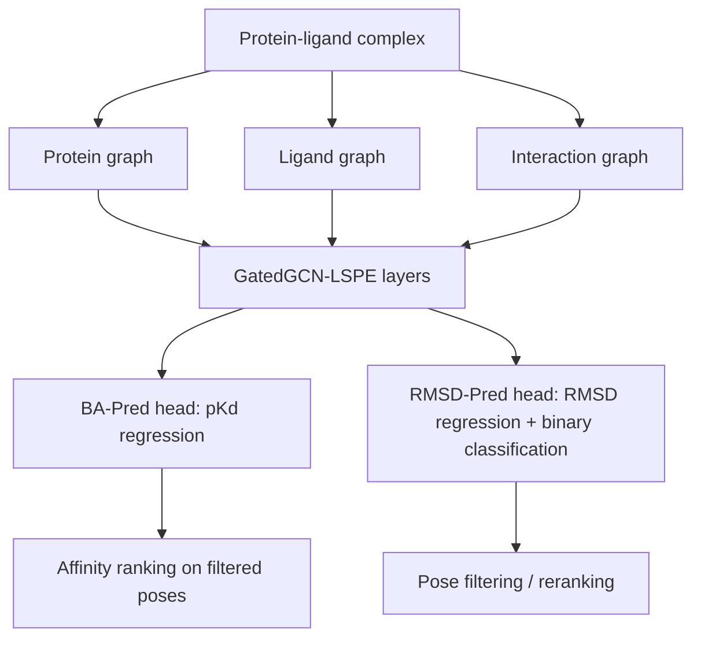

## Hook

protein-ligand 모델링에서 자주 생기는 착각이 하나 있다. **좋은 affinity predictor면 좋은 docking scorer일 것**이라는 가정이다. 얼핏 당연해 보이지만, 실제로는 그렇지 않다. binding affinity 예측은 “이 pose가 맞다”를 전제하고 그 위에서 얼마나 잘 결합하는지를 읽는 문제에 가깝고, docking pose 평가는 수많은 decoy 중에서 **crystal pose에 가까운 구조를 골라내는 순위 문제**에 더 가깝다. 입력 분포도 다르고, 실패 방식도 다르다.

이 논문은 그 불편한 사실을 정면으로 받아들인다. 한 모델에 모든 걸 억지로 맡기지 않고, **affinity는 BA-Pred**, **pose quality는 RMSD-Pred**로 분리한다. 둘 다 protein-ligand graph를 쓰지만, 어떤 정보를 더 보존해야 하는지와 어떤 loss를 써야 하는지가 다르다는 판단이다. 한마디로 말해, “구조 기반 drug discovery의 두 핵심 과업은 비슷해 보여도 같은 문제가 아니다”라는 주장이다.

결과도 그 주장과 꽤 잘 맞아떨어진다. BA-Pred는 CASF-2016 scoring power에서 **RMSE 1.10 pKd** 수준으로 strong performance를 보이고, RMSD-Pred는 CASF-2016 docking power에서 **top-1 success 96.49%**까지 올라간다. 더 흥미로운 건 조합 효과다. RMSD-Pred로 pose를 먼저 거른 뒤 BA-Pred로 affinity를 매기면, CASF-2016 screening benchmark에서 **EF 1% 21.1**을 기록한다. 즉, 둘을 따로 만든 이유가 단순한 모듈 분할이 아니라 실제 pipeline 성능 향상으로 이어진다.

이 글에서는 이 논문을 단순 성능 소개가 아니라, **왜 affinity와 pose를 분리해야 했는지**, **그래프 표현과 GatedGCN-LSPE가 어떻게 그 역할을 받치는지**, 그리고 **어디까지 설득력 있고 어디서부터는 조심해서 봐야 하는지**를 중심으로 풀어보겠다.

## Problem

이 논문이 푸는 문제는 사실 두 개다.

1. **주어진 protein-ligand complex pose로부터 binding affinity를 예측하는 것**
2. **주어진 docking pose가 native pose에 얼마나 가까운지 평가하는 것**

문제는 이 둘이 표면적으로는 비슷해도, 학습해야 하는 신호가 다르다는 점이다.

### 병목 1: affinity prediction은 pose quality에 강하게 의존한다

binding affinity는 물리적으로 말이 되는 bound pose 위에서만 의미가 있다. 비현실적인 decoy pose를 넣고 pKd를 예측하면, 숫자는 나와도 그 숫자의 의미는 상당히 약해진다. 다시 말해,

$$
\text{good affinity prediction} \Rightarrow \text{good pose-conditioned regression}
$$

이지,

$$
\text{good affinity prediction} \not\Rightarrow \text{good pose discriminator}
$$

는 아니라는 것이다.

실제로 이 논문에서도 BA-Pred는 scoring에서는 강하지만 docking power는 **31.6% top-1 success**에 그친다. 저자들이 말하고 싶은 핵심도 여기 있다. crystal structure 중심으로 학습한 affinity model은 decoy-rich docking distribution에서 native-like pose를 골라내는 데 약할 수 있다.

### 병목 2: pose evaluation은 chemistry보다 geometric discrimination이 더 중요할 수 있다

pose quality 평가는 “얼마나 세게 붙는가”보다 “얼마나 native pose에 가까운가”가 핵심이다. 그래서 RMSD-Pred는 binding thermodynamics보다 **interface geometry**를 더 세밀하게 읽도록 설계된다. BA-Pred가 residue 단위 chemical integrity를 살리기 위해 pocket residue 전체를 유지하는 반면, RMSD-Pred는 atom-level cutoff로 더 촘촘한 spatial resolution을 택한다.

### 병목 3: train-test leakage가 구조 기반 벤치마크를 쉽게 부풀린다

PDBbind 기반 연구는 늘 leakage 문제를 안고 있다. 비슷한 protein family, 유사 ligand, 유사 binding pose가 train/test 사이에 겹치면, 모델이 실제 물리를 배웠는지 아니면 사례를 기억했는지 구분이 흐려진다. 그래서 이 논문은 Random Split만 쓰지 않고,

- **PDBbind CleanSplit**
- **LP-PDBBind**

같이 더 엄격한 split에서도 결과를 제시한다. 이건 꽤 중요한 태도다. 적어도 “CASF 숫자만 잘 나온 모델”로 끝내지 않겠다는 뜻이기 때문이다.

## Key Idea

이 논문의 핵심 아이디어는 아주 간단하게 정리할 수 있다.

> **affinity regression과 pose-quality estimation을 하나의 scoring function으로 뭉개지 말고, 서로 다른 inductive bias를 가진 두 개의 graph model로 분리하자.**

구성은 이렇다.

- **BA-Pred**: pKd 회귀 모델
- **RMSD-Pred**: RMSD 회귀 + native/non-native 이진 분류 모델
- **공통 backbone**: GatedGCN-LSPE 기반 protein-ligand graph encoder
- **최종 pipeline**: RMSD-Pred로 pose filtering → BA-Pred로 최종 ranking

큰 차이는 입력 graph의 구성과 output head에 있다.

| 항목 | BA-Pred | RMSD-Pred |
|---|---|---|
| 주 과업 | binding affinity 회귀 | pose RMSD / near-native 판별 |
| pocket 구성 | residue integrity 보존 중심 | geometric resolution 중심 |
| interaction edge | distance + chemical interaction | distance 중심 |
| 출력 | pKd | predicted RMSD, binary probability |
| 기대 역할 | strong scoring/ranking | strong docking/reranking |

이렇게 보면 이 논문의 새로움은 backbone 자체보다도 **task decomposition**에 있다. “좋은 구조 기반 모델” 하나를 만들겠다는 접근보다, 구조 기반 drug discovery pipeline을 실제 workflow에 맞춰 쪼개겠다는 쪽에 더 가깝다.

## How It Works

### Overview


_Figure 1: BA-Pred/RMSD-Pred 전체 개요. protein graph, ligand graph, interaction graph를 구성한 뒤 GatedGCN-LSPE로 업데이트하고 task-specific head를 붙인다. 출처: 원 논문._

전체 흐름은 다음처럼 볼 수 있다.



중요한 건 graph를 그냥 하나의 complex graph로 던지지 않는다는 점이다. 저자들은

1. **protein internal structure**
2. **ligand internal structure**
3. **protein-ligand interaction**

을 분리해서 표현하고, 그 위에서 message passing을 수행한다. 이게 chemical bond와 intermolecular contact의 의미 차이를 반영하는 기본 설계다.

### Representation / Problem Formulation

두 모델 모두 heavy atom 단위 graph를 기본 표현으로 사용한다. 다만 pocket를 자르는 방식이 다르다.

#### BA-Pred의 pocket 구성

BA-Pred는 thermodynamic signal을 읽는 게 목적이라, atom-level hard cutoff로 residue를 자르면 side chain chemistry가 끊길 수 있다고 본다. 그래서 **리간드와 8 Å 안에 접촉하는 residue는 residue 전체를 포함**한다. 요지는 이거다.

- bond graph의 완전성 보존
- side-chain hydrophobic/electrostatic context 보존
- affinity에 중요한 chemical environment 유지

#### RMSD-Pred의 pocket 구성

반대로 RMSD-Pred는 subtle geometric deviation을 구분해야 하므로, **10 Å 이내의 protein atom만 취하는 atom-level pocket**을 만든다. residue 단위 완전성보다 local spatial fit를 더 중시하는 셈이다.

이 차이는 task-specific inductive bias의 가장 직접적인 예다. 같은 protein-ligand 문제라도 무엇을 예측하느냐에 따라 “좋은 입력 표현”이 달라진다.

#### 데이터셋과 split도 사실상 모델 설계의 일부다

논문은 입력 표현만 바꾼 게 아니라, **어떤 분포 위에서 학습했는가**도 비교적 명확하게 공개한다.

- **BA-Pred 학습 데이터**: PDBbind v2020 general set 기반, 유효 graph 19,012 complexes
- **RMSD-Pred 학습 데이터**: self-docking으로 만든 약 **100만+ pose ensemble**
  - crystal pose: 18,431
  - near-native pose: 162,081
  - decoy pose: 888,007

RMSD-Pred 데이터 구성은 특히 중요하다. 각 complex마다 최대 60개 pose를 만들고,

- crystal structure 1개
- RMSD ≤ 2 Å near-native pose 최대 15개
- 나머지는 decoy

로 채운다. 즉, 이 모델은 처음부터 **decoy-heavy distribution**에서 학습된다. BA-Pred가 crystal-like distribution 중심이고 RMSD-Pred가 docking distribution 중심인 셈이다. 이 분포 차이가 결국 둘의 성격 차이를 만든다.

### Distance embedding과 interaction graph

protein-ligand interaction edge는 5 Å cutoff로 정의하고, 거리 $d$는 15차원 Gaussian RBF embedding으로 바뀐다.

$$
\phi_n(d) = \exp\left(-\frac{d^2}{1.5^n}\right), \quad n \in \{0,1,\dots,14\}
$$

이 식의 역할은 단순하다. 거리를 그냥 scalar 하나로 넣지 않고, 짧은 거리에서는 더 민감하게, 긴 거리에서는 더 완만하게 반응하는 multiscale feature로 바꾸는 것이다. 논문 기준으로 이 설계는 hydrogen bond나 van der Waals contact처럼 **0-5 Å 구간의 미세한 차이**를 더 잘 읽게 해준다.

BA-Pred에서는 여기에 더해 SMARTS 기반의 **10차원 chemical interaction vector**를 붙인다. hydrogen bond, hydrophobic, electrostatic 같은 interaction type을 더 명시적으로 넣겠다는 뜻이다. 반면 RMSD-Pred는 chemical label보다 geometric proximity 자체를 더 신뢰하므로 거리 정보 위주로 간다.

### Core Architecture: GatedGCN-LSPE

두 모델의 backbone은 Gated Graph Convolutional Network with Learnable Structural Positional Encoding, 즉 **GatedGCN-LSPE**다. 요지는 일반 message passing에 learnable positional encoding을 얹어, 그래프 내 상대적 위치성을 더 잘 반영하겠다는 것이다.

논문은 각 레이어의 갱신을 아래처럼 쓴다.

$$
(h^{\ell+1}, e^{\ell+1}, p^{\ell+1}) = \mathrm{GatedGCN\text{-}LSPE}(h^{\ell}, e^{\ell}, p^{\ell})
$$

여기서 $h$는 node feature, $e$는 edge feature, $p$는 positional encoding이다. 논문은 이 $p$를 **RWPE(Random Walk Positional Encoding)** 로 두며, 대략 다음 꼴의 random-walk signature를 사용한다.

$$
p_i^{\mathrm{RWPE}} = \left[ RW_{ii}, RW^2_{ii}, \dots, RW^k_{ii} \right], \qquad RW = AD^{-1}, \; k=20
$$

즉 각 node가 random walk 관점에서 그래프 안에서 어떤 위치적 맥락을 갖는지를 대각성분 기반으로 요약한 것이다. 일반적인 GNN이 graph topology를 로컬 neighborhood 안에서만 간접적으로 느끼는 데 비해, LSPE는 이런 positional trace를 함께 학습하며 구조 정보를 더 오래 끌고 간다. 더 중요한 건 gating score다.

$$
\eta_{ij} = B_1 h_i + B_2 h_j + B_3 e_{ij}
$$

그리고 이 score를 sigmoid 기반 정규화 weight로 바꿔 neighbor influence를 조절한다.

$$
\sigma_{ij} = \frac{\mathrm{sigmoid}(\eta_{ij})}{\sum_{k \in \mathcal{N}(i)} \mathrm{sigmoid}(\eta_{ik})}
$$

직관적으로 보면,

- 모든 이웃이 같은 비중으로 정보를 보내는 게 아니라
- 현재 node, 이웃 node, edge 특징을 보고
- **어느 interaction이 더 중요한지 가중치를 학습**하는 구조다.

protein-ligand 문제에서는 이게 꽤 자연스럽다. 모든 contact가 binding에 똑같이 중요한 건 아니기 때문이다. 어떤 edge는 단순 proximity이고, 어떤 edge는 실제 scoring signal일 수 있다.

또 하나 놓치기 쉬운 차이는 **pooling 대상**이다.

- **BA-Pred**는 최종적으로 **ligand node만 pooling**한다.
- **RMSD-Pred**는 **ligand + protein pocket node를 함께 pooling**한다.

이 차이도 꽤 말이 된다. BA-Pred는 최종적으로 “이 ligand가 이 pocket 환경에서 얼마나 잘 결합하느냐”를 읽는 회귀라 ligand representation이 중심이 되고, RMSD-Pred는 pose의 옳고 그름을 판단해야 하므로 protein-mediated geometric context를 더 직접적으로 읽는 편이 유리하다.

### Training Objective

BA-Pred는 회귀 문제라 MSE loss를 쓴다.

$$
L_{\mathrm{BA}} = \frac{1}{N} \sum_{i=1}^{N} (y_i - \hat{y}_i)^2
$$

여기서 $y_i$는 experimental binding affinity, 즉 보통 pKd 값이다.

RMSD-Pred는 조금 더 흥미롭다. 하나는 RMSD regression이고, 다른 하나는 2 Å 기준의 binary classification이다.

회귀 쪽은 outlier에 덜 민감하도록 Huber loss를 쓴다.

$$
L_{\mathrm{Huber}} = \frac{1}{N} \sum_{i=1}^{N}
\begin{cases}
\frac{1}{2}(p_i - t_i)^2 & \text{if } |p_i - t_i| \le \delta \\
\delta |p_i - t_i| - \frac{1}{2}\delta^2 & \text{otherwise}
\end{cases}
$$

분류 쪽은 BCE loss다.

$$
L_{\mathrm{BCE}} = -\frac{1}{N}\sum_{i=1}^{N} \left[y_i \log \hat{y}_i + (1-y_i)\log (1-\hat{y}_i)\right]
$$

왜 이런 조합이 맞느냐면, pose quality는 단순 연속 회귀 하나로만 보는 것보다 “2 Å 이내 near-native인가?”라는 thresholded decision이 실전 docking reranking에 더 직접적이기 때문이다.

### Inference / Sampling: 실제 파이프라인은 어떻게 쓰이나

논문이 제시하는 실전 흐름은 꽤 명확하다.

```python
# conceptual pseudocode
poses = autodock_gpu(protein, ligand_library)

rescored = []
for pose in poses:
    rmsd_hat = rmsd_pred_reg(pose)
    p_non_native = rmsd_pred_cls(pose)
    if p_non_native <= 0.1:  # or rmsd_hat <= 1.0
        affinity_hat = ba_pred(pose)
        rescored.append((pose, affinity_hat))

ranked = sort_by_affinity(rescored)
return ranked
```

이 코드는 단순하지만 핵심을 잘 보여준다. BA-Pred는 **pose filter 이후**에 써야 더 강하다. 곧, 이 논문은 BA-Pred를 universal scorer로 내세우는 게 아니라, **좋은 pose가 들어왔을 때 강한 affinity head**로 위치시킨다.

### Why this works

이 설계가 먹히는 이유는 대략 세 가지로 읽힌다.

1. **task mismatch를 인정했다**  
   affinity와 pose-quality를 같은 supervision으로 묶지 않았다.

2. **입력 표현도 task에 맞게 달라졌다**  
   BA-Pred는 chemical integrity, RMSD-Pred는 geometric sensitivity를 우선한다.

3. **pipeline decomposition이 성능으로 이어졌다**  
   filter-then-rank 방식이 단일 scorer보다 virtual screening에서 낫다.

즉, architecture novelty보다 **problem formulation의 정합성**이 더 중요한 논문이다.

## Results

### 1) BA-Pred: CASF-2016 scoring power

CASF-2016에서 BA-Pred(Random Split)는 다음 수준을 기록한다.

- **MAE 0.821**
- **RMSE 1.102**
- **Pearson 0.865**
- **Spearman 0.863**

논문 표에서는 AGL-EAT-score, HAC-Net, PLANET, FAST, FGNN, ECIF 같은 기존 방법들과 비교해도 꽤 강하다. 적어도 retrospective scoring benchmark에서는 상위권이라고 봐도 무방하다.

다만 더 중요한 건 CleanSplit 결과다.

- **CleanSplit 5-fold ensemble: RMSE 1.288, Pearson 0.823**
- 논문 본문 요약 수치로는 **RMSE 1.293, Pearson 0.818**

숫자가 Random Split보다 떨어지는 건 당연하다. 오히려 이 하락폭이 “이 모델도 leakage에서 완전히 자유롭진 않지만, 그렇다고 Random Split만으로 성능이 만들어진 건 아니다” 정도로 읽힌다.

### 2) LP-PDBBind: 일반화 성능 점검

LP-PDBBind에서는 train/val/test가 더 엄격하게 분리된다. BA-Pred는

- **train RMSE 1.86 kcal/mol**
- **validation RMSE 1.95 kcal/mol**
- **test RMSE 2.01 kcal/mol**

을 기록한다. 특히 validation-test 차이가 작아서 과적합이 심하지 않다는 점은 좋다. 다만 absolute error 자체는 CASF보다 꽤 커진다. 즉, 현실적인 generalization setting에선 여전히 binding affinity prediction이 만만치 않다는 사실도 함께 보여준다.

### 3) CASP16: blind benchmark에서의 의미

이 논문에서 꽤 설득력 있는 대목은 CASP16 결과다. 저자 팀은 ligand binding affinity prediction category에서 **28개 팀 중 2위**, N-weighted Kendall’s $\tau = 0.33$을 기록한다.

blind challenge 결과는 retrospective benchmark보다 신뢰도가 높다. 특히 실제 제약 타깃 기반 과제라는 점에서 “이 모델이 진짜 unseen target에도 먹히는가?”라는 질문에 어느 정도 답을 준다.

### 4) RMSD-Pred: docking power

RMSD-Pred의 CASF-2016 docking power는 꽤 좋다.

- **Regression / Random Split: 94.85%**
- **Binary / Random Split: 95.91%**
- **Regression / CleanSplit: 94.74%**
- **Binary / CleanSplit: 96.49%**

특히 binary variant가 consistently 더 좋다. 이건 꽤 직관적이다. docking reranking에서는 “가장 native-like한 pose를 고르는 일”이 중요하지, RMSD 숫자를 아주 정밀하게 맞히는 일이 최종 목적은 아니기 때문이다.

더 흥미로운 건 BA-Pred가 같은 과제에서 **31.6%**에 그친다는 점이다. 이 대비가 바로 논문의 핵심 주장에 실증을 붙인다.

### 5) External generalization: Astex / PoseBusters


_Figure 2: Astex Diverse Set과 PoseBusters에서 RMSD-Pred가 docking baseline scorer를 얼마나 끌어올리는지 보여주는 결과 figure. 특히 AutoDock-GPU 재정렬에서 개선폭이 크다. 출처: 원 논문._

PoseBusters가 들어가는 순간 얘기가 더 실전적으로 바뀐다. RMSD-Pred는 Astex와 PoseBusters에서 AutoDock Vina/AutoDock-GPU가 만든 pose를 rerank하며 성능을 올린다.

- **Astex**: Random Split binary가 Vina pose에서 **80.8 ± 1.4%**, ADG pose에서 **69.4 ± 1.2%**
- **PoseBusters**: CleanSplit binary가 Vina pose에서 **72.9 ± 0.4%**, ADG pose에서 **70.9 ± 0.2%**
- ADG baseline 대비 PoseBusters에서 **+33.2%p** 개선
- Random Split과 CleanSplit 차이가 대체로 **2% 이내**라 generalization이 비교적 안정적임

이건 꽤 중요한 결과다. baseline scorer가 약할수록 RMSD-Pred reranking 이득이 커진다는 뜻이기 때문이다. 특히 ADG처럼 native pose ranking baseline이 낮은 경우에 improvement가 더 크게 나타난다. 실무 pipeline에 붙였을 때 체감되는 improvement는 이런 종류의 모델에서 더 중요하다.

### 6) Virtual screening: 두 모델을 같이 써야 빛난다

결과를 표면적으로만 보면 RMSD-Pred 단독도 이미 screening에 꽤 쓸 만하다. 하지만 논문이 정말 보여주는 건 single-model supremacy가 아니라 **stagewise screening design**이다. 즉,

1. 먼저 pose가 말이 되는지 걸러내고
2. 그다음 남은 후보를 affinity로 정렬해야
3. BA-Pred의 장점이 살아난다.

CASF-2016 screening power에서:

- **RMSD-Pred-binary 단독**: EF 1% **20.0**, SR 1% **45.0**
- **BA-Pred 단독**: EF 1% **2.6**, SR 1% **9.4**
- **Cls + BA (pcls ≤ 0.1 후 BA-Pred)**: EF 1% **21.1**, SR 1% **59.6**

여기서 BA-Pred 단독이 매우 약하다는 점은 오히려 좋은 신호다. 저자들이 자신에게 불리한 결과를 숨기지 않고, **BA-Pred는 좋은 pose가 먼저 필요하다**는 사실을 드러냈기 때문이다.

LIT-PCBA에서는 absolute EF가 아주 높지는 않지만, AutoDock-GPU baseline **2.18 → 3.19**로 개선된다. 약간 보수적으로 말하면, “이 모델이 screening을 단독으로 혁신한다”기보다 **기존 docking workflow에 붙였을 때 incremental but meaningful gain을 준다** 쪽이 더 정확하다.

## Discussion

이 논문의 좋은 점은 “큰 모델”보다 “맞는 분해”를 택했다는 데 있다. protein-ligand 예측에서 흔히 보는 욕심은 하나의 powerful architecture로 affinity, docking, screening을 모두 잡겠다는 것이다. 하지만 이 논문은 오히려 반대로 간다.

- affinity는 **crystal-like pose conditioned regression**에 가깝고
- docking은 **decoy discrimination**에 가깝고
- screening은 결국 **filter + rank pipeline** 문제다

이걸 분리해서 보는 게 더 자연스럽다는 것이다.

또 하나 괜찮은 점은 CleanSplit, LP-PDBBind, BDB2020+, CASP16, PoseBusters처럼 서로 다른 평가 프레임을 섞어 썼다는 점이다. 이 분야는 특정 benchmark만 잘 맞추는 모델이 많아서, evaluation 다양성 자체가 contribution처럼 느껴질 때가 있다.

다만 architecture 측면에서 아주 급진적인 새로움이 있는 논문은 아니다. backbone은 GatedGCN-LSPE이고, 핵심 novelty는 representation과 workflow design에 더 가깝다. 그래서 이 논문의 가치는 “새 레이어 하나 만들었다”보다 **drug discovery pipeline을 더 현실적으로 재구성했다**는 데 있다.

## Limitations

### 1) BA-Pred의 강점은 pose-conditioned라는 전제가 붙는다

BA-Pred는 강한 affinity model이지만, 좋은 docking scorer는 아니다. 이건 논문의 장점이자 한계다. 결국 실전에서 BA-Pred를 쓰려면 RMSD-Pred 같은 upstream pose filter가 사실상 필요하다.

### 2) CASF-2016 의존성은 여전히 남아 있다

CleanSplit과 LP-PDBBind를 넣긴 했지만, 주요 headline number는 여전히 CASF-2016 중심이다. CASF는 너무 오래 benchmark로 써온 탓에 community-wide tuning pressure가 크다. 따라서 이 숫자만으로 실전 우위를 단정하긴 어렵다.

### 3) virtual screening 결과는 강하지만 SOTA를 압도하진 않는다

CASF screening에서 EF 1% 21.1은 인상적이지만, literature baseline 중 더 높은 수치도 있다. LIT-PCBA에서도 3.19는 유의미하지만 절대적인 최고 수준이라고 보긴 어렵다. 즉, “실용적인 improvement”는 맞아도 “판을 바꿨다”고까지 말하긴 어렵다.

### 4) docking pose generation 자체를 해결하는 모델은 아니다

RMSD-Pred는 좋은 reranker이지 generator는 아니다. 결국 upstream docking engine의 sampling quality에 의존한다. sampling이 충분히 다양한 near-native pose를 만들지 못하면, downstream reranker도 한계가 있다.

### 5) chemistry validity를 직접 보장하는 건 아니다

PoseBusters generalization은 꽤 좋지만, 이 모델이 물리적으로 valid pose를 생성하는 건 아니다. decoy 중 더 나은 걸 고르는 모델이지, explicit physics constraint generator는 아니다.

## Conclusion

이 논문은 protein-ligand 예측에서 자주 섞여 버리는 두 문제, **affinity estimation**과 **pose evaluation**을 명확히 분리해야 한다는 점을 꽤 설득력 있게 보여준다. BA-Pred는 좋은 pose가 들어왔을 때 강한 affinity regressor이고, RMSD-Pred는 decoy-rich docking setting에서 강한 pose discriminator다. 그리고 둘을 연결했을 때 screening pipeline이 단일 모델보다 더 잘 작동한다.

가장 중요한 기술 포인트는 GNN backbone 자체보다도, **task에 따라 pocket definition과 edge semantics를 다르게 잡은 표현 설계**와 **filter-then-rank workflow**다. 가장 중요한 caveat는, BA-Pred의 headline 성능을 곧바로 universal scoring ability로 읽으면 안 된다는 점이다. 이 논문은 오히려 그 반대를 잘 보여준다.

## TL;DR

- BA-Pred와 RMSD-Pred는 protein-ligand 문제를 **affinity 회귀**와 **pose-quality 평가**로 분리한 GNN 파이프라인이다.
- 공통 backbone은 **GatedGCN-LSPE**지만, pocket 구성과 interaction feature는 task에 맞게 다르게 설계된다.
- **BA-Pred**는 CASF-2016 scoring power에서 **RMSE 1.10 pKd** 수준의 strong performance를 보인다.
- **RMSD-Pred**는 CASF-2016 docking power에서 **top-1 success 96.49%**를 기록해 pose reranking에 강하다.
- BA-Pred는 docking scorer로는 약해서 **top-1 success 31.6%**에 그친다. 이게 오히려 두 과업을 분리해야 하는 이유를 보여준다.
- RMSD-Pred로 pose를 거른 뒤 BA-Pred로 ranking하면 CASF-2016 screening에서 **EF 1% 21.1**, LIT-PCBA에선 ADG baseline **2.18 → 3.19** 개선을 얻는다.

## Paper Info

| 항목 | 내용 |
|---|---|
| **Title** | BA-Pred and RMSD-Pred: Integrated Graph Neural Network Models for Accurate Protein-Ligand Binding Affinity and Binding Pose Prediction |
| **Authors** | Jaemin Sim, Juyong Lee |
| **Affiliations** | Seoul National University 계열 연구진 (논문 본문 기준) |
| **Venue** | Journal of Chemical Information and Modeling |
| **Published** | Accepted March 26, 2026 |
| **Link** | https://doi.org/10.1021/acs.jcim.5c02591 |
| **Paper** | https://doi.org/10.1021/acs.jcim.5c02591 |
| **Code** | https://github.com/eightmm/BA-Pred / https://github.com/eightmm/RMSD-Pred |

---

> 이 글은 LLM(Large Language Model)의 도움을 받아 작성되었습니다. 
> 논문의 내용을 기반으로 작성되었으나, 부정확한 내용이 있을 수 있습니다.
> 오류 지적이나 피드백은 언제든 환영합니다.
{: .prompt-info }
